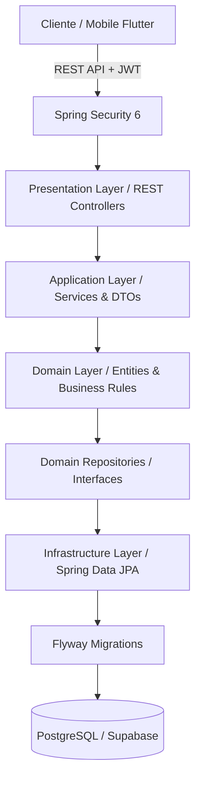

# 🎯 Operação Aprovação — Plataforma Corporativa & Agente de Estudos

[](https://openjdk.org/)
[](https://spring.io/projects/spring-boot)
[](https://www.postgresql.org/)
[](https://flywaydb.org/)
[](https://swagger.io/)
[](docs/estudos/01-governanca-e-arcabouco-ecc.md)

---

## 📌 Sobre o Projeto

O **Operação Aprovação** é uma plataforma comercial e um **agente pessoal de treinamento** desenvolvido com padrões de engenharia de software sênior para potencializar a aprovação em concursos públicos de alta concorrência.

O sistema é **completamente agnóstico a certames**: sua engine inteligente é capaz de receber qualquer edital, banca examinadora (Cebraspe, FGV, FCC, etc.) e estrutura de disciplinas, adaptando dinamicamente o plano de estudos, simulados com pesos ponderados e métricas de proficiência.

O caso de homologação inicial (MVP) é o concurso da **Polícia Civil do Estado de Pernambuco (PC-PE)** com a banca **Cebraspe**.

---

## 🏛️ Governança de Engenharia & Arcabouço ECC (Enterprise Coding Catalyst)

Este projeto adota formalmente o **Arcabouço ECC (Enterprise Coding Catalyst)**, aplicando diretrizes rigorosas de governança corporativa, padrões de design e segurança OWASP Top 10.

> 📄 **Para Recrutadores, Arquitetos e Tech Leads:**  
> Consulte o manual completo de governança e auditoria do código em:  
> 👉 [docs/estudos/01-governanca-e-arcabouco-ecc.md](docs/estudos/01-governanca-e-arcabouco-ecc.md)

---

## 🏗️ Arquitetura do Sistema (Clean Architecture & Monólito Modular)

A solução foi projetada seguindo rigorosamente os princípios de **Clean Architecture**, **Domain-Driven Design (DDD)** e **SOLID**:



#### 💡 O QUE ESTE DIAGRAMA SIGNIFICA NA PRÁTICA NO MUNDO REAL?
> Garante que a regra de negócio central (o cálculo de pontuação dos simulados da banca e o algoritmo do treinador) fique completamente isolada de detalhes externos de interface e banco de dados. Se amanhã o banco mudar de PostgreSQL para MySQL ou o cliente mudar de Flutter para Web, o núcleo do sistema não sofre alterações.

### 🧩 Módulos do Sistema (Bounded Contexts)
- **auth**: Gestão de identidade, controle de acesso baseado em papéis (RBAC) e emissão de tokens JWT.
- **certame**: Engine agnóstica de modelagem de Bancas, Concursos, Editais, Disciplinas e Assuntos.
- **questao**: Gestão do banco de questões (Múltipla Escolha e Certo/Errado), com gabaritos comentados e justificativas.
- **treinamento**: Núcleo do agente inteligente de estudos, gerador de simulados ponderados e métricas de proficiência.

---

## 🛠️ Stack Tecnológica

### Backend (Java Corporativo)
- **Linguagem:** Java 21 (LTS)
- **Framework:** Spring Boot 3.3.3
- **Segurança:** Spring Security 6, JWT (io.jsonwebtoken), BCrypt com salt aleatório
- **Persistência:** Spring Data JPA, Hibernate 6
- **Banco de Dados:** PostgreSQL 16 (Produção / Supabase) e H2 (Dev / Testes)
- **Versionamento de Banco:** Flyway
- **Mapeamento & Boilerplate:** MapStruct, Lombok
- **Documentação de API:** SpringDoc OpenAPI 3.0 / Swagger UI
- **Testes Automatizados:** JUnit 5, Mockito, Spring Boot Test, MockMvc (Zero Port Conflicts)

---

## 🚀 Como Executar o Projeto Localmente

### Pré-requisitos
- **Java 21 LTS** instalado e configurado no PATH
- **Apache Maven 3.9+** instalado
- **Git**

### Passo a Passo

1. **Clone o repositório:**
   ```bash
   git clone https://github.com/rngolima/operacao-aprovacao.git
   cd operacao-aprovacao/backend
   ```

2. **Execute a suíte de testes automatizados (Auditoria ECC):**
   ```bash
   mvn clean test
   ```

3. **Inicie a aplicação Spring Boot:**
   ```bash
   mvn spring-boot:run
   ```

4. **Acesse a documentação interativa (Swagger UI):**
   Abra no seu navegador: [http://localhost:8080/swagger-ui.html](http://localhost:8080/swagger-ui.html)

5. **Verifique a saúde da API (Health Check Probe):**
   [http://localhost:8080/api/v1/health](http://localhost:8080/api/v1/health)

---

## 📚 Central de Estudos & Mentoria Técnica

Toda a evolução do projeto, decisões de arquitetura e preparação técnica para entrevistas estão documentadas em:
- 📖 [Central de Estudos (Índice Geral)](docs/estudos/README.md)
- 🏛️ [Guia de Governança & Arcabouço ECC](docs/estudos/01-governanca-e-arcabouco-ecc.md)
- 📘 [Sprint 0: Foundation (Base Corporativa)](docs/estudos/sprint-0-fundamentos/sprint-0-fundamentos.md)
- 🔐 [Sprint 1: Security & Identity (JWT & RBAC)](docs/estudos/sprint-1-security-jwt/sprint-1-security-jwt.md)

---

## 📋 Roadmap de Entregas (Sprints)

- [x] **Sprint 0: Foundation** — Setup inicial Java 21, Spring Boot 3.3, Clean Architecture, Flyway V1, OpenAPI, H2/PostgreSQL e testes MockMvc.
- [x] **Sprint 1: Security & Identity** — Autenticação JWT Stateless, hashing BCrypt, controle RBAC e testes de integração.
- [ ] **Sprint 2: Core Domain (Certames & Questões)** — Modelagem agnóstica de bancas, concursos e ingestão de questões da PC-PE.
- [ ] **Sprint 3: Engine de Treinamento & Simulados** — Geração dinâmica de simulados ponderados e tracking de proficiência.
- [ ] **Sprint 4: Testes Corporativos & QA** — Testcontainers, cobertura massiva de testes e esteira CI/CD.
- [ ] **Sprint 5: Frontend Flutter** — Aplicativo mobile e web integrado à API.

---

## 👤 Autor & Desenvolvedor

Desenvolvido por **Rudson Americo** ([GitHub](https://github.com/rngolima)).