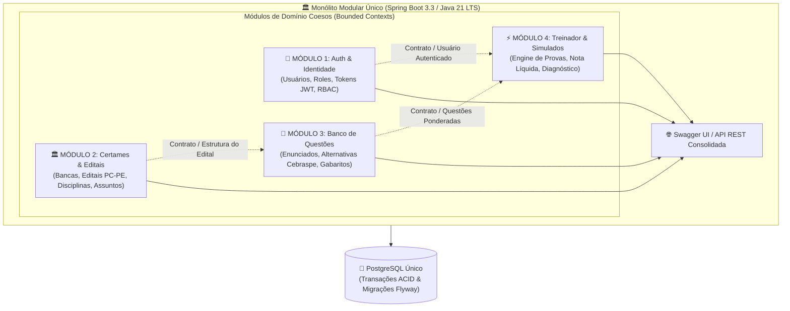

# 🎯 Operação Aprovação — Plataforma & Engine de Estudos para Concursos

[](https://openjdk.org/)
[](https://spring.io/projects/spring-boot)
[](https://www.postgresql.org/)
[](https://flywaydb.org/)
[](https://swagger.io/)
[](docs/estudos/01-governanca-e-arcabouco-ecc.md)

---

## 📌 O Problema Real de Negócio & Nossa Solução

### 🚨 A Dor do Concurseiro:
Milhares de candidatos estudam anos a fio acumulando PDFs teóricos e resolvendo questões avulsas na internet, mas são reprovados porque **não treinam a mecânica real de pontuação da banca examinadora**.
- Na banca **Cebraspe**, por exemplo, adota-se o critério rigoroso em que **uma questão errada anula uma questão certa** (pontuação líquida). Sem treinamento cirúrgico, o candidato zera a pontuação líquida mesmo acertando 60% da prova.

### 💡 A Solução da Engenharia:
O **Operação Aprovação** é uma API backend corporativa de alta performance que atua como uma engine inteligente de treinamento e simulados:
1. **Caso de Uso Real (MVP):** Homologado inicialmente no concurso da **Polícia Civil de Pernambuco (PC-PE)** com a banca **Cebraspe**.
2. **Simulados Ponderados:** Gera simulados calibrados estritamente com os pesos e matérias do edital oficial.
3. **Cálculo de Nota Líquida Cebraspe:** Computa acertos, erros e questões em branco, aplicando a penalidade real da banca.
4. **Diagnóstico Cirúrgico de Proficiência:** Informa com precisão matemática em quais assuntos específicos do edital o aluno precisa reforçar os estudos.

---

## 🏛️ Governança de Engenharia & Arcabouço ECC (Enterprise Coding Catalyst)

O projeto é desenvolvido sob o **Arcabouço ECC (Enterprise Coding Catalyst)**, aplicando governança corporativa de times seniores, Clean Architecture e segurança OWASP:
- **Code Review Contínuo:** Validação de conformidade de código e segurança ao término de cada etapa.
- **Pipeline de Testes Isolado:** Execução de testes em memória com `MockMvc` sem conflitos de portas de rede.

> 📄 **Para Recrutadores, Arquitetos e Tech Leads:**  
> Consulte o manual completo de governança e auditoria do código em:  
> 👉 [docs/estudos/01-governanca-e-arcabouco-ecc.md](docs/estudos/01-governanca-e-arcabouco-ecc.md)

---

## 🧱 Arquitetura: Monólito Modular & Fatias Verticais (Vertical Slices)

O backend adota o padrão de **Monólito Modular (Modular Monolith)** estruturado em **Fatias Verticais (Vertical Slices)** e orientado aos princípios de *Domain-Driven Design (DDD)* e *Clean Architecture*.

### 🚫 Por que NÃO usamos Microsserviços Prematuros?
Conforme formalizado em nosso [ADR 001](docs/adr/001-arquitetura-e-stack-tecnologica.md), microsserviços distribuídos desde o início trariam complexidade operacional desnecessária (Kubernetes, Service Mesh, latência de rede, transações distribuídas e custos de nuvem excessivos).

### 💡 A Solução: Monólito Modular com Fronteiras Rígidas
Em vez de um monólito acoplado (*"espaguete disfarçado em pastas bonitas"*), o sistema é construído com **módulos de domínio coesos (*Bounded Contexts*)** que executam no mesmo processo Spring Boot e compartilham a governança transacional ACID do PostgreSQL, mas mantêm suas fronteiras protegidas através de contratos, DTOs e interfaces públicas:



#### 💡 O QUE ESTE DIAGRAMA SIGNIFICA NA PRÁTICA NO MUNDO REAL?
> 1. **Não são microsserviços isolados:** Não há tráfego de rede nem chamadas HTTP lentas entre os módulos; toda a comunicação é direta em memória com altíssima performance.
> 2. **Não é um monólito desordenado ("pastas bonitas"):** Cada módulo respeita seu domínio. Se amanhã o motor de simulados precisar atender milhões de requisições concorrentes, ele já está delimitado e pode ser desacoplado para um microsserviço autônomo sem refatorar regras de negócio.
> 3. **Entregas em Fatias Verticais:** O sistema evolui em sprints com APIs funcionais e testáveis no Swagger a cada etapa, garantindo previsibilidade e qualidade contínua.

---

## 🗄️ Mapeamento Completo das Entidades do Domínio (100% Planejadas)

A modelagem relacional de dados já está 100% concebida e versionada no banco PostgreSQL via migrações imutáveis do Flyway (`V1__initial_schema.sql`). Ela é dividida em 4 blocos coesos:

| Módulo / Pacote | Entidade / Modelo | Ícone | Responsabilidade no Sistema |
| :--- | :--- | :--- | :--- |
| **👤 Identidade (`auth`)** | `Usuario` | 🧠 | Cadastro de alunos e administradores (implementa `UserDetails` do Spring Security). |
| **👤 Identidade (`auth`)** | `Role` | ☕ | Enum RBAC (`ROLE_STUDENT`, `ROLE_ADMIN`) para controle fino de permissões. |
| **🏛️ Concurso (`certame`)** | `Banca` | 🏛️ | Instituição organizadora do concurso (ex: Cebraspe, FGV, FCC). |
| **🏛️ Concurso (`certame`)** | `Concurso` | 📜 | O certame oficial homologado (ex: PC-PE 2026/2027). |
| **🏛️ Concurso (`certame`)** | `Edital` | 📋 | Regras oficiais, datas, critérios de eliminação e vagas. |
| **🏛️ Concurso (`certame`)** | `Disciplina` | 📚 | Matérias do certame (Direito Penal, Informática, Língua Portuguesa, etc.). |
| **🏛️ Concurso (`certame`)** | `Assunto` | 📑 | Tópicos específicos do edital (ex: Crimes contra a Pessoa, Redes de Computadores). |
| **📝 Questões (`questao`)** | `Questao` | ✍️ | Enunciado, ano da prova, cargo e modalidade (Certo/Errado ou Múltipla Escolha). |
| **📝 Questões (`questao`)** | `Alternativa` | 🏷️ | Opções de resposta, gabarito oficial e justificativa técnica comentada. |
| **🧠 Treinador (`treinamento`)** | `Simulado` | ⏱️ | Prova gerada dinamicamente com peso balanceado pelas regras do edital. |
| **🧠 Treinador (`treinamento`)** | `RespostaUsuario` | 📊 | Registro de cada marcação do aluno com telemetria de tempo gasto. |
| **🧠 Treinador (`treinamento`)** | `Desempenho` | 📈 | Pontuação líquida (Cebraspe: errada anula certa) e taxa de acerto por assunto. |

---

## 🛠️ Stack Tecnológica

### Backend (Java Corporativo)
- **Linguagem:** Java 21 (LTS)
- **Framework:** Spring Boot 3.3.3
- **Segurança:** Spring Security 6, JWT (io.jsonwebtoken), BCrypt com salt aleatório
- **Persistência:** Spring Data JPA, Hibernate 6
- **Banco de Dados:** PostgreSQL 16 (Produção / Supabase) e H2 (Dev / Testes)
- **Versionamento de Banco:** Flyway
- **Mapeamento & Boilerplate:** MapStruct, Lombok
- **Documentação de API:** SpringDoc OpenAPI 3.0 / Swagger UI
- **Testes Automatizados:** JUnit 5, Mockito, Spring Boot Test, MockMvc (Zero Port Conflicts)

---

## 🚀 Como Executar o Projeto Localmente

### Pré-requisitos
- **Java 21 LTS** instalado e configurado no PATH
- **Apache Maven 3.9+** instalado
- **Git**

### Passo a Passo

1. **Clone o repositório:**
   ```bash
   git clone https://github.com/rngolima/operacao-aprovacao.git
   cd operacao-aprovacao/backend
   ```

2. **Execute a suíte de testes automatizados (Auditoria ECC):**
   ```bash
   mvn clean test
   ```

3. **Inicie a aplicação Spring Boot:**
   ```bash
   mvn spring-boot:run
   ```

4. **Acesse a documentação interativa (Swagger UI):**
   Abra no seu navegador: [http://localhost:8080/swagger-ui.html](http://localhost:8080/swagger-ui.html)

5. **Verifique a saúde da API (Health Check Probe):**
   [http://localhost:8080/api/v1/health](http://localhost:8080/api/v1/health)

---

## 📚 Central de Estudos & Mentoria Técnica

Toda a evolução do projeto, decisões de arquitetura e preparação técnica para entrevistas estão documentadas em:
- 📖 [Central de Estudos (Índice Geral)](docs/estudos/README.md)
- 🏛️ [Guia de Governança & Arcabouço ECC](docs/estudos/01-governanca-e-arcabouco-ecc.md)
- 📑 [Code Review Oficial & Testes — Sprint 0](docs/estudos/sprint-0-fundamentos/code-review/code-review-e-procedimento-de-testes.md)
- 🧠 [Manual Teórico de Engenharia — Sprint 0](docs/estudos/sprint-0-fundamentos/manual-teorico/manual-de-engenharia-sprint-0.md)
- 🔐 [Sprint 1: Security & Identity (JWT & RBAC)](docs/estudos/sprint-1-security-jwt/sprint-1-security-jwt.md)

---

## 📋 Roadmap de Entregas & Status dos Módulos

| Módulo / Sprint | Status de Engenharia | O Que Entrega Para o Avaliador / Recrutador |
| :--- | :---: | :--- |
| **Sprint 0: Foundation** |  | Setup Java 21, Spring Boot 3.3, Clean Architecture, Flyway V1, OpenAPI, H2/PostgreSQL e testes MockMvc. |
| **Sprint 1: Security & Identity (Módulo 1)** | -green?style=for-the-badge) | Autenticação JWT Stateless (HMAC-SHA256), hashing BCrypt com salt, RBAC (`ROLE_STUDENT`/`ROLE_ADMIN`) e testes MockMvc. |
| **Sprint 2: Core Domain (Módulos 2 e 3)** |  | Gestão de bancas/editais da PC-PE e ingestão do banco de questões Cebraspe (Certo/Errado e Múltipla Escolha). |
| **Sprint 3: Engine do Treinador (Módulo 4)** |  | Motor de geração de simulados ponderados, cálculo de nota líquida Cebraspe e diagnóstico de proficiência. |
| **Sprint 4: Testes Corporativos & QA** |  | Testcontainers, testes de carga, esteira CI/CD no GitHub Actions e cobertura massiva. |
| **Sprint 5: Frontend Flutter** |  | Aplicativo mobile e web integrado consumindo os endpoints da API Backend. |

---

## 👤 Autor & Desenvolvedor

Desenvolvido por **Rudson Americo** ([GitHub](https://github.com/rngolima)).