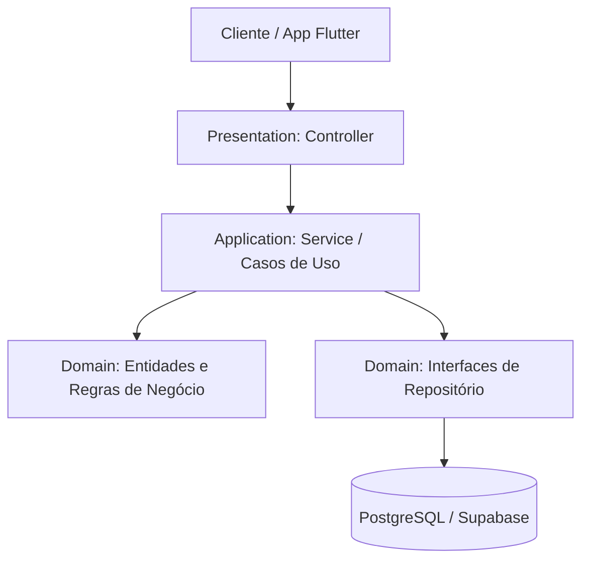

# 📁 Guia Definitivo: Estrutura de Pastas e Arquitetura do Projeto

> **Documento Oficial de Engenharia de Software & Mentoria Técnica**  
> Mapeamento completo da estrutura física de diretórios e da arquitetura do projeto **Operação Aprovação** com os ícones temáticos do VS Code (Material Icon Theme).

---

## 🌍 PARTE 1: A Estrutura Padrão Universal do Java (Maven)

Todo projeto Java corporativo segue o padrão internacional do **Apache Maven** (*Standard Directory Layout*):

```text
📁 operacao-aprovacao/
├── 🐘 pom.xml                     <-- O arquivo mestre de configuração (Project Object Model)
├── 📦 target/                     <-- Pasta gerada pelo compilador (arquivos binários .class e .jar)
└── 📁 src/                        <-- Código-fonte do sistema (Source)
    ├── 📁 main/                   <-- Código de PRODUÇÃO (executado pelo usuário final)
    │   ├── ☕ java/               <-- Código Java puro (.java compilável)
    │   └── 🍃 resources/          <-- Arquivos de configuração (YAML, SQL do Flyway, etc.)
    └── 🧪 test/                   <-- Código de TESTES AUTOMATIZADOS (não vai para produção)
        ├── ☕ java/               <-- Classes de testes com JUnit 5 e MockMvc
        └── 🍃 resources/          <-- Configurações exclusivas do ambiente de teste
```

### 📋 Tabela de Propósito das Pastas Raiz:

| Diretório / Arquivo | Tipo | Propósito no Ecossistema Java |
| :--- | :--- | :--- |
| `🐘 pom.xml` | Configuração Maven | Declara dependências (Spring Boot, JPA, PostgreSQL, JWT), plugins e versão do Java 21. |
| `☕ src/main/java/` | Código de Produção | Contém 100% da lógica de negócio, controllers, services e entidades Java. |
| `🍃 src/main/resources/` | Recursos Estáticos | Configurações de ambiente (`application.yml`) e scripts de banco de dados (`db/migration/`). |
| `🧪 src/test/java/` | Garantia de Qualidade | Testes unitários e de integração que garantem que nada quebre antes do deploy. |
| `📦 target/` | Binários Compilados | Pasta temporária onde o Maven gera os arquivos `.class` e o `.jar` executável final. |

---

## 📦 PARTE 2: Organização de Pacotes (A Regra do Domínio Invertido)

No Java, classes não ficam soltas. Elas pertencem a **Pacotes (Packages)**, que seguem a convenção do domínio da internet invertido para garantir nomes únicos no mundo:

```text
📁 src/
└── 📁 main/
    └── ☕ java/
        └── 📁 com/
            └── 📁 operacaoaprovacao/
                └── 📁 api/                    <-- Pacote Raiz da Aplicação
                    └── ☕ OperacaoAprovacaoApplication.java
```

---

## 🏛️ PARTE 3: Arquitetura Completa com Ícones do VS Code

O projeto adota o padrão **Monólito Modular (Modular Monolith)** aliado à **Clean Architecture** (Arquitetura Limpa):

```text
📁 operacao-aprovacao/
│
├── 📜 README.md                       <-- Apresentação oficial do projeto no GitHub com badges
├── 🚫 .gitignore                      <-- Impede envio de pastas temporárias para o Git
│
├── 📁 docs/                           <-- Documentação Técnica de Engenharia
│   ├── 📁 adr/                        <-- Registros Formais de Decisões de Arquitetura (ADRs)
│   │   ├── 📜 001-arquitetura-e-stack-tecnologica.md
│   │   └── 📜 002-autenticacao-jwt-e-rbac.md
│   ├── 📅 cronograma/                 <-- Cronograma sincronizado para o Google Agenda (.ics)
│   │   └── 📅 Cronograma_Operacao_Aprovacao_Google_Agenda.ics
│   ├── 📐 guidelines/                 <-- Padrões corporativos de engenharia do arcabouço ECC
│   │   ├── 🐘 postgres-patterns.md
│   │   ├── 🍃 springboot-patterns.md
│   │   └── 🔒 springboot-security.md
│   └── 📚 estudos/                    <-- Manuais de Mentoria e Preparação para Entrevistas
│       ├── 📜 README.md               <-- Índice geral navegável de estudos
│       ├── 📜 00-estrutura-de-pastas.md
│       │
│       ├── 📁 sprint-0-fundamentos/   <-- Materiais da Sprint 0
│       │   ├── 📘 sprint-0-fundamentos.md
│       │   └── 📝 revisao/            <-- Subdiretório exclusivo de revisão da Sprint 0
│       │       └── 📜 revisao-sprint-0-passos-1-ao-5.md
│       │
│       └── 📁 sprint-1-security-jwt/  <-- Materiais da Sprint 1
│           ├── 🔐 sprint-1-security-jwt.md
│           └── 📝 revisao/            <-- Subdiretório exclusivo de revisão da Sprint 1
│
└── 📁 backend/
    ├── 🐘 pom.xml                     <-- Declaração das dependências Java 21 e Spring Boot 3.3.3
    └── 📁 src/
        ├── 📁 main/
        │   ├── ☕ java/com/operacaoaprovacao/api/
        │   │   │
        │   │   ├── ☕ OperacaoAprovacaoApplication.java  <-- Ponto de ignição do Spring Boot
        │   │   │
        │   │   ├── 🔒 config/         <-- Infraestrutura de Frameworks e Segurança
        │   │   │   ├── 🔒 SecurityConfig.java            <-- Regras do Spring Security 6 (Stateless, CORS)
        │   │   │   ├── 🔒 JwtAuthenticationFilter.java   <-- Filtro que intercepta e valida tokens JWT
        │   │   │   └── 📄 OpenApiConfig.java             <-- Documentação Swagger UI em /swagger-ui.html
        │   │   │
        │   │   ├── 🧱 core/           <-- Núcleo Transversal Compartilhado
        │   │   │   ├── 🧠 domain/
        │   │   │   │   └── ☕ BaseEntity.java             <-- Superclasse com auditoria (created_at, updated_at)
        │   │   │   ├── ✉️ dto/
        │   │   │   │   └── ☕ ApiResponse.java            <-- Envelope padronizado de resposta REST
        │   │   │   └── 🛡️ exception/
        │   │   │       ├── ☕ BusinessException.java      <-- Exceção de negócio para validações
        │   │   │       └── ☕ GlobalExceptionHandler.java  <-- Interceptador global de erros (400, 401, 500)
        │   │   │
        │   │   ├── 🧩 modules/        <-- Módulos de Domínio Coesos (Bounded Contexts)
        │   │   │   │
        │   │   │   ├── 🔐 auth/       <-- Módulo de Autenticação e Gestão de Contas (Sprint 1)
        │   │   │   │   ├── 🧠 domain/model/
        │   │   │   │   │   ├── ☕ Usuario.java            <-- Entidade JPA + UserDetails do Spring Security
        │   │   │   │   │   └── ☕ Role.java               <-- Enum RBAC (ROLE_STUDENT, ROLE_ADMIN)
        │   │   │   │   ├── 🗄️ domain/repository/
        │   │   │   │   │   └── ☕ UsuarioRepository.java  <-- Consultas JPA (findByEmail, existsByEmail)
        │   │   │   │   ├── ✉️ application/dto/
        │   │   │   │   │   ├── ☕ RegisterRequest.java     <-- Dados de entrada do cadastro com @Valid
        │   │   │   │   │   ├── ☕ LoginRequest.java        <-- Dados de entrada do login
        │   │   │   │   │   └── ☕ AuthResponse.java        <-- DTO de saída contendo o token JWT
        │   │   │   │   ├── ⚙️ application/service/
        │   │   │   │   │   ├── ☕ AuthService.java         <-- Caso de uso: registro com BCrypt e autenticação
        │   │   │   │   │   ├── ☕ JwtService.java          <-- Geração e validação de assinatura HMAC-SHA256
        │   │   │   │   │   └── ☕ CustomUserDetailsService.java <-- Ponte entre o banco e o Spring Security
        │   │   │   │   └── 🌐 presentation/controller/
        │   │   │   │       └── ☕ AuthController.java      <-- Endpoints /api/v1/auth/register e /login
        │   │   │   │
        │   │   │   ├── 📁 certame/    <-- Módulo de Concursos (Sprint 2: Bancas, Editais, Disciplinas)
        │   │   │   ├── 📁 questao/    <-- Módulo de Questões (Sprint 2: Banco Cebraspe, Alternativas)
        │   │   │   └── 📁 treinamento/<-- Módulo do Treinador (Sprint 3: Simulados e Proficiência)
        │   │   │
        │   │   └── 🌐 presentation/controller/
        │   │       └── ☕ HealthController.java          <-- Endpoint /api/v1/health de monitoramento
        │   │
        │   └── 🍃 resources/
        │       ├── 🍃 application.yml                    <-- Configurações gerais da aplicação (porta 8080)
        │       ├── 🍃 application-dev.yml                <-- Perfil dev local (banco H2 em memória)
        │       ├── 🍃 application-prod.yml               <-- Perfil produção (PostgreSQL no Supabase)
        │       └── 🗄️ db/migration/
        │           └── 🗃️ V1__initial_schema.sql         <-- Primeiro script SQL versionado com Flyway
        │
        └── 🧪 test/
            └── ☕ java/com/operacaoaprovacao/api/
                ├── 🧪 OperacaoAprovacaoApplicationTests.java <-- Smoke test e validação do /api/v1/health
                └── 📁 modules/auth/
                    └── 🧪 AuthControllerTest.java            <-- Testes de integração de auth com MockMvc
```

---

## 🎯 PARTE 4: O Propósito das 3 Camadas Internas de Cada Módulo

Em cada módulo (`auth`, `certame`, `questao`, `treinamento`), dividimos o código em 3 camadas estritas:



1. **`🧠 domain/` (Domínio):** Contém as entidades e regras de negócio puras. É o coração do sistema e não depende de frameworks web nem de detalhes de interface.
2. **`⚙️ application/` (Aplicação):** Contém os Services (Casos de Uso) e DTOs. É onde reside a orquestração: validações de negócio, criptografia e regras de fluxo.
3. **`🌐 presentation/` (Apresentação):** Contém os Controllers REST. Responsável estritamente por receber requisições HTTP, validar payloads (`@Valid`) e retornar respostas padronizadas com o status code correto.