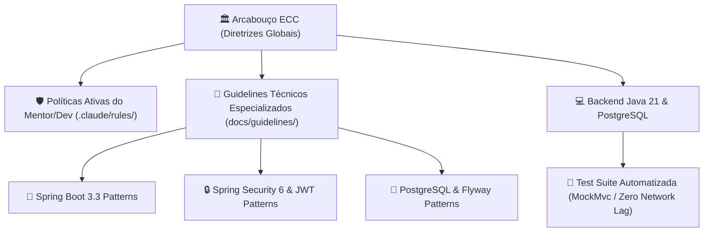

# 🏛️ Governança Corporativa & Arcabouço de Engenharia ECC (Enterprise Coding Catalyst)

> **Documento Oficial de Engenharia de Software & Guia de Auditoria para Recrutadores, Arquitetos e Tech Leads**  
> Este documento formaliza os padrões de governança, diretrizes arquiteturais e políticas de qualidade técnica da plataforma **Operação Aprovação**, fundamentados no ecossistema ECC (Enterprise Coding Catalyst), nos princípios da Clean Architecture e nas recomendações de segurança OWASP.

---

## 🧭 1. O Que É o Arcabouço ECC e Por Que Ele Foi Adotado?

Em grandes corporações de tecnologia (como Google, Itaú, Nubank e Mercado Livre), o desenvolvimento de software não segue preferências individuais aleatórias. Existe um **padrão corporativo rigoroso** que assegura que o sistema seja seguro, escalável, testável e de fácil manutenção por qualquer engenheiro da equipe.

No **Operação Aprovação**, integramos o **ECC (Enterprise Coding Catalyst)** como a nossa espinha dorsal de engenharia. Ele estabelece uma barreira intransponível contra más práticas (código sem teste, SQL solto, senhas vulneráveis e acoplamento desordenado).

### 📊 Visão Geral da Governança no Projeto:


#### 💡 O QUE ESTE DIAGRAMA SIGNIFICA NA PRÁTICA NO MUNDO REAL?
> Imagine a construção de um arranha-céu moderno:  
> 1. **O ECC (Engenheiro-Chefe e Normas da ABNT):** Define as regras de segurança e os materiais permitidos antes que qualquer operário coloque um tijolo.  
> 2. **Os Guidelines (Manuais de Montagem):** Indicam exatamente como a parte elétrica (Segurança JWT), o encanamento (Spring Boot) e a fundação (PostgreSQL) devem ser conectados para nunca darem vazamento.  
> 3. **Os Testes Automatizados (Vistoria dos Bombeiros):** Antes de inaugurar o prédio (deploy em produção), testes em memória passam simulando situações extremas para certificar que tudo funciona sem riscos de colapso.

---

## 📂 2. Onde Estão as Diretrizes do ECC no Repositório?

Os padrões de engenharia estão organizados de forma transparente e modular no repositório para consulta de qualquer desenvolvedor ou avaliador técnico:

| Diretório / Arquivo | Ícone | Tipo de Governança | Finalidade no Projeto |
| :--- | :--- | :--- | :--- |
| `.claude/rules/00-regras-absolutas-pedagogicas.md` | ⚖️ | Governança Absoluta | Regras invioláveis de condução pedagógica, padrões visuais e integridade de commits. |
| `.claude/rules/coding-style.md` | 📜 | Padrão de Estilo | Convenções Clean Code, nomenclatura de classes/métodos e princípios SOLID. |
| `.claude/rules/patterns.md` | 🏛️ | Arquitetura | Clean Architecture, separação de camadas (*Domain*, *Application*, *Presentation*) e Monólito Modular. |
| `.claude/rules/security.md` | 🛡️ | Segurança Corporativa | Diretrizes OWASP Top 10, autenticação Stateless, hashing seguro e mitigação de vulnerabilidades. |
| `.claude/rules/testing.md` | 🧪 | Qualidade & QA | Pirâmide de testes, uso de `MockMvc` em memória e prevenção de testes lentos no CI/CD. |
| `docs/guidelines/springboot-patterns.md` | 🍃 | Manual Técnico | Padrões Spring Boot 3.3: DTOs imutáveis com Lombok, validação com Bean Validation e Envelope Pattern. |
| `docs/guidelines/springboot-security.md` | 🔒 | Manual Técnico | Spring Security 6: filtros OncePerRequestFilter, `SecurityFilterChain`, claims JWT e RBAC. |
| `docs/guidelines/postgres-patterns.md` | 🐘 | Manual Técnico | Modelagem relacional 3NF: chaves primárias `BIGINT`, índices B-Tree em Foreign Keys e Flyway. |

---

## 🔍 3. Guia Prático de Auditoria (Para Recrutadores e Tech Leads)

Se você é um avaliador técnico, recrutador ou desenvolvedor sênior inspecionando este repositório, você pode **validar a conformidade do código em menos de 3 minutos**:

---

### ✅ Teste 1: Execução e Velocidade da Suíte de Testes
Abra o terminal na pasta `operacao-aprovacao/backend` e execute:
```bash
mvn test
```
- **O que observar:** Todos os testes unitários e de integração executam em **poucos segundos** retornando `BUILD SUCCESS` com **0 falhas**.
- **Por que isso importa:** O projeto utiliza `@AutoConfigureMockMvc` e o perfil isolado `application-dev.yml` com banco H2 em memória, garantindo que o pipeline de CI/CD seja ultrarrápido e nunca sofra com erros de porta de rede ocupada (*Port Conflicts*).

---

### ✅ Teste 2: Auditoria Cruzada da Camada de Segurança
Abra lado a lado no seu editor:
1. O manual técnico: `docs/guidelines/springboot-security.md`
2. O código de segurança: `backend/src/main/java/com/operacaoaprovacao/api/config/SecurityConfig.java`
- **O que você vai comprovar:**
  - Política de criação de sessão configurada estritamente como `SessionCreationPolicy.STATELESS`.
  - Proteção CSRF desativada propositalmente (`csrf.disable()`), já que APIs REST com token Bearer no cabeçalho HTTP não utilizam cookies e são imunes a CSRF.
  - Hashing de senhas gerenciado por `BCryptPasswordEncoder` com fator de trabalho seguro e salt pseudoaleatório embutido.

---

### ✅ Teste 3: Auditoria da Modelagem Relacional
Abra lado a lado:
1. O manual técnico: `docs/guidelines/postgres-patterns.md`
2. O script Flyway: `backend/src/main/resources/db/migration/V1__initial_schema.sql`
- **O que você vai comprovar:**
  - Chaves primárias modeladas como `BIGINT GENERATED BY DEFAULT AS IDENTITY` para evitar exaustão de ID em alta concorrência.
  - Presença de índices B-Tree em todas as colunas de chave estrangeira (`banca_id`), prevenindo *Sequential Scans* em tabelas com milhões de linhas.
  - Imutabilidade e idempotência garantidas pelo histórico de migrações gerenciado pelo Flyway.

---

## 💡 4. O Que Isso Significa na Prática Para a Carreira do Desenvolvedor?

Para um desenvolvedor em formação (rumo aos níveis Pleno e Sênior), dominar o ecossistema Java sob o arcabouço ECC proporciona vantagens decisivas:

1. **Capacidade de Conversar com Arquitetos:** O desenvolvedor não responde apenas *"eu fiz assim porque funcionou"*. Ele responde: *"adotei a abordagem Stateless com HMAC-SHA256 para permitir escalabilidade horizontal sem consumo de I/O de sessão em banco relacional"*.
2. **Preparo Para Sistemas de Alta Concorrência:** O código já nasce pronto para orquestradores modernos (Kubernetes, AWS ECS e Docker), com endpoints de saúde (`/api/v1/health`) e auditoria temporal em todas as tabelas.
3. **Padrão de Código Limpo e Autoexplicativo:** A nomenclatura segue o padrão de responsabilidade única e desacoplamento, facilitando o onboarding de novos membros no time.
