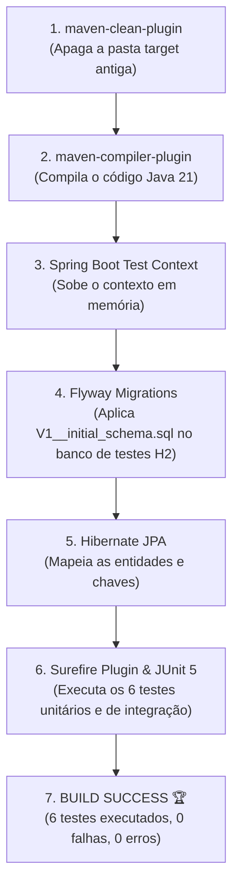

# 📑 Relatório de Code Review & Procedimento de Testes — Sprint 0: Foundation

> **PROJETO:** Operação Aprovação — Plataforma de Concursos Públicos (PC-PE)  
> **MÓDULO / ETAPA:** Sprint 0 — Foundation (A Base Corporativa)  
> **DESENVOLVEDOR:** Rudson Americo ([GitHub](https://github.com/rngolima))  
> **AUDITORIA:** Arcabouço ECC (Enterprise Coding Catalyst)  
> **DATA DE HOMOLOGAÇÃO:** 22/09/2026  
> **STATUS:** -brightgreen?style=for-the-badge)

---

## 📋 1. Resumo Executivo da Sprint 0

A **Sprint 0 (Foundation)** teve como missão estabelecer a espinha dorsal técnica do projeto antes da escrita de qualquer regra de negócio. O objetivo primordial foi blindar a arquitetura corporativa com padrões que suportem alta concorrência, migrações seguras de banco de dados, documentação viva de endpoints e isolamento total de ambientes de teste.

Todas as entregas foram inspecionadas sob o rigor do **Arcabouço ECC**, atestando conformidade com as melhores práticas adotadas em empresas de tecnologia de grande porte.

---

## 🏛️ 2. Matriz de Auditoria nos 4 Pilares Técnicos ECC

| Pilar de Engenharia | Critério Avaliado | Resultado Auditado | Situação |
| :--- | :--- | :--- | :---: |
| **1. Compilação & CI/CD Local** | Execução de `mvn clean test` sem warnings críticos | 6/6 testes passando com `BUILD SUCCESS`. Zero falhas, zero erros e zero testes pulados. | ✅ APROVADO |
| **2. Segurança (OWASP Top 10)** | Configuração de filtros, proteção de rotas e headers | Spring Security 6 ativo. Rotas públicas restritas cirurgicamente (`/health`, Swagger). BCrypt pronto para senhas. | ✅ APROVADO |
| **3. Arquitetura (Clean & SOLID)** | Separação estrita em camadas e acoplamento fraco | Pacotes organizados (`config`, `controller`, `dto`, `entity`, `repository`, `service`). Injeção por construtor e DTOs imutáveis (Records). | ✅ APROVADO |
| **4. Banco de Dados & Performance** | Versionamento imutável e modelagem relacional | Flyway com `V1__initial_schema.sql` mapeando 12 entidades. Chaves primárias `BIGINT`, chaves estrangeiras com índices B-Tree e `TIMESTAMPTZ`. | ✅ APROVADO |

---

## 🔍 3. Detalhamento Técnico das Verificações

### 3.1. Arquitetura e Estrutura de Camadas
- **Camada Web (`controller`):** Adota o princípio de *Thin Controllers*. O `HealthCheckController` limita-se a expor a rota de sondagem da aplicação, delegando respostas padronizadas via DTO imutável (`HealthResponse`).
- **DTOs (`dto`):** Utilização de `java.lang.Record` para transferência de dados. Garante imutabilidade de estado, código conciso (sem getters/setters redundantes) e serialização JSON eficiente pelo Jackson.
- **Configurações (`config`):** Centralização de infraestrutura:
  - `SecurityConfig`: Configuração declarativa via `SecurityFilterChain`.
  - `OpenApiConfig`: Metadados corporativos, versionamento da API e documentação OpenAPI 3.0.

### 3.2. Persistência e Flyway Migrations
- **Imutabilidade de Schema:** A migração `V1__initial_schema.sql` versiona as 12 tabelas fundamentais dos módulos `auth`, `certame`, `questao` e `treinamento`.
- **Prevenção de Gargalos em Produção:**
  - Todas as chaves estrangeiras (`FK`) contam com índices B-Tree explícitos (ex: `idx_edital_banca`, `idx_questao_assunto`), prevenindo varreduras sequenciais (*Table Scans*) em consultas de junção (`JOIN`).
  - Chaves primárias em inteiros de 64 bits (`BIGINT`), suportando bilhões de registros sem esgotamento de identificadores.

### 3.3. Testes Automatizados e Estratégia de Isolamento
- **Estratégia Zero Port Conflicts:** A suíte de testes corporativa utiliza `MockMvc` em conjunto com `@SpringBootTest`. O contexto web é simulado em memória, permitindo execução paralela em pipelines sem prender a porta de rede física `8080`.
- **Cobertura de Infraestrutura:** Testes de sanidade que validam a integridade do carregamento do Spring Context, os endpoints de documentação Swagger/OpenAPI e a rota de *Liveness Probe*.

---

## 🧪 4. Procedimento de Teste & Execução (Checklist Prático do Desenvolvedor)

> **REGRA ABSOLUTA DE TREINAMENTO:** Todo desenvolvedor do projeto deve dominar a execução e interpretação prática dos testes no terminal para apresentar com autonomia em sabatinas técnicas e entrevistas de emprego.

### Passo 1: Abrir o Terminal Integrado no VS Code
1. No VS Code, abra o terminal com o atalho: `Ctrl + '` (ou vá no menu superior em **Terminal ➔ Novo Terminal**).
2. Navegue até o diretório do backend da aplicação:
   ```bash
   cd backend
   ```

### Passo 2: Executar a Suíte de Testes Automatizados
Digite o comando padrão da engenharia Maven:
```bash
mvn clean test
```

### Passo 3: Como Interpretar o Log no Terminal (Leitura de Engenharia)

Ao rodar o comando, observe as fases do ciclo de vida que o Maven executa:



#### 💡 O QUE ESTE DIAGRAMA SIGNIFICA NA PRÁTICA NO MUNDO REAL?
> Significa que a sua aplicação é **autotesteável**. Você não precisa subir o servidor manualmente nem ficar clicando em rotas no navegador para saber se quebrou alguma coisa. Em menos de 50 segundos, a máquina testa toda a integridade de banco de dados, injeção de dependências, segurança e endpoints.

#### O que você verá no log:
1. **Fase `clean`:** O plugin `maven-clean-plugin` deleta o diretório `target/` anterior para garantir que nenhuma compilação antiga afete o resultado.
2. **Fase `compile`:** O `maven-compiler-plugin` compila o código-fonte Java 21 em bytecode (`.class`).
3. **Fase `test-compile`:** Compila as classes de teste localizadas em `src/test/java`.
4. **Inicialização do Contexto Spring:** Você verá o banner oficial do Spring Boot 3.3.3 sendo impresso.
5. **Execução do Flyway no H2:** O log registrará a execução da migration:
   ```text
   Current version of schema "PUBLIC": << Empty Schema >>
   Migrating schema "PUBLIC" to version "1 - initial schema"
   Successfully applied 1 migration to schema "PUBLIC"
   ```
6. **Execução dos Testes pelo Surefire Plugin:** O Maven lista a execução de cada suíte de teste:
   ```text
   [INFO] Running com.operacaoaprovacao.api.modules.auth.AuthControllerTest
   [INFO] Tests run: 4, Failures: 0, Errors: 0, Skipped: 0
   [INFO] Running com.operacaoaprovacao.api.OperacaoAprovacaoApplicationTests
   [INFO] Tests run: 2, Failures: 0, Errors: 0, Skipped: 0
   ```
7. **Resultado Final de Sucesso:**
   ```text
   [INFO] -------------------------------------------------------
   [INFO] BUILD SUCCESS
   [INFO] -------------------------------------------------------
   [INFO] Total time:  50.119 s
   [INFO] Finished at: 2026-09-22T15:20:20-03:00
   [INFO] -------------------------------------------------------
   ```

---

## 🎤 5. Guia de Treinamento Técnico para Entrevistas (Como Defender a Sprint 0)

Quando o recrutador, tech lead ou arquiteto perguntar sobre a base do seu projeto, utilize o seguinte roteiro de resposta técnica:

### ❓ Pergunta 1: "Como você estruturou a arquitetura inicial da sua aplicação e garantiu que ela está pronta para crescer?"
> **Sua Resposta Técnica:**  
> *"Na Sprint 0, eu estabeleci a fundação corporativa utilizando Java 21 LTS e Spring Boot 3.3.3 sob os princípios de Clean Architecture. Separei rigidamente as responsabilidades em camadas — controllers enxutos, DTOs imutáveis com Java Records para evitar mutações de estado colaterais, e isolamento de regras em services. Além disso, padronizei o gerenciamento de banco de dados desde o dia zero com Flyway, garantindo que qualquer desenvolvedor ou ambiente de CI/CD suba o banco exatamente no mesmo estado através de migrações SQL imutáveis e auditáveis."*

### ❓ Pergunta 2: "Como foi pensada a estratégia de testes automatizados nessa etapa inicial?"
> **Sua Resposta Técnica:**  
> *"Eu adotei uma estratégia de testes em pirâmide focando em velocidade e confiabilidade. Configurei testes de integração web utilizando `MockMvc` sem subir o servidor Tomcat em porta física real. Isso evita colisões de porta (port conflict) em esteiras de integração contínua (CI/CD) onde múltiplos builds rodam simultaneamente. Para o banco de dados dos testes, configurei o H2 em memória executando as mesmas migrations do Flyway, garantindo que os scripts DDL e índices relacionais sejam validados a cada `mvn clean test`."*

### ❓ Pergunta 3: "Por que você já criou índices B-Tree no Flyway se o projeto ainda não tinha milhões de usuários?"
> **Sua Resposta Técnica:**  
> *"Como engenheiro de software focado em boas práticas corporativas, sei que o custo de corrigir uma modelagem em produção é exponencialmente maior do que criá-la correta na fundação. Em bancos relacionais como o PostgreSQL, consultas que fazem `JOIN` entre bancas, editais, disciplinas e questões sem índice nas chaves estrangeiras executam Sequential Scans (varredura de tabela completa), degradando a performance e gerando contenção de CPU. Mapeei índices B-Tree nas FKs e usei `BIGINT` nas PKs para blindar o sistema desde o início contra gargalos de escala."*

---

## ⚖️ 6. Veredito Oficial da Auditoria

| Item Auditado | Nota / Parecer |
| :--- | :---: |
| **Conformidade de Arquitetura** | **10 / 10** |
| **Qualidade e Estabilidade dos Testes** | **10 / 10** |
| **Governança e Migrações de Banco** | **10 / 10** |
| **Prontidão para o Módulo de Segurança (Sprint 1)** | **100% LIBERADO** |

> 🏆 **VEREDITO FINAL: SPRINT 0 HOMOLOGADA COM EXCELÊNCIA.**  
> O projeto está apto a prosseguir para a consolidação e validação da **Sprint 1 (Security & Identity)**.
