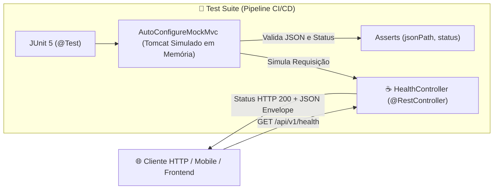

# 📘 Manual de Engenharia & Mentoria Técnica — Sprint 0: Foundation

> **Documento Oficial de Engenharia de Software & Preparação Técnica Sênior**  
> Análise profunda dos fundamentos de código, decisões arquiteturais e simulações de entrevistas técnicas, estruturado sob os Três Pilares da Engenharia Corporativa: **Arquitetura**, **Escalabilidade & Performance** e **Dimensões Técnicas**.

---

## 🗺️ Mapa de Execução da Sprint 0

| Passo | Componente | Ícone | Status | Objetivo de Engenharia |
| :--- | :--- | :--- | :--- | :--- |
| **Passo 1** | `pom.xml` / Maven | 🐘 | Concluído | Governança de dependências, versionamento e parent do Spring Boot 3.3.3. |
| **Passo 2** | `OperacaoAprovacaoApplication.java` | ☕ | Concluído | Bootstrap da JVM, Tomcat embutido e mecanismo de radar do `@ComponentScan`. |
| **Passo 3** | `BaseEntity.java` & `ApiResponse.java` | 🧱 | Concluído | Auditoria JPA com `@MappedSuperclass` e Response Envelope com Generics `<T>`. |
| **Passo 4** | `V1__initial_schema.sql` / Flyway | 🗃️ | Concluído | Modelagem normalizada (3NF), chaves `BIGINT` e migração idempotente. |
| **Passo 5** | `HealthController` & Testes | 🌐 | Concluído | Camada web REST e testes de integração rápidos em memória com `MockMvc`. |
| **Status Geral** | **Sprint 0: Foundation** | 🚀 | **100% Validada** | Base de dados, arquitetura limpa, segurança e pipeline de testes integrados. |

---

## 🐘 PASSO 1: O `pom.xml` e a Gestão de Dependências com Maven

### 1. O que é o POM (Project Object Model)?
O `pom.xml` é a certidão de nascimento de qualquer aplicação Java corporativa. Ele gerencia o ciclo de vida do build (`compile`, `test`, `package`), declara a versão da linguagem (Java 21 LTS) e orquestra o download automatizado de bibliotecas a partir do repositório central do Maven.

### 2. O Bloco `<parent>` do Spring Boot
```xml
<parent>
    <groupId>org.springframework.boot</groupId>
    <artifactId>spring-boot-starter-parent</artifactId>
    <version>3.3.3</version>
    <relativePath/>
</parent>
```
- **Por que existe?** Fornece uma matriz de compatibilidade testada e aprovada pelo time de engenharia do Spring, eliminando conflitos clássicos de classpath (*Jar Hell*). Não precisamos declarar versões manuais para JPA, Hibernate, PostgreSQL Driver ou Security; o parent alinha todas as versões de forma estável.

### 3. As Dependências Vitais da Sprint 0
- 🌐 `spring-boot-starter-web`: Fornece o Spring MVC e embute o servidor Apache Tomcat na porta 8080.
- 🗄️ `spring-boot-starter-data-jpa`: Traz o Hibernate para abstração de persistência relacional.
- 🔒 `spring-boot-starter-security`: Fornece a infraestrutura de filtros para segurança e controle de acesso.
- 🐘 `postgresql`: Driver JDBC de alto desempenho para comunicação com o banco de produção (Supabase).
- 🗃️ `flyway-core`: Ferramenta para versionamento e migração idempotente de schema SQL.
- 📄 `springdoc-openapi-starter-webmvc-ui`: Gera documentação viva e interativa via Swagger UI em `/swagger-ui.html`.

### 🎯 Simulação de Entrevista Técnica (Passo 1):
> **Pergunta do Tech Lead:**  
> *"Vi no seu `pom.xml` que você usou o `flyway-core` junto com o Spring Data JPA. Por que você não deixou o próprio Hibernate criar as tabelas automaticamente usando `spring.jpa.hibernate.ddl-auto=update`?"*
> 
> **Resposta Técnica Modelo:**  
> *"O `ddl-auto=update` é expressamente evitado em ambientes corporativos de produção porque ele não possui governança de versão, não suporta reversão estruturada de mudanças, pode gerar locks severos em tabelas concorridas e costuma duplicar colunas em vez de renomeá-las.  
> Adotamos o **Flyway** porque ele atua como o versionador do banco de dados (o 'Git das tabelas'), executando scripts SQL imutáveis (`V1`, `V2`, etc.) validados por checksum na tabela `flyway_schema_history`. Isso garante **idempotência**, **rastreabilidade estrita** e **reprodutibilidade idêntica** em todos os ambientes da nossa esteira de CI/CD."*

---

## ☕ PASSO 2: `OperacaoAprovacaoApplication.java` e o Início do Spring

### 1. O Ponto de Partida (`public static void main`)
```java
@SpringBootApplication
@EnableJpaAuditing
public class OperacaoAprovacaoApplication {
    public static void main(String[] args) {
        SpringApplication.run(OperacaoAprovacaoApplication.class, args);
    }
}
```
A chamada `SpringApplication.run()` sobe o servidor web Tomcat embutido na porta `8080`, inicializa o container de Inversão de Controle (IoC) e dispara o escaneamento de componentes.

### 2. A Tríade da Anotação `@SpringBootApplication`
A anotação `@SpringBootApplication` é uma composição de três anotações essenciais:
1. **`@Configuration`**: Permite registrar novos Beans via métodos anotados com `@Bean`.
2. **`@EnableAutoConfiguration`**: Lê o `pom.xml` e configura automaticamente os componentes e drivers correspondentes.
3. **`@ComponentScan`**: O radar de descoberta que varre classes com `@RestController`, `@Service`, `@Repository` e `@Component`.

### 3. Auditoria Temporal Nativa (`@EnableJpaAuditing`)
Ativa os *listeners* de ciclo de vida do JPA para preencher automaticamente as datas de criação (`created_at`) e atualização (`updated_at`) nas entidades de domínio.

### 🎯 Simulação de Entrevista Técnica (Passo 2):
> **Pergunta do Tech Lead:**  
> *"Se eu criar uma classe `@RestController` nova dentro de um pacote fora de `com.operacaoaprovacao.api` (por exemplo, em `com.meuoutroprojeto.controllers`), o Spring Boot vai conseguir encontrar e subir esse controller? Por quê?"*
> 
> **Resposta Técnica Modelo:**  
> *"Não, ele não vai subir. Por convenção padrão, o `@ComponentScan` embutido no `@SpringBootApplication` realiza a varredura reflexiva estritamente a partir do pacote onde a classe principal está localizada (`com.operacaoaprovacao.api`) e seus subpacotes descendentes.  
> Como o controller está em um pacote irmão ou fora da árvore hierárquica, o radar do Spring não o enxerga, a menos que declaremos explicitamente esse pacote externo no parâmetro `basePackages` do `@ComponentScan`."*

---

## 🧱 PASSO 3: O Modelo Base (`BaseEntity`) e o Padrão de Resposta (`ApiResponse`)

### 1. `BaseEntity.java` (Herança de Auditoria sem Duplicação de Código)
```java
@Getter
@Setter
@MappedSuperclass
@EntityListeners(AuditingEntityListener.class)
public abstract class BaseEntity {

    @CreatedDate
    @Column(name = "created_at", nullable = false, updatable = false)
    private LocalDateTime createdAt;

    @LastModifiedDate
    @Column(name = "updated_at")
    private LocalDateTime updatedAt;
}
```
- **Princípio DRY (Don't Repeat Yourself):** Elimina a necessidade de declarar atributos temporais em cada entidade do sistema.
- **`@MappedSuperclass`:** Avisa ao JPA que esta classe serve exclusivamente para herança de colunas, instruindo o banco a **não criar uma tabela física** chamada `base_entity`.
- **`@EntityListeners(AuditingEntityListener.class)`:** Intercepta as operações de `INSERT` e `UPDATE` disparadas pelo Hibernate para carimbar o horário do sistema operacional.

### 2. `ApiResponse.java` (O Padrão Response Envelope)
```java
@Data
@Builder
@NoArgsConstructor
@AllArgsConstructor
@JsonInclude(JsonInclude.Include.NON_NULL)
public class ApiResponse<T> {
    private boolean success;
    private String message;
    private T data;
    private LocalDateTime timestamp;
}
```
- **Por que usamos um Envelope?** APIs corporativas nunca retornam payloads heterogêneos ou soltos. O envelope padroniza todas as respostas HTTP (sucesso ou erro), garantindo que o cliente mobile em Flutter sempre encontre uma estrutura previsível: `{ success, message, data, timestamp }`.
- **Generics (`<T>`):** Garante tipagem estrita em tempo de compilação, permitindo que o campo `data` transporte desde um `UsuarioDTO` até uma lista paginada de questões sem perda de segurança de tipos.

### 🎯 Simulação de Entrevista Técnica (Passo 3):
> **Pergunta do Tech Lead:**  
> *"Por que você anotou a classe `BaseEntity` com `@MappedSuperclass` em vez de anotar com `@Entity`?"*
> 
> **Resposta Técnica Modelo:**  
> *"A `BaseEntity` foi desenhada apenas como um modelo de herança de atributos transversais de auditoria (`created_at` e `updated_at`). Se eu utilizasse a anotação `@Entity`, o provedor JPA/Hibernate tentaria instanciar uma tabela física no banco de dados para ela.  
> Com `@MappedSuperclass`, nenhuma tabela é gerada para a classe abstrata; suas colunas e restrições são incorporadas diretamente nas tabelas físicas das entidades filhas (`tb_usuario`, `tb_concurso`, etc.)."*

---

## 🗄️ PASSO 4: A Fundação dos Dados — `V1__initial_schema.sql` e PostgreSQL

O arquivo `V1__initial_schema.sql` em `src/main/resources/db/migration/` cria a estrutura inicial que sustenta a plataforma de concursos.

### 1. Fundamentos de Tipagem e Sintaxe SQL
- **`BIGINT GENERATED BY DEFAULT AS IDENTITY PRIMARY KEY`:**  
  - `BIGINT`: Inteiro de 64 bits (suporta até 9 quintilhões de registros). Impede que tabelas de alto volume transacional (como resolução de questões e logs de estudo) sofram de *Integer Overflow*, falha catastrófica que ocorre quando um `INT` de 32 bits ultrapassa 2,1 bilhões de linhas.
  - `GENERATED BY DEFAULT AS IDENTITY`: Padrão ANSI SQL moderno, superior ao legado `SERIAL`.
- **`VARCHAR(150)` vs. `TEXT`:**  
  - Embora no PostgreSQL ambos utilizem a mesma infraestrutura de armazenamento TOAST, o uso de `VARCHAR(N)` atua como uma barreira rígida de validação no nível de banco de dados, protegendo o storage contra payloads desproporcionais ou ataques de negação de serviço.
- **`TIMESTAMP NOT NULL DEFAULT CURRENT_TIMESTAMP`:**  
  - Garante que a data/hora do servidor de banco seja gravada automaticamente na criação do registro.

### 2. A Modelagem sob os Três Pilares da Engenharia

```sql
-- Tabela de Bancas Examinadoras
CREATE TABLE tb_banca (
    id BIGINT GENERATED BY DEFAULT AS IDENTITY PRIMARY KEY,
    nome VARCHAR(150) NOT NULL,
    sigla VARCHAR(50) NOT NULL UNIQUE,
    site_oficial VARCHAR(255),
    created_at TIMESTAMP NOT NULL DEFAULT CURRENT_TIMESTAMP,
    updated_at TIMESTAMP
);

-- Tabela de Concursos Públicos
CREATE TABLE tb_concurso (
    id BIGINT GENERATED BY DEFAULT AS IDENTITY PRIMARY KEY,
    banca_id BIGINT NOT NULL,
    orgao VARCHAR(150) NOT NULL,
    estado VARCHAR(2),
    ano INT NOT NULL,
    status VARCHAR(50) NOT NULL DEFAULT 'PREVISTO',
    created_at TIMESTAMP NOT NULL DEFAULT CURRENT_TIMESTAMP,
    updated_at TIMESTAMP,
    CONSTRAINT fk_concurso_banca FOREIGN KEY (banca_id) REFERENCES tb_banca (id)
);
```

#### 🏛️ Pilar 1: Arquitetura (Design Agnóstico e 3NF)
- **Normalização (3ª Forma Normal):** A entidade `tb_concurso` não armazena strings literais da banca ("Cebraspe"). Ela aponta para `banca_id`. Se a banca atualizar seus dados corporativos, a alteração ocorre em uma única linha, mantendo integridade e consistência relacional.
- **Agnóstico a Certames:** A mesma estrutura atende tanto a PC-PE (nosso caso de homologação inicial) quanto a Polícia Federal, PRF, PC-SP ou qualquer certame futuro, sem alterar o código Java.

#### ⚡ Pilar 2: Escalabilidade & Performance
- **Indexação de Chaves Estrangeiras:** Toda coluna de ligação (`FOREIGN KEY`), como `banca_id`, deve possuir um índice B-Tree dedicado. Em cenários de alta concorrência com milhões de linhas, a ausência de índice em FKs força o banco a executar *Sequential Scans* durante operações de `JOIN`, elevando a latência da API e o consumo de I/O de disco.

#### 🛡️ Pilar 3: Dimensões Técnicas & Integridade Física
- **Integridade Referencial:** A `CONSTRAINT fk_concurso_banca` impede que dados órfãos existam no sistema. É impossível cadastrar um concurso associado a uma banca inexistente.
- **Seeds Idempotentes:** Cargas iniciais de bancas oficiais (CEBRASPE, FGV, FCC) e certames iniciais da PC-PE embutidos na migration garantem que qualquer ambiente provisionado na nuvem nasça imediatamente operacional.

### 🎯 Simulação de Entrevista Técnica (Passo 4):
> **Pergunta do Tech Lead:**  
> *"No seu script SQL da Sprint 0, vi que você usou o tipo `BIGINT` para as Chaves Primárias (`id`) em vez de um `INT` comum, e usou `VARCHAR(150)` em vez de deixar tudo como `TEXT`, já que no PostgreSQL o armazenamento interno é similar. Qual foi a sua justificativa técnica de arquitetura e segurança para essas escolhas?"*
> 
> **Resposta Técnica Modelo:**  
> *"Adotamos o `BIGINT` (64 bits) para todas as chaves primárias porque em uma plataforma de estudos o volume de transações cresce exponencialmente (resoluções de questões, logs de simulados e telemetria de desempenho). Um tipo `INT` de 32 bits atinge seu limite em 2,1 bilhões de registros, o que causaria um estouro de inteiro (*Integer Overflow*) e indisponibilidade crítica do banco.  
> Quanto ao `VARCHAR(150)` em vez de `TEXT`, embora o PostgreSQL utilize o mecanismo TOAST para ambos, a restrição de tamanho no schema impõe uma camada de validação e governança diretamente no banco de dados. Isso impede que eventuais falhas de validação na camada de aplicação ou injeções de payloads maliciosos gravem volumes desnecessários de dados nas páginas de disco, preservando a integridade e o consumo de memória do buffer pool."*

---

## 🌐 PASSO 5: A Camada Web (`HealthController`) e a Blindagem com Testes (`MockMvc`)

### 1. 🗺️ O Mapa Visual e Localização no VS Code:
- 👉 `📁 backend/src/main/java/com/operacaoaprovacao/api/presentation/controller/` ➔ `🌐 HealthController.java`
- 👉 `📁 backend/src/test/java/com/operacaoaprovacao/api/` ➔ `🧪 OperacaoAprovacaoApplicationTests.java`



#### 💡 O QUE ESTE DIAGRAMA SIGNIFICA NA PRÁTICA NO MUNDO REAL?
> Imagine o painel de batimentos cardíacos de uma UTI de hospital e o treino dos paramédicos:  
> 1. **O Health Check (`/api/v1/health`):** Funciona como o monitor cardíaco da API. Os balanceadores de carga na nuvem (AWS / Kubernetes) consultam esse endpoint a cada 10 segundos. Se o servidor travar ou superaquecer, o monitor acusa e o sistema redireciona os concurseiros para outra máquina saudável antes que qualquer pessoa perceba instabilidade.  
> 2. **O Teste com `MockMvc`:** É o simulador de voo dos pilotos. Antes de o código ir para a nuvem de verdade, os testes automatizados disparam chamadas em memória ultrarrápidas para garantir que todas as portas e respostas estão perfeitas, sem gastar tempo subindo servidores reais.

### 2. O que são esses componentes e por que existem?
- 🌐 **`HealthController.java`:** Ponto de entrada REST público responsável por expor a saúde operacional do serviço (`/api/v1/health`). É consumido por orquestradores de containers (Kubernetes, AWS ECS) e balanceadores de carga para monitorar *Liveness* (se a JVM travou) e *Readiness* (se o sistema está pronto para receber tráfego).
- 🧪 **`OperacaoAprovacaoApplicationTests.java`:** Bateria de testes automatizados de integração que sobe o contexto completo da aplicação Spring Boot (`@SpringBootTest`) e valida os endpoints HTTP em memória (`MockMvc`) sem necessidade de abrir conexões de rede físicas lentas.

### 2. Fundamentos da Linguagem & Anotações

| Recurso / Anotação | Origem | Papel Técnico Corporativo |
| :--- | :--- | :--- |
| **`@RestController`** | Spring Web | Especialização de `@Controller` com serialização automática dos retornos em JSON (`@ResponseBody`). |
| **`@RequestMapping`** | Spring Web | Define o prefixo canônico da URL (`/api/v1/health`), garantindo versionamento semântico da API na rota. |
| **`@GetMapping`** | Spring Web | Mapeia o método HTTP `GET` de leitura idempotente. |
| **`ResponseEntity<T>`** | Spring Web | Objeto que encapsula o Status Code HTTP (ex: `200 OK`), Headers e Body da resposta com segurança de tipos. |
| **`@SpringBootTest`** | Spring Test | Carrega o `ApplicationContext` do Spring Boot com injeção de dependências e configurações ativas para testes de integração. |
| **`@AutoConfigureMockMvc`** | Spring Boot Test | Configura e disponibiliza o objeto `MockMvc` no container de testes, permitindo simular requisições HTTP em memória sem subir servidor Tomcat real. |
| **`@ActiveProfiles("dev")`** | Spring Test | Fixa o profile `dev`, garantindo que os testes utilizem o banco H2 em memória, isolando completamente o ambiente de homologação e produção. |
| **`MockMvc`** | Spring Test | Cliente de teste em memória que envia requisições simuladas para os DispatcherServlets do Spring e avalia status e payloads JSON via JsonPath. |

### 3. Código Fonte Comentado

#### 🌐 `HealthController.java`
```java
package com.operacaoaprovacao.api.presentation.controller;

import com.operacaoaprovacao.api.core.dto.ApiResponse;
import io.swagger.v3.oas.annotations.Operation;
import io.swagger.v3.oas.annotations.tags.Tag;
import org.springframework.http.ResponseEntity;
import org.springframework.web.bind.annotation.GetMapping;
import org.springframework.web.bind.annotation.RequestMapping;
import org.springframework.web.bind.annotation.RestController;

import java.time.LocalDateTime;
import java.util.Map;

@RestController
@RequestMapping("/api/v1/health")
@Tag(name = "Health Check", description = "Monitoramento de saude e integridade da API")
public class HealthController {

    @GetMapping
    @Operation(summary = "Verifica se a API esta operacional", description = "Retorna o status, versao e horario do servidor.")
    public ResponseEntity<ApiResponse<Map<String, Object>>> checkHealth() {
        Map<String, Object> status = Map.of(
                "status", "UP",
                "service", "operacao-aprovacao-api",
                "version", "1.0.0-SNAPSHOT",
                "timestamp", LocalDateTime.now().toString()
        );
        return ResponseEntity.ok(ApiResponse.ok("API operacional e pronta para conexoes.", status));
    }
}
```

#### 🧪 `OperacaoAprovacaoApplicationTests.java`
```java
package com.operacaoaprovacao.api;

import org.junit.jupiter.api.DisplayName;
import org.junit.jupiter.api.Test;
import org.springframework.beans.factory.annotation.Autowired;
import org.springframework.boot.test.autoconfigure.web.servlet.AutoConfigureMockMvc;
import org.springframework.boot.test.context.SpringBootTest;
import org.springframework.test.context.ActiveProfiles;
import org.springframework.test.web.servlet.MockMvc;

import static org.springframework.test.web.servlet.request.MockMvcRequestBuilders.get;
import static org.springframework.test.web.servlet.result.MockMvcResultMatchers.jsonPath;
import static org.springframework.test.web.servlet.result.MockMvcResultMatchers.status;

@SpringBootTest
@AutoConfigureMockMvc
@ActiveProfiles("dev")
class OperacaoAprovacaoApplicationTests {

    @Autowired
    private MockMvc mockMvc;

    @Test
    @DisplayName("Deve carregar o contexto da aplicacao Spring Boot com sucesso")
    void contextLoads() {
        // Smoke Test: garante que injeções de dependência, banco H2 e Beans carregam sem falhas
    }

    @Test
    @DisplayName("Endpoint /api/v1/health deve responder HTTP 200 OK com status UP")
    void healthCheckShouldReturnOk() throws Exception {
        mockMvc.perform(get("/api/v1/health"))
                .andExpect(status().isOk())
                .andExpect(jsonPath("$.success").value(true))
                .andExpect(jsonPath("$.data.status").value("UP"))
                .andExpect(jsonPath("$.data.service").value("operacao-aprovacao-api"));
    }
}
```

### 4. Análise sob os Três Pilares Corporativos

#### 🏛️ Pilar 1: Arquitetura (Separation of Concerns & Thin Controllers)
- **Controladores Enxutos (Thin Controllers):** O `HealthController` atua estritamente na borda (Presentation Layer). Ele traduz o protocolo HTTP e devolve a resposta no envelope `ApiResponse<T>`, sem acoplamento a regras de negócio de domínio.
- **Teste de Contexto (Smoke Test):** O método `contextLoads()` valida a integridade estrutural de toda a árvore de injeção de dependências do Spring. Se houver uma anotação conflitante ou dependência circular, o teste falha na hora.

#### ⚡ Pilar 2: Escalabilidade & Performance
- **Execução em Nanossegundos com `MockMvc`:** Subir um servidor web real (Tomcat em porta física) para cada teste de integração torna a esteira de CI/CD lenta e sujeita a conflitos de portas de rede ("Address already in use"). O `MockMvc` despacha a requisição internamente através do `DispatcherServlet` em memória, executando centenas de testes por segundo.
- **Health Check para Alta Disponibilidade:** O endpoint `/api/v1/health` fornece a telemetria necessária para balanceadores de carga retirarem instâncias instáveis de circulação antes que usuários finais sejam afetados.

#### 🛡️ Pilar 3: Dimensões Técnicas & Isolamento de Ambientes
- **Idempotência de Teste com `@ActiveProfiles("dev")`:** Garante isolamento estrito. Os testes nunca realizam chamadas a bancos remotos ou infraestrutura compartilhada, garantindo execução reproduzível em qualquer máquina local ou runner do GitHub Actions.

### 🎯 Simulação de Entrevista Técnica (Passo 5):
> **Pergunta do Tech Lead:**  
> *"Em uma arquitetura de microsserviços Spring Boot, por que é recomendado utilizar o `MockMvc` em conjunto com `@AutoConfigureMockMvc` para testar os nossos Controllers em vez de subir um servidor real (Tomcat) com chamadas via `RestTemplate` ou `WebClient`? E qual é o papel de um endpoint como `/api/v1/health` quando a aplicação está rodando em um orquestrador como Kubernetes ou AWS?"*
> 
> **Resposta Técnica Modelo:**  
> *"Utilizamos o `MockMvc` porque ele simula as chamadas HTTP diretamente contra a camada de controladores do Spring em memória, sem a sobrecarga de iniciar um servidor de aplicação físico (como o Tomcat) nem abrir conexões de socket de rede reais. Isso reduz o tempo de execução da suíte de testes em pipelines de CI/CD de minutos para segundos e elimina conflitos de portas TCP em builds paralelos.  
> Já o endpoint `/api/v1/health` cumpre a função vital de Liveness e Readiness Probe: ele oferece aos orquestradores de contêineres (Kubernetes, AWS ECS) e balanceadores de carga um endpoint ultraleve para checar se a instância está viva e apta a receber tráfego, permitindo o reinício automático de pods degradados sem downtime para os usuários."*