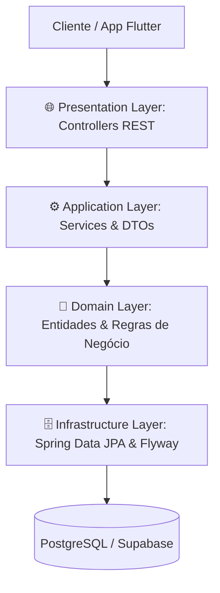

# 📘 Guia de Estudos — Sprint 0: Foundation (A Base Corporativa)

> **Documento Oficial de Engenharia de Software & Mentoria Técnica**  
> Mapeamento completo dos fundamentos, decisões de arquitetura e padrões corporativos da Sprint 0 com os ícones temáticos do VS Code.

---

## 🏛️ 1. O Projeto e a Escolha da Clean Architecture

O **Operação Aprovação** foi desenhado como um **Monólito Modular (Modular Monolith)** aplicando os princípios da **Clean Architecture** (Arquitetura Limpa) de Robert C. Martin (Uncle Bob):



#### 💡 O QUE ESTE DIAGRAMA SIGNIFICA NA PRÁTICA NO MUNDO REAL?
> Imagine a estrutura de um hospital de alta complexidade:  
> 1. **`🌐 Presentation (Recepção)`:** O paciente (o app Flutter do estudante) chega pela recepção. O recepcionista só checa se o documento é válido e o encaminha para o setor correto.  
> 2. **`⚙️ Application (Médicos Especialistas)`:** O médico atende o paciente, aplica os protocolos clínicos de estudo (ex: lógica de pontuação do concurso) e receita o tratamento.  
> 3. **`🧠 Domain (O Conhecimento Médico Puro)`:** As regras biológicas e diagnósticos que nunca mudam, independente de qual hospital o médico trabalha.  
> 4. **`🗄️ Infrastructure (Prontuário Eletrônico / Arquivo)`:** Onde as fichas são armazenadas (PostgreSQL). Se o hospital trocar de sistema de prontuário, a medicina e os médicos continuam atuando da mesma forma.  
> 
> *Aplicação no Projeto:* Garante que o motor de aprovação de concursos nunca fique amarrado a detalhes externos de banco de dados ou telas.

### Por que Clean Architecture?
- **Independência de Frameworks e Bancos:** A regra de negócio central não sabe se o banco é PostgreSQL, H2 ou Oracle, nem se o cliente é Flutter ou React.
- **Testabilidade:** Módulos desacoplados permitem testes unitários rápidos e isolados com MockMvc e Mocks, sem necessidade de banco real em cada teste.

---

## 📂 2. Raio-X dos Arquivos da Sprint 0

| Arquivo / Componente | Camada | Ícone | Responsabilidade Técnica Principal |
| :--- | :--- | :--- | :--- |
| `pom.xml` | Configuração | 🐘 | Manifesto Maven: gerencia dependências, versões e ciclo de vida do build. |
| `OperacaoAprovacaoApplication.java` | Bootstrap | ☕ | Ponto de partida (`main`): sobe o servidor Tomcat e inicializa o `@ComponentScan`. |
| `BaseEntity.java` | Core / Domain | 🧠 | Superclasse abstrata com auditoria JPA automática (`created_at`, `updated_at`). |
| `ApiResponse.java` | Core / DTO | ✉️ | Envelope padronizado de respostas da API com Generics `<T>` e padrão Builder. |
| `SecurityConfig.java` | Config / Security | 🔒 | Configuração do Spring Security 6: arquitetura Stateless, CORS e desativação de CSRF. |
| `HealthController.java` | Presentation | 🌐 | Endpoint `/api/v1/health` para monitoramento de liveness e readiness da API. |
| `V1__initial_schema.sql` | Database / Flyway | 🗃️ | Script DDL inicial versionado que cria as tabelas de bancas, concursos e usuários. |
| `OperacaoAprovacaoApplicationTests.java` | Test / QA | 🧪 | Teste de integração automatizado com `@SpringBootTest` e `MockMvc`. |

---

## 🔍 3. Detalhamento Técnico Arquitetural

### 3.1 🐘 `pom.xml` (Maven Project Object Model)
- **`<parent>` Spring Boot 3.3.3:** Fornece a matriz de compatibilidade testada e aprovada pelo time de engenharia do Spring, eliminando conflitos de bibliotecas.
- **Principais dependências explicadas:**
  - `spring-boot-starter-web`: Traz o Spring MVC e o servidor web embutido **Apache Tomcat** na porta 8080.
  - `spring-boot-starter-data-jpa`: Traz o Hibernate para mapeamento objeto-relacional (ORM) e abstração de repositórios.
  - `spring-boot-starter-security`: Fornece a infraestrutura de filtros para segurança, autenticação e controle de acesso.
  - `postgresql`: Driver JDBC oficial para comunicação com o PostgreSQL na nuvem.
  - `flyway-core`: Gerenciador de migrações que garante versionamento ordenado do schema do banco.
  - `springdoc-openapi-starter-webmvc-ui`: Gera automaticamente a documentação visual e interativa do Swagger em `/swagger-ui.html`.

### 3.2 ☕ `OperacaoAprovacaoApplication.java`
- **`@SpringBootApplication`:** Anotação composta que reúne `@Configuration` (declaração de Beans), `@EnableAutoConfiguration` (leitura do pom.xml) e `@ComponentScan` (varredura automática de classes anotadas a partir do pacote raiz `com.operacaoaprovacao.api`).
- **`@EnableJpaAuditing`:** Ativa a captura de eventos de inserção e atualização para preenchimento automático de datas nas entidades.

### 3.3 🧠 `BaseEntity.java`
- **`@MappedSuperclass`:** Avisa ao provedor JPA que esta classe serve exclusivamente para herança de colunas. O banco de dados **não cria uma tabela física** chamada `base_entity`.
- **`@EntityListeners(AuditingEntityListener.class)`:** Ouvinte que intercepta o ciclo de vida do Hibernate para preencher `@CreatedDate` e `@LastModifiedDate`.

### 3.4 ✉️ `ApiResponse.java` (Response Envelope Pattern)
- Padroniza 100% das saídas da API em uma estrutura previsível:
```json
{
  "success": true,
  "message": "Operação realizada com sucesso",
  "data": { ... },
  "timestamp": "2026-09-18T15:00:00"
}
```
- **Generics (`<T>`):** Permite transportar com type safety qualquer objeto dentro do campo `data`.

### 3.5 🔒 `SecurityConfig.java`
- **`SessionCreationPolicy.STATELESS`:** O servidor Tomcat não armazena sessões HTTP em memória, tornando a aplicação preparada para balanceamento de carga e alta escala.
- **`csrf.disable()`:** APIs REST stateless que utilizam tokens em cabeçalhos HTTP (`Authorization: Bearer`) não utilizam cookies de sessão de navegador e, portanto, não são vulneráveis a CSRF.
- **`BCryptPasswordEncoder`:** Algoritmo com salt aleatório embutido que previne ataques com Rainbow Tables.

### 3.6 🌐 `HealthController.java`
- Endpoint `/api/v1/health` que atende ao padrão de Liveness/Readiness Probe exigido por orquestradores como Kubernetes e AWS ECS para verificar a saúde do container.

### 3.7 🗃️ `V1__initial_schema.sql` (Flyway Migration)
- Script SQL DDL executado de forma imutável e idempotente pelo Flyway, criando tabelas com chaves primárias `BIGINT GENERATED BY DEFAULT AS IDENTITY` e chaves estrangeiras com integridade referencial.

---

## 💼 4. Perguntas Reais de Entrevistas Técnicas

### 🎯 Pergunta 1: "Qual a diferença entre Inversão de Controle (IoC) e Injeção de Dependências (DI)?"
> **Resposta Modelo:**  
> "A Inversão de Controle (IoC) é o princípio de design em que o fluxo de execução e a gestão do ciclo de vida dos objetos deixam de ser feitos manualmente pelo desenvolvedor (via operador `new`) e passam a ser controlados por um container ou framework. A Injeção de Dependências (DI) é o padrão de projeto concreto que implementa o IoC: o Spring instancia os componentes (Beans) e os fornece automaticamente onde forem necessários (via construtor ou `@Autowired`), desacoplando o código e permitindo a substituição por Mocks em testes unitários."

### 🎯 Pergunta 2: "Por que escolhemos uma arquitetura Stateless com JWT em vez de sessões com Cookies?"
> **Resposta Modelo:**  
> "Em uma arquitetura Stateful baseada em cookies e sessões no servidor, cada instância precisa guardar o estado do usuário logado na memória RAM. Para escalar horizontalmente adicionando réplicas da aplicação, você seria obrigado a usar sessões distribuídas (como Redis Session) ou sticky sessions no balanceador de carga. Com a arquitetura Stateless e tokens JWT, o servidor não armazena estado: toda requisição carrega no cabeçalho `Authorization: Bearer` os dados necessários para validação criptográfica, permitindo escalabilidade horizontal imediata e integração nativa com aplicativos mobile em Flutter."

### 🎯 Pergunta 3: "O que é o Flyway e por que é proibido usar `hibernate.ddl-auto=update` em produção?"
> **Resposta Modelo:**  
> "O `ddl-auto=update` não possui controle de versão, não suporta reversão planejada de alterações e costuma duplicar colunas em vez de renomeá-las, além do risco de causar locks severos em tabelas concorridas. O Flyway atua como o versionador oficial do banco de dados (o 'Git das tabelas'): ele executa scripts SQL ordenados e imutáveis (`V1`, `V2`, etc.) validados por checksum na tabela `flyway_schema_history`, garantindo que os ambientes de Dev, Testes e Produção tenham rigorosamente o mesmo estado sem desvios de schema (*Schema Drift*)."