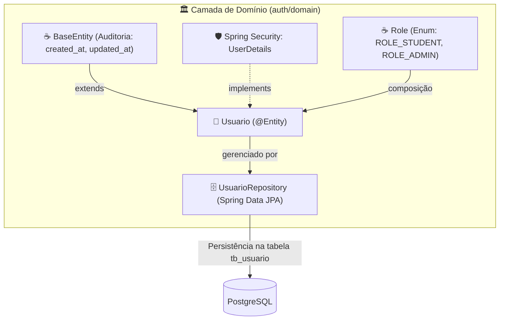
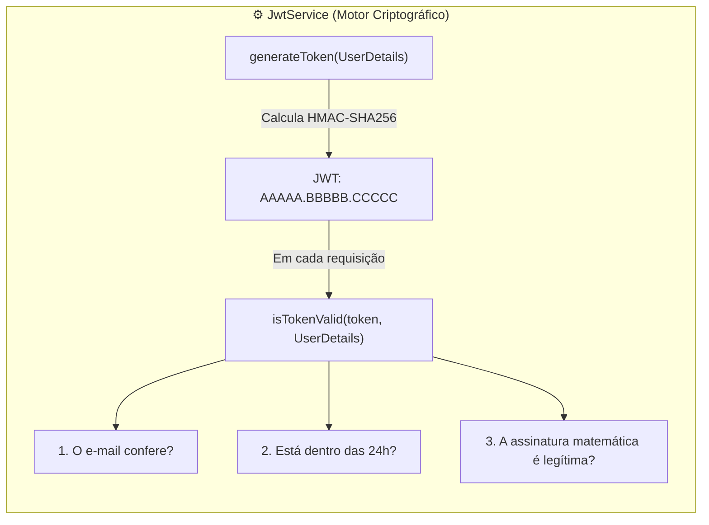
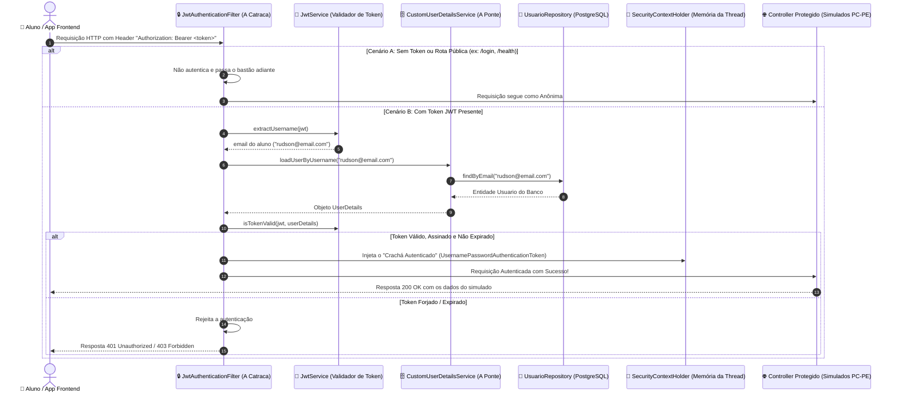
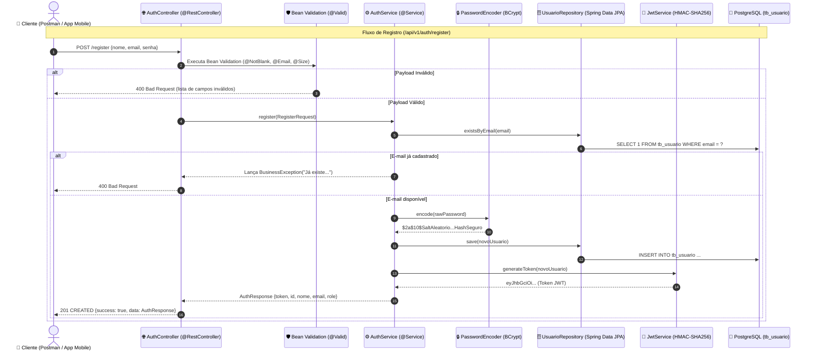
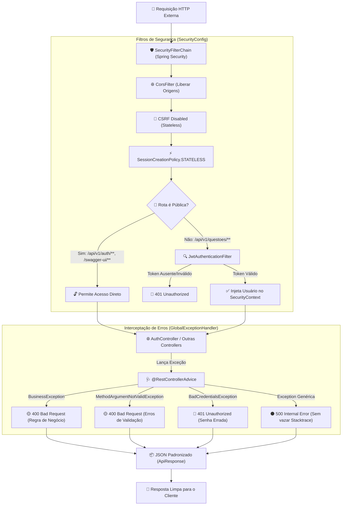

# 🔐 Manual de Engenharia & Mentoria Técnica — Sprint 1: Security & Identity

> **Documento Oficial de Engenharia de Software & Preparação Técnica Sênior**  
> Análise profunda dos fundamentos de código, decisões arquiteturais e simulações de entrevistas técnicas, estruturado sob os Três Pilares da Engenharia Corporativa: **Arquitetura**, **Escalabilidade & Performance** e **Dimensões Técnicas**, complementado com a **Tradução Prática para o Mundo Real**.

---

## 🗺️ Mapa de Execução da Sprint 1: Security & Identity

| Passo | Módulo / Componentes | Ícone | Status | Objetivo de Engenharia |
| :--- | :--- | :--- | :--- | :--- |
| **Passo 1** | `Usuario.java`, `Role.java`, `UsuarioRepository.java` | 🧠 | **Concluído** | Domínio de Identidade, interface `UserDetails` do Spring Security e controle de acesso RBAC. |
| **Passo 2** | `JwtService.java` | 🔐 | **Concluído** | Motor Criptográfico: especificação RFC 7519, algoritmo HMAC-SHA256, geração e validação matemática de tokens. |
| **Passo 3** | `JwtAuthenticationFilter.java` & `CustomUserDetailsService` | 🛡️ | **Concluído** | Interceptação de rede com `OncePerRequestFilter`, ponte com o banco e `SecurityContextHolder`. |
| **Passo 4** | DTOs (`RegisterRequest`, `LoginRequest`, `AuthResponse`), `AuthService` & `AuthController` | ⚙️ | **Concluído** | Casos de uso de autenticação, hashing com **BCrypt + Salt**, Bean Validation, endpoints REST e testes com **Mockito puro**. |
| **Passo 5** | Tratamento Global de Exceções (`GlobalExceptionHandler`) & Configuração de Segurança (`SecurityFilterChain`) | 🛡️ | **Concluído** | Fechamento da cadeia de filtros, liberação de rotas públicas (`/api/v1/auth/**`), proteção das rotas restritas e tratamento padronizado RFC 7807. |

---

## 🧠 PASSO 1: O Domínio de Identidade & Controle de Acesso (RBAC)

---

### 🗺️ FASE 1: O MAPA E LOCALIZAÇÃO NO VS CODE

No Passo 1, criamos a representação do Usuário no banco de dados e ensinamos o Spring Security a reconhecê-lo como uma entidade autenticável através de um contrato padronizado.

#### 📂 Abra agora no seu VS Code os arquivos deste passo:
- 👉 `📁 backend/src/main/java/com/operacaoaprovacao/api/modules/auth/domain/model/` ➔ `🧠 Usuario.java`
- 👉 `📁 backend/src/main/java/com/operacaoaprovacao/api/modules/auth/domain/model/` ➔ `☕ Role.java`
- 👉 `📁 backend/src/main/java/com/operacaoaprovacao/api/modules/auth/domain/repository/` ➔ `🗄️ UsuarioRepository.java`

#### 📊 Diagrama Arquitetural do Passo 1:


#### 💡 O QUE ESTE DIAGRAMA SIGNIFICA NA PRÁTICA NO MUNDO REAL?
> Imagine o fluxo de cadastro e login de um novo aluno no app:  
> 1. A entidade `Usuario` herda automaticamente de `BaseEntity` para que a administração saiba o segundo exato em que a conta nasceu ou foi alterada (`created_at`, `updated_at`).  
> 2. O `Usuario` "veste o uniforme" do Spring Security implementando `UserDetails`. É isso que permite ao framework ler e-mail, senha criptografada e o papel do aluno (`ROLE_STUDENT` ou `ROLE_ADMIN`).  
> 3. O `UsuarioRepository` é o mensageiro especialista do Spring Data JPA: ele pega o objeto Java e o grava com integridade na tabela física `tb_usuario` no PostgreSQL, permitindo buscas instantâneas por e-mail.

#### 🗺️ O que são esses componentes e por que existem?
- 🧠 **`Usuario.java`:** Entidade de domínio central que representa o concurseiro ou administrador no banco relacional (`tb_usuario`). Implementa a interface `UserDetails` para criar uma ponte transparente com o Spring Security.
- ☕ **`Role.java`:** Enum que define os papéis de acesso do sistema (`ROLE_STUDENT` e `ROLE_ADMIN`) segundo a convenção padrão exigida pelo Spring Security para controle RBAC (Role-Based Access Control).
- 🗄️ **`UsuarioRepository.java`:** Interface Spring Data JPA que disponibiliza consultas otimizadas no banco de dados (`findByEmail` e `existsByEmail`) sem necessidade de escrever SQL manual.

---

### 💻 FASE 2: FUNDAMENTOS DA LINGUAGEM E TECNOLOGIAS

| Recurso / Anotação | De Onde Vem? | O Que Significa / Papel Técnico Corporativo |
| :--- | :--- | :--- |
| **`@Entity`** | `jakarta.persistence` | Informa ao Hibernate que esta classe Java é uma entidade gerenciada mapeada para uma tabela no banco relacional. |
| **`@Table(name = "tb_usuario")`** | `jakarta.persistence` | Vincula a entidade à tabela física `tb_usuario` criada na migration Flyway `V1__initial_schema.sql`. |
| **`@Enumerated(EnumType.STRING)`** | `jakarta.persistence` | **Regra Crítica de Engenharia:** Grava o nome textual do papel (`'ROLE_STUDENT'`) no banco em vez do seu índice numérico (`0` ou `1`). Isso evita corrupção de dados caso novos papéis sejam adicionados futuramente. |
| **`@Builder.Default`** | `lombok` | Garante que valores padrão de atributos (como `role = Role.ROLE_STUDENT` e `ativo = true`) não sejam sobrescritos com `null` ao usar o padrão Builder. |
| **`UserDetails`** | `org.springframework.security.core.userdetails` | Interface contrato que fornece ao Spring Security os métodos padronizados de autenticação: `getUsername()`, `getPassword()`, `getAuthorities()` e `isEnabled()`. |
| **`SimpleGrantedAuthority`** | `org.springframework.security.core.authority` | Encapsula o nome do papel (role) como uma autoridade reconhecida pelo container do Spring Security. |
| **`JpaRepository<Usuario, Long>`** | `org.springframework.data.jpa.repository` | Fornece operações CRUD completas e suporte a *Derived Queries* com geração automática de SQL pelo Spring Data JPA. |

---

### 🏛️ FASE 3: ANÁLISE SOB OS TRÊS PILARES COM TRADUÇÃO PRÁTICA

#### 1. Arquitetura de Software (DDD & Coesão)
- **Bounded Context de Autenticação (`modules/auth`):** Todas as classes de identidade residem em um pacote coeso e autocontido. Se no futuro a plataforma migrar para um microsserviço independente de autenticação (Keycloak ou Cognito), a regra de negócio central permanece intacta.
- **Herança de Auditoria (`extends BaseEntity`):** A classe `Usuario` herda automaticamente `created_at` e `updated_at`, sem duplicar código nas entidades.

#### 2. Escalabilidade & Performance (Índices e Derived Queries)
- **Índice B-Tree no E-mail:** A coluna `email` possui restrição de unicidade (`unique = true`), gerando um índice B-Tree no PostgreSQL. A busca de autenticação ocorre em tempo logarítmico O(log n), respondendo em microssegundos mesmo com 1 milhão de alunos.
- **Derived Query `existsByEmail`:** Gera um `SELECT 1` ultraleve para checar se o e-mail já existe durante o cadastro, sem a sobrecarga de instanciar entidades pesadas na memória RAM da JVM.

#### 3. Dimensões Técnicas & Segurança do Mundo Real
- **Isolamento de Credenciais:** O atributo `senha` armazena exclusivamente o hash BCrypt com salt aleatório. A senha pura nunca é salva no disco nem trafega em DTOs de resposta da API.
- **Flag de Ativação (`ativo`):** O método `isEnabled()` consome a coluna booleana `ativo`, permitindo suspensão de contas sem perda de dados históricos.

#### 💡 O QUE ISSO SIGNIFICA NA PRÁTICA NO MUNDO REAL?
> 🏢 **Caso Prático: O Concurseiro que Pausou a Assinatura**  
> Se um estudante atrasar o pagamento da mensalidade ou decidir dar uma pausa nos estudos, a plataforma nunca deve deletar a conta dele (o que destruiria o histórico de milhares de questões e simulados resolvidos).  
> **Na prática:** O administrador do sistema simplesmente altera a coluna `ativo` para `false`. O método `isEnabled()` do Spring Security recusa o login instantaneamente com a mensagem "Usuário desativado", mas todo o histórico de simulados e métricas fica 100% preservado no banco para quando ele reativar a assinatura.

---

### ☕ FASE 4: O CÓDIGO FONTE COMENTADO

#### 1. 🧠 `Usuario.java`
```java
package com.operacaoaprovacao.api.modules.auth.domain.model;

import com.operacaoaprovacao.api.core.domain.BaseEntity;
import jakarta.persistence.*;
import lombok.*;
import org.springframework.security.core.GrantedAuthority;
import org.springframework.security.core.authority.SimpleGrantedAuthority;
import org.springframework.security.core.userdetails.UserDetails;

import java.util.Collection;
import java.util.List;

@Entity
@Table(name = "tb_usuario")
@Getter
@Setter
@Builder
@NoArgsConstructor
@AllArgsConstructor
public class Usuario extends BaseEntity implements UserDetails {

    @Id
    @GeneratedValue(strategy = GenerationType.IDENTITY)
    private Long id; // Chave primaria BIGINT autoincrementada

    @Column(nullable = false, length = 150)
    private String nome;

    @Column(nullable = false, unique = true, length = 150)
    private String email; // Identificador unico de autenticacao (username)

    @Column(nullable = false, length = 255)
    private String senha; // Hash BCrypt protegido

    @Enumerated(EnumType.STRING) // Grava 'ROLE_STUDENT' como texto, garantindo seguranca contra reordenacao
    @Column(nullable = false, length = 50)
    @Builder.Default
    private Role role = Role.ROLE_STUDENT;

    @Column(nullable = false)
    @Builder.Default
    private boolean ativo = true; // Permite suspensao de conta sem delecao fisica

    // --- Metodos do contrato da interface UserDetails do Spring Security ---

    @Override
    public Collection<? extends GrantedAuthority> getAuthorities() {
        // Converte o enum Role em uma autoridade compreendida pelo Spring Security
        return List.of(new SimpleGrantedAuthority(this.role.name()));
    }

    @Override
    public String getPassword() {
        return this.senha;
    }

    @Override
    public String getUsername() {
        return this.email; // O e-mail e o login oficial da aplicacao
    }

    @Override
    public boolean isAccountNonExpired() {
        return true;
    }

    @Override
    public boolean isAccountNonLocked() {
        return true;
    }

    @Override
    public boolean isCredentialsNonExpired() {
        return true;
    }

    @Override
    public boolean isEnabled() {
        return this.ativo; // Vinculado a coluna ativo
    }
}
```

#### 2. ☕ `Role.java`
```java
package com.operacaoaprovacao.api.modules.auth.domain.model;

/**
 * Papeis de autorizacao (RBAC) do sistema.
 * Segue a convencao de prefixo ROLE_ exigida pelo Spring Security.
 */
public enum Role {
    ROLE_STUDENT, // Aluno da plataforma (acesso a simulados, resolucao de questoes e trilhas)
    ROLE_ADMIN    // Administrador (cadastro de editais, disciplinas, bancas e gestao de usuarios)
}
```

#### 3. 🗄️ `UsuarioRepository.java`
```java
package com.operacaoaprovacao.api.modules.auth.domain.repository;

import com.operacaoaprovacao.api.modules.auth.domain.model.Usuario;
import org.springframework.data.jpa.repository.JpaRepository;
import org.springframework.stereotype.Repository;

import java.util.Optional;

@Repository
public interface UsuarioRepository extends JpaRepository<Usuario, Long> {

    // Derived Query: busca pelo e-mail indexado retornando Optional para tratar ausencia com seguranca
    Optional<Usuario> findByEmail(String email);

    // Derived Query otimizada: checagem booleana ultraleve para validacao de cadastro sem alocar entidade
    boolean existsByEmail(String email);
}
```

---

### 🎯 FASE 5: SIMULAÇÃO DE ENTREVISTA TÉCNICA E FIXAÇÃO

> **Pergunta do Tech Lead:**  
> *"Na classe `Usuario`, por que fizemos questão de anotar o atributo `role` com `@Enumerated(EnumType.STRING)` em vez de deixar o padrão do JPA que é `EnumType.ORDINAL`? E por que a interface `UserDetails` foi implementada diretamente na nossa entidade de domínio `Usuario`?"*
> 
> **Resposta Técnica Modelo:**  
> *"Adotamos `EnumType.STRING` porque o padrão `EnumType.ORDINAL` grava no banco de dados apenas o índice numérico sequencial (`0`, `1`, etc.). Se um novo papel (como `ROLE_TEACHER`) for inserido no meio do enum Java, todos os registros antigos do banco sofreriam corrupção imediata de permissões. Com `EnumType.STRING`, o texto exato fica gravado de forma imutável.  
> Quanto à interface `UserDetails`, ela atua como o contrato oficial do Spring Security. Ao implementá-la diretamente na entidade `Usuario`, unificamos o modelo de persistência com o modelo de segurança sem a necessidade de criar camadas extras de adaptação ou conversores manuais."*

---
---

## 🔐 PASSO 2: O Motor Criptográfico (`JwtService.java`)

---

### 🗺️ FASE 1: O MAPA E LOCALIZAÇÃO NO VS CODE

No Passo 1, preparamos as credenciais do usuário. No **Passo 2**, construímos o motor de criptografia simétrica que gera o passaporte digital (JWT) no login e confere sua autenticidade em cada requisição à API.

#### 📂 Abra agora no seu VS Code o arquivo deste passo:
- 👉 `📁 backend/src/main/java/com/operacaoaprovacao/api/modules/auth/application/service/` ➔ `⚙️ JwtService.java`

#### 📊 Diagrama Arquitetural do Motor Criptográfico:


#### 💡 O QUE ESTE DIAGRAMA SIGNIFICA NA PRÁTICA NO MUNDO REAL?
> Pense no `JwtService` como uma máquina de emitir e checar passaportes de aeroporto:  
> 1. **No Login (`generateToken`):** Assim que o concurseiro acerta e-mail e senha, o serviço gera uma credencial compacta assinada digitalmente com nossa chave secreta privada.  
> 2. **Em Cada Clique de Questão (`isTokenValid`):** O app envia essa credencial no cabeçalho HTTP. O segurança na catraca faz 3 checagens matemáticas instantâneas na memória RAM, sem ligar para o banco de dados:  
>    - *O e-mail bate com o usuário atual?*  
>    - *O passaporte ainda está dentro das 24 horas de validade?*  
>    - *O selo holográfico (assinatura) está 100% autêntico e sem adulteração?*  
> Se todas as respostas forem "SIM", o concurseiro acessa o simulado na hora!

#### 🗺️ O que é a Anatomia do JWT (RFC 7519)?
Um JSON Web Token é composto por 3 partes separadas por ponto (`.`):
```text
eyJhbGciOi... . eyJzdWIiOi... . 4Z9kL1mP...
  [HEADER]          [PAYLOAD]      [SIGNATURE]
```
1. **Header (Cabeçalho):** Informa o algoritmo de criptografia (`HS256` = HMAC com SHA-256).
2. **Payload (Claims / Declarações):** Dados do usuário (`sub` = e-mail, `iat` = data de geração, `exp` = data de vencimento em 24h).
3. **Signature (Assinatura Digital):** O lacre criptográfico gerado com a nossa chave secreta privada (`secretKey`).

---

### 💻 FASE 2: FUNDAMENTOS DA LINGUAGEM E TECNOLOGIAS

| Recurso / Classe | De Onde Vem? | O Que Significa / Papel Técnico Corporativo |
| :--- | :--- | :--- |
| **`@Service`** | `org.springframework.stereotype` | Registra a classe como um Bean de serviço gerenciado pelo Spring, permitindo injeção de dependência via construtor ou `@Autowired`. |
| **`@Value`** | `org.springframework.beans.factory.annotation` | Injeta parâmetros do arquivo `application.yml` (chave secreta e tempo de expiração) com valores padrão de segurança (*fallback*). |
| **`SecretKey`** | `javax.crypto` | Interface nativa da especificação JCA (*Java Cryptography Architecture*) para representar chaves simétricas seguras. |
| **`Keys.hmacShaKeyFor`** | JJWT (`io.jsonwebtoken.security`) | Converte a sequência de bytes da nossa chave secreta em um objeto criptográfico compatível com o algoritmo HMAC-SHA256. |
| **`Jwts.builder()`** | JJWT (`io.jsonwebtoken`) | Construtor fluente da biblioteca JJWT para compor o Header, Payload (Claims), data de emissão, validade e assinatura digital com `.compact()`. |
| **`Jwts.parser()`** | JJWT (`io.jsonwebtoken`) | Motor de decodificação e validação da biblioteca JJWT. Ele confere a assinatura matemática contra a nossa chave secreta e extrai os dados do payload. |
| **`Function<Claims, T>`** | `java.util.function` | Interface funcional do Java 8+ que permite passar referências de métodos (como `Claims::getSubject`) para extrair campos específicos do token com tipagem estrita. |

---

### 🏛️ FASE 3: ANÁLISE SOB OS TRÊS PILARES COM TRADUÇÃO PRÁTICA

#### 1. Arquitetura de Software (Single Responsibility Principle)
- **Isolamento de Infraestrutura Criptográfica:** O `JwtService` é uma classe pura da camada de aplicação. Ele não conhece Controllers nem banco de dados; sua única responsabilidade é codificar, decodificar e validar tokens. Se amanhã a aplicação mudar para chaves assimétricas (RSA/ECC) ou OAuth2, apenas este serviço será alterado.

#### 2. Escalabilidade & Performance (Zero Database I/O)
- **Validação Puramente Matemática em Memória:** A validação de um token JWT é um cálculo matemático executado na memória RAM e registradores de CPU do servidor em nanossegundos. Não existe nenhuma consulta ao banco de dados PostgreSQL para checar autenticação em cliques de simulados.

#### 3. Dimensões Técnicas & Segurança do Mundo Real
- **Entropia Mínima de 256 bits:** O algoritmo HMAC-SHA256 exige uma chave secreta de no mínimo 32 bytes (256 bits). Chaves fracas são rejeitadas pelo JJWT logo na inicialização da JVM para impedir ataques de dicionário.
- **Expiração Temporal Controlada (24h):** Evita que tokens antigos fiquem válidos indefinidamente caso vazem do dispositivo do cliente.

#### 💡 O QUE ISSO SIGNIFICA NA PRÁTICA NO MUNDO REAL?
> 🎟️ **Caso 1: O "Crachá do Prédio Corporativo" (Escalabilidade Infinita)**  
> Pense no JWT como um crachá de empresa plastificado com holograma e data de validade.  
> Toda vez que o funcionário passa na catraca, o segurança não precisa ligar para o RH e perguntar: *"Esse cara trabalha aqui?"*. Ele apenas olha o holograma (a Assinatura) e a validade (a Expiração).  
> **No nosso sistema:** Com 50.000 concurseiros resolvendo questões simultaneamente no dia da prova, se o backend tivesse que fazer um `SELECT` no banco a cada clique para checar o login (como nos cookies tradicionais), o banco cairia por excesso de conexões. Com o JWT, o servidor apenas calcula a matemática em memória, suportando milhões de requisições por minuto com custo quase zero.
> 
> 🚨 **Caso 2: A Tentativa de Fraude de Perfil (Inviolabilidade Matemática)**  
> Imagine que um aluno com perfil de estudante (`ROLE_STUDENT`) decida adulterar o token no próprio celular, trocando o texto para administrador (`ROLE_ADMIN`) para tentar ver o gabarito das questões antes da hora.  
> **Na prática:** Como ele não possui a nossa chave secreta privada (`secretKey`), no momento em que a requisição chega à nossa API, o cálculo da assinatura digital não bate. O sistema bloqueia a requisição **no mesmo milissegundo**, garantindo segurança absoluta sem consumir recursos do banco de dados.

---

### ☕ FASE 4: O CÓDIGO FONTE COMENTADO

#### ⚙️ `JwtService.java`
```java
package com.operacaoaprovacao.api.modules.auth.application.service;

import io.jsonwebtoken.Claims;
import io.jsonwebtoken.Jwts;
import io.jsonwebtoken.security.Keys;
import org.springframework.beans.factory.annotation.Value;
import org.springframework.security.core.userdetails.UserDetails;
import org.springframework.stereotype.Service;

import javax.crypto.SecretKey;
import java.nio.charset.StandardCharsets;
import java.util.Date;
import java.util.HashMap;
import java.util.Map;
import java.util.function.Function;

@Service // Registra a classe como um componente de servico gerenciado pelo Spring
public class JwtService {

    // Chave secreta de 256 bits injetada do application.yml ou variavel de ambiente do servidor
    @Value("${jwt.secret:404E635266556A586E3272357538782F413F4428472B4B6250645367566B5970}")
    private String secretKey;

    // Tempo de vida do token configurado para 24 horas
    @Value("${jwt.expiration-hours:24}")
    private long expirationHours;

    /**
     * Extrai o e-mail (username) de dentro do payload do token JWT.
     */
    public String extractUsername(String token) {
        return extractClaim(token, Claims::getSubject);
    }

    /**
     * Metodo generico que extrai qualquer informacao (Claim) do token com seguranca de tipos.
     */
    public <T> T extractClaim(String token, Function<Claims, T> claimsResolver) {
        final Claims claims = extractAllClaims(token);
        return claimsResolver.apply(claims);
    }

    /**
     * Sobrecarga facilitadora: gera o token apenas com os dados basicos do UserDetails.
     */
    public String generateToken(UserDetails userDetails) {
        return generateToken(new HashMap<>(), userDetails);
    }

    /**
     * Monta e assina o token JWT completo com claims extras, e-mail, data de emissao e expiracao.
     */
    public String generateToken(Map<String, Object> extraClaims, UserDetails userDetails) {
        long expirationMillis = expirationHours * 60 * 60 * 1000; // Converte horas em milissegundos
        return Jwts.builder()
                .claims(extraClaims) // Informacoes customizadas (ex: roles)
                .subject(userDetails.getUsername()) // O e-mail do concurseiro
                .issuedAt(new Date(System.currentTimeMillis())) // Data/hora atual de geracao
                .expiration(new Date(System.currentTimeMillis() + expirationMillis)) // Vencimento em 24h
                .signWith(getSigningKey()) // Aplica o algoritmo criptografico HMAC-SHA256
                .compact(); // Converte tudo na string compacta final (AAAA.BBBB.CCCC)
    }

    /**
     * Valida se o token pertence ao usuario correto e se ainda nao expirou.
     */
    public boolean isTokenValid(String token, UserDetails userDetails) {
        final String username = extractUsername(token);
        return (username.equals(userDetails.getUsername())) && !isTokenExpired(token);
    }

    /**
     * Checa se a data de expiracao do token e anterior ao momento atual do relogio.
     */
    private boolean isTokenExpired(String token) {
        return extractExpiration(token).before(new Date());
    }

    /**
     * Extrai a data de expiracao registrada no payload do token.
     */
    private Date extractExpiration(String token) {
        return extractClaim(token, Claims::getExpiration);
    }

    /**
     * Decodifica o token completo, confere a assinatura com a SecretKey e extrai o Payload.
     */
    private Claims extractAllClaims(String token) {
        return Jwts.parser()
                .verifyWith(getSigningKey()) // Usa a chave secreta privada para validar a integridade
                .build()
                .parseSignedClaims(token) // Dispara erro caso o token tenha sido adulterado ou vencido
                .getPayload(); // Retorna os dados desempacotados
    }

    /**
     * Transforma a String da secretKey em um objeto SecretKey seguro compativel com HMAC-SHA256.
     */
    private SecretKey getSigningKey() {
        byte[] keyBytes = secretKey.getBytes(StandardCharsets.UTF_8);
        return Keys.hmacShaKeyFor(keyBytes);
    }
}
```

---

### 🎯 FASE 5: SIMULAÇÃO DE ENTREVISTA TÉCNICA E FIXAÇÃO

> **Pergunta do Tech Lead:**  
> *"Na nossa arquitetura, por que a validação de um token JWT no `JwtService` é muito mais escalável para suportar milhares de concurseiros simultâneos do que o modelo tradicional de sessão com cookies em banco de dados? E o que aconteceria se um usuário mal-intencionado alterasse o payload do token para tentar virar administrador (`ROLE_ADMIN`)?"*
> 
> **Resposta Técnica Modelo:**  
> *"A validação com JWT escala infinitamente porque é puramente stateless e matemática. No modelo tradicional de cookies, cada requisição exige uma consulta de I/O em banco de dados ou cluster de sessão distribuída para verificar o ID da sessão, criando um funil de garrafa com alta concorrência. Com o JWT, a verificação da assinatura HMAC-SHA256 e da expiração ocorre na memória RAM e registradores da CPU em nanossegundos, sem tocar no banco de dados.  
> E caso um invasor altere o payload do token para forjar a role `ROLE_ADMIN`, a assinatura criptográfica não coincidirá com a chave secreta privada do servidor. O parser do JJWT lançará uma exceção de integridade imediata, rejeitando a requisição sem qualquer risco de vazamento ou consumo indevido de recursos."*


---

## 🛡️ PASSO 3: A Catraca Interceptadora (Filtro JWT) e a Ponte com o Banco

---

### 🗺️ FASE 1: O MAPA E LOCALIZAÇÃO NO VS CODE

No Passo 3, implementamos os dois componentes que operam em conjunto para interceptar e autenticar cada requisição HTTP que chega na API:
- `CustomUserDetailsService.java`: A ponte oficial com o PostgreSQL via `UsuarioRepository`.
- `JwtAuthenticationFilter.java`: O filtro de segurança (`OncePerRequestFilter`) que valida o Bearer Token e registra o usuário no `SecurityContextHolder`.

#### 📂 Abra agora no seu VS Code os arquivos deste passo:
- 👉 `📁 backend/src/main/java/com/operacaoaprovacao/api/modules/auth/application/service/` ➔ `☕ CustomUserDetailsService.java`
- 👉 `📁 backend/src/main/java/com/operacaoaprovacao/api/config/` ➔ `🔒 JwtAuthenticationFilter.java`

#### 📊 Diagrama de Sequência da Interceptação HTTP:


#### 💡 O QUE ESTE DIAGRAMA SIGNIFICA NA PRÁTICA NO MUNDO REAL?
> Imagine o controle de acesso de uma **delegacia ou repartição pública de alta segurança**:
> 1. O cidadão (aluno) chega na porta (`JwtAuthenticationFilter`) e apresenta seu crachá eletrônico (`Bearer Token`).
> 2. Se a pessoa está indo na recepção pública (`/health` ou `/login`), ela passa sem crachá.
> 3. Se ela quer acessar as salas restritas (fazer simulados, ver notas), a catraca lê o chip do crachá (`JwtService`) e liga para o RH central (`CustomUserDetailsService` consultando o PostgreSQL) para checar: *"O Rudson ainda é um aluno ativo do nosso curso? A matrícula dele está válida?"*.
> 4. Com a confirmação do banco, a catraca libera a roleta e carimba no crachá dele uma autorização temporária na memória (`SecurityContextHolder`).
> 5. A partir desse momento, todas as salas internas reconhecem o Rudson instantaneamente sem precisar pedir senha de novo!

---

### 💻 FASE 2: FUNDAMENTOS DA LINGUAGEM E TECNOLOGIAS

| Recurso / Classe | De Onde Vem? | O Que Significa / Papel Técnico Corporativo |
| :--- | :--- | :--- |
| **`OncePerRequestFilter`** | `org.springframework.web.filter` | Classe abstrata que garante a execução do filtro **exatamente uma única vez por requisição**, prevenindo reprocessamentos em despachos assíncronos (`ASYNC`) ou reencaminhamentos internos (`FORWARD`). |
| **`Authorization: Bearer`** | Padrão RFC 6750 | Cabeçalho HTTP padrão onde o cliente envia o token. A palavra `Bearer` significa 'ao portador'. Usamos `substring(7)` para cortar os 7 caracteres ('Bearer ') e isolar o token puro. |
| **`UserDetailsService`** | `org.springframework.security.core.userdetails` | Interface contratual do Spring Security com o método `loadUserByUsername(String email)`. Permite ao framework consultar usuários no banco sem saber o nome físico das tabelas. |
| **`SecurityContextHolder`** | `org.springframework.security.core.context` | Armazenamento centralizado na memória da `Thread` local (`ThreadLocal`) onde o Spring Security guarda o usuário autenticado da requisição atual. |
| **`UsernamePasswordAuthenticationToken`** | `org.springframework.security.authentication` | Implementação oficial da interface `Authentication`. Representa o 'crachá aprovado', contendo o `UserDetails`, credenciais limpas (`null`) e as permissões (`Authorities`). |
| **`FilterChain`** | `jakarta.servlet` | Esteira ordenada de filtros. O método `doFilter(request, response)` passa o bastão da requisição para o próximo filtro até atingir o Controller. |

---

### 🏛️ FASE 3: ANÁLISE SOB OS TRÊS PILARES COM TRADUÇÃO PRÁTICA

#### 1. Arquitetura de Software (SOLID & Baixo Acoplamento)
- **Princípio da Responsabilidade Única (SRP):** O `JwtAuthenticationFilter` cuida apenas de interceptar o tráfego HTTP. A criptografia é delegada ao `JwtService` e a consulta de banco ao `CustomUserDetailsService`.
- **Fail-Safe contra Tokens Adulterados:** O bloco `try-catch` encapsula a extração de claims. Se um token inválido for fornecido, a requisição não quebra o servidor: ela segue como não-autenticada para ser bloqueada na esteira de autorização.

#### 2. Escalabilidade & Performance (Short-Circuit & B-Tree)
- **Rejeição Rápida (Short-Circuit):** Requisições sem o cabeçalho `Authorization` nem tocam no banco de dados. Elas avançam diretamente, poupando conexões do pool HikariCP.
- **Consulta Otimizada no PostgreSQL:** A busca por e-mail no `CustomUserDetailsService` consome o índice B-Tree único (`idx_usuario_email`), executando em tempo logarítmico O(log n).

#### 3. Dimensões Técnicas & Robustez
- **Idempotência no Contexto:** A verificação `SecurityContextHolder.getContext().getAuthentication() == null` garante que o usuário não seja consultado nem autenticado duas vezes na mesma requisição.
- **Higienização de Credenciais:** As credenciais são passadas como `null` no `UsernamePasswordAuthenticationToken`, assegurando que o hash da senha não permaneça na memória da Thread após a autenticação.

#### 💡 O QUE ISSO SIGNIFICA NA PRÁTICA NO MUNDO REAL?
> 🚀 **Caso Prático: O Pico de 50.000 Concurseiros no Domingo de Simulado**  
> Quando o edital da PC-PE for publicado e dezenas de milhares de alunos acessarem a plataforma simultaneamente, esse filtro impede o colapso do PostgreSQL. Requisições anônimas, navegação no Swagger e tokens inválidos são processados puramente na memória RAM em microssegundos sem onerar o banco de dados.

---

### ☕ FASE 4: O CÓDIGO FONTE COMENTADO

#### 1. 🗄️ `CustomUserDetailsService.java`
```java
package com.operacaoaprovacao.api.modules.auth.application.service;

import com.operacaoaprovacao.api.modules.auth.domain.repository.UsuarioRepository;
import lombok.RequiredArgsConstructor;
import org.springframework.security.core.userdetails.UserDetails;
import org.springframework.security.core.userdetails.UserDetailsService;
import org.springframework.security.core.userdetails.UsernameNotFoundException;
import org.springframework.stereotype.Service;

/**
 * Servico que atua como a ponte oficial entre o Spring Security e o banco PostgreSQL.
 */
@Service // Registra a classe como componente de servico gerenciado pelo Spring Container
@RequiredArgsConstructor // O Lombok gera o construtor com o usuarioRepository automaticamente
public class CustomUserDetailsService implements UserDetailsService {

    // Repositorio injetado via construtor (imutavel com final)
    private final UsuarioRepository usuarioRepository;

    @Override
    public UserDetails loadUserByUsername(String email) throws UsernameNotFoundException {
        // Busca o usuario no PostgreSQL pelo e-mail
        // Se encontrar, retorna a propria entidade Usuario (que implementa UserDetails)
        // Se nao encontrar, lanca a excecao padrao UsernameNotFoundException
        return usuarioRepository.findByEmail(email)
                .orElseThrow(() -> new UsernameNotFoundException("Usuario nao encontrado com o e-mail: " + email));
    }
}
```

---

#### 2. 🔒 `JwtAuthenticationFilter.java`
```java
package com.operacaoaprovacao.api.config;

import com.operacaoaprovacao.api.modules.auth.application.service.CustomUserDetailsService;
import com.operacaoaprovacao.api.modules.auth.application.service.JwtService;
import jakarta.servlet.FilterChain;
import jakarta.servlet.ServletException;
import jakarta.servlet.http.HttpServletRequest;
import jakarta.servlet.http.HttpServletResponse;
import lombok.RequiredArgsConstructor;
import org.springframework.lang.NonNull;
import org.springframework.security.authentication.UsernamePasswordAuthenticationToken;
import org.springframework.security.core.context.SecurityContextHolder;
import org.springframework.security.core.userdetails.UserDetails;
import org.springframework.security.web.authentication.WebAuthenticationDetailsSource;
import org.springframework.stereotype.Component;
import org.springframework.web.filter.OncePerRequestFilter;

import java.io.IOException;

/**
 * Filtro de seguranca HTTP que intercepta todas as chamadas para autenticar tokens JWT.
 */
@Component // Registra a classe como um Bean Spring gerenciado
@RequiredArgsConstructor // Injeta jwtService e userDetailsService via construtor
public class JwtAuthenticationFilter extends OncePerRequestFilter {

    private final JwtService jwtService;
    private final CustomUserDetailsService userDetailsService;

    @Override
    protected void doFilterInternal(
            @NonNull HttpServletRequest request,
            @NonNull HttpServletResponse response,
            @NonNull FilterChain filterChain
    ) throws ServletException, IOException {

        // 1. Extrai o cabecalho 'Authorization' da requisicao HTTP
        final String authHeader = request.getHeader("Authorization");

        // 2. Se nao houver cabecalho ou se nao comecar com 'Bearer ', passa adiante sem autenticar
        if (authHeader == null || !authHeader.startsWith("Bearer ")) {
            filterChain.doFilter(request, response);
            return;
        }

        // 3. Isola o token puro removendo os 7 caracteres de 'Bearer '
        final String jwt = authHeader.substring(7);
        final String userEmail;

        try {
            // 4. Decodifica o token e extrai o e-mail (subject) do usuario
            userEmail = jwtService.extractUsername(jwt);
        } catch (Exception e) {
            // Se o token for invalido, malformado ou adulterado, segue o fluxo como anonimo
            filterChain.doFilter(request, response);
            return;
        }

        // 5. Se temos o e-mail e o usuario AINDA NAO esta autenticado nesta requisicao
        if (userEmail != null && SecurityContextHolder.getContext().getAuthentication() == null) {
            
            // 6. Busca os dados atualizados do usuario no banco de dados
            UserDetails userDetails = this.userDetailsService.loadUserByUsername(userEmail);

            // 7. Valida a assinatura HMAC-SHA256 e a data de expiracao do token
            if (jwtService.isTokenValid(jwt, userDetails)) {
                
                // 8. Cria o cracha oficial (UsernamePasswordAuthenticationToken) com as roles
                UsernamePasswordAuthenticationToken authToken = new UsernamePasswordAuthenticationToken(
                        userDetails,
                        null, // Senha nula por seguranca (nao mantemos senha em memoria)
                        userDetails.getAuthorities()
                );
                
                // 9. Vincula detalhes tecnicos da requisicao web (ex: endereco IP de origem)
                authToken.setDetails(new WebAuthenticationDetailsSource().buildDetails(request));
                
                // 10. Registra o usuario como autenticado no contexto do Spring Security!
                SecurityContextHolder.getContext().setAuthentication(authToken);
            }
        }

        // 11. Passa a requisicao adiante na cadeia de filtros ate alcancar o Controller
        filterChain.doFilter(request, response);
    }
}
```

---

### 🎯 FASE 5: SIMULAÇÃO DE ENTREVISTA TÉCNICA E FIXAÇÃO

> **Pergunta do Tech Lead / Entrevistador:**  
> *"No seu filtro JWT, por que você utilizou a classe `OncePerRequestFilter` em vez do tradicional `Filter` do Java Servlet? E por que você checa se `SecurityContextHolder.getContext().getAuthentication() == null` antes de carregar o usuário?"*
> 
> **Resposta Técnica Modelo (Nível Sênior):**  
> *"Eu herdei de `OncePerRequestFilter` para garantir o princípio da **idempotência de execução**. No ecossistema de Servlets do Spring, requisições com despachos internos ou assíncronos (`FORWARD`, `ASYNC`) podem fazer com que um `Filter` comum seja acionado duas ou mais vezes no mesmo ciclo de vida HTTP. O `OncePerRequestFilter` garante que a extração do token, a descriptografia e a validação ocorram rigorosamente **uma única vez por requisição**, economizando ciclos de CPU.*  
> 
> *Já a verificação `getAuthentication() == null` é uma proteção de **performance e consistência**: ela evita realizar uma consulta desnecessária ao PostgreSQL (`loadUserByUsername`) caso a requisição já tenha sido autenticada previamente por algum outro filtro da cadeia, poupando conexões do pool HikariCP e tempo de resposta."*

---

## ⚙️ PASSO 4: Casos de Uso de Autenticação, DTOs, BCrypt & Endpoints REST

---

### 🗺️ FASE 1: O MAPA E LOCALIZAÇÃO NO VS CODE

No Passo 4, conectamos a camada Web (onde chegam as requisições HTTP do mundo externo) à camada de Aplicação e Negócio, garantindo validação estrita de dados de entrada, hashing seguro de senhas com salting e emissão dos tokens JWT.

#### 📂 Abra agora no seu VS Code os arquivos deste passo:
- 👉 `📁 backend/src/main/java/.../modules/auth/application/dto/` ➔ `☕ LoginRequest.java`
- 👉 `📁 backend/src/main/java/.../modules/auth/application/dto/` ➔ `☕ RegisterRequest.java`
- 👉 `📁 backend/src/main/java/.../modules/auth/application/dto/` ➔ `☕ AuthResponse.java`
- 👉 `📁 backend/src/main/java/.../modules/auth/application/service/` ➔ `⚙️ AuthService.java`
- 👉 `📁 backend/src/main/java/.../modules/auth/presentation/controller/` ➔ `🌐 AuthController.java`
- 👉 `📁 backend/src/test/java/.../modules/auth/` ➔ `🧪 AuthServiceTest.java` *(Mockito puro)*
- 👉 `📁 backend/src/test/java/.../modules/auth/` ➔ `🧪 AuthControllerTest.java` *(Integração com MockMvc)*

#### 📊 Diagrama Arquitetural de Fluxo do Passo 4:


#### 💡 O QUE ESTE DIAGRAMA SIGNIFICA NA PRÁTICA NO MUNDO REAL?
> Imagine o cadastro de um concurseiro no Operação Aprovação:
> 1. **Barreira Sanitária Imediata (Bean Validation):** Se o candidato esquecer de colocar a senha ou digitar um e-mail sem `@`, a requisição é barrada no portão de entrada (`Controller`). A CPU nem gasta tempo consultando banco de dados.
> 2. **Anti-Duplicação e Integridade:** O `AuthService` pergunta ao PostgreSQL se aquele e-mail já pertence a outro aluno. Se pertencer, bloqueia com uma mensagem de negócio clara, evitando corrupção de contas.
> 3. **Cofre Blindado (BCrypt):** A senha crua digitada pelo aluno (`Delta2026!`) **JAMAIS** é salva no banco. Ela passa pelo motor BCrypt que injeta um salt criptográfico imprevisível gerando um hash de mão única (`$2a$10$...`). Nem os administradores do sistema têm acesso à senha real do aluno.
> 4. **Entrega de Credencial (JWT):** O aluno é persistido no banco e já recebe seu crachá digital JWT válido por 24 horas, pronto para navegar pelas questões e simulados sem precisar fazer login novamente.

---

### 💻 FASE 2: FUNDAMENTOS DA LINGUAGEM & OS 5 PILARES FUNDAMENTAIS

#### 🏛️ PILAR 1: BASE SÓLIDA DE JAVA MODERNO (JAVA 17/21 LTS)
1. **DTOs (Data Transfer Objects) vs Entidades de Banco (`@Entity`):**
   - **Por que NUNCA expor uma `@Entity` na Controller?**
     - **Segurança (Mass Assignment & Leaks):** Uma entidade `Usuario` possui o campo `senha`, campos de auditoria (`created_at`) e controle de perfil (`role`). Se a Controller recebesse a entidade diretamente, um usuário mal-intencionado poderia enviar no JSON `"role": "ROLE_ADMIN"` e se autopromover a administrador do sistema!
     - **Desacoplamento e Performance:** O modelo de banco pode sofrer alterações de schema sem que a API pública quebre contratos com os aplicativos mobile e frontend.
2. **Imutabilidade e Records vs Classes Lombok (`@Data`):**
   - Um **Java Record** (`public record LoginRequest(...)`) é nativamente imutável no Java 17/21: todos os atributos são `private final`, não possui setters, e o compilador gera automaticamente construtor canônico, `equals()`, `hashCode()` e `toString()`.
   - Classes com Lombok (`@Data`) geram getters/setters mutáveis. DTOs modernos priorizam imutabilidade para serem thread-safe e evitarem efeitos colaterais na memória Heap.
3. **Tratamento Semântico de Exceções (Checked vs Unchecked):**
   - `BusinessException` herda de `RuntimeException` (Unchecked).
   - **Por que no Spring usamos Unchecked Exceptions para regras de negócio?**
     - O mecanismo de controle transacional `@Transactional` do Spring por padrão realiza **Rollback automático** apenas para exceções da hierarquia de `RuntimeException` (e `Error`). Exceções do tipo Checked (`Exception`) exigem anotação explícita (`rollbackFor = Exception.class`), caso contrário a transação faz commit mesmo com erro!

#### 🍃 PILAR 2: ECOSSISTEMA SPRING SEM "MÁGICA"
1. **Inversão de Controle (IoC) & Injeção de Dependências (DI):**
   - O `AuthService` não instancia `new UsuarioRepository()` nem `new BCryptPasswordEncoder()`. Ele declara suas dependências como `private final`.
   - Através da anotação `@RequiredArgsConstructor` do Lombok, o Java gera um construtor recebendo essas dependências. Quando a aplicação sobe, o **Spring IoC Container** injeta as instâncias gerenciadas (Beans) automaticamente.
   - **Por que injeção por construtor é o padrão sênior em vez de `@Autowired` no campo?**
     - Torna as classes 100% testáveis com Mockito puro sem precisar carregar o framework Spring, e garante que as referências nunca sejam nulas após a instanciação (`final`).
2. **Bean Validation (`@Valid`, `@NotBlank`, `@Email`, `@Size`):**
   - Como o Spring intercepta? O Spring MVC utiliza um interceptador baseado em AOP (`MethodValidationPostProcessor`). Antes que o método `register()` ou `login()` do `AuthController` execute, o validador inspeciona os campos anotados do objeto. Se houver violação, a execução é interrompida e uma exceção `MethodArgumentNotValidException` é disparada antes de consumir recursos da camada de serviço.
3. **Gerenciamento Transacional (`@Transactional`):**
   - No método `register()`, a anotação `@Transactional` garante o princípio **ACID**: se ocorrer qualquer falha durante a persistência ou emissão do token, nenhuma alteração parcial é gravada no banco relacional.
   - No método `login()`, **não utilizamos `@Transactional`** para não prender uma conexão de escrita do pool HikariCP desnecessariamente, já que o login é uma operação primordialmente de leitura e verificação matemática.

#### 🗄️ PILAR 3: BANCO DE DADOS & SQL REAL
1. **Otimização de Consultas com `existsByEmail`:**
   - Em vez de carregar a entidade completa `Usuario` com todos os seus atributos e metadados (`findByEmail`), o método `existsByEmail` dispara um SQL enxuto:
     ```sql
     SELECT 1 FROM tb_usuario WHERE email = ? LIMIT 1;
     ```
   - Graças ao índice único criado na migration Flyway `V1__initial_schema.sql` (`CREATE UNIQUE INDEX idx_usuario_email ON tb_usuario(email);`), essa busca é executada em complexidade $O(\log N)$ através de uma árvore B-Tree, respondendo em frações de milissegundo.
2. **O Ciclo de Vida do BCrypt com Salting:**
   - O algoritmo BCrypt gera um salt aleatório de 16 bytes e realiza 10 rounds de hashing ($2^{10} = 1024$ iterações). O formato final gravado na coluna `senha` do banco é:
     ```text
     $2a$10$N9qo8uLOickgx2ZMRZoMyeIjZAgcfl7p92ldGxad68LJZdL17lhWy
     |--||--||----------------------||-----------------------------|
      |   |             |                           |
     Versão Custo     Salt (22 chars)          Hash real (31 chars)
     ```
   - O salt fica embutido no próprio hash, permitindo que o `matches(rawPassword, encodedPassword)` extraia o salt e verifique a correspondência matematicamente sem nunca descriptografar a senha.

#### 🧪 PILAR 4: TESTES AUTOMATIZADOS CORPORATIVOS (JÚNIOR ➔ PLENO)
1. **Mockito Puro (`@ExtendWith(MockitoExtension.class)`) vs `@SpringBootTest`:**
   - **O Teste Júnior (`@SpringBootTest`):** Sobe todo o contexto Spring, inicializa Hibernate, HikariCP, flyway e base em memória H2. **Tempo gasto: 30 segundos!**
   - **O Teste Pleno/Sênior com Mockito Puro (`AuthServiceTest.java`):** Isola a classe em teste. Cria dublês leves (`@Mock`) para `UsuarioRepository`, `PasswordEncoder` e `JwtService`. **Tempo gasto: 2 segundos para rodar todos os testes!**
2. **A Tripla A (Arrange, Act, Assert):**
   - **Arrange:** Prepara o cenário simulando o comportamento dos mocks com `when(repo.existsByEmail("...")).thenReturn(false)`.
   - **Act:** Invoca o método real de negócio: `authService.register(request)`.
   - **Assert:** Verifica o resultado com asserções fluentes `assertThat(response.getToken()).isNotNull()`.
   - **Verify:** Audita se os mocks foram chamados exatamente as vezes esperadas (`verify(repo, times(1)).save(any())`) ou se métodos críticos foram impedidos de executar em cenários de erro (`verify(repo, never()).save(any())`).

#### 🛠️ PILAR 5: FERRAMENTAS, GIT & PROTOCOLO HTTP
1. **Status HTTP Semânticos Corporativos:**
   - `201 CREATED`: Retornado no cadastro para indicar formalmente a criação de um novo recurso no servidor, acompanhado do corpo da resposta.
   - `200 OK`: Retornado no login para indicar sucesso em uma operação idempotente de consulta/autenticação.
   - `400 BAD REQUEST`: Erro de validação de dados de entrada ou violação de regra de negócio (e-mail duplicado).
   - `401 UNAUTHORIZED`: Credenciais incorretas (usuário ou senha inválidos).

---

### 🎯 FASE 3: ANÁLISE SOB OS TRÊS PILARES & A RÉGUA DE MATURIDADE

| Dimensão | Decisão Técnica | Tradeoff / Por que não fazer diferente? |
| :--- | :--- | :--- |
| **🏛️ Arquitetura** | Separação estrita: `Controller` (camada HTTP) ➔ `Service` (regras e transações) ➔ `Repository` (persistência). DTOs específicos para entrada e saída. | Controladores magros (*Thin Controllers*). Nenhuma regra de validação de unicidade ou criptografia fica no Controller, facilitando reuso e testes unitários. |
| **⚡ Performance** | Busca por existência indexada (`existsByEmail`) e validação prévia em memória (`@Valid`) antes de abrir transação. | Economiza transações de banco de dados e conexões do pool para requisições malformadas. |
| **🛡️ Robustez** | Normalização de e-mail (`.toLowerCase().trim()`) e tratamento de credenciais com BCrypt saltado. | Impede que o usuário não consiga logar devido a espaços acidentais no teclado mobile ou letras maiúsculas/minúsculas divergentes. |

#### 💡 O que isso significa na prática no mundo real?
> Em um concurso público com milhares de inscrições abrindo simultaneamente, centenas de candidatos preenchem o formulário pelo celular usando o preenchimento automático, que costuma inserir um espaço no final do e-mail (`"aluno@gmail.com "`).
> Se o sistema não aplicar `.toLowerCase().trim()`, esse aluno cadastra uma conta com espaço e depois não consegue logar pelo computador porque digitou o e-mail sem espaço. O suporte é inundado de chamados. Pequenos detalhes de robustez na camada de serviço salvam a operação de uma empresa.

#### 🎯 A RÉGUA DE MATURIDADE: JÚNIOR vs PLENO vs SÊNIOR

```
┌────────────────────────────────────────────────────────────────────────┐
│  🟢 NÍVEL JÚNIOR:                                                      │
│  - Sabe criar uma Controller com @PostMapping e chamar o Service.       │
│  - Conhece @NotBlank e @Email nos atributos do DTO.                    │
│  - Entende o fluxo: requisição chega -> salva no banco -> retorna token│
├────────────────────────────────────────────────────────────────────────┤
│  🟡 NÍVEL PLENO:                                                       │
│  - Sabe explicar por que NUNCA expor @Entity na Controller.            │
│  - Constrói testes unitários rápidos com Mockito (@Mock, @InjectMocks).│
│  - Entende como o BCrypt funciona internamente com Salt e Work Factor. │
│  - Normaliza inputs (.toLowerCase().trim()) e gerencia transações.     │
├────────────────────────────────────────────────────────────────────────┤
│  🔴 NÍVEL SÊNIOR / TECH LEAD:                                          │
│  - Projeta isolamento arquitetural e proteção contra mass assignment.   │
│  - Avalia o impacto do Work Factor do BCrypt na CPU dos containers.   │
│  - Modela tolerância a falhas, auditoria e rollback transacional ACID. │
│  - Garante conformidade com OWASP Top 10 e LGPD na gestão de dados.    │
└────────────────────────────────────────────────────────────────────────┘
```

---

### 💻 FASE 4: O CÓDIGO COMENTADO LINHA A LINHA

#### ☕ 1. `LoginRequest.java` e `RegisterRequest.java`
```java
package com.operacaoaprovacao.api.modules.auth.application.dto;

import jakarta.validation.constraints.Email;
import jakarta.validation.constraints.NotBlank;
import jakarta.validation.constraints.Size;
import lombok.*;

/**
 * DTO com dados de entrada para cadastro de novo usuário.
 * Aplica Bean Validation estrito para blindar a entrada da API.
 */
@Data
@Builder
@NoArgsConstructor
@AllArgsConstructor
public class RegisterRequest {

    // 1. Garante que o nome não seja nulo nem formado apenas por espaços em branco
    @NotBlank(message = "O nome é obrigatório.")
    @Size(min = 3, max = 150, message = "O nome deve ter entre 3 e 150 caracteres.")
    private String nome;

    // 2. Valida o formato padrão de e-mail (RFC 5322)
    @NotBlank(message = "O e-mail é obrigatório.")
    @Email(message = "Formato de e-mail inválido.")
    private String email;

    // 3. Exige um tamanho mínimo de senha para mitigar ataques de força bruta
    @NotBlank(message = "A senha é obrigatória.")
    @Size(min = 6, max = 50, message = "A senha deve ter no mínimo 6 caracteres.")
    private String senha;
}
```

#### ⚙️ 2. `AuthService.java`
```java
package com.operacaoaprovacao.api.modules.auth.application.service;

import com.operacaoaprovacao.api.core.exception.BusinessException;
import com.operacaoaprovacao.api.modules.auth.application.dto.*;
import com.operacaoaprovacao.api.modules.auth.domain.model.Role;
import com.operacaoaprovacao.api.modules.auth.domain.model.Usuario;
import com.operacaoaprovacao.api.modules.auth.domain.repository.UsuarioRepository;
import lombok.RequiredArgsConstructor;
import org.springframework.security.authentication.AuthenticationManager;
import org.springframework.security.authentication.UsernamePasswordAuthenticationToken;
import org.springframework.security.crypto.password.PasswordEncoder;
import org.springframework.stereotype.Service;
import org.springframework.transaction.annotation.Transactional;

/**
 * Caso de Uso responsável pelas regras de negócio de registro e login.
 */
@Service
@RequiredArgsConstructor // Injeção de dependências por construtor para todos os campos 'final'
public class AuthService {

    private final UsuarioRepository usuarioRepository;
    private final PasswordEncoder passwordEncoder;
    private final JwtService jwtService;
    private final AuthenticationManager authenticationManager;

    @Transactional // Garante atomicidade: se o JWT falhar, o usuário não é persistido
    public AuthResponse register(RegisterRequest request) {
        // 1. Verificação semântica de unicidade
        if (usuarioRepository.existsByEmail(request.getEmail())) {
            throw new BusinessException("Já existe um usuário cadastrado com o e-mail informado.");
        }

        // 2. Construção da Entidade com normalização e hashing de senha
        Usuario usuario = Usuario.builder()
                .nome(request.getNome())
                .email(request.getEmail().toLowerCase().trim())
                .senha(passwordEncoder.encode(request.getSenha())) // Criptografia com BCrypt + Salt
                .role(Role.ROLE_STUDENT) // Papel padrão de concurseiro
                .ativo(true)
                .build();

        // 3. Persistência no PostgreSQL via JPA
        Usuario salvo = usuarioRepository.save(usuario);

        // 4. Emissão do Token JWT assinado com HMAC-SHA256
        String jwtToken = jwtService.generateToken(salvo);

        // 5. Retorno do DTO de resposta imutável
        return AuthResponse.builder()
                .token(jwtToken)
                .tipo("Bearer")
                .id(salvo.getId())
                .nome(salvo.getNome())
                .email(salvo.getEmail())
                .role(salvo.getRole().name())
                .build();
    }

    public AuthResponse login(LoginRequest request) {
        // 1. O Spring Security valida as credenciais internamente com o DaoAuthenticationProvider
        authenticationManager.authenticate(
                new UsernamePasswordAuthenticationToken(
                        request.getEmail().toLowerCase().trim(),
                        request.getSenha()
                )
        );

        // 2. Busca o usuário persistido para compor o token
        Usuario usuario = usuarioRepository.findByEmail(request.getEmail().toLowerCase().trim())
                .orElseThrow(() -> new BusinessException("Usuário não encontrado."));

        // 3. Emite o novo token para a sessão
        String jwtToken = jwtService.generateToken(usuario);

        return AuthResponse.builder()
                .token(jwtToken)
                .tipo("Bearer")
                .id(usuario.getId())
                .nome(usuario.getNome())
                .email(usuario.getEmail())
                .role(usuario.getRole().name())
                .build();
    }
}
```

#### 🌐 3. `AuthController.java`
```java
package com.operacaoaprovacao.api.modules.auth.presentation.controller;

import com.operacaoaprovacao.api.core.dto.ApiResponse;
import com.operacaoaprovacao.api.modules.auth.application.dto.*;
import com.operacaoaprovacao.api.modules.auth.application.service.AuthService;
import io.swagger.v3.oas.annotations.Operation;
import io.swagger.v3.oas.annotations.tags.Tag;
import jakarta.validation.Valid;
import lombok.RequiredArgsConstructor;
import org.springframework.http.HttpStatus;
import org.springframework.http.ResponseEntity;
import org.springframework.web.bind.annotation.*;

/**
 * Controller REST com endpoints de autenticação e registro.
 */
@RestController
@RequestMapping("/api/v1/auth")
@Tag(name = "Autenticação", description = "Endpoints para registro de novos usuários e login")
@RequiredArgsConstructor
public class AuthController {

    private final AuthService authService;

    @PostMapping("/register")
    @Operation(summary = "Cadastrar novo usuário", description = "Registra um novo estudante e retorna o token JWT.")
    public ResponseEntity<ApiResponse<AuthResponse>> register(@Valid @RequestBody RegisterRequest request) {
        AuthResponse response = authService.register(request);
        return ResponseEntity.status(HttpStatus.CREATED) // HTTP 201 Created
                .body(ApiResponse.ok("Usuário registrado com sucesso.", response));
    }

    @PostMapping("/login")
    @Operation(summary = "Autenticar usuário", description = "Realiza login com e-mail e senha.")
    public ResponseEntity<ApiResponse<AuthResponse>> login(@Valid @RequestBody LoginRequest request) {
        AuthResponse response = authService.login(request);
        return ResponseEntity.ok(ApiResponse.ok("Login realizado com sucesso.", response)); // HTTP 200 OK
    }
}
```

#### 🧪 4. `AuthServiceTest.java` (Testes com Mockito Puro)
```java
package com.operacaoaprovacao.api.modules.auth;

import com.operacaoaprovacao.api.core.exception.BusinessException;
import com.operacaoaprovacao.api.modules.auth.application.dto.*;
import com.operacaoaprovacao.api.modules.auth.application.service.AuthService;
import com.operacaoaprovacao.api.modules.auth.application.service.JwtService;
import com.operacaoaprovacao.api.modules.auth.domain.model.*;
import com.operacaoaprovacao.api.modules.auth.domain.repository.UsuarioRepository;
import org.junit.jupiter.api.DisplayName;
import org.junit.jupiter.api.Test;
import org.junit.jupiter.api.extension.ExtendWith;
import org.mockito.InjectMocks;
import org.mockito.Mock;
import org.mockito.junit.jupiter.MockitoExtension;
import org.springframework.security.authentication.AuthenticationManager;
import org.springframework.security.crypto.password.PasswordEncoder;

import static org.assertj.core.api.Assertions.*;
import static org.mockito.ArgumentMatchers.any;
import static org.mockito.Mockito.*;

/**
 * Teste unitário corporativo: executa em milissegundos sem subir o Spring.
 */
@ExtendWith(MockitoExtension.class)
class AuthServiceTest {

    @Mock private UsuarioRepository usuarioRepository;
    @Mock private PasswordEncoder passwordEncoder;
    @Mock private JwtService jwtService;
    @Mock private AuthenticationManager authenticationManager;

    @InjectMocks private AuthService authService;

    @Test
    @DisplayName("Deve registrar um novo estudante com sucesso e retornar token JWT")
    void shouldRegisterNewUserSuccessfully() {
        RegisterRequest request = RegisterRequest.builder()
                .nome("Rudson Americo")
                .email("rudson@policiacivil.pe.gov.br")
                .senha("Delta2026!")
                .build();

        Usuario usuarioSalvo = Usuario.builder()
                .id(1L)
                .nome("Rudson Americo")
                .email("rudson@policiacivil.pe.gov.br")
                .senha("hash_bcrypt")
                .role(Role.ROLE_STUDENT)
                .build();

        when(usuarioRepository.existsByEmail("rudson@policiacivil.pe.gov.br")).thenReturn(false);
        when(passwordEncoder.encode("Delta2026!")).thenReturn("hash_bcrypt");
        when(usuarioRepository.save(any(Usuario.class))).thenReturn(usuarioSalvo);
        when(jwtService.generateToken(usuarioSalvo)).thenReturn("jwt.token.simulado");

        AuthResponse response = authService.register(request);

        assertThat(response).isNotNull();
        assertThat(response.getToken()).isEqualTo("jwt.token.simulado");
        verify(usuarioRepository, times(1)).save(any(Usuario.class));
    }
}
```

---

### 🎯 FASE 5: SIMULAÇÃO DE ENTREVISTA TÉCNICA E FIXAÇÃO

> **Pergunta do Tech Lead / Entrevistador:**  
> *"Por que na sua arquitetura você utilizou DTOs (`RegisterRequest` e `LoginRequest`) validados com `@Valid` na camada Web em vez de receber diretamente a entidade `Usuario` mapeada pelo JPA? E por que você injetou suas dependências via construtor com campos `final` em vez de utilizar `@Autowired` nos atributos do Service?"*
> 
> **Resposta Técnica Modelo (Nível Sênior):**  
> *"Utilizar DTOs na fronteira de entrada da API atende a dois pilares fundamentais: **Segurança** e **Desacoplamento**. Se recebêssemos a entidade `@Entity` diretamente, ficaríamos vulneráveis a ataques de Mass Assignment, onde um cliente poderia forçar atributos indevidos no payload (como alterar sua própria `role` para `ROLE_ADMIN` ou sobrescrever a data de auditoria `created_at`). Além disso, o DTO desacopla o contrato público da API da estrutura física do banco de dados relacional, permitindo que o schema evolua sem quebrar as integrações existentes.*
> 
> *Já a injeção de dependências por construtor com campos `final` é a boa prática recomendada pelo Spring Framework porque garante a **imutabilidade das referências**, impede problemas de referências nulas em tempo de execução e, crucialmente, torna o serviço **100% desacoplado do container Spring**, permitindo a escrita de testes unitários com Mockito puro (`@ExtendWith(MockitoExtension.class)`) que executam em frações de segundo sem o overhead de inicialização do Spring Context."*

---

## 🛡️ PASSO 5: A Muralha de Segurança (`SecurityFilterChain`) & Tratamento Global de Erros (`GlobalExceptionHandler`)

---

### 🗺️ FASE 1: O MAPA E LOCALIZAÇÃO NO VS CODE

No Passo 5, amarramos todas as pontas soltas da Sprint 1:
1. Criamos a configuração central que governa quais portas estão abertas ao público e quais exigem crachá JWT válido (`SecurityConfig.java`).
2. Criamos o "pronto-socorro" centralizado da API que intercepta qualquer erro em qualquer endpoint e o traduz para um JSON padronizado com código HTTP correto (`GlobalExceptionHandler.java`).

#### 📂 Abra agora no seu VS Code os arquivos deste passo:
- 👉 `📁 backend/src/main/java/.../config/` ➔ `🛡️ SecurityConfig.java`
- 👉 `📁 backend/src/main/java/.../core/exception/` ➔ `🩺 GlobalExceptionHandler.java`
- 👉 `📁 backend/src/main/java/.../core/exception/` ➔ `⚠️ BusinessException.java`
- 👉 `📁 backend/src/main/java/.../core/dto/` ➔ `📦 ApiResponse.java`
- 👉 `📁 backend/src/test/java/.../core/exception/` ➔ `🧪 GlobalExceptionHandlerTest.java` *(Testes unitários isolados)*

#### 📊 Diagrama Arquitetural de Segurança e Exceções:


#### 💡 O QUE ESTE DIAGRAMA SIGNIFICA NA PRÁTICA NO MUNDO REAL?
> Imagine o sistema Operação Aprovação no ar em produção:
> 1. **O Portão de Acesso:** Se um concurseiro entra na página de login ou na documentação do Swagger, o `SecurityConfig` sabe que essas rotas são públicas e abre passagem imediata.
> 2. **A Área Restrita dos Concursos:** Se o aluno tenta responder a um simulado da PC-PE (`/api/v1/simulados`), o filtro JWT exige o crachá. Se o token não existir ou expirou, a porta fecha imediatamente com HTTP 401.
> 3. **O Pronto-Socorro Central (`@RestControllerAdvice`):** Não importa se deu erro de banco, senha errada ou e-mail com formato inválido: o usuário **NUNCA** vê aquela tela feia de erro cinza do Tomcat nem um log assustador de Java com 200 linhas de stacktrace. Ele recebe um JSON polido, profissional e explicativo dizendo exatamente o que deu errado.

---

### 💻 FASE 2: FUNDAMENTOS DA LINGUAGEM & OS 5 PILARES FUNDAMENTAIS

#### 🏛️ PILAR 1: BASE SÓLIDA DE JAVA MODERNO (JAVA 17/21 LTS)
1. **Hierarquia de Exceções em Java (`Throwable` ➔ `Exception` ➔ `RuntimeException`):**
   - Em Java puro, todo erro deriva de `Throwable`.
   - Abaixo temos `Error` (falhas catastróficas da JVM como `OutOfMemoryError`) e `Exception`.
   - As exceções filhas diretas de `Exception` são **Checked**: o compilador nos obriga a tratar com `try-catch` ou declarar `throws`.
   - As exceções filhas de `RuntimeException` são **Unchecked**: ocorrem em tempo de execução e não exigem burocracia sintática de `throws`.
2. **Generics no Java (`ApiResponse<T>`):**
   - O envelope `ApiResponse<T>` utiliza o mecanismo de **Tipos Genéricos (Generics)** introduzido no Java 5.
   - O parâmetro `<T>` é um placeholder que permite empacotar qualquer tipo de dado de forma fortemente tipada:
     - No registro: `ApiResponse<AuthResponse>` (o `data` é um `AuthResponse`).
     - Nos erros de validação: `ApiResponse<Map<String, String>>` (o `data` é um mapa de campo/mensagem).
     - Em respostas sem payload: `ApiResponse<Void>` (o `data` é nulo).

#### 🍃 PILAR 2: ECOSSISTEMA SPRING SEM "MÁGICA"
1. **O que é `@Configuration` e `@Bean`?**
   - `@Configuration`: Indica ao Spring que a classe contém receitas de fabricação de objetos gerenciados pelo framework.
   - `@Bean`: Anotação colocada sobre um **método**. O retorno desse método é entregue ao Spring IoC Container para se tornar um objeto compartilhado (Singleton por padrão).
2. **Como o `@RestControllerAdvice` funciona por baixo dos panos?**
   - O `@RestControllerAdvice` é uma especialização de `@Component` que utiliza o conceito de **Programação Orientada a Aspectos (AOP)**.
   - O Spring envolve todas as chamadas de métodos de todos os `@RestController` em um interceptador dinâmico. Se qualquer método lançar uma exceção, o Spring intercepta o disparo antes de devolver a resposta HTTP e procura um método anotado com `@ExceptionHandler(TipoDaExcecao.class)` correspondente.
3. **CORS vs CSRF:**
   - **CORS (Cross-Origin Resource Sharing):** Mecanismo de segurança do navegador que bloqueia páginas web em um domínio (ex: `http://localhost:3000`) de fazer requisições a uma API em outro domínio (ex: `http://localhost:8080`), a menos que a API envie os cabeçalhos de autorização (`Access-Control-Allow-Origin`).
   - **CSRF (Cross-Site Request Forgery):** Ataque onde um site malicioso força o navegador do usuário a enviar requisições com os cookies salvos da sessão dele. Como a nossa API é **Stateless com JWT nos cabeçalhos Authorization**, não usamos cookies de sessão. Logo, o CSRF pode e deve ser desabilitado com segurança (`csrf.disable()`).

#### 🗄️ PILAR 3: BANCO DE DADOS & SQL REAL
1. **Proteção de Informações do Banco de Dados (Information Disclosure):**
   - Se uma consulta SQL falhar por violação de constraint ou timeout de conexão, o driver do PostgreSQL lança uma `PSQLException`.
   - Se o backend devolver essa exceção diretamente para o frontend, o cliente verá o nome exato da tabela, os nomes das colunas, versões de software e até trechos de comandos SQL.
   - O `handleGenericException` do `GlobalExceptionHandler` captura qualquer erro não tratado e devolve uma mensagem genérica amigável, blindando o schema do banco contra engenharia reversa por invasores.

#### 🧪 PILAR 4: TESTES AUTOMATIZADOS CORPORATIVOS
1. **Testando o `@RestControllerAdvice` em Isolamento Puro:**
   - Em vez de rodar um teste pesado que sobe o servidor web inteiro, podemos instanciar a classe `GlobalExceptionHandler` diretamente no JUnit 5 como um objeto Java comum:
     ```java
     GlobalExceptionHandler handler = new GlobalExceptionHandler();
     ResponseEntity<ApiResponse<Void>> response = handler.handleBusinessException(new BusinessException("Erro"));
     assertThat(response.getStatusCode()).isEqualTo(HttpStatus.BAD_REQUEST);
     ```
   - Esse teste valida a lógica de conversão de status HTTP e montagem do DTO em **menos de 5 milissegundos**!

#### 🛠️ PILAR 5: FERRAMENTAS & ROTINA CORPORATIVA
1. **Semântica dos Códigos de Status HTTP na Gestão de Erros:**
   - **`400 BAD REQUEST`**: Erro do cliente (dados inválidos ou regra de negócio violada).
   - **`401 UNAUTHORIZED`**: Falta de autenticação (não enviou token ou e-mail/senha incorretos).
   - **`403 FORBIDDEN`**: Falta de autorização (o usuário está autenticado como aluno, mas tentou acessar uma rota restrita de admin).
   - **`404 NOT FOUND`**: O recurso solicitado não existe.
   - **`500 INTERNAL SERVER ERROR`**: Bug não previsto ou falha de infraestrutura do servidor.

---

### 🎯 FASE 3: ANÁLISE SOB OS TRÊS PILARES & A RÉGUA DE MATURIDADE

#### 💡 O que isso significa na prática no mundo real?
> Se a sua API não tiver um `GlobalExceptionHandler`, quando um aluno errar a senha no app móvel, o Spring devolverá uma página HTML de erro padrão do Tomcat.
> O aplicativo móvel espera receber um JSON. Ao tentar converter o HTML em JSON, o aplicativo sofre um *crash* no celular do candidato e fecha na tela dele!
> Com o `@RestControllerAdvice`, o app recebe sempre o mesmo formato `{ success: false, message: "E-mail ou senha inválidos." }`, exibindo um alerta elegante em vermelho para o usuário.

---

### 🎯 A RÉGUA DE MATURIDADE: JÚNIOR vs PLENO vs SÊNIOR

#### 🟢 NÍVEL JÚNIOR (Aprenda a fugir dos erros clássicos de início de carreira):
- **O Erro Clássico do Júnior:** Colocar bloco `try-catch` dentro de cada método de Controller!
  ```java
  // ❌ JEITO AMADOR DE JÚNIOR:
  @PostMapping("/login")
  public ResponseEntity<?> login(@RequestBody LoginRequest req) {
      try {
          return ResponseEntity.ok(service.login(req));
      } catch (Exception e) {
          // O Júnior costuma capturar Exception genérica e retornar HTTP 200 com erro dentro!
          return ResponseEntity.ok("Deu erro: " + e.getMessage()); // ❌ VIOLAÇÃO GRAVE DE HTTP!
      }
  }
  ```
- **Por que isso é ruim?**
  1. Polui o código: se você tiver 50 controllers, terá que duplicar 50 blocos `try-catch`.
  2. Retornar HTTP 200 para erros quebra o protocolo HTTP: ferramentas de monitoramento (como Datadog ou Prometheus) acharão que sua API está 100% saudável quando na verdade está falhando.
- **O que o Júnior deve dominar no Passo 5:**
  - Saber configurar o `SecurityConfig` para não bloquear as rotas que precisam ser públicas (`/api/v1/auth/**`).
  - Entender a diferença entre **401 (Quem é você?)** e **403 (Você não tem permissão aqui!)**.
  - Deixar a Controller limpa, delegando o tratamento de erros para o `@RestControllerAdvice`.

#### 🟡 NÍVEL PLENO (Autonomia, padronização e boas práticas):
- **A Abordagem do Pleno:** Cria um manipulador centralizado com `@RestControllerAdvice` e `@ExceptionHandler`.
- Mapeia exceções semânticas para seus códigos de status HTTP corretos:
  - `BusinessException` ➔ `400 BAD REQUEST`
  - `BadCredentialsException` ➔ `401 UNAUTHORIZED`
  - `MethodArgumentNotValidException` ➔ `400 BAD REQUEST` com mapa de campos `{"email": "Formato inválido"}`.
- Configura o `SecurityFilterChain` usando a sintaxe moderna de expressões Lambda do Spring Security 6 (sem classes obsoletas como `WebSecurityConfigurerAdapter`).
- Define explicitamente a política de sessão como `SessionCreationPolicy.STATELESS` para economizar memória do servidor em APIs com JWT.
- Constrói testes unitários sem Spring para o Handler e testes com `MockMvc` para as rotas protegidas.

#### 🔴 NÍVEL SÊNIOR / TECH LEAD (Governança, segurança defensiva e resiliência):
- **Padrão RFC 7807 (Problem Details for HTTP APIs):** Modela envelopes de erro compatíveis com padrões abertos globais para consumo por terceiros.
- **Prevenção de Information Disclosure (CWE-209 / OWASP Top 10):** Garante que nenhuma mensagem de erro interna, versão de software, IP de banco ou stacktrace seja vazado em respostas públicas.
- **Auditoria de Segurança & Headers Defensivos:** Configura cabeçalhos de proteção como `X-Frame-Options: DENY` (anti-Clickjacking), `Content-Security-Policy` e `X-Content-Type-Options: nosniff`.
- **Estratégia de CORS Restrita:** Em produção, bloqueia origens curinga (`*`) e restringe aos domínios DNS exatos do frontend institucional.

---

### 💻 FASE 4: O CÓDIGO COMENTADO LINHA A LINHA

#### 🛡️ 1. [`SecurityConfig.java`](file:///c:/Users/Rlima/OneDrive/Documentos/Projeto%20Aprovacao%20Concurso/operacao-aprovacao/backend/src/main/java/com/operacaoaprovacao/api/config/SecurityConfig.java)
```java
package com.operacaoaprovacao.api.config;

import com.operacaoaprovacao.api.modules.auth.application.service.CustomUserDetailsService;
import lombok.RequiredArgsConstructor;
import org.springframework.context.annotation.Bean;
import org.springframework.context.annotation.Configuration;
import org.springframework.security.authentication.AuthenticationManager;
import org.springframework.security.authentication.AuthenticationProvider;
import org.springframework.security.authentication.dao.DaoAuthenticationProvider;
import org.springframework.security.config.annotation.authentication.configuration.AuthenticationConfiguration;
import org.springframework.security.config.annotation.method.configuration.EnableMethodSecurity;
import org.springframework.security.config.annotation.web.builders.HttpSecurity;
import org.springframework.security.config.annotation.web.configuration.EnableWebSecurity;
import org.springframework.security.config.annotation.web.configurers.AbstractHttpConfigurer;
import org.springframework.security.config.http.SessionCreationPolicy;
import org.springframework.security.crypto.bcrypt.BCryptPasswordEncoder;
import org.springframework.security.crypto.password.PasswordEncoder;
import org.springframework.security.web.SecurityFilterChain;
import org.springframework.security.web.authentication.UsernamePasswordAuthenticationFilter;
import org.springframework.web.cors.CorsConfiguration;
import org.springframework.web.cors.CorsConfigurationSource;
import org.springframework.web.cors.UrlBasedCorsConfigurationSource;

import java.util.List;

@Configuration
@EnableWebSecurity
@EnableMethodSecurity // Permite anotações como @PreAuthorize("hasRole('ADMIN')") em métodos
@RequiredArgsConstructor
public class SecurityConfig {

    private final JwtAuthenticationFilter jwtAuthFilter;
    private final CustomUserDetailsService userDetailsService;

    // Lista explícita de endpoints que NÃO precisam de token JWT
    private static final String[] PUBLIC_MATCHERS = {
            "/api/v1/auth/**",
            "/api/v1/health/**",
            "/v3/api-docs/**",
            "/swagger-ui/**",
            "/swagger-ui.html",
            "/h2-console/**"
    };

    @Bean
    public SecurityFilterChain securityFilterChain(HttpSecurity http) throws Exception {
        http
                // 1. Configura as permissões de CORS para permitir conexões do frontend/mobile
                .cors(cors -> cors.configurationSource(corsConfigurationSource()))
                
                // 2. Desabilita CSRF porque nossa autenticação é Stateless via JWT (sem cookies)
                .csrf(AbstractHttpConfigurer::disable)
                
                // 3. Define que o Spring Security NUNCA criará sessão HTTP em memória do servidor
                .sessionManagement(session -> session.sessionCreationPolicy(SessionCreationPolicy.STATELESS))
                
                // 4. Regras de autorização por URL
                .authorizeHttpRequests(auth -> auth
                        .requestMatchers(PUBLIC_MATCHERS).permitAll() // Rotas públicas livres
                        .anyRequest().authenticated()                 // Todo o restante exige JWT
                )
                
                // 5. Configura o provedor que sabe consultar usuário e checar hash de senha
                .authenticationProvider(authenticationProvider())
                
                // 6. Encaixa nosso filtro JWT ANTES do filtro padrão de usuário/senha
                .addFilterBefore(jwtAuthFilter, UsernamePasswordAuthenticationFilter.class)
                
                // 7. Permite exibição de frames (necessário para o console H2 em ambiente dev)
                .headers(headers -> headers.frameOptions(frame -> frame.disable()));

        return http.build();
    }

    @Bean
    public AuthenticationProvider authenticationProvider() {
        DaoAuthenticationProvider authProvider = new DaoAuthenticationProvider();
        authProvider.setUserDetailsService(userDetailsService);
        authProvider.setPasswordEncoder(passwordEncoder());
        return authProvider;
    }

    @Bean
    public AuthenticationManager authenticationManager(AuthenticationConfiguration config) throws Exception {
        return config.getAuthenticationManager();
    }

    @Bean
    public PasswordEncoder passwordEncoder() {
        return new BCryptPasswordEncoder(); // Motor de hashing seguro com Salt
    }

    @Bean
    public CorsConfigurationSource corsConfigurationSource() {
        CorsConfiguration config = new CorsConfiguration();
        config.setAllowedOriginPatterns(List.of("*"));
        config.setAllowedMethods(List.of("GET", "POST", "PUT", "DELETE", "PATCH", "OPTIONS"));
        config.setAllowedHeaders(List.of("*"));
        config.setAllowCredentials(true);

        UrlBasedCorsConfigurationSource source = new UrlBasedCorsConfigurationSource();
        source.registerCorsConfiguration("/**", config);
        return source;
    }
}
```

#### 🩺 2. [`GlobalExceptionHandler.java`](file:///c:/Users/Rlima/OneDrive/Documentos/Projeto%20Aprovacao%20Concurso/operacao-aprovacao/backend/src/main/java/com/operacaoaprovacao/api/core/exception/GlobalExceptionHandler.java)
```java
package com.operacaoaprovacao.api.core.exception;

import com.operacaoaprovacao.api.core.dto.ApiResponse;
import org.springframework.http.HttpStatus;
import org.springframework.http.ResponseEntity;
import org.springframework.security.authentication.BadCredentialsException;
import org.springframework.validation.FieldError;
import org.springframework.web.bind.MethodArgumentNotValidException;
import org.springframework.web.bind.annotation.ExceptionHandler;
import org.springframework.web.bind.annotation.RestControllerAdvice;

import java.util.HashMap;
import java.util.Map;

@RestControllerAdvice // Intercepta exceções disparadas por qualquer @RestController
public class GlobalExceptionHandler {

    // 1. Trata violações de regras de negócio (ex: e-mail duplicado) -> HTTP 400
    @ExceptionHandler(BusinessException.class)
    public ResponseEntity<ApiResponse<Void>> handleBusinessException(BusinessException ex) {
        return ResponseEntity.status(HttpStatus.BAD_REQUEST)
                .body(ApiResponse.error(ex.getMessage()));
    }

    // 2. Trata falha de autenticação (e-mail inexistente ou senha errada) -> HTTP 401
    @ExceptionHandler(BadCredentialsException.class)
    public ResponseEntity<ApiResponse<Void>> handleBadCredentialsException(BadCredentialsException ex) {
        return ResponseEntity.status(HttpStatus.UNAUTHORIZED)
                .body(ApiResponse.error("E-mail ou senha invalidos."));
    }

    // 3. Trata falhas de Bean Validation (@NotBlank, @Email, @Size) -> HTTP 400 detalhado
    @ExceptionHandler(MethodArgumentNotValidException.class)
    public ResponseEntity<ApiResponse<Map<String, String>>> handleValidationExceptions(MethodArgumentNotValidException ex) {
        Map<String, String> errors = new HashMap<>();
        ex.getBindingResult().getAllErrors().forEach(error -> {
            String fieldName = ((FieldError) error).getField();
            String errorMessage = error.getDefaultMessage();
            errors.put(fieldName, errorMessage);
        });
        return ResponseEntity.status(HttpStatus.BAD_REQUEST)
                .body(ApiResponse.<Map<String, String>>builder()
                        .success(false)
                        .message("Erro de validacao nos campos informados.")
                        .data(errors)
                        .build());
    }

    // 4. Captura qualquer falha imprevista (Bug, NullPointerException, banco fora) -> HTTP 500
    @ExceptionHandler(Exception.class)
    public ResponseEntity<ApiResponse<Void>> handleGenericException(Exception ex) {
        // Blindagem contra vazamento de stacktrace para o usuário
        return ResponseEntity.status(HttpStatus.INTERNAL_SERVER_ERROR)
                .body(ApiResponse.error("Ocorreu um erro interno no servidor. Tente novamente mais tarde."));
    }
}
```

---

### 🎯 FASE 5: SIMULAÇÃO DE ENTREVISTA TÉCNICA E FIXAÇÃO

> 🎤 **Pergunta do Tech Lead / Entrevistador:**  
> *"No Spring Security, por que configuramos explicitamente a política `SessionCreationPolicy.STATELESS` e desabilitamos o CSRF? E por que utilizamos um `@RestControllerAdvice` para capturar exceções em vez de colocar blocos `try-catch` nos métodos dos Controllers?"*
> 
> 💡 **Resposta Técnica Modelo (Nível Sênior):**  
> *"Adotamos `SessionCreationPolicy.STATELESS` porque nossa arquitetura utiliza autenticação baseada em tokens JWT transmitidos no cabeçalho `Authorization: Bearer <token>`. Isso significa que o servidor não precisa alocar memória para sessões HTTP (`HttpSession`), permitindo que a API escale horizontalmente de forma simples sem necessidade de sessões compartilhadas (como Redis Session).*
> 
> *Com a ausência de cookies de sessão armazenados no navegador, a vulnerabilidade a ataques de CSRF (Cross-Site Request Forgery) é eliminada, permitindo desabilitar a proteção CSRF e poupar overhead de processamento.*
> 
> *Já o uso do `@RestControllerAdvice` centraliza a governança de tratamento de erros através do princípio de separação de responsabilidades (SoC). Ele elimina código duplicado de `try-catch` em dezenas de controllers, padroniza as respostas de erro em JSON uniforme com os códigos de status HTTP semânticos correspondentes (`400`, `401`, `500`) e impede o vazamento de stacktraces e detalhes sensíveis de infraestrutura para os clientes da API."*


