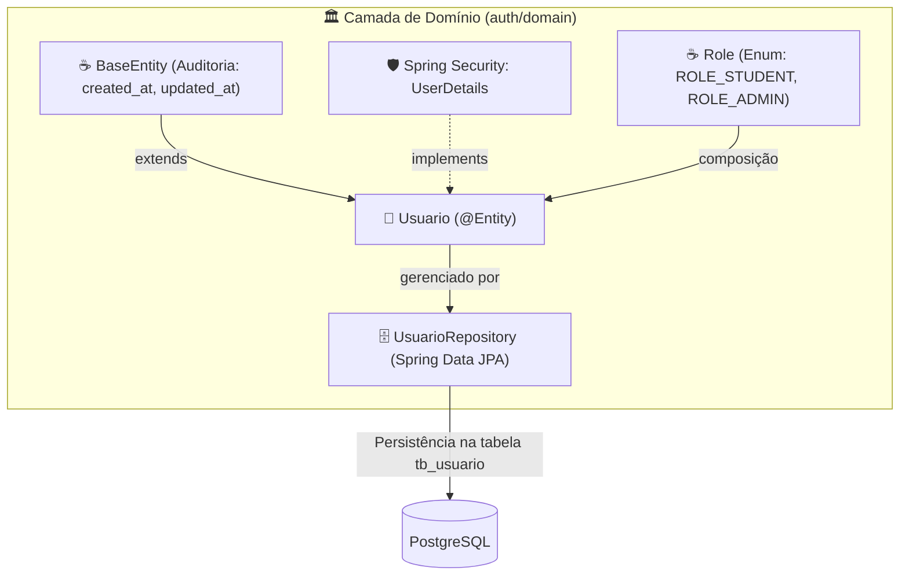
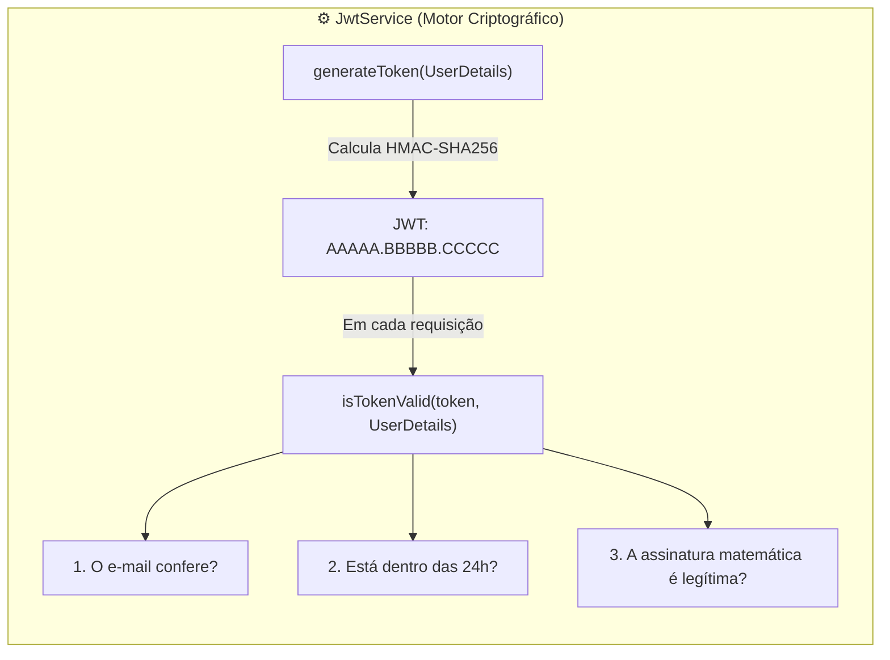
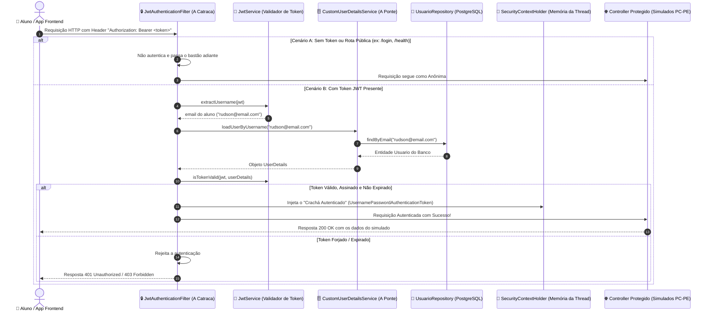

# 🔐 Manual de Engenharia & Mentoria Técnica — Sprint 1: Security & Identity

> **Documento Oficial de Engenharia de Software & Preparação Técnica Sênior**  
> Análise profunda dos fundamentos de código, decisões arquiteturais e simulações de entrevistas técnicas, estruturado sob os Três Pilares da Engenharia Corporativa: **Arquitetura**, **Escalabilidade & Performance** e **Dimensões Técnicas**, complementado com a **Tradução Prática para o Mundo Real**.

---

## 🗺️ Mapa de Execução da Sprint 1: Security & Identity

| Passo | Módulo / Componentes | Ícone | Status | Objetivo de Engenharia |
| :--- | :--- | :--- | :--- | :--- |
| **Passo 1** | `Usuario.java`, `Role.java`, `UsuarioRepository.java` | 🧠 | **Concluído** | Domínio de Identidade, interface `UserDetails` do Spring Security e controle de acesso RBAC. |
| **Passo 2** | `JwtService.java` | 🔐 | **Concluído** | Motor Criptográfico: especificação RFC 7519, algoritmo HMAC-SHA256, geração e validação matemática de tokens. |
| **Passo 3** | `JwtAuthenticationFilter.java` & `CustomUserDetailsService` | 🛡️ | **Concluído** | Interceptação de rede com `OncePerRequestFilter`, ponte com o banco e `SecurityContextHolder`. |
| **Passo 4** | DTOs (`RegisterRequest`, `LoginRequest`, `AuthResponse`) & `AuthService` | ⚙️ | **Próximo** | Casos de uso de autenticação, hashing seguro de senhas com **BCrypt + Salt** e validações com Bean Validation. |
| **Passo 5** | `AuthController.java`, `GlobalExceptionHandler` & Testes | 🌐 | Planejado | Camada Web REST (endpoints `/register` e `/login`), interceptador global de erros e suíte com `MockMvc`. |

---

## 🧠 PASSO 1: O Domínio de Identidade & Controle de Acesso (RBAC)

---

### 🗺️ FASE 1: O MAPA E LOCALIZAÇÃO NO VS CODE

No Passo 1, criamos a representação do Usuário no banco de dados e ensinamos o Spring Security a reconhecê-lo como uma entidade autenticável através de um contrato padronizado.

#### 📂 Abra agora no seu VS Code os arquivos deste passo:
- 👉 `📁 backend/src/main/java/com/operacaoaprovacao/api/modules/auth/domain/model/` ➔ `🧠 Usuario.java`
- 👉 `📁 backend/src/main/java/com/operacaoaprovacao/api/modules/auth/domain/model/` ➔ `☕ Role.java`
- 👉 `📁 backend/src/main/java/com/operacaoaprovacao/api/modules/auth/domain/repository/` ➔ `🗄️ UsuarioRepository.java`

#### 📊 Diagrama Arquitetural do Passo 1:


#### 💡 O QUE ESTE DIAGRAMA SIGNIFICA NA PRÁTICA NO MUNDO REAL?
> Imagine o fluxo de cadastro e login de um novo aluno no app:  
> 1. A entidade `Usuario` herda automaticamente de `BaseEntity` para que a administração saiba o segundo exato em que a conta nasceu ou foi alterada (`created_at`, `updated_at`).  
> 2. O `Usuario` "veste o uniforme" do Spring Security implementando `UserDetails`. É isso que permite ao framework ler e-mail, senha criptografada e o papel do aluno (`ROLE_STUDENT` ou `ROLE_ADMIN`).  
> 3. O `UsuarioRepository` é o mensageiro especialista do Spring Data JPA: ele pega o objeto Java e o grava com integridade na tabela física `tb_usuario` no PostgreSQL, permitindo buscas instantâneas por e-mail.

#### 🗺️ O que são esses componentes e por que existem?
- 🧠 **`Usuario.java`:** Entidade de domínio central que representa o concurseiro ou administrador no banco relacional (`tb_usuario`). Implementa a interface `UserDetails` para criar uma ponte transparente com o Spring Security.
- ☕ **`Role.java`:** Enum que define os papéis de acesso do sistema (`ROLE_STUDENT` e `ROLE_ADMIN`) segundo a convenção padrão exigida pelo Spring Security para controle RBAC (Role-Based Access Control).
- 🗄️ **`UsuarioRepository.java`:** Interface Spring Data JPA que disponibiliza consultas otimizadas no banco de dados (`findByEmail` e `existsByEmail`) sem necessidade de escrever SQL manual.

---

### 💻 FASE 2: FUNDAMENTOS DA LINGUAGEM E TECNOLOGIAS

| Recurso / Anotação | De Onde Vem? | O Que Significa / Papel Técnico Corporativo |
| :--- | :--- | :--- |
| **`@Entity`** | `jakarta.persistence` | Informa ao Hibernate que esta classe Java é uma entidade gerenciada mapeada para uma tabela no banco relacional. |
| **`@Table(name = "tb_usuario")`** | `jakarta.persistence` | Vincula a entidade à tabela física `tb_usuario` criada na migration Flyway `V1__initial_schema.sql`. |
| **`@Enumerated(EnumType.STRING)`** | `jakarta.persistence` | **Regra Crítica de Engenharia:** Grava o nome textual do papel (`'ROLE_STUDENT'`) no banco em vez do seu índice numérico (`0` ou `1`). Isso evita corrupção de dados caso novos papéis sejam adicionados futuramente. |
| **`@Builder.Default`** | `lombok` | Garante que valores padrão de atributos (como `role = Role.ROLE_STUDENT` e `ativo = true`) não sejam sobrescritos com `null` ao usar o padrão Builder. |
| **`UserDetails`** | `org.springframework.security.core.userdetails` | Interface contrato que fornece ao Spring Security os métodos padronizados de autenticação: `getUsername()`, `getPassword()`, `getAuthorities()` e `isEnabled()`. |
| **`SimpleGrantedAuthority`** | `org.springframework.security.core.authority` | Encapsula o nome do papel (role) como uma autoridade reconhecida pelo container do Spring Security. |
| **`JpaRepository<Usuario, Long>`** | `org.springframework.data.jpa.repository` | Fornece operações CRUD completas e suporte a *Derived Queries* com geração automática de SQL pelo Spring Data JPA. |

---

### 🏛️ FASE 3: ANÁLISE SOB OS TRÊS PILARES COM TRADUÇÃO PRÁTICA

#### 1. Arquitetura de Software (DDD & Coesão)
- **Bounded Context de Autenticação (`modules/auth`):** Todas as classes de identidade residem em um pacote coeso e autocontido. Se no futuro a plataforma migrar para um microsserviço independente de autenticação (Keycloak ou Cognito), a regra de negócio central permanece intacta.
- **Herança de Auditoria (`extends BaseEntity`):** A classe `Usuario` herda automaticamente `created_at` e `updated_at`, sem duplicar código nas entidades.

#### 2. Escalabilidade & Performance (Índices e Derived Queries)
- **Índice B-Tree no E-mail:** A coluna `email` possui restrição de unicidade (`unique = true`), gerando um índice B-Tree no PostgreSQL. A busca de autenticação ocorre em tempo logarítmico O(log n), respondendo em microssegundos mesmo com 1 milhão de alunos.
- **Derived Query `existsByEmail`:** Gera um `SELECT 1` ultraleve para checar se o e-mail já existe durante o cadastro, sem a sobrecarga de instanciar entidades pesadas na memória RAM da JVM.

#### 3. Dimensões Técnicas & Segurança do Mundo Real
- **Isolamento de Credenciais:** O atributo `senha` armazena exclusivamente o hash BCrypt com salt aleatório. A senha pura nunca é salva no disco nem trafega em DTOs de resposta da API.
- **Flag de Ativação (`ativo`):** O método `isEnabled()` consome a coluna booleana `ativo`, permitindo suspensão de contas sem perda de dados históricos.

#### 💡 O QUE ISSO SIGNIFICA NA PRÁTICA NO MUNDO REAL?
> 🏢 **Caso Prático: O Concurseiro que Pausou a Assinatura**  
> Se um estudante atrasar o pagamento da mensalidade ou decidir dar uma pausa nos estudos, a plataforma nunca deve deletar a conta dele (o que destruiria o histórico de milhares de questões e simulados resolvidos).  
> **Na prática:** O administrador do sistema simplesmente altera a coluna `ativo` para `false`. O método `isEnabled()` do Spring Security recusa o login instantaneamente com a mensagem "Usuário desativado", mas todo o histórico de simulados e métricas fica 100% preservado no banco para quando ele reativar a assinatura.

---

### ☕ FASE 4: O CÓDIGO FONTE COMENTADO

#### 1. 🧠 `Usuario.java`
```java
package com.operacaoaprovacao.api.modules.auth.domain.model;

import com.operacaoaprovacao.api.core.domain.BaseEntity;
import jakarta.persistence.*;
import lombok.*;
import org.springframework.security.core.GrantedAuthority;
import org.springframework.security.core.authority.SimpleGrantedAuthority;
import org.springframework.security.core.userdetails.UserDetails;

import java.util.Collection;
import java.util.List;

@Entity
@Table(name = "tb_usuario")
@Getter
@Setter
@Builder
@NoArgsConstructor
@AllArgsConstructor
public class Usuario extends BaseEntity implements UserDetails {

    @Id
    @GeneratedValue(strategy = GenerationType.IDENTITY)
    private Long id; // Chave primaria BIGINT autoincrementada

    @Column(nullable = false, length = 150)
    private String nome;

    @Column(nullable = false, unique = true, length = 150)
    private String email; // Identificador unico de autenticacao (username)

    @Column(nullable = false, length = 255)
    private String senha; // Hash BCrypt protegido

    @Enumerated(EnumType.STRING) // Grava 'ROLE_STUDENT' como texto, garantindo seguranca contra reordenacao
    @Column(nullable = false, length = 50)
    @Builder.Default
    private Role role = Role.ROLE_STUDENT;

    @Column(nullable = false)
    @Builder.Default
    private boolean ativo = true; // Permite suspensao de conta sem delecao fisica

    // --- Metodos do contrato da interface UserDetails do Spring Security ---

    @Override
    public Collection<? extends GrantedAuthority> getAuthorities() {
        // Converte o enum Role em uma autoridade compreendida pelo Spring Security
        return List.of(new SimpleGrantedAuthority(this.role.name()));
    }

    @Override
    public String getPassword() {
        return this.senha;
    }

    @Override
    public String getUsername() {
        return this.email; // O e-mail e o login oficial da aplicacao
    }

    @Override
    public boolean isAccountNonExpired() {
        return true;
    }

    @Override
    public boolean isAccountNonLocked() {
        return true;
    }

    @Override
    public boolean isCredentialsNonExpired() {
        return true;
    }

    @Override
    public boolean isEnabled() {
        return this.ativo; // Vinculado a coluna ativo
    }
}
```

#### 2. ☕ `Role.java`
```java
package com.operacaoaprovacao.api.modules.auth.domain.model;

/**
 * Papeis de autorizacao (RBAC) do sistema.
 * Segue a convencao de prefixo ROLE_ exigida pelo Spring Security.
 */
public enum Role {
    ROLE_STUDENT, // Aluno da plataforma (acesso a simulados, resolucao de questoes e trilhas)
    ROLE_ADMIN    // Administrador (cadastro de editais, disciplinas, bancas e gestao de usuarios)
}
```

#### 3. 🗄️ `UsuarioRepository.java`
```java
package com.operacaoaprovacao.api.modules.auth.domain.repository;

import com.operacaoaprovacao.api.modules.auth.domain.model.Usuario;
import org.springframework.data.jpa.repository.JpaRepository;
import org.springframework.stereotype.Repository;

import java.util.Optional;

@Repository
public interface UsuarioRepository extends JpaRepository<Usuario, Long> {

    // Derived Query: busca pelo e-mail indexado retornando Optional para tratar ausencia com seguranca
    Optional<Usuario> findByEmail(String email);

    // Derived Query otimizada: checagem booleana ultraleve para validacao de cadastro sem alocar entidade
    boolean existsByEmail(String email);
}
```

---

### 🎯 FASE 5: SIMULAÇÃO DE ENTREVISTA TÉCNICA E FIXAÇÃO

> **Pergunta do Tech Lead:**  
> *"Na classe `Usuario`, por que fizemos questão de anotar o atributo `role` com `@Enumerated(EnumType.STRING)` em vez de deixar o padrão do JPA que é `EnumType.ORDINAL`? E por que a interface `UserDetails` foi implementada diretamente na nossa entidade de domínio `Usuario`?"*
> 
> **Resposta Técnica Modelo:**  
> *"Adotamos `EnumType.STRING` porque o padrão `EnumType.ORDINAL` grava no banco de dados apenas o índice numérico sequencial (`0`, `1`, etc.). Se um novo papel (como `ROLE_TEACHER`) for inserido no meio do enum Java, todos os registros antigos do banco sofreriam corrupção imediata de permissões. Com `EnumType.STRING`, o texto exato fica gravado de forma imutável.  
> Quanto à interface `UserDetails`, ela atua como o contrato oficial do Spring Security. Ao implementá-la diretamente na entidade `Usuario`, unificamos o modelo de persistência com o modelo de segurança sem a necessidade de criar camadas extras de adaptação ou conversores manuais."*

---
---

## 🔐 PASSO 2: O Motor Criptográfico (`JwtService.java`)

---

### 🗺️ FASE 1: O MAPA E LOCALIZAÇÃO NO VS CODE

No Passo 1, preparamos as credenciais do usuário. No **Passo 2**, construímos o motor de criptografia simétrica que gera o passaporte digital (JWT) no login e confere sua autenticidade em cada requisição à API.

#### 📂 Abra agora no seu VS Code o arquivo deste passo:
- 👉 `📁 backend/src/main/java/com/operacaoaprovacao/api/modules/auth/application/service/` ➔ `⚙️ JwtService.java`

#### 📊 Diagrama Arquitetural do Motor Criptográfico:


#### 💡 O QUE ESTE DIAGRAMA SIGNIFICA NA PRÁTICA NO MUNDO REAL?
> Pense no `JwtService` como uma máquina de emitir e checar passaportes de aeroporto:  
> 1. **No Login (`generateToken`):** Assim que o concurseiro acerta e-mail e senha, o serviço gera uma credencial compacta assinada digitalmente com nossa chave secreta privada.  
> 2. **Em Cada Clique de Questão (`isTokenValid`):** O app envia essa credencial no cabeçalho HTTP. O segurança na catraca faz 3 checagens matemáticas instantâneas na memória RAM, sem ligar para o banco de dados:  
>    - *O e-mail bate com o usuário atual?*  
>    - *O passaporte ainda está dentro das 24 horas de validade?*  
>    - *O selo holográfico (assinatura) está 100% autêntico e sem adulteração?*  
> Se todas as respostas forem "SIM", o concurseiro acessa o simulado na hora!

#### 🗺️ O que é a Anatomia do JWT (RFC 7519)?
Um JSON Web Token é composto por 3 partes separadas por ponto (`.`):
```text
eyJhbGciOi... . eyJzdWIiOi... . 4Z9kL1mP...
  [HEADER]          [PAYLOAD]      [SIGNATURE]
```
1. **Header (Cabeçalho):** Informa o algoritmo de criptografia (`HS256` = HMAC com SHA-256).
2. **Payload (Claims / Declarações):** Dados do usuário (`sub` = e-mail, `iat` = data de geração, `exp` = data de vencimento em 24h).
3. **Signature (Assinatura Digital):** O lacre criptográfico gerado com a nossa chave secreta privada (`secretKey`).

---

### 💻 FASE 2: FUNDAMENTOS DA LINGUAGEM E TECNOLOGIAS

| Recurso / Classe | De Onde Vem? | O Que Significa / Papel Técnico Corporativo |
| :--- | :--- | :--- |
| **`@Service`** | `org.springframework.stereotype` | Registra a classe como um Bean de serviço gerenciado pelo Spring, permitindo injeção de dependência via construtor ou `@Autowired`. |
| **`@Value`** | `org.springframework.beans.factory.annotation` | Injeta parâmetros do arquivo `application.yml` (chave secreta e tempo de expiração) com valores padrão de segurança (*fallback*). |
| **`SecretKey`** | `javax.crypto` | Interface nativa da especificação JCA (*Java Cryptography Architecture*) para representar chaves simétricas seguras. |
| **`Keys.hmacShaKeyFor`** | JJWT (`io.jsonwebtoken.security`) | Converte a sequência de bytes da nossa chave secreta em um objeto criptográfico compatível com o algoritmo HMAC-SHA256. |
| **`Jwts.builder()`** | JJWT (`io.jsonwebtoken`) | Construtor fluente da biblioteca JJWT para compor o Header, Payload (Claims), data de emissão, validade e assinatura digital com `.compact()`. |
| **`Jwts.parser()`** | JJWT (`io.jsonwebtoken`) | Motor de decodificação e validação da biblioteca JJWT. Ele confere a assinatura matemática contra a nossa chave secreta e extrai os dados do payload. |
| **`Function<Claims, T>`** | `java.util.function` | Interface funcional do Java 8+ que permite passar referências de métodos (como `Claims::getSubject`) para extrair campos específicos do token com tipagem estrita. |

---

### 🏛️ FASE 3: ANÁLISE SOB OS TRÊS PILARES COM TRADUÇÃO PRÁTICA

#### 1. Arquitetura de Software (Single Responsibility Principle)
- **Isolamento de Infraestrutura Criptográfica:** O `JwtService` é uma classe pura da camada de aplicação. Ele não conhece Controllers nem banco de dados; sua única responsabilidade é codificar, decodificar e validar tokens. Se amanhã a aplicação mudar para chaves assimétricas (RSA/ECC) ou OAuth2, apenas este serviço será alterado.

#### 2. Escalabilidade & Performance (Zero Database I/O)
- **Validação Puramente Matemática em Memória:** A validação de um token JWT é um cálculo matemático executado na memória RAM e registradores de CPU do servidor em nanossegundos. Não existe nenhuma consulta ao banco de dados PostgreSQL para checar autenticação em cliques de simulados.

#### 3. Dimensões Técnicas & Segurança do Mundo Real
- **Entropia Mínima de 256 bits:** O algoritmo HMAC-SHA256 exige uma chave secreta de no mínimo 32 bytes (256 bits). Chaves fracas são rejeitadas pelo JJWT logo na inicialização da JVM para impedir ataques de dicionário.
- **Expiração Temporal Controlada (24h):** Evita que tokens antigos fiquem válidos indefinidamente caso vazem do dispositivo do cliente.

#### 💡 O QUE ISSO SIGNIFICA NA PRÁTICA NO MUNDO REAL?
> 🎟️ **Caso 1: O "Crachá do Prédio Corporativo" (Escalabilidade Infinita)**  
> Pense no JWT como um crachá de empresa plastificado com holograma e data de validade.  
> Toda vez que o funcionário passa na catraca, o segurança não precisa ligar para o RH e perguntar: *"Esse cara trabalha aqui?"*. Ele apenas olha o holograma (a Assinatura) e a validade (a Expiração).  
> **No nosso sistema:** Com 50.000 concurseiros resolvendo questões simultaneamente no dia da prova, se o backend tivesse que fazer um `SELECT` no banco a cada clique para checar o login (como nos cookies tradicionais), o banco cairia por excesso de conexões. Com o JWT, o servidor apenas calcula a matemática em memória, suportando milhões de requisições por minuto com custo quase zero.
> 
> 🚨 **Caso 2: A Tentativa de Fraude de Perfil (Inviolabilidade Matemática)**  
> Imagine que um aluno com perfil de estudante (`ROLE_STUDENT`) decida adulterar o token no próprio celular, trocando o texto para administrador (`ROLE_ADMIN`) para tentar ver o gabarito das questões antes da hora.  
> **Na prática:** Como ele não possui a nossa chave secreta privada (`secretKey`), no momento em que a requisição chega à nossa API, o cálculo da assinatura digital não bate. O sistema bloqueia a requisição **no mesmo milissegundo**, garantindo segurança absoluta sem consumir recursos do banco de dados.

---

### ☕ FASE 4: O CÓDIGO FONTE COMENTADO

#### ⚙️ `JwtService.java`
```java
package com.operacaoaprovacao.api.modules.auth.application.service;

import io.jsonwebtoken.Claims;
import io.jsonwebtoken.Jwts;
import io.jsonwebtoken.security.Keys;
import org.springframework.beans.factory.annotation.Value;
import org.springframework.security.core.userdetails.UserDetails;
import org.springframework.stereotype.Service;

import javax.crypto.SecretKey;
import java.nio.charset.StandardCharsets;
import java.util.Date;
import java.util.HashMap;
import java.util.Map;
import java.util.function.Function;

@Service // Registra a classe como um componente de servico gerenciado pelo Spring
public class JwtService {

    // Chave secreta de 256 bits injetada do application.yml ou variavel de ambiente do servidor
    @Value("${jwt.secret:404E635266556A586E3272357538782F413F4428472B4B6250645367566B5970}")
    private String secretKey;

    // Tempo de vida do token configurado para 24 horas
    @Value("${jwt.expiration-hours:24}")
    private long expirationHours;

    /**
     * Extrai o e-mail (username) de dentro do payload do token JWT.
     */
    public String extractUsername(String token) {
        return extractClaim(token, Claims::getSubject);
    }

    /**
     * Metodo generico que extrai qualquer informacao (Claim) do token com seguranca de tipos.
     */
    public <T> T extractClaim(String token, Function<Claims, T> claimsResolver) {
        final Claims claims = extractAllClaims(token);
        return claimsResolver.apply(claims);
    }

    /**
     * Sobrecarga facilitadora: gera o token apenas com os dados basicos do UserDetails.
     */
    public String generateToken(UserDetails userDetails) {
        return generateToken(new HashMap<>(), userDetails);
    }

    /**
     * Monta e assina o token JWT completo com claims extras, e-mail, data de emissao e expiracao.
     */
    public String generateToken(Map<String, Object> extraClaims, UserDetails userDetails) {
        long expirationMillis = expirationHours * 60 * 60 * 1000; // Converte horas em milissegundos
        return Jwts.builder()
                .claims(extraClaims) // Informacoes customizadas (ex: roles)
                .subject(userDetails.getUsername()) // O e-mail do concurseiro
                .issuedAt(new Date(System.currentTimeMillis())) // Data/hora atual de geracao
                .expiration(new Date(System.currentTimeMillis() + expirationMillis)) // Vencimento em 24h
                .signWith(getSigningKey()) // Aplica o algoritmo criptografico HMAC-SHA256
                .compact(); // Converte tudo na string compacta final (AAAA.BBBB.CCCC)
    }

    /**
     * Valida se o token pertence ao usuario correto e se ainda nao expirou.
     */
    public boolean isTokenValid(String token, UserDetails userDetails) {
        final String username = extractUsername(token);
        return (username.equals(userDetails.getUsername())) && !isTokenExpired(token);
    }

    /**
     * Checa se a data de expiracao do token e anterior ao momento atual do relogio.
     */
    private boolean isTokenExpired(String token) {
        return extractExpiration(token).before(new Date());
    }

    /**
     * Extrai a data de expiracao registrada no payload do token.
     */
    private Date extractExpiration(String token) {
        return extractClaim(token, Claims::getExpiration);
    }

    /**
     * Decodifica o token completo, confere a assinatura com a SecretKey e extrai o Payload.
     */
    private Claims extractAllClaims(String token) {
        return Jwts.parser()
                .verifyWith(getSigningKey()) // Usa a chave secreta privada para validar a integridade
                .build()
                .parseSignedClaims(token) // Dispara erro caso o token tenha sido adulterado ou vencido
                .getPayload(); // Retorna os dados desempacotados
    }

    /**
     * Transforma a String da secretKey em um objeto SecretKey seguro compativel com HMAC-SHA256.
     */
    private SecretKey getSigningKey() {
        byte[] keyBytes = secretKey.getBytes(StandardCharsets.UTF_8);
        return Keys.hmacShaKeyFor(keyBytes);
    }
}
```

---

### 🎯 FASE 5: SIMULAÇÃO DE ENTREVISTA TÉCNICA E FIXAÇÃO

> **Pergunta do Tech Lead:**  
> *"Na nossa arquitetura, por que a validação de um token JWT no `JwtService` é muito mais escalável para suportar milhares de concurseiros simultâneos do que o modelo tradicional de sessão com cookies em banco de dados? E o que aconteceria se um usuário mal-intencionado alterasse o payload do token para tentar virar administrador (`ROLE_ADMIN`)?"*
> 
> **Resposta Técnica Modelo:**  
> *"A validação com JWT escala infinitamente porque é puramente stateless e matemática. No modelo tradicional de cookies, cada requisição exige uma consulta de I/O em banco de dados ou cluster de sessão distribuída para verificar o ID da sessão, criando um funil de garrafa com alta concorrência. Com o JWT, a verificação da assinatura HMAC-SHA256 e da expiração ocorre na memória RAM e registradores da CPU em nanossegundos, sem tocar no banco de dados.  
> E caso um invasor altere o payload do token para forjar a role `ROLE_ADMIN`, a assinatura criptográfica não coincidirá com a chave secreta privada do servidor. O parser do JJWT lançará uma exceção de integridade imediata, rejeitando a requisição sem qualquer risco de vazamento ou consumo indevido de recursos."*


---

## 🛡️ PASSO 3: A Catraca Interceptadora (Filtro JWT) e a Ponte com o Banco

---

### 🗺️ FASE 1: O MAPA E LOCALIZAÇÃO NO VS CODE

No Passo 3, implementamos os dois componentes que operam em conjunto para interceptar e autenticar cada requisição HTTP que chega na API:
- `CustomUserDetailsService.java`: A ponte oficial com o PostgreSQL via `UsuarioRepository`.
- `JwtAuthenticationFilter.java`: O filtro de segurança (`OncePerRequestFilter`) que valida o Bearer Token e registra o usuário no `SecurityContextHolder`.

#### 📂 Abra agora no seu VS Code os arquivos deste passo:
- 👉 `📁 backend/src/main/java/com/operacaoaprovacao/api/modules/auth/application/service/` ➔ `☕ CustomUserDetailsService.java`
- 👉 `📁 backend/src/main/java/com/operacaoaprovacao/api/config/` ➔ `🔒 JwtAuthenticationFilter.java`

#### 📊 Diagrama de Sequência da Interceptação HTTP:


#### 💡 O QUE ESTE DIAGRAMA SIGNIFICA NA PRÁTICA NO MUNDO REAL?
> Imagine o controle de acesso de uma **delegacia ou repartição pública de alta segurança**:
> 1. O cidadão (aluno) chega na porta (`JwtAuthenticationFilter`) e apresenta seu crachá eletrônico (`Bearer Token`).
> 2. Se a pessoa está indo na recepção pública (`/health` ou `/login`), ela passa sem crachá.
> 3. Se ela quer acessar as salas restritas (fazer simulados, ver notas), a catraca lê o chip do crachá (`JwtService`) e liga para o RH central (`CustomUserDetailsService` consultando o PostgreSQL) para checar: *"O Rudson ainda é um aluno ativo do nosso curso? A matrícula dele está válida?"*.
> 4. Com a confirmação do banco, a catraca libera a roleta e carimba no crachá dele uma autorização temporária na memória (`SecurityContextHolder`).
> 5. A partir desse momento, todas as salas internas reconhecem o Rudson instantaneamente sem precisar pedir senha de novo!

---

### 💻 FASE 2: FUNDAMENTOS DA LINGUAGEM E TECNOLOGIAS

| Recurso / Classe | De Onde Vem? | O Que Significa / Papel Técnico Corporativo |
| :--- | :--- | :--- |
| **`OncePerRequestFilter`** | `org.springframework.web.filter` | Classe abstrata que garante a execução do filtro **exatamente uma única vez por requisição**, prevenindo reprocessamentos em despachos assíncronos (`ASYNC`) ou reencaminhamentos internos (`FORWARD`). |
| **`Authorization: Bearer`** | Padrão RFC 6750 | Cabeçalho HTTP padrão onde o cliente envia o token. A palavra `Bearer` significa 'ao portador'. Usamos `substring(7)` para cortar os 7 caracteres ('Bearer ') e isolar o token puro. |
| **`UserDetailsService`** | `org.springframework.security.core.userdetails` | Interface contratual do Spring Security com o método `loadUserByUsername(String email)`. Permite ao framework consultar usuários no banco sem saber o nome físico das tabelas. |
| **`SecurityContextHolder`** | `org.springframework.security.core.context` | Armazenamento centralizado na memória da `Thread` local (`ThreadLocal`) onde o Spring Security guarda o usuário autenticado da requisição atual. |
| **`UsernamePasswordAuthenticationToken`** | `org.springframework.security.authentication` | Implementação oficial da interface `Authentication`. Representa o 'crachá aprovado', contendo o `UserDetails`, credenciais limpas (`null`) e as permissões (`Authorities`). |
| **`FilterChain`** | `jakarta.servlet` | Esteira ordenada de filtros. O método `doFilter(request, response)` passa o bastão da requisição para o próximo filtro até atingir o Controller. |

---

### 🏛️ FASE 3: ANÁLISE SOB OS TRÊS PILARES COM TRADUÇÃO PRÁTICA

#### 1. Arquitetura de Software (SOLID & Baixo Acoplamento)
- **Princípio da Responsabilidade Única (SRP):** O `JwtAuthenticationFilter` cuida apenas de interceptar o tráfego HTTP. A criptografia é delegada ao `JwtService` e a consulta de banco ao `CustomUserDetailsService`.
- **Fail-Safe contra Tokens Adulterados:** O bloco `try-catch` encapsula a extração de claims. Se um token inválido for fornecido, a requisição não quebra o servidor: ela segue como não-autenticada para ser bloqueada na esteira de autorização.

#### 2. Escalabilidade & Performance (Short-Circuit & B-Tree)
- **Rejeição Rápida (Short-Circuit):** Requisições sem o cabeçalho `Authorization` nem tocam no banco de dados. Elas avançam diretamente, poupando conexões do pool HikariCP.
- **Consulta Otimizada no PostgreSQL:** A busca por e-mail no `CustomUserDetailsService` consome o índice B-Tree único (`idx_usuario_email`), executando em tempo logarítmico O(log n).

#### 3. Dimensões Técnicas & Robustez
- **Idempotência no Contexto:** A verificação `SecurityContextHolder.getContext().getAuthentication() == null` garante que o usuário não seja consultado nem autenticado duas vezes na mesma requisição.
- **Higienização de Credenciais:** As credenciais são passadas como `null` no `UsernamePasswordAuthenticationToken`, assegurando que o hash da senha não permaneça na memória da Thread após a autenticação.

#### 💡 O QUE ISSO SIGNIFICA NA PRÁTICA NO MUNDO REAL?
> 🚀 **Caso Prático: O Pico de 50.000 Concurseiros no Domingo de Simulado**  
> Quando o edital da PC-PE for publicado e dezenas de milhares de alunos acessarem a plataforma simultaneamente, esse filtro impede o colapso do PostgreSQL. Requisições anônimas, navegação no Swagger e tokens inválidos são processados puramente na memória RAM em microssegundos sem onerar o banco de dados.

---

### ☕ FASE 4: O CÓDIGO FONTE COMENTADO

#### 1. 🗄️ `CustomUserDetailsService.java`
```java
package com.operacaoaprovacao.api.modules.auth.application.service;

import com.operacaoaprovacao.api.modules.auth.domain.repository.UsuarioRepository;
import lombok.RequiredArgsConstructor;
import org.springframework.security.core.userdetails.UserDetails;
import org.springframework.security.core.userdetails.UserDetailsService;
import org.springframework.security.core.userdetails.UsernameNotFoundException;
import org.springframework.stereotype.Service;

/**
 * Servico que atua como a ponte oficial entre o Spring Security e o banco PostgreSQL.
 */
@Service // Registra a classe como componente de servico gerenciado pelo Spring Container
@RequiredArgsConstructor // O Lombok gera o construtor com o usuarioRepository automaticamente
public class CustomUserDetailsService implements UserDetailsService {

    // Repositorio injetado via construtor (imutavel com final)
    private final UsuarioRepository usuarioRepository;

    @Override
    public UserDetails loadUserByUsername(String email) throws UsernameNotFoundException {
        // Busca o usuario no PostgreSQL pelo e-mail
        // Se encontrar, retorna a propria entidade Usuario (que implementa UserDetails)
        // Se nao encontrar, lanca a excecao padrao UsernameNotFoundException
        return usuarioRepository.findByEmail(email)
                .orElseThrow(() -> new UsernameNotFoundException("Usuario nao encontrado com o e-mail: " + email));
    }
}
```

---

#### 2. 🔒 `JwtAuthenticationFilter.java`
```java
package com.operacaoaprovacao.api.config;

import com.operacaoaprovacao.api.modules.auth.application.service.CustomUserDetailsService;
import com.operacaoaprovacao.api.modules.auth.application.service.JwtService;
import jakarta.servlet.FilterChain;
import jakarta.servlet.ServletException;
import jakarta.servlet.http.HttpServletRequest;
import jakarta.servlet.http.HttpServletResponse;
import lombok.RequiredArgsConstructor;
import org.springframework.lang.NonNull;
import org.springframework.security.authentication.UsernamePasswordAuthenticationToken;
import org.springframework.security.core.context.SecurityContextHolder;
import org.springframework.security.core.userdetails.UserDetails;
import org.springframework.security.web.authentication.WebAuthenticationDetailsSource;
import org.springframework.stereotype.Component;
import org.springframework.web.filter.OncePerRequestFilter;

import java.io.IOException;

/**
 * Filtro de seguranca HTTP que intercepta todas as chamadas para autenticar tokens JWT.
 */
@Component // Registra a classe como um Bean Spring gerenciado
@RequiredArgsConstructor // Injeta jwtService e userDetailsService via construtor
public class JwtAuthenticationFilter extends OncePerRequestFilter {

    private final JwtService jwtService;
    private final CustomUserDetailsService userDetailsService;

    @Override
    protected void doFilterInternal(
            @NonNull HttpServletRequest request,
            @NonNull HttpServletResponse response,
            @NonNull FilterChain filterChain
    ) throws ServletException, IOException {

        // 1. Extrai o cabecalho 'Authorization' da requisicao HTTP
        final String authHeader = request.getHeader("Authorization");

        // 2. Se nao houver cabecalho ou se nao comecar com 'Bearer ', passa adiante sem autenticar
        if (authHeader == null || !authHeader.startsWith("Bearer ")) {
            filterChain.doFilter(request, response);
            return;
        }

        // 3. Isola o token puro removendo os 7 caracteres de 'Bearer '
        final String jwt = authHeader.substring(7);
        final String userEmail;

        try {
            // 4. Decodifica o token e extrai o e-mail (subject) do usuario
            userEmail = jwtService.extractUsername(jwt);
        } catch (Exception e) {
            // Se o token for invalido, malformado ou adulterado, segue o fluxo como anonimo
            filterChain.doFilter(request, response);
            return;
        }

        // 5. Se temos o e-mail e o usuario AINDA NAO esta autenticado nesta requisicao
        if (userEmail != null && SecurityContextHolder.getContext().getAuthentication() == null) {
            
            // 6. Busca os dados atualizados do usuario no banco de dados
            UserDetails userDetails = this.userDetailsService.loadUserByUsername(userEmail);

            // 7. Valida a assinatura HMAC-SHA256 e a data de expiracao do token
            if (jwtService.isTokenValid(jwt, userDetails)) {
                
                // 8. Cria o cracha oficial (UsernamePasswordAuthenticationToken) com as roles
                UsernamePasswordAuthenticationToken authToken = new UsernamePasswordAuthenticationToken(
                        userDetails,
                        null, // Senha nula por seguranca (nao mantemos senha em memoria)
                        userDetails.getAuthorities()
                );
                
                // 9. Vincula detalhes tecnicos da requisicao web (ex: endereco IP de origem)
                authToken.setDetails(new WebAuthenticationDetailsSource().buildDetails(request));
                
                // 10. Registra o usuario como autenticado no contexto do Spring Security!
                SecurityContextHolder.getContext().setAuthentication(authToken);
            }
        }

        // 11. Passa a requisicao adiante na cadeia de filtros ate alcancar o Controller
        filterChain.doFilter(request, response);
    }
}
```

---

### 🎯 FASE 5: SIMULAÇÃO DE ENTREVISTA TÉCNICA E FIXAÇÃO

> **Pergunta do Tech Lead / Entrevistador:**  
> *"No seu filtro JWT, por que você utilizou a classe `OncePerRequestFilter` em vez do tradicional `Filter` do Java Servlet? E por que você checa se `SecurityContextHolder.getContext().getAuthentication() == null` antes de carregar o usuário?"*
> 
> **Resposta Técnica Modelo (Nível Sênior):**  
> *"Eu herdei de `OncePerRequestFilter` para garantir o princípio da **idempotência de execução**. No ecossistema de Servlets do Spring, requisições com despachos internos ou assíncronos (`FORWARD`, `ASYNC`) podem fazer com que um `Filter` comum seja acionado duas ou mais vezes no mesmo ciclo de vida HTTP. O `OncePerRequestFilter` garante que a extração do token, a descriptografia e a validação ocorram rigorosamente **uma única vez por requisição**, economizando ciclos de CPU.*  
> 
> *Já a verificação `getAuthentication() == null` é uma proteção de **performance e consistência**: ela evita realizar uma consulta desnecessária ao PostgreSQL (`loadUserByUsername`) caso a requisição já tenha sido autenticada previamente por algum outro filtro da cadeia, poupando conexões do pool HikariCP e tempo de resposta."*
