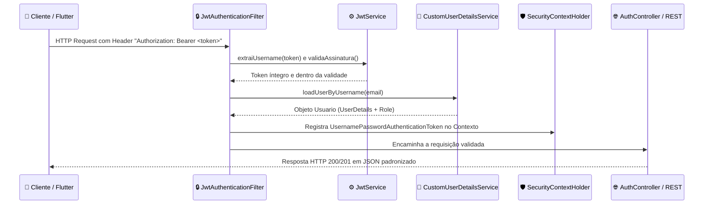

# 🔐 Guia de Estudos — Sprint 1: Security & Identity (Autenticação JWT & RBAC)

> **Documento Oficial de Engenharia de Software & Mentoria Técnica**  
> Mapeamento completo dos fundamentos de segurança, arquitetura Stateless com JWT, Spring Security 6 e controle de acesso baseado em papéis (RBAC).

---

## 🔑 1. O que é e como funciona o JWT (JSON Web Token)?

O JWT é um padrão aberto internacional (**RFC 7519**) que define uma forma compacta e autossuficiente para transmitir informações com segurança entre partes como um objeto JSON assinado digitalmente.

### A Anatomia de um Token JWT:
Um token é uma string composta por três partes separadas por pontos (`.`):

```text
AAAAAA.BBBBBB.CCCCCC
(Header).(Payload).(Signature)
```

1. **Header (Cabeçalho):** Informa o algoritmo criptográfico de assinatura (ex: `HS256` = HMAC com SHA-256) e o tipo do token (`JWT`).
2. **Payload (Carga Útil):** Contém as **Claims** (declarações/dados do usuário):
   - `sub` (Subject): O identificador principal (o e-mail do usuário autenticado).
   - `iat` (Issued At): Timestamp do momento exato em que o token foi gerado.
   - `exp` (Expiration): Data e hora em que o token perde a validade (configurado para 24 horas).
3. **Signature (Assinatura Criptográfica):** Calculada pelo servidor utilizando a chave secreta:
   ```text
   HMACSHA256(base64(Header) + "." + base64(Payload), SECRET_KEY)
   ```
   *Ponto Crítico de Segurança:* Se um atacante tentar alterar o payload (por exemplo, trocar seu e-mail ou tentar alterar seu papel para admin), a assinatura não confere com a chave secreta do servidor, e a requisição é **bloqueada instantaneamente sem precisar consultar o banco de dados!**

---

## 🔄 2. O Ciclo de Vida de uma Requisição no Spring Security 6

Veja o fluxo exato de uma requisição autenticada do aplicativo Flutter para a nossa API Spring Boot:



#### 💡 O QUE ESTE DIAGRAMA SIGNIFICA NA PRÁTICA NO MUNDO REAL?
> Imagine o controle de embarque prioritário em um aeroporto:  
> 1. **`📱 App (Passageiro)`:** O aluno tenta acessar uma área restrita (ex: fazer o Simulado da PC-PE) apresentando seu cartão de embarque digital (`Authorization: Bearer <token>`).  
> 2. **`🔒 JwtAuthenticationFilter (Portão Eletrônico)`:** O filtro intercepta a pessoa antes que ela pise na aeronave.  
> 3. **`⚙️ JwtService (Scanner do QR Code)`:** Faz a checagem rápida da assinatura digital. Se o QR Code for falso ou estiver vencido, o portão apita e barra na hora!  
> 4. **`🧠 CustomUserDetailsService (Lista de Passageiros)`:** Confere se o passageiro consta como ativo no voo (`tb_usuario`).  
> 5. **`🛡️ SecurityContextHolder (Crachá Temporário de Bordo)`:** O sistema coloca o passageiro na lista oficial de pessoas autorizadas dentro daquela thread de processamento.  
> 6. **`🌐 Controller (A Cabine)`:** O endpoint atende o concurseiro com total confiança de que ele é realmente quem diz ser e devolve os dados com segurança!

---

## 📂 3. Raio-X dos Arquivos da Sprint 1

| Arquivo / Componente | Camada | Ícone | Responsabilidade Técnica Principal |
| :--- | :--- | :--- | :--- |
| `Usuario.java` | Domain / Model | 🧠 | Entidade JPA que estende `BaseEntity` e implementa `UserDetails` do Spring Security. |
| `Role.java` | Domain / Model | ☕ | Enum RBAC (`ROLE_STUDENT`, `ROLE_ADMIN`) mapeado como string no banco de dados. |
| `UsuarioRepository.java` | Domain / Repository | 🗄️ | Interface Spring Data JPA com métodos otimizados `findByEmail` e `existsByEmail`. |
| `JwtService.java` | Application / Service | ⚙️ | Emissão, decodificação e validação de tokens JWT usando algoritmo HMAC-SHA256. |
| `CustomUserDetailsService.java` | Application / Service | ⚙️ | Carrega os dados de autenticação do usuário a partir do PostgreSQL para o Spring. |
| `JwtAuthenticationFilter.java` | Config / Security | 🔒 | Filtro derivado de `OncePerRequestFilter` que intercepta requisições e valida o Bearer Token. |
| `RegisterRequest.java` | Application / DTO | ✉️ | Objeto de entrada de cadastro protegido com Bean Validation (`@NotBlank`, `@Email`, `@Size`). |
| `LoginRequest.java` | Application / DTO | ✉️ | Objeto de entrada de login contendo e-mail e senha. |
| `AuthResponse.java` | Application / DTO | ✉️ | Objeto de saída contendo o token JWT gerado e dados básicos do usuário. |
| `AuthService.java` | Application / Service | ⚙️ | Casos de uso de autenticação: registro com hash BCrypt e login autenticado. |
| `AuthController.java` | Presentation | 🌐 | Endpoints públicos `/api/v1/auth/register` (HTTP 201) e `/api/v1/auth/login` (HTTP 200). |
| `GlobalExceptionHandler.java` | Core / Exception | 🛡️ | Interceptador `@RestControllerAdvice` que trata `BadCredentialsException` e erros 400. |
| `AuthControllerTest.java` | Test / QA | 🧪 | Testes de integração cobrindo cadastro, email duplicado, login válido e senha errada. |

---

## 💼 4. Perguntas Reais de Entrevistas Técnicas

### 🎯 Pergunta 1: "O que é Salt e por que nunca devemos usar MD5 ou SHA-256 puro para armazenar senhas?"
> **Resposta Modelo:**  
> "Algoritmos como MD5 ou SHA-256 comum foram projetados para serem ultra rápidos (cálculo de integridade de arquivos). Por serem rápidos, invasores conseguem testar bilhões de combinações por segundo usando tabelas pré-computadas (*Rainbow Tables*).  
> O **BCrypt** é uma função de derivação de chave propositalmente lenta (*slow by design*) que incorpora um fator de custo e um **Salt** (sequência criptográfica pseudoaleatória gerada automaticamente para cada senha). Mesmo que dois usuários tenham exatamente a mesma senha literal, o hash gerado pelo BCrypt será completamente diferente para cada um, inviabilizando ataques com tabelas pré-computadas."

### 🎯 Pergunta 2: "Qual é o papel do `SecurityContextHolder` no Spring Security?"
> **Resposta Modelo:**  
> "O `SecurityContextHolder` é o repositório central onde o Spring Security armazena os detalhes da autenticação do usuário durante o processamento de uma requisição. Por padrão, ele opera sob a estratégia baseada em `ThreadLocal`, o que significa que o objeto `Authentication` fica isolado e acessível para qualquer método ou serviço executado dentro daquela mesma thread de requisição, sem a necessidade de passar o usuário manualmente como parâmetro entre as camadas do sistema."

### 🎯 Pergunta 3: "Se o token JWT for roubado, o que acontece? Como mitigar esse risco em produção?"
> **Resposta Modelo:**  
> "Em uma arquitetura puramente stateless, qualquer cliente que possua um token JWT válido tem permissão para consumir os recursos autorizados até que o token atinja sua data de expiração. Para mitigar esse risco em sistemas de missão crítica, adotamos três estratégias consagradas:  
> 1. Tráfego estritamente sob **HTTPS (TLS)** com certificados válidos para neutralizar ataques de interceptação na rede (*Man-in-the-Middle*);  
> 2. Tempo de vida curto para o token de acesso (*Short-Lived Access Token*, ex: de 15 a 60 minutos) combinado com *Refresh Tokens* armazenados de forma segura;  
> 3. Em cenários que exigem revogação imediata (ex: logout explícito ou suspeita de fraude), implementa-se uma lista de revogação rápida (*Token Denylist/Blocklist*) em memória distribuída com **Redis**."