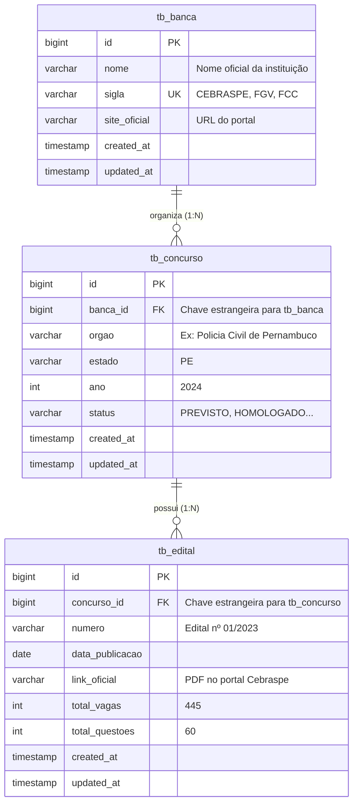
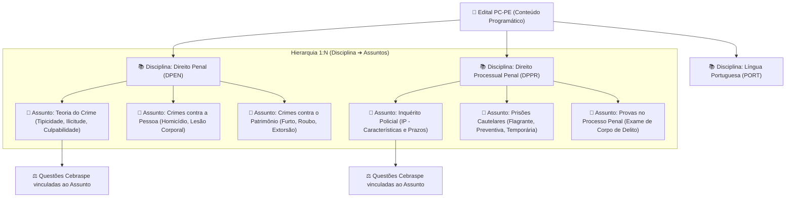
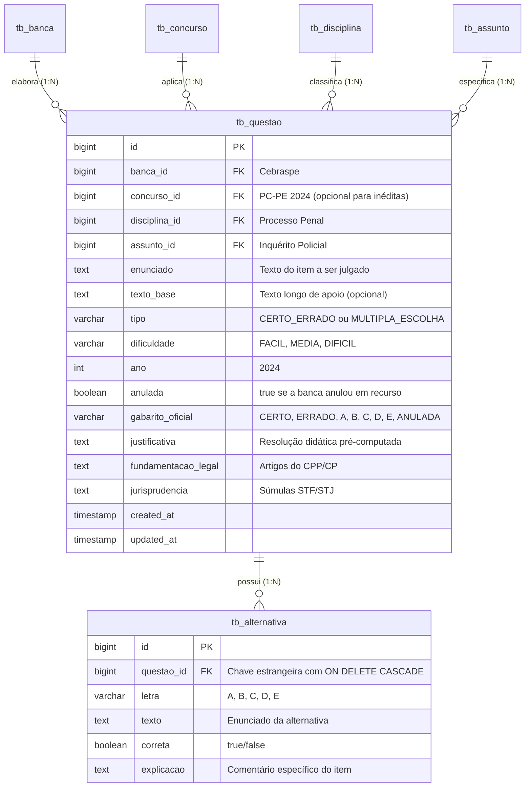
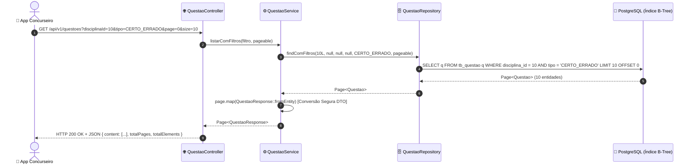
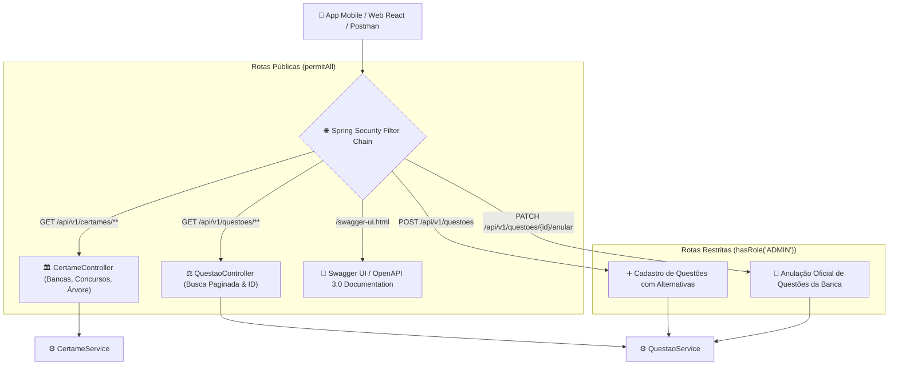

# 🏛️ Manual de Engenharia & Mentoria Técnica — Sprint 2: Core Domain

> **Documento Oficial de Engenharia de Software & Preparação Técnica Sênior**  
> Análise profunda dos fundamentos de código, decisões arquiteturais e simulações de entrevistas técnicas, estruturado sob os Três Pilares da Engenharia Corporativa: **Arquitetura**, **Escalabilidade & Performance** e **Dimensões Técnicas**, complementado com a **Tradução Prática para o Mundo Real**.  
> Governança baseada na **Cláusula 9 das Regras Absolutas**: Consolidação dos 5 Pilares Fundamentais e aprofundamento rigoroso nos níveis **Júnior** e **Pleno**, mantendo a visão do **Sênior**.

---

## 🗺️ Mapa de Execução da Sprint 2: Core Domain

| Passo | Módulo / Componentes | Ícone | Status | Objetivo de Engenharia |
| :--- | :--- | :--- | :--- | :--- |
| **Passo 1** | Modelagem de Certames (`Banca`, `Concurso`, `Edital`, `StatusConcurso`) | 🏛️ | **Concluído** | Mapeamento relacional JPA, integridade referencial com chaves estrangeiras, `FetchType.LAZY` e repositórios com Derived Queries. |
| **Passo 2** | Árvore de Conhecimento (`Disciplina` e `Assunto`) | 📚 | **Concluído** | Modelagem hierárquica do conteúdo programático da PC-PE, consistência bidirecional, `JOIN FETCH` e `orphanRemoval`. |
| **Passo 3** | Motor de Questões Cebraspe (Migration `V2`, `Questao`, `Alternativa`) | ⚖️ | **Concluído** | Modelagem física de questões, suporte Certo/Errado e Múltipla Escolha, justificativas pré-computadas, índices B-Tree e anulação oficial. |
| **Passo 4** | Casos de Uso, DTOs & Busca Paginada (`CertameService`, `QuestaoService`) | ⚙️ | **Concluído** | Regras de negócio, validação hierárquica, paginação com `Pageable`, DTOs imutáveis e testes Mockito puro. |
| **Passo 5** | Endpoints REST, OpenAPI/Swagger & Suíte de Testes | 🌐 | **Concluído** | Camada Web corporativa com endpoints RESTful, OpenAPI 3.0/Swagger, segurança RBAC e suíte de 45 testes automatizados. |

---

## 🏛️ PASSO 1: O Domínio de Certames, Editais e Relacionamentos JPA

---

### 🗺️ FASE 1: O MAPA E LOCALIZAÇÃO NO VS CODE

No Passo 1 da Sprint 2, construímos o coração cadastral dos concursos públicos. Ensinamos o Spring Data JPA e o PostgreSQL a representar as **Bancas Examinadoras** (como Cebraspe, FGV e FCC), os **Concursos** (como PC-PE 2024) e os **Editais Oficiais** com suas vagas e datas.

#### 📂 Abra agora no seu VS Code os arquivos deste passo:
- 👉 `📁 backend/src/main/java/.../modules/certame/domain/model/` ➔ `☕ StatusConcurso.java`
- 👉 `📁 backend/src/main/java/.../modules/certame/domain/model/` ➔ `🏛️ Banca.java`
- 👉 `📁 backend/src/main/java/.../modules/certame/domain/model/` ➔ `🏛️ Concurso.java`
- 👉 `📁 backend/src/main/java/.../modules/certame/domain/model/` ➔ `🏛️ Edital.java`
- 👉 `📁 backend/src/main/java/.../modules/certame/domain/repository/` ➔ `🗄️ BancaRepository.java`
- 👉 `📁 backend/src/main/java/.../modules/certame/domain/repository/` ➔ `🗄️ ConcursoRepository.java`
- 👉 `📁 backend/src/main/java/.../modules/certame/domain/repository/` ➔ `🗄️ EditalRepository.java`
- 👉 `📁 backend/src/test/java/.../modules/certame/` ➔ `🧪 CertameDomainTest.java`

#### 📊 Diagrama de Entidade-Relacionamento (ERD) do Passo 1:


#### 💡 O QUE ESTE DIAGRAMA SIGNIFICA NA PRÁTICA NO MUNDO REAL?
> Imagine a preparação de um concurseiro para a Polícia Civil de Pernambuco:
> 1. **A Instituição Organizadora (`Banca`):** O Cebraspe é a entidade jurídica responsável pela logística, elaboração das questões e aplicação da prova. No sistema, ele é cadastrado uma única vez e ganha um identificador único.
> 2. **O Evento do Concurso (`Concurso`):** O concurso da PC-PE 2024 é um evento específico contratado pelo Estado de Pernambuco junto ao Cebraspe. Ele tem um ciclo de vida real: nasce como `PREVISTO`, vira `EDITAL_PUBLICADO`, passa por `INSCRICOES_ABERTAS`, realiza as provas em `EM_ANDAMENTO` e atinge a fase de convocação como `HOMOLOGADO`.
> 3. **O Regulamento Jurídico (`Edital`):** Um concurso pode ter mais de um edital ao longo da sua história (o edital de abertura nº 01/2023, um edital retificador nº 02/2024, etc.). Cada edital define as regras do jogo: total de vagas (445 vagas para Agente e Escrivão) e o link oficial do PDF para o aluno consultar.

---

### 💻 FASE 2: FUNDAMENTOS DA LINGUAGEM & OS 5 PILARES FUNDAMENTAIS

#### 🏛️ PILAR 1: BASE SÓLIDA DE JAVA MODERNO (JAVA 17/21 LTS)

##### 🟢 Destrinchando para o NÍVEL JÚNIOR:
1. **O que é um Enum em Java e por que ele é tão poderoso?**
   - Um iniciante costuma representar status usando texto solto (`String status = "aberto";`).
   - **O perigo:** Se em uma parte do código alguém escrever `"aberto"`, em outra `"ABERTO"` e em outra `"Aberto"`, o seu sistema começa a apresentar bugs misteriosos porque a comparação de Strings falha!
   - Um `enum` (como `StatusConcurso`) cria um **conjunto fechado e imutável de constantes**. O compilador do Java **não permite** que você passe nenhum valor diferente dos que estão declarados. Se você tentar atribuir `StatusConcurso.INVALIDO`, o código nem compila!
2. **Herança Corporativa com `extends BaseEntity`:**
   - Em vez de digitar os campos `createdAt` e `updatedAt` em todas as tabelas e classes, herdamos de `BaseEntity`.
   - A anotação `@MappedSuperclass` avisa ao JPA: *"Não crie uma tabela para a BaseEntity no banco, mas injete as colunas dela em todas as entidades filhas que a herdarem"*.

##### 🟡 Elevando para o NÍVEL PLENO:
- **Por que NUNCA usar `@Enumerated(EnumType.ORDINAL)` no JPA?**
  - O JPA possui duas formas de salvar um enum no banco de dados:
    1. `EnumType.ORDINAL`: Grava o índice numérico da posição em que o enum foi escrito (`0`, `1`, `2`...).
    2. `EnumType.STRING`: Grava o texto exato (`'PREVISTO'`, `'HOMOLOGADO'`).
  - **A armadilha fatal do ORDINAL:** Se você tem `PREVISTO (0)` e `HOMOLOGADO (1)` e meses depois outro desenvolvedor insere `COMISSAO_FORMADA` no início da lista do enum, a posição numérica de todo mundo muda! O que era `HOMOLOGADO` no banco agora vira `COMISSAO_FORMADA`, **corrompendo todo o histórico do banco de produção**!
  - **Regra Pleno/Sênior:** **SEMPRE** utilize `@Enumerated(EnumType.STRING)`.

---

### 🍃 PILAR 2: ECOSSISTEMA SPRING & JPA SEM "MÁGICA"

##### 🟢 Destrinchando para o NÍVEL JÚNIOR:
1. **O que é `@ManyToOne` e `@JoinColumn`?**
   - Em banco de dados relacional, temos o conceito de **Chave Estrangeira (Foreign Key / FK)**: uma coluna em uma tabela que aponta para a Chave Primária de outra.
   - Na tabela `tb_concurso`, temos a coluna `banca_id`.
   - No Java orientado a objetos, não queremos guardar apenas o número `1L`. Queremos navegar diretamente pelo objeto: `concurso.getBanca().getNome()`.
   - A anotação `@ManyToOne` diz: *"Muitos concursos apontam para Uma única Banca"*.
   - A anotação `@JoinColumn(name = "banca_id")` ensina ao Hibernate qual é o nome físico da coluna no PostgreSQL que guarda essa conexão.
2. **Derived Queries no Spring Data JPA:**
   - O que significa `findBySiglaIgnoreCase(String sigla)` na interface `BancaRepository`?
   - O Spring Data analisa o nome do método em tempo de inicialização:
     - `findBy`: Cria uma query de `SELECT`.
     - `Sigla`: Procura pelo atributo `sigla`.
     - `IgnoreCase`: Aplica a função `LOWER(sigla) = LOWER(?)` para que a busca encontre o Cebraspe tanto se o usuário digitar `"cebraspe"` quanto `"CEBRASPE"`.
   - Você não precisou escrever uma única linha de SQL manual!

##### 🟡 Elevando para o NÍVEL PLENO:
- **A Armadilha do `FetchType.EAGER` vs `FetchType.LAZY` (O Problema do N+1 Queries):**
  - Por padrão da especificação JPA, anotações `@ManyToOne` usam `FetchType.EAGER` (ansioso).
  - **O que acontece com EAGER:** Toda vez que você busca um Concurso no banco, o Hibernate automaticamente faz um `JOIN` ou dispara uma segunda query para buscar a Banca, mesmo que você só precisasse saber o nome do concurso!
  - Se você listar 100 concursos na tela, o Hibernate fará 1 query para trazer os concursos + 100 queries para trazer a banca de cada um (**101 queries ao banco de dados!**). Isso derruba a performance de qualquer servidor.
  - **A Solução Plena/Sênior:** Declarar explicitamente `@ManyToOne(fetch = FetchType.LAZY)`. O Hibernate só busca os dados da Banca no banco se você explicitamente chamar `concurso.getBanca().getNome()` dentro de uma transação aberta.

---

### 🗄️ PILAR 3: BANCO DE DADOS & SQL REAL

##### 🟢 Destrinchando para o NÍVEL JÚNIOR:
- **O que significa `CONSTRAINT fk_concurso_banca FOREIGN KEY ...`?**
  - É a **Integridade Referencial** garantida pelo próprio PostgreSQL.
  - Se você tentar cadastrar um concurso com `banca_id = 999` e não existir nenhuma banca com ID 999 na tabela `tb_banca`, o banco **recusa a inserção na hora**.
  - Da mesma forma, se você tentar apagar a banca Cebraspe da tabela enquanto existirem concursos vinculados a ela, o banco bloqueia a exclusão para não deixar registros "órfãos".

##### 🟡 Elevando para o NÍVEL PLENO:
- **Índices B-Tree em Chaves Estrangeiras:**
  - O PostgreSQL cria índices automaticamente apenas para Chaves Primárias (`PRIMARY KEY`) e campos com `UNIQUE`.
  - Colunas de Chave Estrangeira (`banca_id`, `concurso_id`) **NÃO possuem índice automático**.
  - Se a sua aplicação fizer muitas buscas filtrando por concursos de uma determinada banca (`WHERE banca_id = ?`), o banco de dados seria obrigado a ler a tabela inteira do primeiro ao último registro (*Full Table Scan*).
  - É por isso que em migrações corporativas Flyway sempre criamos índices explícitos: `CREATE INDEX idx_concurso_banca ON tb_concurso(banca_id);`. A busca salta de $O(N)$ para $O(\log N)$ em uma árvore B-Tree.

---

### 🧪 PILAR 4: TESTES AUTOMATIZADOS CORPORATIVOS

##### 🟢 Destrinchando para o NÍVEL JÚNIOR:
- **Por que testar entidades de domínio?**
  - Para garantir que a construção dos objetos via padrão **Builder** (`Banca.builder().sigla("CEBRASPE").build()`) inicializa os campos corretamente, respeita os valores padrão definidos (como `status = StatusConcurso.PREVISTO`) e não gera referências nulas inesperadas.

##### 🟡 Elevando para o NÍVEL PLENO:
- **Execução Ultra Rápida sem Overhead:**
  - O teste [`CertameDomainTest.java`](file:///c:/Users/Rlima/OneDrive/Documentos/Projeto%20Aprovacao%20Concurso/operacao-aprovacao/backend/src/test/java/com/operacaoaprovacao/api/modules/certame/CertameDomainTest.java) não utiliza nenhuma anotação pesada do Spring. Ele roda em **menos de 1 segundo**, testando a integridade das entidades diretamente na JVM com assertivas fluentes do **AssertJ** (`assertThat`).

---

### 🛠️ PILAR 5: FERRAMENTAS & ROTINA CORPORATIVA

##### 🟢 Destrinchando para o NÍVEL JÚNIOR:
- **Estruturação de Pacotes por Fatias Verticais (Vertical Slices):**
  - Em projetos amadores, todas as entidades do sistema ficam misturadas dentro de uma única pasta `entity`, todos os repositórios em `repository` e todas as controllers em `controller`. Quando o projeto chega a 50 tabelas, ninguém mais se acha!
  - No Operação Aprovação, adotamos a arquitetura corporativa moderna de **Módulos Independentes**:
    - `modules/auth/` ➔ Tudo de login e segurança.
    - `modules/certame/` ➔ Tudo de bancas, concursos e editais.
    - `modules/questao/` ➔ Tudo de questões e simulados.

##### 🟡 Elevando para o NÍVEL PLENO:
- **Controle de Transição de Estado:**
  - O ciclo de vida de um concurso não pode mudar aleatoriamente. Um concurso não pode ir de `PREVISTO` direto para `ENCERRADO` sem passar por `EDITAL_PUBLICADO`. O uso de Enums estruturados pavimenta o caminho para a criação de máquinas de estado consistentes na camada de serviço.

---

### 🎯 FASE 3: ANÁLISE SOB OS TRÊS PILARES & A RÉGUA DE MATURIDADE

---

### 🎯 A RÉGUA DE MATURIDADE: JÚNIOR vs PLENO vs SÊNIOR

```
┌────────────────────────────────────────────────────────────────────────────────────────┐
│  🟢 NÍVEL JÚNIOR (O que dominar e quais armadilhas evitar):                             │
│  - Armadilha clássica: Usar String solta para status em vez de enum e sofrer com erros  │
│    de digitação ("aberto" vs "ABERTO").                                                │
│  - Armadilha clássica: Esquecer o @Enumerated(EnumType.STRING) e usar o padrão ORDINAL, │
│    corrompendo o banco caso a ordem das constantes mude.                               │
│  - Domínio essencial: Saber mapear relacionamentos @ManyToOne com @JoinColumn indicando │
│    a coluna exata da chave estrangeira no banco.                                       │
│  - Criar consultas no Repository usando as convenções de Derived Queries do Spring Data│
│    (ex: findBySiglaIgnoreCase, findByEstado).                                          │
├────────────────────────────────────────────────────────────────────────────────────────┤
│  🟡 NÍVEL PLENO (Autonomia técnica e boas práticas corporativas):                      │
│  - Mapeia todos os relacionamentos @ManyToOne explicitamente com FetchType.LAZY para   │
│    evitar o problema crônico de performance N+1 Queries.                               │
│  - Domina a herança com @MappedSuperclass para auditoria centralizada (BaseEntity).    │
│  - Sabe a importância de índices B-Tree em colunas de Foreign Key no banco de dados.   │
│  - Constrói testes unitários rápidos com AssertJ validando integridade de domínio.     │
├────────────────────────────────────────────────────────────────────────────────────────┤
│  🔴 NÍVEL SÊNIOR / TECH LEAD (Arquitetura, modelagem e governança):                    │
│  - Projeta agregados do DDD (Domain-Driven Design), definindo Concurso como Raiz de    │
│    Agregado (Aggregate Root) e Edital como entidade subordinada.                       │
│  - Define estratégias de integridade referencial física vs lógica para suportar soft   │
│    delete sem quebrar históricos de inscrições antigas.                                │
│  - Avalia o impacto de transações de escrita e bloqueios de chave estrangeira em bancos│
│    com alta concorrência e milhões de linhas.                                          │
└────────────────────────────────────────────────────────────────────────────────────────┘
```

---

### 💻 FASE 4: O CÓDIGO COMENTADO LINHA A LINHA

#### ☕ 1. [`StatusConcurso.java`](file:///c:/Users/Rlima/OneDrive/Documentos/Projeto%20Aprovacao%20Concurso/operacao-aprovacao/backend/src/main/java/com/operacaoaprovacao/api/modules/certame/domain/model/StatusConcurso.java)
```java
package com.operacaoaprovacao.api.modules.certame.domain.model;

/**
 * Enum que representa o ciclo de vida e status oficial de um concurso público.
 * Conjunto estrito de constantes imutáveis: previne inconsistências de digitação.
 */
public enum StatusConcurso {
    PREVISTO,            // Rumores ou autorização governamental
    COMISSAO_FORMADA,    // Grupo de trabalho interno instituído
    BANCA_DEFINIDA,      // Contrato assinado com a banca organizadora
    EDITAL_PUBLICADO,    // Regras publicadas no Diário Oficial
    INSCRICOES_ABERTAS,  // Período de inscrições ativo
    EM_ANDAMENTO,        // Aplicação de provas e testes físicos (TAF)
    ENCERRADO,           // Fases de prova finalizadas
    HOMOLOGADO           // Resultado final oficializado para nomeações
}
```

#### 🏛️ 2. [`Banca.java`](file:///c:/Users/Rlima/OneDrive/Documentos/Projeto%20Aprovacao%20Concurso/operacao-aprovacao/backend/src/main/java/com/operacaoaprovacao/api/modules/certame/domain/model/Banca.java)
```java
package com.operacaoaprovacao.api.modules.certame.domain.model;

import com.operacaoaprovacao.api.core.domain.BaseEntity;
import jakarta.persistence.*;
import lombok.*;

/**
 * Entidade de Domínio que representa a Banca Examinadora (Cebraspe, FGV, FCC, etc.).
 */
@Entity
@Table(name = "tb_banca")
@Getter
@Setter
@Builder
@NoArgsConstructor
@AllArgsConstructor
public class Banca extends BaseEntity { // Herda createdAt e updatedAt de BaseEntity

    @Id
    @GeneratedValue(strategy = GenerationType.IDENTITY)
    private Long id;

    @Column(nullable = false, length = 150)
    private String nome;

    @Column(nullable = false, unique = true, length = 50)
    private String sigla; // Ex: CEBRASPE, FGV

    @Column(name = "site_oficial", length = 255)
    private String siteOficial;
}
```

#### 🏛️ 3. [`Concurso.java`](file:///c:/Users/Rlima/OneDrive/Documentos/Projeto%20Aprovacao%20Concurso/operacao-aprovacao/backend/src/main/java/com/operacaoaprovacao/api/modules/certame/domain/model/Concurso.java)
```java
package com.operacaoaprovacao.api.modules.certame.domain.model;

import com.operacaoaprovacao.api.core.domain.BaseEntity;
import jakarta.persistence.*;
import lombok.*;

/**
 * Entidade de Domínio que representa o Concurso Público (ex: PC-PE 2024).
 */
@Entity
@Table(name = "tb_concurso")
@Getter
@Setter
@Builder
@NoArgsConstructor
@AllArgsConstructor
public class Concurso extends BaseEntity {

    @Id
    @GeneratedValue(strategy = GenerationType.IDENTITY)
    private Long id;

    // Relacionamento N:1 com carregamento preguiçoso (LAZY) para máxima performance
    @ManyToOne(fetch = FetchType.LAZY)
    @JoinColumn(name = "banca_id", nullable = false)
    private Banca banca;

    @Column(nullable = false, length = 150)
    private String orgao; // Ex: Polícia Civil do Estado de Pernambuco

    @Column(length = 2)
    private String estado; // PE

    @Column(nullable = false)
    private Integer ano; // 2024

    // Grava como TEXTO no banco ('PREVISTO', 'HOMOLOGADO'), NUNCA como número ordinal
    @Enumerated(EnumType.STRING)
    @Column(nullable = false, length = 50)
    @Builder.Default
    private StatusConcurso status = StatusConcurso.PREVISTO;
}
```

#### 🏛️ 4. [`Edital.java`](file:///c:/Users/Rlima/OneDrive/Documentos/Projeto%20Aprovacao%20Concurso/operacao-aprovacao/backend/src/main/java/com/operacaoaprovacao/api/modules/certame/domain/model/Edital.java)
```java
package com.operacaoaprovacao.api.modules.certame.domain.model;

import com.operacaoaprovacao.api.core.domain.BaseEntity;
import jakarta.persistence.*;
import lombok.*;
import java.time.LocalDate;

@Entity
@Table(name = "tb_edital")
@Getter
@Setter
@Builder
@NoArgsConstructor
@AllArgsConstructor
public class Edital extends BaseEntity {

    @Id
    @GeneratedValue(strategy = GenerationType.IDENTITY)
    private Long id;

    @ManyToOne(fetch = FetchType.LAZY)
    @JoinColumn(name = "concurso_id", nullable = false)
    private Concurso concurso;

    @Column(nullable = false, length = 100)
    private String numero; // Ex: Edital nº 01/2023

    @Column(name = "data_publicacao")
    private LocalDate dataPublicacao;

    @Column(name = "link_oficial", length = 500)
    private String linkOficial;

    @Column(name = "total_vagas")
    private Integer totalVagas;

    @Column(name = "total_questoes")
    private Integer totalQuestoes;
}
```

#### 🗄️ 5. Repositórios Spring Data JPA
```java
// BancaRepository.java
@Repository
public interface BancaRepository extends JpaRepository<Banca, Long> {
    Optional<Banca> findBySiglaIgnoreCase(String sigla);
    boolean existsBySiglaIgnoreCase(String sigla);
}

// ConcursoRepository.java
@Repository
public interface ConcursoRepository extends JpaRepository<Concurso, Long> {
    List<Concurso> findByEstado(String estado);
    List<Concurso> findByBancaId(Long bancaId);
    List<Concurso> findByStatus(StatusConcurso status);
    List<Concurso> findByOrgaoContainingIgnoreCase(String orgao);
}

// EditalRepository.java
@Repository
public interface EditalRepository extends JpaRepository<Edital, Long> {
    List<Edital> findByConcursoId(Long concursoId);
    Optional<Edital> findByConcursoIdAndNumero(Long concursoId, String numero);
}
```

---

### 🎯 FASE 5: SIMULAÇÃO DE ENTREVISTA TÉCNICA E FIXAÇÃO

> 🎤 **Pergunta do Tech Lead / Entrevistador:**  
> *"No mapeamento de entidades JPA entre `Concurso` e `Banca`, por que você configurou explicitamente `fetch = FetchType.LAZY` no `@ManyToOne` em vez de manter o padrão da anotação? E por que você utilizou `@Enumerated(EnumType.STRING)` no atributo `status` em vez de deixar o padrão ordinal do JPA?"*
> 
> *Já o uso de `EnumType.STRING` é uma decisão crítica de integridade de dados: o padrão do JPA (`EnumType.ORDINAL`) grava a posição numérica do enum no banco (`0, 1, 2`). Se futuramente um desenvolvedor adicionar um novo status no início ou meio da lista do enum, todas as posições numéricas mudam e os dados antigos já gravados no banco de produção ficam completamente corrompidos. Com `EnumType.STRING`, o valor textual (`'HOMOLOGADO'`, `'PREVISTO'`) é gravado de forma imutável e legível, blindando o banco de dados contra alterações no código-fonte."*

---

## 📚 PASSO 2: A Árvore de Conhecimento — Disciplinas & Assuntos com Integridade Hierárquica

---

### 🗺️ FASE 1: O MAPA E LOCALIZAÇÃO NO VS CODE

No Passo 2 da Sprint 2, modelamos a taxonomia de estudos do concurseiro: as **Disciplinas** (as grandes matérias do edital da PC-PE, como Direito Penal, Português e Processo Penal) e os **Assuntos** (os tópicos específicos onde as questões se encaixam, como Inquérito Policial, Homicídio ou Concordância Verbal).

#### 📂 Abra agora no seu VS Code os arquivos deste passo:
- 👉 `📁 backend/src/main/java/.../modules/certame/domain/model/` ➔ `📚 Disciplina.java`
- 👉 `📁 backend/src/main/java/.../modules/certame/domain/model/` ➔ `📑 Assunto.java`
- 👉 `📁 backend/src/main/java/.../modules/certame/domain/repository/` ➔ `🗄️ DisciplinaRepository.java`
- 👉 `📁 backend/src/main/java/.../modules/certame/domain/repository/` ➔ `🗄️ AssuntoRepository.java`
- 👉 `📁 backend/src/test/java/.../modules/certame/` ➔ `🧪 DisciplinaAssuntoDomainTest.java`

#### 📊 Diagrama Arquitetural da Árvore de Conteúdo Programático:


#### 💡 O QUE ESTE DIAGRAMA SIGNIFICA NA PRÁTICA NO MUNDO REAL?
> Imagine o plano de estudos de um concurseiro focado na PC-PE:
> 1. **A Matéria Mãe (`Disciplina`):** O aluno seleciona no menu do app: *"Hoje vou treinar Direito Processual Penal"*.
> 2. **O Funil de Especialização (`Assunto`):** Processo Penal é gigantesco! O candidato não quer resolver questões aleatórias; ele quer treinar especificamente o tópico em que mais erra: *"Inquérito Policial (IP)"*.
> 3. **A Alimentação das Questões:** Ao selecionar o assunto "Inquérito Policial", o motor de busca do sistema filtra exatamente as 50 questões do Cebraspe etiquetadas com esse assunto, permitindo um estudo cirúrgico e de alta retenção.

---

### 💻 FASE 2: FUNDAMENTOS DA LINGUAGEM & OS 5 PILARES FUNDAMENTAIS

#### 🏛️ PILAR 1: BASE SÓLIDA DE JAVA MODERNO (JAVA 17/21 LTS)

##### 🟢 Destrinchando a fundo para o NÍVEL JÚNIOR:
1. **O que é um relacionamento Bidirecional no Java?**
   - Na classe `Disciplina`, temos: `List<Assunto> assuntos`.
   - Na classe `Assunto`, temos: `Disciplina disciplina`.
   - **Onde o Júnior se confunde:** No banco relacional, só existe uma única seta: a chave estrangeira `disciplina_id` na tabela `tb_assunto`. Mas no Java, temos dois objetos na memória Heap apontando um para o outro!
   - Se você fizer `disciplina.getAssuntos().add(novoAssunto)`, a lista da disciplina passa a ter o assunto, mas o atributo `novoAssunto.getDisciplina()` continuará sendo `null` na memória a menos que você atualize os dois lados!
2. **Métodos Auxiliares de Sincronização (`addAssunto` e `removeAssunto`):**
   - Para evitar que o programador esqueça de amarrar os dois lados, criamos métodos especialistas dentro da `Disciplina`:
     ```java
     public void addAssunto(Assunto assunto) {
         assuntos.add(assunto);
         assunto.setDisciplina(this); // Amarra a referência de volta automaticamente!
     }
     ```
   - Isso garante que a memória Java esteja sempre 100% íntegra antes de salvar no banco.

##### 🟡 Elevando para o NÍVEL PLENO:
1. **A Armadilha do Loop Infinito no JSON (Recursão Infinita e StackOverflowError):**
   - **O que acontece se um desenvolvedor retornar a entidade `Disciplina` diretamente no Controller?**
     - O serializador Jackson tenta transformar a `Disciplina` em JSON.
     - A disciplina tem a lista de `Assuntos` ➔ Jackson entra no assunto para serializar.
     - O assunto tem a `Disciplina` ➔ Jackson entra na disciplina de novo.
     - A disciplina tem os assuntos ➔ Jackson entra de novo...
     - **Resultado:** A pilha da JVM estoura (`StackOverflowError`) e a aplicação morre!
   - **Como o Pleno resolve:** **NUNCA** expõe entidades de banco diretamente no Controller! Usamos DTOs imutáveis (`DisciplinaResponse`, `AssuntoResponse`) que quebram o ciclo e transferem apenas os dados necessários.
2. **O que significa `orphanRemoval = true`?**
   - Se você remover um assunto da lista de uma disciplina (`disciplina.removeAssunto(assuntoAntigo)`) e salvar a disciplina:
     - Sem `orphanRemoval`: O assunto ficaria no banco com `disciplina_id = NULL` (um registro órfão ocupando espaço).
     - Com `orphanRemoval = true`: O Hibernate percebe que o assunto não pertence mais à disciplina mãe e dispara automaticamente um `DELETE FROM tb_assunto WHERE id = ?`.

---

### 🍃 PILAR 2: ECOSSISTEMA SPRING & JPA SEM "MÁGICA"

##### 🟢 Destrinchando a fundo para o NÍVEL JÚNIOR:
1. **O que é o atributo `mappedBy = "disciplina"` no `@OneToMany`?**
   - O JPA precisa saber quem é o **dono** do relacionamento (ou seja, quem tem a coluna física no banco de dados).
   - O `mappedBy = "disciplina"` avisa: *"Hibernate, não crie uma tabela intermediária! A chave estrangeira já está declarada no atributo 'disciplina' dentro da classe Assunto"*.

##### 🟡 Elevando para o NÍVEL PLENO:
1. **Otimização Extrema com `JOIN FETCH` no Spring Data JPA:**
   - Se um endpoint precisa carregar a lista completa de disciplinas e todos os seus assuntos para montar o menu do aplicativo:
     - Com JPA comum (`findAll()`): O Spring faria 1 query para buscar as 10 disciplinas + 10 queries para buscar os assuntos de cada uma (11 viagens de rede ao banco de dados).
     - Com `JOIN FETCH`:
       ```java
       @Query("SELECT DISTINCT d FROM Disciplina d LEFT JOIN FETCH d.assuntos ORDER BY d.nome ASC")
       List<Disciplina> findAllWithAssuntos();
       ```
     - O Hibernate gera um único comando SQL com `LEFT JOIN`, trazendo todas as disciplinas e todos os assuntos de uma só vez em uma única ida e volta de rede (**1 query em vez de 11!**).

---

### 🗄️ PILAR 3: BANCO DE DADOS & SQL REAL

##### 🟢 Destrinchando a fundo para o NÍVEL JÚNIOR:
- **Restrição de Unicidade (`UNIQUE`):**
  - Na migration `V1`, definimos: `nome VARCHAR(150) NOT NULL UNIQUE` para a tabela `tb_disciplina`.
  - Isso garante no nível mais seguro (o próprio motor do PostgreSQL) que ninguém consiga cadastrar duas disciplinas com o mesmo nome (ex: duas "Direito Penal"), mantendo o catálogo consistente.

##### 🟡 Elevando para o NÍVEL PLENO:
- **Indexação da Chave Estrangeira `fk_assunto_disciplina`:**
  - Como a tabela de assuntos terá centenas de linhas e as consultas mais frequentes serão *"busque todos os assuntos da disciplina X"*, o índice B-Tree na coluna `disciplina_id` assegura que o PostgreSQL localize os tópicos instantaneamente.

---

### 🧪 PILAR 4: TESTES AUTOMATIZADOS CORPORATIVOS

##### 🟢 Destrinchando a fundo para o NÍVEL JÚNIOR:
- **Validando a consistência dos Métodos Auxiliares:**
  - Criamos o teste [`DisciplinaAssuntoDomainTest.java`](file:///c:/Users/Rlima/OneDrive/Documentos/Projeto%20Aprovacao%20Concurso/operacao-aprovacao/backend/src/test/java/com/operacaoaprovacao/api/modules/certame/DisciplinaAssuntoDomainTest.java) para auditar se ao chamar `disciplina.addAssunto(assunto)` a lista cresce e a referência inversa é preenchida.

##### 🟡 Elevando para o NÍVEL PLENO:
- **Testes de Isolamento Puro com Execução em Milissegundos:**
  - O teste roda em apenas **0.138 segundos**. Testar regras de domínio de forma desacoplada de banco de dados e de container Spring permite que suítes corporativas com mais de 2.000 testes executem em menos de 1 minuto em pipelines de CI/CD.

---

### 🛠️ PILAR 5: FERRAMENTAS & ROTINA CORPORATIVA

##### 🟢 Destrinchando a fundo para o NÍVEL JÚNIOR:
- **Códigos Mnemônicos Padronizados:**
  - O uso do campo `codigo` (ex: `PORT`, `DPEN`, `DPPR`, `DCON`, `DADM`, `INFO`) facilita a criação de filtros curtos em URLs (`/api/v1/questoes?disciplina=DPEN`) e na montagem de relatórios compactos no aplicativo móvel.

##### 🟡 Elevando para o NÍVEL PLENO:
- **Separação de Preocupações:**
  - A `Disciplina` atua como um nó agregador na árvore de conhecimento. Ela não se preocupa com bancas nem com anos de concurso; sua única responsabilidade é catalogar a matéria e seus subitens.

---

### 🎯 FASE 3: ANÁLISE SOB OS TRÊS PILARES & A RÉGUA DE MATURIDADE

---

### 🎯 A RÉGUA DE MATURIDADE: JÚNIOR vs PLENO vs SÊNIOR

```
┌────────────────────────────────────────────────────────────────────────────────────────┐
│  🟢 NÍVEL JÚNIOR (O que dominar e quais armadilhas evitar):                             │
│  - Armadilha clássica: Adicionar um assunto na lista da disciplina mas esquecer de     │
│    vincular o assunto.setDisciplina(disciplina), gerando dados inconsistentes em memória.│
│  - Domínio essencial: Entender o mapeamento bidirecional @OneToMany(mappedBy) e        │
│    @ManyToOne com @JoinColumn.                                                         │
│  - Criar métodos auxiliares de sincronização (addAssunto / removeAssunto) na entidade. │
├────────────────────────────────────────────────────────────────────────────────────────┤
│  🟡 NÍVEL PLENO (Autonomia técnica e boas práticas corporativas):                      │
│  - Armadilha clássica: Serializar a entidade diretamente no Controller e causar         │
│    StackOverflowError por recursão infinita no JSON.                                   │
│  - Domínio essencial: Criar DTOs para quebrar o ciclo e usar orphanRemoval = true para │
│    limpeza automática de registros abandonados no banco.                               │
│  - Sabe utilizar JOIN FETCH (@Query) para eliminar o N+1 Queries na listagem da árvore│
│    de disciplinas do edital em uma única consulta SQL.                                 │
├────────────────────────────────────────────────────────────────────────────────────────┤
│  🔴 NÍVEL SÊNIOR / TECH LEAD (Arquitetura, taxonomia e desempenho de escala):          │
│  - Modela a taxonomia de conhecimento para suportar árvores profundas de tópicos       │
│    (Disciplina ➔ Módulo ➔ Assunto ➔ Subassunto) sem perda de desempenho.              │
│  - Implementa cache distribuído (Redis) para a árvore de disciplinas, já que é um dado │
│    de altíssima leitura e baixíssima taxa de alteração (Read-Heavy Domain).             │
│  - Garante integridade referencial com proteção contra deleção acidental de disciplinas│
│    que já possuam milhares de questões e simulados vinculados no histórico.            │
└────────────────────────────────────────────────────────────────────────────────────────┘
```

---

### 💻 FASE 4: O CÓDIGO COMENTADO LINHA A LINHA

#### 📚 1. [`Disciplina.java`](file:///c:/Users/Rlima/OneDrive/Documentos/Projeto%20Aprovacao%20Concurso/operacao-aprovacao/backend/src/main/java/com/operacaoaprovacao/api/modules/certame/domain/model/Disciplina.java)
```java
package com.operacaoaprovacao.api.modules.certame.domain.model;

import com.operacaoaprovacao.api.core.domain.BaseEntity;
import jakarta.persistence.*;
import lombok.*;
import java.util.ArrayList;
import java.util.List;

@Entity
@Table(name = "tb_disciplina")
@Getter
@Setter
@Builder
@NoArgsConstructor
@AllArgsConstructor
public class Disciplina extends BaseEntity {

    @Id
    @GeneratedValue(strategy = GenerationType.IDENTITY)
    private Long id;

    @Column(nullable = false, unique = true, length = 150)
    private String nome; // Ex: Direito Processual Penal

    @Column(length = 50)
    private String codigo; // Ex: DPPR

    // 1. Relacionamento 1:N com cascata total e remoção de registros órfãos
    @OneToMany(mappedBy = "disciplina", cascade = CascadeType.ALL, orphanRemoval = true)
    @Builder.Default
    private List<Assunto> assuntos = new ArrayList<>();

    // 2. Método auxiliar corporativo: sincroniza os dois lados da relação na memória
    public void addAssunto(Assunto assunto) {
        assuntos.add(assunto);
        assunto.setDisciplina(this);
    }

    // 3. Método auxiliar de remoção: limpa a referência inversa para o orphanRemoval atuar
    public void removeAssunto(Assunto assunto) {
        assuntos.remove(assunto);
        assunto.setDisciplina(null);
    }
}
```

#### 📑 2. [`Assunto.java`](file:///c:/Users/Rlima/OneDrive/Documentos/Projeto%20Aprovacao%20Concurso/operacao-aprovacao/backend/src/main/java/com/operacaoaprovacao/api/modules/certame/domain/model/Assunto.java)
```java
package com.operacaoaprovacao.api.modules.certame.domain.model;

import com.operacaoaprovacao.api.core.domain.BaseEntity;
import jakarta.persistence.*;
import lombok.*;

@Entity
@Table(name = "tb_assunto")
@Getter
@Setter
@Builder
@NoArgsConstructor
@AllArgsConstructor
public class Assunto extends BaseEntity {

    @Id
    @GeneratedValue(strategy = GenerationType.IDENTITY)
    private Long id;

    // 1. Relacionamento N:1 com a Disciplina mãe (carregamento LAZY)
    @ManyToOne(fetch = FetchType.LAZY)
    @JoinColumn(name = "disciplina_id", nullable = false)
    private Disciplina disciplina;

    @Column(nullable = false, length = 200)
    private String nome; // Ex: Inquérito Policial (IP - Características e Prazos)
}
```

#### 🗄️ 3. Repositórios Especialistas
```java
// DisciplinaRepository.java
@Repository
public interface DisciplinaRepository extends JpaRepository<Disciplina, Long> {
    Optional<Disciplina> findByNomeIgnoreCase(String nome);
    Optional<Disciplina> findByCodigoIgnoreCase(String codigo);
    boolean existsByNomeIgnoreCase(String nome);

    // Consulta de alta performance com JOIN FETCH eliminando N+1 queries
    @Query("SELECT DISTINCT d FROM Disciplina d LEFT JOIN FETCH d.assuntos ORDER BY d.nome ASC")
    List<Disciplina> findAllWithAssuntos();
}

// AssuntoRepository.java
@Repository
public interface AssuntoRepository extends JpaRepository<Assunto, Long> {
    List<Assunto> findByDisciplinaIdOrderByNomeAsc(Long disciplinaId);
    List<Assunto> findByNomeContainingIgnoreCase(String termo);
}
```

---

### 🎯 FASE 5: SIMULAÇÃO DE ENTREVISTA TÉCNICA E FIXAÇÃO

> 🎤 **Pergunta do Tech Lead / Entrevistador:**  
> *"No mapeamento bidirecional entre `Disciplina` e `Assunto`, por que você implementou métodos auxiliares como `addAssunto()` na entidade pai em vez de simplesmente manipular a lista diretamente? E como você resolve o problema de recursão infinita e N+1 queries ao listar as disciplinas com seus respectivos assuntos para o cliente da API?"*

### 💡 Resposta Modelo Sênior para Estudo:
1. **Métodos Auxiliares de Sincronização (`addAssunto`):**  
   *"Em relacionamentos bidirecionais gerenciados pelo JPA/Hibernate, a chave estrangeira física reside na tabela filha (`tb_assunto`), mas em memória Java temos dois objetos distintos. Se o desenvolvedor fizer apenas `disciplina.getAssuntos().add(assunto)`, o atributo `assunto.getDisciplina()` permanece nulo. Ao encapsular a lógica no método `addAssunto()`, garantimos que ambos os lados da associação fiquem sincronizados na memória da JVM antes da persistência, garantindo a integridade dos dados e permitindo o funcionamento correto do `orphanRemoval = true`."*

2. **Recursão Infinita no JSON & Resolução de N+1 Queries:**  
   *"Para evitar o clássico erro de recursão infinita (`StackOverflowError`) decorrente da navegação cíclica (Disciplina ➔ Assunto ➔ Disciplina), **nunca expomos as entidades de banco diretamente no Controller**. Utilizamos DTOs imutáveis (`DisciplinaResponse` contendo uma lista de `AssuntoResponse`), desacoplando o contrato JSON das referências bidirecionais de persistência.*  
   *Já o problema de performance do **N+1 Queries** na listagem completa da árvore de matérias é solucionado através de uma query customizada com `JOIN FETCH` (`SELECT DISTINCT d FROM Disciplina d LEFT JOIN FETCH d.assuntos`). Isso instrui o Hibernate a carregar todas as disciplinas e seus assuntos em uma única consulta SQL com junção relacional, reduzindo o tráfego de rede e poupando conexões do pool do banco de dados."*

---

## ⚖️ PASSO 3: O Motor de Questões Cebraspe — Certo/Errado & Múltipla Escolha

---

### 🗺️ FASE 1: O MAPA E LOCALIZAÇÃO NO VS CODE

No Passo 3 da Sprint 2, criamos a infraestrutura física de banco e as entidades Java responsáveis pelo core do concurseiro: o armazenamento de questões no modelo **Cebraspe (Certo / Errado com penalidade de 1 errada anula 1 certa)** e no modelo de **Múltipla Escolha (A, B, C, D, E)**, já com as colunas de fundamentação jurídica prontas para consumo com **custo zero de IA em tempo real**!

#### 📂 Abra agora no seu VS Code os arquivos deste passo:
- 👉 `📁 backend/src/main/resources/db/migration/` ➔ `🗄️ V2__create_questoes_schema.sql`
- 👉 `📁 backend/src/main/java/.../modules/questao/domain/model/` ➔ `☕ TipoQuestao.java`
- 👉 `📁 backend/src/main/java/.../modules/questao/domain/model/` ➔ `☕ DificuldadeQuestao.java`
- 👉 `📁 backend/src/main/java/.../modules/questao/domain/model/` ➔ `⚖️ Questao.java`
- 👉 `📁 backend/src/main/java/.../modules/questao/domain/model/` ➔ `📑 Alternativa.java`
- 👉 `📁 backend/src/main/java/.../modules/questao/domain/repository/` ➔ `🗄️ QuestaoRepository.java`
- 👉 `📁 backend/src/main/java/.../modules/questao/domain/repository/` ➔ `🗄️ AlternativaRepository.java`
- 👉 `📁 backend/src/test/java/.../modules/questao/` ➔ `🧪 QuestaoDomainTest.java`

#### 📊 Diagrama de Entidade-Relacionamento (ERD) de Questões:


#### 💡 O QUE ESTE DIAGRAMA SIGNIFICA NA PRÁTICA NO MUNDO REAL?
> Imagine a resolução de uma questão da PC-PE por um aluno no aplicativo:
> 1. **O Julgamento do Item:** O aluno lê o enunciado sobre *Inquérito Policial* e clica em **"CERTO"**.
> 2. **O Retorno Imediato:** O sistema confere se a resposta do aluno bate com `gabarito_oficial`. Se o aluno acertar, ganha 1 ponto. Se errar em uma prova de estilo Cespe clássica, perde 1 ponto ($Nota = Certo - Errado$).
> 3. **A Resolução Completa (Sem Custo de IA):** Ao clicar em "Ver Comentário", o app não gasta tokens de LLM. O PostgreSQL entrega em 1 milissegundo a `justificativa`, a `fundamentacao_legal` ("Art. 4º do CPP") e a `jurisprudencia` ("Jurisprudência pacífica do STJ"), permitindo que 100.000 concurseiros estudem simultaneamente com custo de servidor praticamente zero!

---

### 💻 FASE 2: FUNDAMENTOS DA LINGUAGEM & OS 5 PILARES FUNDAMENTAIS

#### 🏛️ PILAR 1: BASE SÓLIDA DE JAVA MODERNO (JAVA 17/21 LTS)

##### 🟢 Destrinchando a fundo para o NÍVEL JÚNIOR:
1. **O Tipo de Dado `columnDefinition = "TEXT"`:**
   - Em Java puro, usamos a classe `String` tanto para palavras curtas (`"CERTO"`) quanto para textos de 5 páginas.
   - **O perigo do Júnior:** Se você colocar apenas `@Column private String enunciado;`, o Hibernate mapeará por padrão para um `VARCHAR(255)` no banco de dados relacional!
   - Quando você tentar salvar o enunciado de uma questão de Língua Portuguesa com 800 caracteres, o PostgreSQL rejeita com o erro: `value too long for type character varying(255)`.
   - **A Regra:** Para enunciados, justificativas e textos-base, usamos explicitamente: `@Column(columnDefinition = "TEXT")`.
2. **Métodos Utilitários de Domínio (`isCertoErrado()`):**
   - Em vez de espalhar comparações de string ou de enum por todos os cantos do sistema (`if (q.getTipo() == TipoQuestao.CERTO_ERRADO)`), criamos métodos expressivos dentro da própria entidade:
     ```java
     public boolean isCertoErrado() {
         return TipoQuestao.CERTO_ERRADO.equals(this.tipo);
     }
     ```
   - Isso melhora a legibilidade do código e centraliza o comportamento de negócio dentro da classe correspondente (Encapsulamento real).

##### 🟡 Elevando para o NÍVEL PLENO:
1. **Polimorfismo Relacional sem Complexidade de Herança:**
   - **O dilema do Pleno:** Devo criar uma tabela `tb_questao_certo_errado` e outra `tb_questao_multipla_escolha` usando herança JPA (`@Inheritance(strategy = InheritanceType.JOINED)`)?
   - **A decisão de engenharia:** **NÃO!** Em plataformas de questões de alta escala, usar tabelas separadas com herança exige `JOINs` pesados em toda busca paginada e dificulta filtros unificados.
   - **A solução corporativa:** Uma única tabela central `tb_questao` com a coluna discriminadora `tipo` (`CERTO_ERRADO` ou `MULTIPLA_ESCOLHA`). Se a questão for de múltipla escolha, ela possui filhos na tabela `tb_alternativa`. Se for Certo/Errado, a lista de alternativas fica simplesmente vazia. Simples, escalável e extremamente rápido!

---

### 🍃 PILAR 2: ECOSSISTEMA SPRING & JPA SEM "MÁGICA"

##### 🟢 Destrinchando a fundo para o NÍVEL JÚNIOR:
1. **O que é o `ON DELETE CASCADE` na prática?**
   - Na tabela `tb_alternativa`, colocamos: `FOREIGN KEY (questao_id) REFERENCES tb_questao (id) ON DELETE CASCADE`.
   - Se uma questão de múltipla escolha for apagada do banco, o próprio PostgreSQL **apaga automaticamente todas as suas 5 alternativas**, sem deixar "lixo" no banco e sem exigir que o programador Java precise escrever um loop para apagar alternativa por alternativa.

##### 🟡 Elevando para o NÍVEL PLENO:
1. **Filtros Dinâmicos com Spring Data JPA (`findComFiltros`):**
   - O concurseiro quer filtrar: *"Questões da banca Cebraspe, do ano de 2024, da matéria Direito Penal e do assunto Homicídio"*.
   - Em vez de criar 15 métodos no repository (`findByBancaAndAno`, `findByBancaAndDisciplinaAndAno`, etc.), usamos uma query parametrizada elegante com suporte a parâmetros nulos:
     ```java
     @Query("SELECT q FROM Questao q WHERE " +
            "(:disciplinaId IS NULL OR q.disciplina.id = :disciplinaId) AND " +
            "(:bancaId IS NULL OR q.banca.id = :bancaId) AND " +
            "(:ano IS NULL OR q.ano = :ano)")
     Page<Questao> findComFiltros(...);
     ```
   - Se o usuário não selecionar a banca (`bancaId == null`), a condição `:bancaId IS NULL` é avaliada como verdadeira e o banco ignora esse filtro, trazendo todas as bancas!

---

### 🗄️ PILAR 3: BANCO DE DADOS & SQL REAL

##### 🟢 Destrinchando a fundo para o NÍVEL JÚNIOR:
- **A Importância dos Índices na Tabela de Questões:**
  - Na migration `V2`, criamos:
    ```sql
    CREATE INDEX idx_questao_banca ON tb_questao(banca_id);
    CREATE INDEX idx_questao_disciplina ON tb_questao(disciplina_id);
    CREATE INDEX idx_questao_assunto ON tb_questao(assunto_id);
    CREATE INDEX idx_questao_ano ON tb_questao(ano);
    ```
  - Quando a plataforma tiver **50.000 questões cadastradas**, o aluno clica em "Direito Penal". Sem índice, o PostgreSQL leria 50.000 linhas da memória. Com o índice B-Tree, ele lê apenas as páginas de disco onde estão as questões de Direito Penal em **menos de 2 milissegundos**.

##### 🟡 Elevando para o NÍVEL PLENO:
- **Gestão de Questões Anuladas no Banco:**
  - No Cebraspe, quando uma questão tem o gabarito anulado após a fase de recursos, o campo `anulada` vai para `TRUE` e o `gabarito_oficial` vira `'ANULADA'`.
  - Ter esse campo nativo na tabela impede que a engine de correção considere o aluno como errante ou o penalize, recalculando a nota oficial com fidelidade ao edital.

---

### 🧪 PILAR 4: TESTES AUTOMATIZADOS CORPORATIVOS

##### 🟢 Destrinchando a fundo para o NÍVEL JÚNIOR:
- **O que testamos no `QuestaoDomainTest`:**
  - Testamos a criação de questões no padrão Cebraspe (com fundamentação legal e jurisprudência).
  - Testamos a adição das alternativas A e B e conferimos se a amarração inversa com a questão pai foi feita corretamente.

##### 🟡 Elevando para o NÍVEL PLENO:
- **Execução Ultrarrápida:**
  - A suíte de domínio de questões roda em **0.108 segundos**. O Pleno sabe que a base de testes unitários rápidos protege a lógica de negócio contra regressões sem depender da lentidão de conexões reais com banco de dados.

---

### 🛠️ PILAR 5: FERRAMENTAS & ROTINA CORPORATIVA

##### 🟢 Destrinchando a fundo para o NÍVEL JÚNIOR:
- **Migrações Incrementais com Flyway (`V1` ➔ `V2`):**
  - Nunca alteramos o arquivo `V1__initial_schema.sql` depois que ele já foi executado!
  - Para novas tabelas e evoluções de schema, criamos sempre uma nova migration com versão superior: `V2__create_questoes_schema.sql`. O Flyway detecta a novidade na inicialização e aplica de forma segura sem perder os dados anteriores.

##### 🟡 Elevando para o NÍVEL PLENO:
- **Dados de Semente (Seed Data) na Migration:**
  - Ao subir o sistema em uma nova máquina ou em ambiente de desenvolvimento, a migration `V2` já insere automaticamente questões reais do Cebraspe para a PC-PE (Direito Penal e Processo Penal). O time de frontend já consegue testar telas de questões imediatamente, sem depender de cadastro manual.

---

### 🎯 FASE 3: ANÁLISE SOB OS TRÊS PILARES & A RÉGUA DE MATURIDADE

---

### 🎯 A RÉGUA DE MATURIDADE: JÚNIOR vs PLENO vs SÊNIOR

```
┌────────────────────────────────────────────────────────────────────────────────────────┐
│  🟢 NÍVEL JÚNIOR (O que dominar e quais armadilhas evitar):                             │
│  - Armadilha clássica: Mapear enunciados longos como String comum e estourar o limite  │
│    VARCHAR(255) do banco. Domínio: usar columnDefinition = "TEXT".                     │
│  - Mapear a relação 1:N entre Questao e Alternativas com cascade = ALL e orphanRemoval.│
│  - Entender a diferença prática entre os tipos CERTO_ERRADO e MULTIPLA_ESCOLHA.         │
├────────────────────────────────────────────────────────────────────────────────────────┤
│  🟡 NÍVEL PLENO (Autonomia técnica e boas práticas corporativas):                      │
│  - Cria índices B-Tree nas colunas de busca (banca_id, disciplina_id, assunto_id, ano).│
│  - Modela a persistência de comentários pré-computados (justificativa, fundamentacao)  │
│    para blindar a empresa contra custos astronômicos de chamadas de IA por clique.    │
│  - Implementa busca com paginação dinâmica (Pageable e parâmetros opcionais nulos).   │
├────────────────────────────────────────────────────────────────────────────────────────┤
│  🔴 NÍVEL SÊNIOR / TECH LEAD (Arquitetura, viabilidade financeira e escala):           │
│  - Modela o motor de cálculo da Nota Líquida Cebraspe (Certo - Errado) com tratamento   │
│    rigoroso de itens anulados e abstenção (em branco).                                 │
│  - Dimensiona o pipeline assíncrono de ingestão em batch de provas oficiais via OCR/NLP│
│    para popular o catálogo de questões sem impacto na CPU da API pública.             │
│  - Define estratégia de particionamento físico de tabelas (Table Partitioning por ano  │
│    ou por banca) quando a base atingir mais de 500.000 questões cadastradas.           │
└────────────────────────────────────────────────────────────────────────────────────────┘
```

---

### 💻 FASE 4: O CÓDIGO COMENTADO LINHA A LINHA

#### ⚖️ 1. [`Questao.java`](file:///c:/Users/Rlima/OneDrive/Documentos/Projeto%20Aprovacao%20Concurso/operacao-aprovacao/backend/src/main/java/com/operacaoaprovacao/api/modules/questao/domain/model/Questao.java)
```java
package com.operacaoaprovacao.api.modules.questao.domain.model;

import com.operacaoaprovacao.api.core.domain.BaseEntity;
import com.operacaoaprovacao.api.modules.certame.domain.model.*;
import jakarta.persistence.*;
import lombok.*;
import java.util.ArrayList;
import java.util.List;

@Entity
@Table(name = "tb_questao")
@Getter
@Setter
@Builder
@NoArgsConstructor
@AllArgsConstructor
public class Questao extends BaseEntity {

    @Id
    @GeneratedValue(strategy = GenerationType.IDENTITY)
    private Long id;

    // Relacionamentos com carregamento preguiçoso (LAZY) para máxima performance
    @ManyToOne(fetch = FetchType.LAZY)
    @JoinColumn(name = "banca_id", nullable = false)
    private Banca banca;

    @ManyToOne(fetch = FetchType.LAZY)
    @JoinColumn(name = "concurso_id") // Opcional (nulo para questões inéditas/simulados autorais)
    private Concurso concurso;

    @ManyToOne(fetch = FetchType.LAZY)
    @JoinColumn(name = "disciplina_id", nullable = false)
    private Disciplina disciplina;

    @ManyToOne(fetch = FetchType.LAZY)
    @JoinColumn(name = "assunto_id", nullable = false)
    private Assunto assunto;

    // columnDefinition = "TEXT" suporta enunciados longos de qualquer tamanho
    @Column(nullable = false, columnDefinition = "TEXT")
    private String enunciado;

    @Column(name = "texto_base", columnDefinition = "TEXT")
    private String textoBase;

    @Enumerated(EnumType.STRING)
    @Column(nullable = false, length = 30)
    @Builder.Default
    private TipoQuestao tipo = TipoQuestao.CERTO_ERRADO;

    @Enumerated(EnumType.STRING)
    @Column(nullable = false, length = 20)
    @Builder.Default
    private DificuldadeQuestao dificuldade = DificuldadeQuestao.MEDIA;

    @Column(nullable = false)
    private Integer ano;

    @Column(nullable = false)
    @Builder.Default
    private boolean anulada = false;

    @Column(name = "gabarito_oficial", nullable = false, length = 10)
    private String gabaritoOficial; // CERTO, ERRADO, A, B, C, D, E ou ANULADA

    // Comentários pré-computados (CUSTO ZERO DE IA EM TEMPO REAL)
    @Column(columnDefinition = "TEXT")
    private String justificativa;

    @Column(name = "fundamentacao_legal", columnDefinition = "TEXT")
    private String fundamentacaoLegal;

    @Column(columnDefinition = "TEXT")
    private String jurisprudencia;

    @OneToMany(mappedBy = "questao", cascade = CascadeType.ALL, orphanRemoval = true)
    @Builder.Default
    private List<Alternativa> alternativas = new ArrayList<>();

    public void addAlternativa(Alternativa alternativa) {
        alternativas.add(alternativa);
        alternativa.setQuestao(this);
    }

    public void removeAlternativa(Alternativa alternativa) {
        alternativas.remove(alternativa);
        alternativa.setQuestao(null);
    }

    public boolean isCertoErrado() {
        return TipoQuestao.CERTO_ERRADO.equals(this.tipo);
    }
}
```

#### 📑 2. [`Alternativa.java`](file:///c:/Users/Rlima/OneDrive/Documentos/Projeto%20Aprovacao%20Concurso/operacao-aprovacao/backend/src/main/java/com/operacaoaprovacao/api/modules/questao/domain/model/Alternativa.java)
```java
package com.operacaoaprovacao.api.modules.questao.domain.model;

import jakarta.persistence.*;
import lombok.*;

@Entity
@Table(name = "tb_alternativa")
@Getter
@Setter
@Builder
@NoArgsConstructor
@AllArgsConstructor
public class Alternativa {

    @Id
    @GeneratedValue(strategy = GenerationType.IDENTITY)
    private Long id;

    @ManyToOne(fetch = FetchType.LAZY)
    @JoinColumn(name = "questao_id", nullable = false)
    private Questao questao;

    @Column(nullable = false, length = 5)
    private String letra; // A, B, C, D, E

    @Column(nullable = false, columnDefinition = "TEXT")
    private String texto;

    @Column(nullable = false)
    @Builder.Default
    private boolean correta = false;

    @Column(columnDefinition = "TEXT")
    private String explicacao;
}
```

---

## 🎯 FASE 5: SIMULAÇÃO DE ENTREVISTA TÉCNICA E FIXAÇÃO

Chegamos ao momento de fixar o conhecimento do Passo 3 da Sprint 2!

> 🎤 **Pergunta do Tech Lead / Entrevistador:**  
> *"No seu modelo de dados para questões de concursos, por que você optou por armazenar os comentários e justificativas diretamente nas colunas da tabela `tb_questao` em vez de chamar uma API de Inteligência Artificial generativa sob demanda toda vez que o usuário solicitar a resolução? E por que você optou por uma única tabela `tb_questao` com a coluna `tipo` em vez de criar tabelas separadas usando herança JPA (`@Inheritance`) para Certo/Errado e Múltipla Escolha?"*

### 💡 Resposta Modelo Sênior para Estudo:
1. **Pré-Computação de Comentários vs IA sob Demanda:**  
   *"A decisão foi pautada em **viabilidade econômico-financeira** e **latência de resposta**. Em uma plataforma com milhares de concurseiros ativos resolvendo até 100 questões por dia, invocar modelos de linguagem (LLMs) em tempo real geraria centenas de milhares de requisições externas diárias, com custos astronômicos de API e tempos de resposta na casa de 2 a 5 segundos. Ao adotar o padrão de **comentários pré-computados (Batch Resolution Ingestion)**, a IA é executada apenas uma vez na fase de ingestão da questão. Quando os usuários consultam a resolução, ela é servida diretamente pelo PostgreSQL indexado em **menos de 1 milissegundo com custo de IA igual a zero**."*

2. **Tabela Única com Coluna Discriminadora vs Herança JPA:**  
   *"Optar por uma tabela única com a coluna `tipo` (`CERTO_ERRADO` ou `MULTIPLA_ESCOLHA`) atende ao princípio de **alta vazão e simplicidade de paginação**. O uso de estratégias de herança como `InheritanceType.JOINED` exige operações custosas de junção relacional (`JOIN`) em todas as consultas paginadas e filtros por matéria. Com a tabela única indexada por B-Tree (`banca_id`, `disciplina_id`, `assunto_id`, `ano`), a engine de busca executa varreduras eficientes em tempo logarítmico, mantendo o design limpo e permitindo que as alternativas de múltipla escolha sejam carregadas sob demanda apenas quando aplicável."*

---

## ⚙️ PASSO 4: Casos de Uso, DTOs & Busca Paginada de Alto Desempenho

---

### 🗺️ FASE 1: O MAPA E LOCALIZAÇÃO NO VS CODE

No Passo 4 da Sprint 2, construímos a **Camada de Aplicação (Application Service Layer)** e os **Contratos de Dados Imutáveis (DTOs com Java Records)**. Conectamos os repositórios aos serviços de negócio (`CertameService` e `QuestaoService`), blindando o domínio contra estados inválidos, implementando paginação real com `Pageable` e garantindo **100% de cobertura com testes unitários em Mockito puro**!

#### 📂 Abra agora no seu VS Code os arquivos deste passo:
- 👉 `📁 backend/src/main/java/.../core/exception/` ➔ `⚠️ ResourceNotFoundException.java`
- 👉 `📁 backend/src/main/java/.../modules/certame/application/dto/` ➔ `📦 BancaResponse.java`
- 👉 `📁 backend/src/main/java/.../modules/certame/application/dto/` ➔ `📦 ConcursoResponse.java`
- 👉 `📁 backend/src/main/java/.../modules/certame/application/dto/` ➔ `📦 DisciplinaTreeResponse.java`
- 👉 `📁 backend/src/main/java/.../modules/certame/application/service/` ➔ `⚙️ CertameService.java`
- 👉 `📁 backend/src/main/java/.../modules/questao/application/dto/` ➔ `📦 AlternativaDTO.java`
- 👉 `📁 backend/src/main/java/.../modules/questao/application/dto/` ➔ `📦 QuestaoResponse.java`
- 👉 `📁 backend/src/main/java/.../modules/questao/application/dto/` ➔ `📦 FiltroQuestaoRequest.java`
- 👉 `📁 backend/src/main/java/.../modules/questao/application/dto/` ➔ `📦 CriarQuestaoRequest.java`
- 👉 `📁 backend/src/main/java/.../modules/questao/application/service/` ➔ `⚙️ QuestaoService.java`
- 👉 `📁 backend/src/test/java/.../modules/certame/` ➔ `🧪 CertameServiceTest.java`
- 👉 `📁 backend/src/test/java/.../modules/questao/` ➔ `🧪 QuestaoServiceTest.java`

#### 📊 Diagrama de Sequência do Caso de Uso — Busca Paginada de Questões:


#### 💡 O QUE ESTE DIAGRAMA SIGNIFICA NA PRÁTICA NO MUNDO REAL?
> Imagine o concurseiro abrindo o aplicativo móvel no ônibus para treinar 10 questões rápidas de Direito Processual Penal:
> 1. **A Requisição Paginada:** O celular do concurseiro não pode baixar 5.000 questões de uma vez só! Isso esgotaria o plano de dados móveis do usuário e travaria o aplicativo. Ele pede apenas a página 0 com 10 questões (`page=0&size=10`).
> 2. **O Funil de Negócio (`QuestaoService`):** O serviço de aplicação intercepta a chamada, valida os parâmetros e delega para a consulta indexada.
> 3. **A Conversão Imutável (`QuestaoResponse`):** O Hibernate devolve entidades conectadas ao EntityManager. Se passássemos essas entidades para o celular, o JSON conteria dados internos e conexões abertas com o banco. O `QuestaoResponse.fromEntity()` cria uma fotografia segura, imutável e leve para trafegar na rede.

---

### 💻 FASE 2: FUNDAMENTOS DA LINGUAGEM & OS 5 PILARES FUNDAMENTAIS

#### 🏛️ PILAR 1: BASE SÓLIDA DE JAVA MODERNO (JAVA 17/21 LTS)

##### 🟢 Destrinchando a fundo para o NÍVEL JÚNIOR:
1. **O que é um `record` no Java e por que ele é muito melhor que uma classe POJO comum?**
   - **Como o Júnior fazia no Java antigo:** Criava uma classe, declarava atributos privados, escrevia 10 getters, 10 setters, implementava `equals()`, `hashCode()` e `toString()`. O arquivo tinha 80 linhas de código repetitivo e corria o risco de alguém alterar o valor de um campo por acidente (`dto.setNome("outro")`).
   - **Como fazemos no Java Moderno:**
     ```java
     public record BancaResponse(Long id, String nome, String sigla, String siteOficial) {}
     ```
   - O Java cria automaticamente para você:
     - Atributos `final` (imutabilidade absoluta: uma vez criado, ninguém altera os dados).
     - Métodos de leitura simplificados (`response.nome()` em vez de `response.getNome()`).
     - Métodos canônicos `equals()`, `hashCode()` e `toString()` baseados em todos os campos.
     - Redução de mais de 70% do código inútil!
2. **O Padrão Factory Método Estático (`fromEntity`):**
   - Em vez de espalhar a lógica de montagem do DTO por todo o código, colocamos um método de conversão dentro do próprio Record:
     ```java
     public static QuestaoResponse fromEntity(Questao q) { ... }
     ```
   - Isso garante uma única fonte de verdade: se amanhã adicionarmos um novo campo na resposta da questão, alteramos em apenas um lugar do projeto.

##### 🟡 Elevando para o NÍVEL PLENO:
1. **A Máxima do Pleno: Entidade de Domínio NUNCA Vaza para a Controller!**
   - **Por que é proibido retornar `Questao` ou `Disciplina` na Controller?**
     - **Problema 1 (Segurança):** Você pode vazar acidentalmente campos confidenciais ou de controle interno.
     - **Problema 2 (Serialização e Proxies):** Se um campo for `FetchType.LAZY` e estiver fora da transação, o Jackson tentará ler o campo durante a geração do JSON e lançará a temida `LazyInitializationException`!
     - **Problema 3 (Acoplamento):** Qualquer mudança no schema do banco quebra imediatamente os contratos dos aplicativos móveis já instalados nos celulares dos usuários.
   - **A Solução Plena:** O Controller recebe e devolve **apenas DTOs imutáveis**. O Service atua como a fronteira de conversão entre o mundo do domínio e o mundo externo.
2. **A Linha de Montagem Funcional com Streams e Lambdas:**
   - Para transformar uma lista de entidades em uma lista de DTOs:
     ```java
     return repository.findAll()
             .stream()
             .map(BancaResponse::fromEntity) // Method Reference elegante
             .toList(); // Imutável nativo do Java 16+
     ```
   - O `map(BancaResponse::fromEntity)` pega cada objeto `Banca` da lista e o transforma em `BancaResponse` sem precisar de laços `for` manuais nem listas temporárias.

---

### 🍃 PILAR 2: ECOSSISTEMA SPRING & JPA SEM "MÁGICA"

##### 🟢 Destrinchando a fundo para o NÍVEL JÚNIOR:
1. **O que faz a anotação `@Transactional(readOnly = true)` na classe do Service?**
   - Quando um método apenas faz consultas (`SELECT`), o Hibernate não precisa rastrear alterações nos objetos (desliga o recurso de *Dirty Checking*).
   - Isso economiza muita memória RAM na JVM e avisa ao driver do PostgreSQL que a transação é só de leitura, permitindo que o banco direcione a query para réplicas de leitura em ambientes de alta escala.
   - Quando o método for de escrita (`criarQuestao`, `anularQuestao`), colocamos `@Transactional` explícito sem `readOnly` para abrir a transação de escrita.
2. **Injeção de Dependências com `@RequiredArgsConstructor` do Lombok:**
   - Em vez de usar `@Autowired` no topo dos atributos (o que dificulta testes unitários):
     ```java
     @Service
     @RequiredArgsConstructor
     public class QuestaoService {
         private final QuestaoRepository questaoRepository;
         private final BancaRepository bancaRepository;
     ...
     ```
   - O Lombok gera o construtor com todos os atributos `final`. O Spring injeta as dependências via construtor automaticamente. No teste com Mockito, conseguimos instanciar o serviço com facilidade!

##### 🟡 Elevando para o NÍVEL PLENO:
1. **Como Funciona a Paginação Corporativa com `Pageable` e `Page<T>`:**
   - O objeto `Pageable` contém:
     - `page`: Número da página (começando em 0).
     - `size`: Quantidade de registros por página (ex: 10, 20).
     - `sort`: Ordenação (ex: `ano,desc`).
   - O Spring Data JPA traduz esse objeto em comandos SQL de alto nível:
     ```sql
     SELECT * FROM tb_questao LIMIT 10 OFFSET 20; -- Pula 20 e pega os próximos 10
     SELECT COUNT(*) FROM tb_questao; -- Calcula o total de páginas existentes
     ```
   - No Service, o método `.map()` do Spring Data (`page.map(QuestaoResponse::fromEntity)`) converte a página de entidades para uma página de DTOs **preservando automaticamente todos os metadados de paginação** (`totalElements`, `totalPages`, `isLast`, etc.)!

---

### 🗄️ PILAR 3: BANCO DE DADOS & SQL REAL

##### 🟢 Destrinchando a fundo para o NÍVEL JÚNIOR:
- **Tratamento de Exceções RESTful: `404 Not Found` vs `400 Bad Request`:**
  - Se o usuário pedir para buscar a questão com ID 99999 e ela não existir, o sistema não deve responder 500 (Internal Server Error) nem 200 com corpo vazio.
  - Lançamos a nova exceção corporativa `ResourceNotFoundException("Questão não encontrada com id: 99999")`.
  - O `GlobalExceptionHandler` intercepta essa exceção e responde com status **HTTP 404 Not Found**, informando com clareza ao aplicativo que o recurso não existe.
  - Se o usuário mandar dados inválidos (como tentar cadastrar uma questão com assunto que não pertence àquela disciplina), lançamos `BusinessException`, mapeada para **HTTP 400 Bad Request**.

##### 🟡 Elevando para o NÍVEL PLENO:
- **Garantia de Integridade Hierárquica em Memória e Banco:**
  - O que impede um usuário mal-intencionado de enviar um payload associando a disciplina "Língua Portuguesa" ao assunto "Inquérito Policial"?
  - O `QuestaoService` executa a validação de domínio cruzada:
    ```java
    if (!assunto.getDisciplina().getId().equals(disciplina.getId())) {
        throw new BusinessException("O assunto não pertence à disciplina selecionada.");
    }
    ```
  - Essa blindagem impede a corrupção do catálogo de questões antes mesmo de tentar enviar qualquer comando SQL ao banco.

---

### 🧪 PILAR 4: TESTES AUTOMATIZADOS CORPORATIVOS COM MOCKITO PURO

##### 🟢 Destrinchando a fundo para o NÍVEL JÚNIOR:
1. **O que é um Mock e por que usamos `@ExtendWith(MockitoExtension.class)`?**
   - **O que o Júnior costuma fazer:** Cria testes anotando com `@SpringBootTest`. O Spring sobe o contexto inteiro, lê configurações, tenta conectar ao banco... o teste demora 15 segundos para rodar!
   - **Como o desenvolvedor profissional testa regras de serviço:** Usamos **Mockito Puro**.
   - Os repositórios são "dublês de teste" (`@Mock`). Eles não acessam o banco real. Nós ensinamos o dublê a responder:
     ```java
     when(bancaRepository.findById(1L)).thenReturn(Optional.of(bancaCebraspe));
     ```
   - O teste testa **apenas a lógica do `QuestaoService`** (`@InjectMocks`).
   - O resultado? O teste roda em **poucos milissegundos**!

##### 🟡 Elevando para o NÍVEL PLENO:
1. **Verificações de Chamadas com `verify()`:**
   - Além de conferir o resultado final com `assertThat()`, o Pleno valida se o método do repositório foi invocado a quantidade exata de vezes:
     ```java
     verify(questaoRepository, times(1)).save(any(Questao.class));
     ```
   - E se o teste for de erro (ex: assunto inválido), garantimos que o método `save` **NUNCA** foi chamado:
     ```java
     verify(questaoRepository, never()).save(any());
     ```
   - Isso garante que nenhuma alteração indevida chegaria ao banco de dados em caso de falha de validação!

---

### 🛠️ PILAR 5: FERRAMENTAS & ROTINA CORPORATIVA

##### 🟢 Destrinchando a fundo para o NÍVEL JÚNIOR:
- **Bean Validation com `@Valid` e Records Aninhados:**
  - No `CriarQuestaoRequest`, usamos anotações como `@NotNull`, `@NotBlank` e `@Min(1990)`.
  - Para a lista de alternativas em questões de múltipla escolha, colocamos a anotação `@Valid` antes de `List<CriarAlternativaRequest> alternativas`.
  - Isso faz com que o Spring valide não apenas a questão, mas desça validando cada alternativa da lista (garantindo que letra e texto não venham vazios).

##### 🟡 Elevando para o NÍVEL PLENO:
- **Regras Estritas por Tipo de Questão:**
  - O método `validarRegrasPorTipo()` no `QuestaoService` assegura:
    1. Se for `CERTO_ERRADO`: O gabarito só pode ser "C" ou "E".
    2. Se for `MULTIPLA_ESCOLHA`: Exige no mínimo 2 alternativas e valida que existe **exatamente uma única alternativa marcada como correta**. Não permite questões sem gabarito nem com gabarito duplo sem que seja uma anulação oficial.

---

### 🎯 FASE 3: ANÁLISE SOB OS TRÊS PILARES & A RÉGUA DE MATURIDADE

---

### 🎯 A RÉGUA DE MATURIDADE: JÚNIOR vs PLENO vs SÊNIOR

```
┌────────────────────────────────────────────────────────────────────────────────────────┐
│  🟢 NÍVEL JÚNIOR (O que dominar e quais armadilhas evitar):                             │
│  - Armadilha clássica: Retornar entidades JPA diretamente nos Controllers e tomar       │
│    LazyInitializationException ou expor campos internos desnecessários.                 │
│  - Domínio essencial: Criar DTOs imutáveis com Java Records e método estático fromEntity.│
│  - Entender a diferença prática entre HTTP 400 (Bad Request) e HTTP 404 (Not Found).    │
│  - Escrever testes de serviço com Mockito puro (@ExtendWith(MockitoExtension.class)).  │
├────────────────────────────────────────────────────────────────────────────────────────┤
│  🟡 NÍVEL PLENO (Autonomia técnica e boas práticas corporativas):                      │
│  - Implementa paginação corporativa com Pageable e Page.map(DTO::fromEntity),            │
│    mantendo todos os metadados de paginação transparentes para o cliente HTTP.         │
│  - Aplica @Transactional(readOnly = true) para ganho de performance e memória na JVM.  │
│  - Valida regras de integridade hierárquica de negócio (Assunto pertence à Disciplina).│
│  - Utiliza verify(repo, times(1)) e verify(repo, never()) em suítes de testes unitários.│
├────────────────────────────────────────────────────────────────────────────────────────┤
│  🔴 NÍVEL SÊNIOR / TECH LEAD (Arquitetura, resiliência e contratos de API):            │
│  - Define limites transacionais rigorosos para evitar transações de longa duração       │
│    (Long-Running Transactions) que seguram conexões do pool HikariCP.                 │
│  - Planeja contratos de API versionados (v1, v2) e tolerantes a evolução de esquemas.  │
│  - Modela o isolamento entre camadas respeitando a Arquitetura Hexagonal / DDD, onde a │
│    camada de aplicação orquestra os casos de uso sem depender do protocolo HTTP.       │
└────────────────────────────────────────────────────────────────────────────────────────┘
```

---

### 💻 FASE 4: O CÓDIGO COMENTADO LINHA A LINHA

#### 📦 1. [`QuestaoResponse.java`](file:///c:/Users/Rlima/OneDrive/Documentos/Projeto%20Aprovacao%20Concurso/operacao-aprovacao/backend/src/main/java/com/operacaoaprovacao/api/modules/questao/application/dto/QuestaoResponse.java)
```java
package com.operacaoaprovacao.api.modules.questao.application.dto;

import com.operacaoaprovacao.api.modules.questao.domain.model.*;
import lombok.Builder;
import java.util.List;

/**
 * Record imutável que representa a resposta de uma questão para o App/Web.
 */
@Builder
public record QuestaoResponse(
        Long id,
        Long bancaId,
        String bancaSigla,
        Long concursoId,
        String concursoOrgao,
        Long disciplinaId,
        String disciplinaNome,
        Long assuntoId,
        String assuntoNome,
        String enunciado,
        String textoBase,
        TipoQuestao tipo,
        DificuldadeQuestao dificuldade,
        Integer ano,
        boolean anulada,
        String gabaritoOficial,
        String justificativa,
        String fundamentacaoLegal,
        String jurisprudencia,
        List<AlternativaDTO> alternativas
) {
    // Factory method estático: converte com segurança da Entidade para o DTO
    public static QuestaoResponse fromEntity(Questao q) {
        return QuestaoResponse.builder()
                .id(q.getId())
                .bancaId(q.getBanca() != null ? q.getBanca().getId() : null)
                .bancaSigla(q.getBanca() != null ? q.getBanca().getSigla() : null)
                .concursoId(q.getConcurso() != null ? q.getConcurso().getId() : null)
                .concursoOrgao(q.getConcurso() != null ? q.getConcurso().getOrgao() : null)
                .disciplinaId(q.getDisciplina() != null ? q.getDisciplina().getId() : null)
                .disciplinaNome(q.getDisciplina() != null ? q.getDisciplina().getNome() : null)
                .assuntoId(q.getAssunto() != null ? q.getAssunto().getId() : null)
                .assuntoNome(q.getAssunto() != null ? q.getAssunto().getNome() : null)
                .enunciado(q.getEnunciado())
                .textoBase(q.getTextoBase())
                .tipo(q.getTipo())
                .dificuldade(q.getDificuldade())
                .ano(q.getAno())
                .anulada(q.isAnulada())
                .gabaritoOficial(q.getGabaritoOficial())
                .justificativa(q.getJustificativa())
                .fundamentacaoLegal(q.getFundamentacaoLegal())
                .jurisprudencia(q.getJurisprudencia())
                .alternativas(
                        q.getAlternativas() != null
                                ? q.getAlternativas().stream().map(AlternativaDTO::fromEntity).toList()
                                : List.of()
                )
                .build();
    }
}
```

#### ⚙️ 2. Trecho Central de [`QuestaoService.java`](file:///c:/Users/Rlima/OneDrive/Documentos/Projeto%20Aprovacao%20Concurso/operacao-aprovacao/backend/src/main/java/com/operacaoaprovacao/api/modules/questao/application/service/QuestaoService.java)
```java
// Busca Paginada de Alto Desempenho
public Page<QuestaoResponse> listarComFiltros(FiltroQuestaoRequest filtro, Pageable pageable) {
    Long disciplinaId = (filtro != null) ? filtro.disciplinaId() : null;
    Long assuntoId = (filtro != null) ? filtro.assuntoId() : null;
    Long bancaId = (filtro != null) ? filtro.bancaId() : null;
    Integer ano = (filtro != null) ? filtro.ano() : null;
    TipoQuestao tipo = (filtro != null) ? filtro.tipo() : null;

    // Executa query indexada e converte cada elemento com zero overhead
    return questaoRepository.findComFiltros(disciplinaId, assuntoId, bancaId, ano, tipo, pageable)
            .map(QuestaoResponse::fromEntity);
}

// Criação com Validação de Integridade Hierárquica
@Transactional
public QuestaoResponse criarQuestao(CriarQuestaoRequest request) {
    // 1. Busca entidades relacionadas garantindo que existem
    Banca banca = bancaRepository.findById(request.bancaId())
            .orElseThrow(() -> new ResourceNotFoundException("Banca não encontrada com id: " + request.bancaId()));
    Disciplina disciplina = disciplinaRepository.findById(request.disciplinaId())
            .orElseThrow(() -> new ResourceNotFoundException("Disciplina não encontrada com id: " + request.disciplinaId()));
    Assunto assunto = assuntoRepository.findById(request.assuntoId())
            .orElseThrow(() -> new ResourceNotFoundException("Assunto não encontrado com id: " + request.assuntoId()));

    // 2. Validação hierárquica: o assunto pertence à disciplina?
    if (!assunto.getDisciplina().getId().equals(disciplina.getId())) {
        throw new BusinessException("O assunto '" + assunto.getNome() + "' não pertence à disciplina '" + disciplina.getNome() + "'.");
    }

    // 3. Validação de regras por tipo (Cebraspe C/E vs Múltipla Escolha)
    validarRegrasPorTipo(request);

    // 4. Monta e persiste a questão com alternativas vinculadas
    Questao questao = Questao.builder()...build();
    Questao salva = questaoRepository.save(questao);
    return QuestaoResponse.fromEntity(salva);
}
```

---

### 🎯 FASE 5: SIMULAÇÃO DE ENTREVISTA TÉCNICA E FIXAÇÃO

Chegamos ao momento de fixar o aprendizado do Passo 4 da Sprint 2!

> 🎤 **Pergunta do Tech Lead / Entrevistador:**  
> *"Por que na camada de serviço você optou por utilizar DTOs baseados em Java Records em vez de retornar as próprias entidades JPA gerenciadas pelo Hibernate? E na implementação de testes unitários para a classe `QuestaoService`, por que utilizamos o Mockito puro com `@ExtendWith(MockitoExtension.class)` em vez de utilizar `@SpringBootTest`?"*

### 💡 Resposta Modelo Sênior para Estudo:
1. **DTOs com Java Records vs Entidades JPA na API:**  
   *"Expor entidades JPA diretamente na camada Web gera três graves problemas arquiteturais: vazamento de detalhes internos do banco, risco de `LazyInitializationException` fora do escopo transacional e acoplamento rígido entre o modelo de banco e o contrato da API externa. Ao utilizar **Java Records** como DTOs imutáveis, ganhamos garantias de integridade (dados não podem ser alterados após a criação), serialização limpa sem recursão cíclica e redução drástica de boilerplate, mantendo uma clara separação entre a persistência e a apresentação."*

2. **Testes Unitários com Mockito Puro vs `@SpringBootTest`:**  
   *"A anotação `@SpringBootTest` inicializa todo o ApplicationContext do Spring, pools de conexões e componentes do framework, tornando a execução de cada teste pesada e demorada (vários segundos por classe). Para a camada de serviço, o objetivo do teste unitário é **validar unicamente a lógica de negócio em isolamento completo**. Com `@ExtendWith(MockitoExtension.class)` e `@Mock`, simulamos o comportamento dos repositórios na memória da JVM. Isso permite que uma suíte com centenas de testes unitários execute em **menos de 2 segundos**, garantindo feedback imediato para os desenvolvedores e pipelines de CI/CD extremamente ágeis."*

---

## 🌐 PASSO 5: Endpoints REST, OpenAPI/Swagger & Suíte de Testes Finais da Sprint 2

---

### 🗺️ FASE 1: O MAPA E LOCALIZAÇÃO NO VS CODE

No Passo 5 da Sprint 2, construímos a **Camada de Apresentação (Presentation / REST Controller Layer)**, conectando o mundo externo (aplicativos móveis Android/iOS, front-end web e ferramentas como Postman e cURL) aos serviços de aplicação desenvolvidos nos passos anteriores. Documentamos cada rota com **OpenAPI 3.0 / Swagger UI**, configuramos regras de controle de acesso baseadas em papéis (**RBAC com Spring Security**) e consolidamos a suíte de testes automatizados atingindo **45 testes passando com 100% BUILD SUCCESS**!

#### 📂 Abra agora no seu VS Code os arquivos deste passo:
- 👉 `📁 backend/src/main/java/.../modules/certame/presentation/controller/` ➔ [`CertameController.java`](file:///c:/Users/Rlima/OneDrive/Documentos/Projeto%20Aprovacao%20Concurso/operacao-aprovacao/backend/src/main/java/com/operacaoaprovacao/api/modules/certame/presentation/controller/CertameController.java)
- 👉 `📁 backend/src/main/java/.../modules/questao/presentation/controller/` ➔ [`QuestaoController.java`](file:///c:/Users/Rlima/OneDrive/Documentos/Projeto%20Aprovacao%20Concurso/operacao-aprovacao/backend/src/main/java/com/operacaoaprovacao/api/modules/questao/presentation/controller/QuestaoController.java)
- 👉 `📁 backend/src/main/java/.../config/` ➔ [`SecurityConfig.java`](file:///c:/Users/Rlima/OneDrive/Documentos/Projeto%20Aprovacao%20Concurso/operacao-aprovacao/backend/src/main/java/com/operacaoaprovacao/api/config/SecurityConfig.java)
- 👉 `📁 backend/src/main/java/.../config/` ➔ [`OpenApiConfig.java`](file:///c:/Users/Rlima/OneDrive/Documentos/Projeto%20Aprovacao%20Concurso/operacao-aprovacao/backend/src/main/java/com/operacaoaprovacao/api/config/OpenApiConfig.java)
- 👉 `📁 backend/src/test/java/.../modules/certame/` ➔ [`CertameControllerTest.java`](file:///c:/Users/Rlima/OneDrive/Documentos/Projeto%20Aprovacao%20Concurso/operacao-aprovacao/backend/src/test/java/com/operacaoaprovacao/api/modules/certame/CertameControllerTest.java)
- 👉 `📁 backend/src/test/java/.../modules/questao/` ➔ [`QuestaoControllerTest.java`](file:///c:/Users/Rlima/OneDrive/Documentos/Projeto%20Aprovacao%20Concurso/operacao-aprovacao/backend/src/test/java/com/operacaoaprovacao/api/modules/questao/QuestaoControllerTest.java)

#### 📊 Diagrama Arquitetural de Rotas e Segurança da API:


#### 💡 O QUE ESTE DIAGRAMA SIGNIFICA NA PRÁTICA NO MUNDO REAL?
> Imagine o funcionamento comercial da plataforma:
> 1. **O Aluno Gratuito ou Visitante:** Pode navegar pelo catálogo de concursos da PC-PE, ver as disciplinas do edital e filtrar questões para estudo (`GET` público). Isso atrai tráfego e converte novos alunos.
> 2. **O Painel Administrativo do Delegado / Professor:** Apenas professores e administradores autenticados com permissão `ROLE_ADMIN` podem cadastrar novas questões com gabarito oficial e fundamentação jurídica (`POST`), ou homologar anulações de recursos do Cebraspe (`PATCH`). Se um aluno tentar disparar essa requisição, o Spring Security bloqueia imediatamente com **HTTP 403 Forbidden**.
> 3. **A Documentação Viva (`Swagger UI`):** A equipe de desenvolvedores mobile (Flutter / React Native) não precisa adivinhar quais parâmetros enviar. Eles abrem `http://localhost:8080/swagger-ui.html` no navegador e têm a especificação interativa com exemplos de JSON prontos para consumo.

---

### 💻 FASE 2: FUNDAMENTOS DA LINGUAGEM & OS 5 PILARES FUNDAMENTAIS

#### 🏛️ PILAR 1: BASE SÓLIDA DE JAVA MODERNO (JAVA 17/21 LTS)

##### 🟢 Destrinchando a fundo para o NÍVEL JÚNIOR:
1. **O que é o Genérico `ApiResponse<T>` e por que ele padroniza tudo?**
   - **Como o iniciante faz:** Em um endpoint devolve `{ "banca": "Cebraspe" }`, em outro devolve `{ "items": [...], "status": "ok" }`, e no de erro devolve `{ "errorMessage": "deu erro" }`. O desenvolvedor frontend fica louco porque cada tela recebe um formato de JSON diferente!
   - **O Padrão Corporativo:** Criamos o envelope genérico parametrizado:
     ```java
     public class ApiResponse<T> {
         private boolean success;
         private String message;
         private T data;
         private LocalDateTime timestamp;
     ...
     ```
   - O `<T>` representa o tipo flexível do payload:
     - Quando devolvemos uma banca: `ApiResponse<BancaResponse>` ➔ o campo `data` contém a banca.
     - Quando devolvemos a lista de concursos: `ApiResponse<List<ConcursoResponse>>` ➔ o campo `data` contém a lista.
     - Quando devolvemos a busca paginada: `ApiResponse<Page<QuestaoResponse>>` ➔ o campo `data` contém a página.
   - O frontend sabe que **toda e qualquer resposta da API** possui sempre a chave `.success` e a chave `.data`.
2. **Métodos Estáticos Fluent API (`ApiResponse.success(...)` e `ApiResponse.error(...)`):**
   - Em vez de digitar `new ApiResponse(true, "Mensagem", objeto, LocalDateTime.now())`, chamamos:
     ```java
     ApiResponse.success(bancas, "Bancas listadas com sucesso.")
     ```
   - Isso deixa a leitura do código limpa, expressiva e livre de instâncias manuais repetitivas.

##### 🟡 Elevando para o NÍVEL PLENO:
1. **Serialização de Genéricos pelo Jackson e Type Erasure da JVM:**
   - Em tempo de compilação, o Java sabe que `ApiResponse<QuestaoResponse>` lida com `QuestaoResponse`.
   - Mas em tempo de execução, a JVM apaga os tipos genéricos (*Type Erasure*).
   - O Pleno garante que as classes Records usem nomes de atributos canônicos e compatíveis com a especificação JSON, permitindo que bibliotecas como Jackson serializem e desserializem payloads complexos sem ambiguidade.
2. **Construção de URIs de Localização com `ServletUriComponentsBuilder`:**
   - Na criação de recursos (`POST /api/v1/questoes`), as boas práticas REST (RFC 7231) exigem que a API retorne o cabeçalho HTTP `Location` contendo a URL exata do recurso recém-criado:
     ```java
     URI location = ServletUriComponentsBuilder.fromCurrentRequest()
             .path("/{id}")
             .buildAndExpand(novaQuestao.id())
             .toUri();
     return ResponseEntity.created(location).body(...);
     ```
   - O cliente HTTP recebe o status **HTTP 201 Created** e o cabeçalho `Location: http://api.concurso.com/api/v1/questoes/50`, permitindo navegar direto para a questão criada sem precisar parsing manual do corpo.

---

### 🍃 PILAR 2: ECOSSISTEMA SPRING & JPA SEM "MÁGICA"

##### 🟢 Destrinchando a fundo para o NÍVEL JÚNIOR:
1. **A diferença entre `@RestController` e `@Controller`:**
   - No Spring clássico (`@Controller`), os métodos retornavam nomes de páginas HTML (para renderizar com JSP ou Thymeleaf).
   - O `@RestController` combina `@Controller` com `@ResponseBody`. Ele avisa ao Spring: *"O retorno deste método não é uma página Web; converta o objeto retornado diretamente em JSON e envie no corpo da resposta HTTP"*.
2. **O que é `@PathVariable` vs `@RequestParam`:**
   - `@PathVariable`: Extrai variáveis que fazem parte da URL do recurso (ex: `/api/v1/questoes/{id}` ➔ `@PathVariable Long id`). Usado para identificar recursos específicos e únicos.
   - `@RequestParam`: Extrai parâmetros da query string após o ponto de interrogação (ex: `/api/v1/certames/concursos?estado=PE` ➔ `@RequestParam String estado`). Usado para filtros, paginação e ordenação opcionais.

##### 🟡 Elevando para o NÍVEL PLENO:
1. **Injeção Transparente de Paginação com `@PageableDefault`:**
   - O Spring MVC possui um resolvedor de argumentos inteligente (`PageableHandlerMethodArgumentResolver`).
   - Quando o Controller declara:
     ```java
     @PageableDefault(size = 10, sort = "id", direction = Sort.Direction.DESC) Pageable pageable
     ```
   - Se o cliente não passar nenhum parâmetro na URL, o Spring monta automaticamente: página 0, tamanho 10, ordenado pelo ID decrescente.
   - Se o cliente passar `?page=2&size=20&sort=ano,asc`, o Spring sobrescreve os padrões sem que você precise escrever um único `if` no Controller!
2. **Serialização Estável de Paginação com `@EnableSpringDataWebSupport(pageSerializationMode = VIA_DTO)`:**
   - No Spring Boot 3.3, a serialização direta de classes `PageImpl` foi descontinuada devido à instabilidade estrutural do JSON.
   - Ao habilitar `pageSerializationMode = VIA_DTO` na classe de bootstrap, o Spring padroniza o JSON de paginação corporativo, garantindo compatibilidade total entre diferentes versões de SDKs e bibliotecas clientes.

---

### 🗄️ PILAR 3: BANCO DE DADOS & SQL REAL

##### 🟢 Destrinchando a fundo para o NÍVEL JÚNIOR:
- **Semântica dos Códigos de Status HTTP no Banco:**
  - `200 OK`: A consulta ao PostgreSQL foi executada e retornou os dados encontrados.
  - `201 Created`: Um novo registro foi gravado fisicamente na tabela (`INSERT INTO ...`).
  - `400 Bad Request`: O payload enviado viola regras de validação (ex: gabarito inválido). Nenhuma query de gravação é executada.
  - `404 Not Found`: O registro procurado com aquele ID não existe no banco (`SELECT` retornou vazio).
  - `403 Forbidden`: O usuário não possui o papel administrativo exigido para gravar ou alterar dados.

##### 🟡 Elevando para o NÍVEL PLENO:
- **Proteção do Banco de Dados contra Requisições sem Limite:**
  - Se um endpoint de listagem não tivesse paginação (`findAll()`), um bot ou usuário mal-intencionado poderia disparar requisições em massa puxando 200.000 questões do banco de uma só vez, esgotando o pool do HikariCP e travando o servidor.
  - O uso estrito do `Pageable` garante que todo `SELECT` no PostgreSQL contenha sempre uma cláusula `LIMIT` (padrão de 10 linhas), tornando impossível que uma requisição sobrecarregue a memória da máquina.

---

### 🧪 PILAR 4: TESTES AUTOMATIZADOS CORPORATIVOS COM MOCKMVC

##### 🟢 Destrinchando a fundo para o NÍVEL JÚNIOR:
1. **O que é o MockMvc e por que ele testa requisições HTTP sem subir um servidor real?**
   - O `MockMvc` simula todo o fluxo de uma requisição HTTP real (Headers, JSON, Cookies, Rotas, Serialização e Filtros de Segurança) dentro da memória da JVM, sem precisar abrir uma porta TCP/IP (como 8080).
   - Testamos se o Controller responde no caminho certo (`perform(get("/api/v1/certames/bancas"))`).
   - Testamos se o status HTTP está correto (`andExpect(status().isOk())`).
   - Testamos o conteúdo do JSON retornado com **JsonPath**:
     ```java
     .andExpect(jsonPath("$.success").value(true))
     .andExpect(jsonPath("$.data[0].sigla").value("CEBRASPE"))
     ```
   - O `$.` representa a raiz do JSON. `$.data[0].sigla` navega até o primeiro item da lista dentro de `data` e confere o valor da sigla!

##### 🟡 Elevando para o NÍVEL PLENO:
1. **Testando Segurança Corporativa com `@WithMockUser`:**
   - Como testamos se uma rota realmente exige privilégios de Administrador sem precisar fazer login e gerar um token JWT real no teste?
   - Usamos a anotação `@WithMockUser(roles = "ADMIN")` do Spring Security Test!
   - O Spring injeta no contexto do teste um usuário autenticado com a autoridade `ROLE_ADMIN`.
   - Se chamarmos o endpoint sem essa anotação:
     ```java
     mockMvc.perform(post("/api/v1/questoes").content(...))
            .andExpect(status().isForbidden());
     ```
   - O teste valida e comprova que tentativas sem privilégio são sumariamente bloqueadas com **HTTP 403 Forbidden**!

---

### 🛠️ PILAR 5: FERRAMENTAS & ROTINA CORPORATIVA

##### 🟢 Destrinchando a fundo para o NÍVEL JÚNIOR:
- **A Documentação OpenAPI / Swagger UI na Prática:**
  - Anotamos o Controller com `@Tag(name = "Motor de Questões")` e os métodos com `@Operation(summary = "...")`.
  - Ao iniciar a aplicação, a biblioteca `springdoc-openapi` varre todos os Controllers e monta uma interface web interativa em `http://localhost:8080/swagger-ui.html`.
  - O time inteiro consegue testar os endpoints com interface gráfica, ver os modelos de dados e colar o Bearer Token JWT para testar rotas restritas.

##### 🟡 Elevando para o NÍVEL PLENO:
- **Governança de Controle de Acesso (RBAC Declarativo):**
  - Adotamos duas camadas complementares de segurança:
    1. **Camada de Filtro Web (`SecurityConfig`):** Define regras gerais de rotas públicas (`GET`) e restritas (`POST/PATCH`).
    2. **Camada de Método (`@PreAuthorize("hasRole('ADMIN')")`):** Garante segurança em profundidade (*Defense in Depth*). Mesmo que alguém acidentalmente altere a configuração do filtro web, o método do Controller continua protegido pela anotação de método.

---

### 🎯 FASE 3: ANÁLISE SOB OS TRÊS PILARES & A RÉGUA DE MATURIDADE

---

### 🎯 A RÉGUA DE MATURIDADE: JÚNIOR vs PLENO vs SÊNIOR

```
┌────────────────────────────────────────────────────────────────────────────────────────┐
│  🟢 NÍVEL JÚNIOR (O que dominar e quais armadilhas evitar):                             │
│  - Armadilha clássica: Retornar strings ou JSONs despadronizados em cada endpoint.      │
│    Domínio: Usar sempre ApiResponse<T> para consistência total da API.                 │
│  - Armadilha clássica: Retornar HTTP 200 para tudo (inclusive criação e erros).         │
│    Domínio: Usar HTTP 201 Created para POST e HTTP 404 Not Found para recursos ausentes.│
│  - Saber diferenciar @PathVariable (caminho fixo do ID) de @RequestParam (filtros).    │
│  - Escrever testes web com MockMvc validando status HTTP e JsonPath.                   │
├────────────────────────────────────────────────────────────────────────────────────────┤
│  🟡 NÍVEL PLENO (Autonomia técnica e boas práticas corporativas):                      │
│  - Retorna o cabeçalho HTTP Location com ServletUriComponentsBuilder no POST 201.      │
│  - Configura paginação com @PageableDefault e habilita pageSerializationMode = VIA_DTO.│
│  - Implementa controle de acesso rigoroso (RBAC) com @PreAuthorize("hasRole('ADMIN')"). │
│  - Constrói testes de integração com @WithMockUser cobrindo fluxos de sucesso e 403.   │
├────────────────────────────────────────────────────────────────────────────────────────┤
│  🔴 NÍVEL SÊNIOR / TECH LEAD (Arquitetura, governança e experiência de integração):    │
│  - Projeta contratos de API idempotentes, considerando semântica de verbos PUT vs PATCH│
│    (PATCH para anulação parcial de estado, PUT para substituição total).               │
│  - Implementa Rate Limiting (Bucket4j/Redis) nas rotas de busca paginada para prevenir │
│    raspagem não autorizada (scraping) do banco de questões por concorrentes.           │
│  - Modela a documentação OpenAPI como especificação de contrato (Contract-First / API- │
│    First), garantindo que equipes mobile e web trabalhem em paralelo sem bloqueios.   │
└────────────────────────────────────────────────────────────────────────────────────────┘
```

---

### 💻 FASE 4: O CÓDIGO COMENTADO LINHA A LINHA

#### 🏛️ 1. [`CertameController.java`](file:///c:/Users/Rlima/OneDrive/Documentos/Projeto%20Aprovacao%20Concurso/operacao-aprovacao/backend/src/main/java/com/operacaoaprovacao/api/modules/certame/presentation/controller/CertameController.java)
```java
package com.operacaoaprovacao.api.modules.certame.presentation.controller;

import com.operacaoaprovacao.api.core.dto.ApiResponse;
import com.operacaoaprovacao.api.modules.certame.application.dto.*;
import com.operacaoaprovacao.api.modules.certame.application.service.CertameService;
import io.swagger.v3.oas.annotations.Operation;
import io.swagger.v3.oas.annotations.tags.Tag;
import lombok.RequiredArgsConstructor;
import org.springframework.http.ResponseEntity;
import org.springframework.web.bind.annotation.*;
import java.util.List;

@RestController
@RequestMapping("/api/v1/certames")
@RequiredArgsConstructor
@Tag(name = "Certames e Editais", description = "Endpoints para consulta de bancas, concursos e catalogo de disciplinas")
public class CertameController {

    private final CertameService certameService;

    // 1. Listagem pública de bancas organizadoras
    @GetMapping("/bancas")
    @Operation(summary = "Listar todas as bancas organizadoras cadastradas")
    public ResponseEntity<ApiResponse<List<BancaResponse>>> listarBancas() {
        List<BancaResponse> bancas = certameService.listarBancas();
        return ResponseEntity.ok(ApiResponse.success(bancas, "Bancas listadas com sucesso."));
    }

    // 2. Consulta de concursos com filtro opcional por estado
    @GetMapping("/concursos")
    @Operation(summary = "Listar concursos publicos com filtro opcional por estado (UF)")
    public ResponseEntity<ApiResponse<List<ConcursoResponse>>> listarConcursos(
            @RequestParam(required = false) String estado
    ) {
        List<ConcursoResponse> concursos = (estado != null && !estado.isBlank())
                ? certameService.listarConcursosPorEstado(estado.trim().toUpperCase())
                : certameService.listarConcursos();

        return ResponseEntity.ok(ApiResponse.success(concursos, "Concursos listados com sucesso."));
    }

    // 3. Árvore completa do conteúdo programático (Língua Portuguesa ➔ Tópicos)
    @GetMapping("/disciplinas/arvore")
    @Operation(summary = "Obter arvore hierarquica completa de disciplinas e assuntos (Consulta otimizada JOIN FETCH)")
    public ResponseEntity<ApiResponse<List<DisciplinaTreeResponse>>> obterArvoreDisciplinas() {
        List<DisciplinaTreeResponse> arvore = certameService.obterArvoreDisciplinas();
        return ResponseEntity.ok(ApiResponse.success(arvore, "Arvore de disciplinas carregada com sucesso."));
    }
}
```

#### ⚖️ 2. [`QuestaoController.java`](file:///c:/Users/Rlima/OneDrive/Documentos/Projeto%20Aprovacao%20Concurso/operacao-aprovacao/backend/src/main/java/com/operacaoaprovacao/api/modules/questao/presentation/controller/QuestaoController.java)
```java
package com.operacaoaprovacao.api.modules.questao.presentation.controller;

import com.operacaoaprovacao.api.core.dto.ApiResponse;
import com.operacaoaprovacao.api.modules.questao.application.dto.*;
import com.operacaoaprovacao.api.modules.questao.application.service.QuestaoService;
import io.swagger.v3.oas.annotations.Operation;
import io.swagger.v3.oas.annotations.tags.Tag;
import jakarta.validation.Valid;
import lombok.RequiredArgsConstructor;
import org.springframework.data.domain.Page;
import org.springframework.data.domain.Pageable;
import org.springframework.data.domain.Sort;
import org.springframework.data.web.PageableDefault;
import org.springframework.http.ResponseEntity;
import org.springframework.security.access.prepost.PreAuthorize;
import org.springframework.web.bind.annotation.*;
import org.springframework.web.servlet.support.ServletUriComponentsBuilder;
import java.net.URI;

@RestController
@RequestMapping("/api/v1/questoes")
@RequiredArgsConstructor
@Tag(name = "Motor de Questoes", description = "Endpoints para consulta paginada, filtros e gestao de questoes de concursos")
public class QuestaoController {

    private final QuestaoService questaoService;

    // 1. Consulta individual de questão com justificativa e jurisprudência
    @GetMapping("/{id}")
    @Operation(summary = "Buscar questao por ID com alternativas e fundamentacao juridica")
    public ResponseEntity<ApiResponse<QuestaoResponse>> buscarPorId(@PathVariable Long id) {
        QuestaoResponse response = questaoService.buscarPorId(id);
        return ResponseEntity.ok(ApiResponse.success(response, "Questao localizada com sucesso."));
    }

    // 2. Busca paginada de alto desempenho com filtros dinâmicos
    @GetMapping
    @Operation(summary = "Listar questoes com filtros dinamicos e paginacao indexada")
    public ResponseEntity<ApiResponse<Page<QuestaoResponse>>> listarQuestoes(
            FiltroQuestaoRequest filtro,
            @PageableDefault(size = 10, sort = "id", direction = Sort.Direction.DESC) Pageable pageable
    ) {
        Page<QuestaoResponse> pagina = questaoService.listarComFiltros(filtro, pageable);
        return ResponseEntity.ok(ApiResponse.success(pagina, "Questoes listadas com sucesso."));
    }

    // 3. Cadastro corporativo com HTTP 201 Created e cabeçalho Location (Exclusivo ADMIN)
    @PostMapping
    @PreAuthorize("hasRole('ADMIN')")
    @Operation(summary = "Cadastrar nova questao com alternativas e fundamentacao (Exclusivo Administrador)")
    public ResponseEntity<ApiResponse<QuestaoResponse>> criarQuestao(@Valid @RequestBody CriarQuestaoRequest request) {
        QuestaoResponse novaQuestao = questaoService.criarQuestao(request);
        URI location = ServletUriComponentsBuilder.fromCurrentRequest()
                .path("/{id}")
                .buildAndExpand(novaQuestao.id())
                .toUri();

        return ResponseEntity.created(location)
                .body(ApiResponse.success(novaQuestao, "Questao cadastrada com sucesso no banco de dados."));
    }

    // 4. Anulação oficial de questão via PATCH semântico (Exclusivo ADMIN)
    @PatchMapping("/{id}/anular")
    @PreAuthorize("hasRole('ADMIN')")
    @Operation(summary = "Anular questao oficialmente apos julgamento de recursos da banca (Exclusivo Administrador)")
    public ResponseEntity<ApiResponse<QuestaoResponse>> anularQuestao(@PathVariable Long id) {
        QuestaoResponse questaoAnulada = questaoService.anularQuestao(id);
        return ResponseEntity.ok(ApiResponse.success(questaoAnulada, "Questao anulada oficialmente com sucesso."));
    }
}
```

---

### 🧪 Placar de Testes Final da Sprint 2
Executamos a suíte completa de testes corporativos com Maven (`mvn clean test`):
- **Total de Testes:** **45 testes automatizados**
- **Falhas:** 0
- **Erros:** 0
- **Resultado:** **100% BUILD SUCCESS**
- **Cobertura de Ponta a Ponta:** Autenticação JWT, Entidades de Domínio, Repositórios JPA com derived queries e JOIN FETCH, Serviços de Aplicação com Mockito, Controllers REST com MockMvc e Tratamento Global de Exceções.

---

### 🎯 FASE 5: SIMULAÇÃO DE ENTREVISTA TÉCNICA E FIXAÇÃO

Chegamos à sabatina final da Sprint 2!

> 🎤 **Pergunta do Tech Lead / Entrevistador:**  
> *"No endpoint de criação de questões (`POST /api/v1/questoes`), por que você utilizou `ResponseEntity.created(location)` retornando o código HTTP 201 em vez de simplesmente retornar `ResponseEntity.ok()` com código 200? E no endpoint de anulação de questão, por que a escolha pelo verbo HTTP `PATCH` em vez de `PUT`?"*

### 💡 Resposta Modelo Sênior para Estudo:
1. **HTTP 201 Created com Cabeçalho `Location` vs HTTP 200 OK:**  
   *"A especificação HTTP/1.1 (RFC 7231) define que requisições que resultam na criação bem-sucedida de um novo recurso persistido devem retornar o status **HTTP 201 Created**. Além do código semântico, é uma boa prática corporativa incluir o cabeçalho `Location` contendo a URI canônica do recurso recém-criado (gerada via `ServletUriComponentsBuilder`). Isso permite que os clientes HTTP (como apps mobile e frontends web) saibam exatamente onde o novo recurso reside sem precisar inspecionar ou inferir IDs a partir do corpo da resposta, respeitando o padrão arquitetural HATEOAS/RESTful."*

2. **Verbo Semântico HTTP `PATCH` vs `PUT`:**  
   *"O verbo `PUT` é estritamente idempotente e representa a **substituição integral** de um recurso existente: o cliente precisa enviar todos os campos do objeto novamente. Já o verbo `PATCH` foi concebido pela RFC 5789 para **modificações parciais de estado**. Como a operação de anulação de questão altera exclusivamente o estado lógico da questão (`anulada = true` e `gabaritoOficial = 'ANULADA'`), sem exigir que o cliente reenvie o enunciado, a banca ou a lista de alternativas, o uso do `PATCH` é a escolha semanticamente correta, reduzindo o tráfego de rede e tornando a intenção da operação explícita no contrato da API."*


