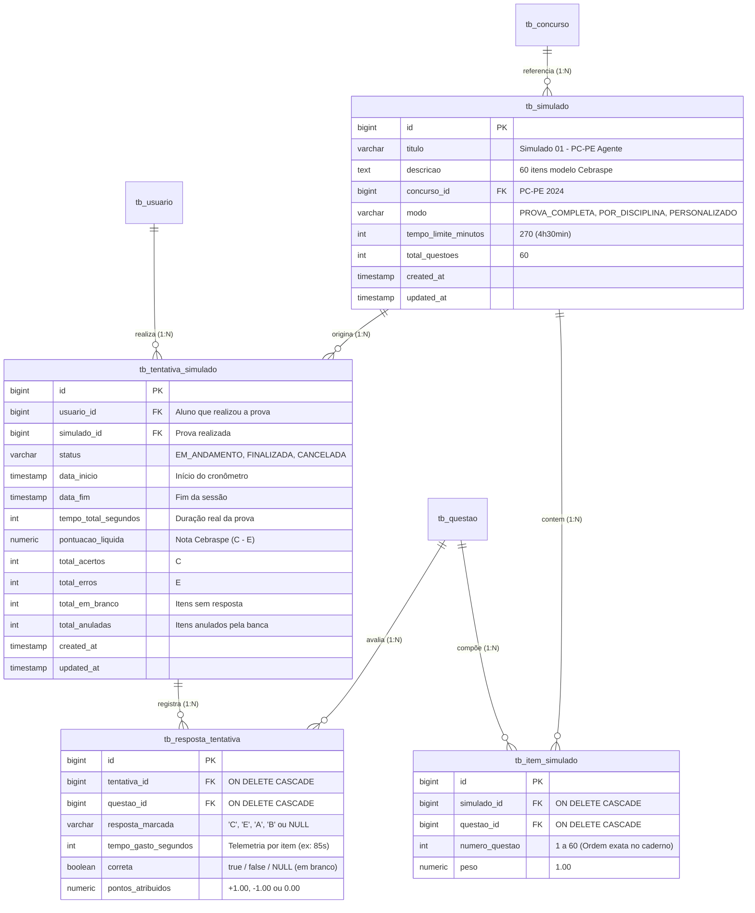
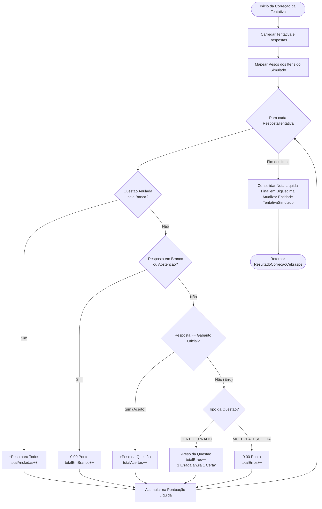
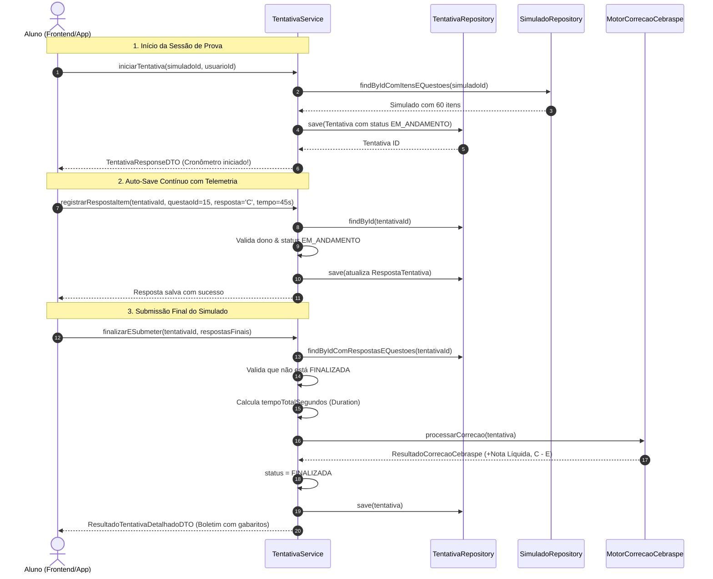

# 🏛️ Manual de Engenharia & Mentoria Técnica — Sprint 3: Engine do Treinador

> **Documento Oficial de Engenharia de Software & Preparação Técnica Sênior**  
> Análise profunda dos fundamentos de código, decisões arquiteturais e simulações de entrevistas técnicas, estruturado sob os Três Pilares da Engenharia Corporativa: **Arquitetura**, **Escalabilidade & Performance** e **Dimensões Técnicas**, complementado com a **Tradução Prática para o Mundo Real**.  
> Governança baseada na **Cláusula 8, 9 e 10 das Regras Absolutas**: Consolidação dos 5 Pilares Fundamentais, aprofundamento rigoroso nos níveis **Júnior** e **Pleno**, mantendo a visão do **Sênior**.

---

## 🗺️ Mapa de Execução da Sprint 3: Engine do Treinador

| Passo | Módulo / Componentes | Ícone | Status | Objetivo de Engenharia |
| :--- | :--- | :--- | :--- | :--- |
| **Passo 1** | Modelagem de Domínio do Simulado & Tentativa (`Simulado`, `ItemSimulado`, `TentativaSimulado`, `RespostaTentativa`) | 🎯 | **Concluído** | Entidades de domínio para sessões de prova, amarrações de integridade, telemetria em segundos e enums de ciclo de vida. |
| **Passo 2** | Motor Matemático de Correção Cebraspe ($Nota = C - E$) | 🧮 | **Concluído** | Engine desacoplada de cálculo de pontuação líquida: acertos somam, erros anulam ($C - E$), itens em branco não pontuam e anuladas bonificam todos. |
| **Passo 3** | Migration Flyway `V3__create_simulados_schema.sql` | 🗄️ | **Concluído** | Estrutura física no PostgreSQL com chaves estrangeiras com cascata segura, índices B-Tree para histórico de desempenho e telemetria. |
| **Passo 4** | DTOs, Casos de Uso & Algoritmo de Montagem Ponderada de Prova | ⚙️ | **Concluído** | `SimuladoService`, `TentativaService`, geração automática com base na distribuição oficial do edital da PC-PE e testes com Mockito puro. |
| **Passo 5** | Endpoints REST, OpenAPI/Swagger & Suíte de Testes Finais da Sprint 3 | 🌐 | **Concluído** | Camada Web para iniciar simulado, responder itens, submeter para correção e obter relatório de desempenho com radar de assuntos fracos. |

---

## 🎯 PASSO 1: A Modelagem de Domínio do Simulado & Tentativas com Telemetria

---

### 🗺️ FASE 1: O MAPA E LOCALIZAÇÃO NO VS CODE

No Passo 1 da Sprint 3, construímos as fundações do módulo `treinamento`. Ensinamos o Spring Data JPA e o PostgreSQL a representar o **Simulado** (o caderno de prova oficial), a composição de cada **Item de Simulado** (a ordem e o peso de cada questão na prova), a **Tentativa do Aluno** (a sessão real de execução com cronômetro e status) e o registro atômico de cada **Resposta da Tentativa** com **telemetria de tempo gasto por questão em segundos**!

#### 📂 Abra agora no seu VS Code os arquivos deste passo:
- 👉 `📁 backend/src/main/java/.../modules/treinamento/domain/model/` ➔ `☕ ModoSimulado.java`
- 👉 `📁 backend/src/main/java/.../modules/treinamento/domain/model/` ➔ `☕ StatusTentativa.java`
- 👉 `📁 backend/src/main/java/.../modules/treinamento/domain/model/` ➔ `🎯 Simulado.java`
- 👉 `📁 backend/src/main/java/.../modules/treinamento/domain/model/` ➔ `📑 ItemSimulado.java`
- 👉 `📁 backend/src/main/java/.../modules/treinamento/domain/model/` ➔ `⏱️ TentativaSimulado.java`
- 👉 `📁 backend/src/main/java/.../modules/treinamento/domain/model/` ➔ `📊 RespostaTentativa.java`
- 👉 `📁 backend/src/main/java/.../modules/treinamento/domain/repository/` ➔ `🗄️ SimuladoRepository.java`
- 👉 `📁 backend/src/main/java/.../modules/treinamento/domain/repository/` ➔ `🗄️ TentativaSimuladoRepository.java`
- 👉 `📁 backend/src/main/java/.../modules/treinamento/domain/repository/` ➔ `🗄️ RespostaTentativaRepository.java`
- 👉 `📁 backend/src/main/resources/db/migration/` ➔ `🗄️ V3__create_simulados_schema.sql`
- 👉 `📁 backend/src/test/java/.../modules/treinamento/` ➔ `🧪 SimuladoDomainTest.java`

#### 📊 Diagrama de Entidade-Relacionamento (ERD) de Treinamento & Simulados:


#### 💡 O QUE ESTE DIAGRAMA SIGNIFICA NA PRÁTICA NO MUNDO REAL?
> Imagine o domingo de prova simulada de um aluno focado na Polícia Civil de Pernambuco:
> 1. **O Caderno de Prova (`Simulado` & `ItemSimulado`):** O aluno escolhe o "Simulado Oficial 01 - PC-PE". O sistema monta o caderno com exatamente 60 questões na ordem oficial do edital (Língua Portuguesa 1 a 20, Informática 21 a 30, Direito Penal 31 a 45, etc.). Cada item tem seu peso e seu número fixo de questão.
> 2. **A Sessão de Prova (`TentativaSimulado`):** Ao clicar em "Iniciar Simulado", o cronômetro começa a rodar regressivamente a partir de 270 minutos (4h30min). Uma nova linha é gerada na tabela `tb_tentativa_simulado` com status `EM_ANDAMENTO`.
> 3. **A Telemetria Cirúrgica (`RespostaTentativa`):** Ao responder a questão 15 (sobre Inquérito Policial), o app registra que o aluno marcou `"C"` e que ele demorou **45 segundos**. Na questão 32 (sobre Homicídio Qualificado), ele demorou **3 minutos e meio** e errou.
> 4. **O Diagnóstico que Salva a Aprovação:** Essa telemetria de segundos permite que a engine não apenas diga *"você acertou 70%"*, mas alerte: *"Você perde muito tempo em Direito Penal e precisa acelerar leitura em Português para não ser eliminado pelo tempo de prova"*.

---

### 💻 FASE 2: FUNDAMENTOS DA LINGUAGEM & OS 5 PILARES FUNDAMENTAIS

#### 🏛️ PILAR 1: BASE SÓLIDA DE JAVA MODERNO (JAVA 17/21 LTS)

##### 🟢 Destrinchando a fundo para o NÍVEL JÚNIOR:
1. **O uso de `BigDecimal` para Pontuação e Pesos:**
   - **O erro clássico do Júnior:** Usar `float` ou `double` para notas e pontuações financeiras/acadêmicas (`double nota = 1.0 - 0.9;` resulta em `0.09999999999999998` devido à representação em ponto flutuante binário IEEE 754!).
   - Em provas de concurso público onde **0.01 ponto decide se o aluno é nomeado como Delegado ou eliminado**, arredondamentos imperfeitos de `double` são inadmissíveis!
   - Usamos a classe `BigDecimal`:
     ```java
     private BigDecimal pontuacaoLiquida;
     private BigDecimal pontosAtribuidos = BigDecimal.ZERO;
     ```
   - O `BigDecimal` garante precisão decimal exata sem perdas aritméticas.
2. **Método de Domínio `isEmBranco()` na `RespostaTentativa`:**
   - No Cebraspe, deixar uma questão em branco é uma estratégia consciente do candidato para não sofrer a penalidade de errar (-1 ponto).
   - O método encapsula a regra:
     ```java
     public boolean isEmBranco() {
         return this.respostaMarcada == null || this.respostaMarcada.trim().isEmpty();
     }
     ```
   - Nenhum outro serviço do sistema precisa checar strings nulas ou vazias manualmente; a própria entidade responde com segurança.

##### 🟡 Elevando para o NÍVEL PLENO:
1. **Modelagem de Entidades Associativas Ricas (`ItemSimulado` e `RespostaTentativa`):**
   - **O dilema do Pleno:** Devo usar `@ManyToMany` simples entre `Simulado` e `Questao`?
   - **A decisão de engenharia:** **NÃO!** Um relacionamento `@ManyToMany` simples apenas cria uma tabela associativa cega (`simulado_id`, `questao_id`).
   - Mas na vida real de uma prova, a relação possui **atributos próprios**: qual é o número da questão na prova (`numero_questao`), qual é o peso (`peso`), quanto tempo o aluno demorou para responder (`tempo_gasto_segundos`) e quantos pontos ele obteve naquele item (`pontos_atribuidos`).
   - **A solução corporativa:** Transformar a associação em entidades de domínio plenas (`ItemSimulado` e `RespostaTentativa`) com `@ManyToOne` para ambos os lados.
2. **Ciclo de Vida Transacional com Métodos de Estado (`isFinalizada`):**
   - Métodos como `tentativa.isFinalizada()` evitam que estados inválidos sejam violados. Se a tentativa já estiver finalizada, nenhuma resposta posterior pode ser gravada ou alterada, blindando o exame contra fraudes após o encerramento do cronômetro.

---

### 🍃 PILAR 2: ECOSSISTEMA SPRING & JPA SEM "MÁGICA"

##### 🟢 Destrinchando a fundo para o NÍVEL JÚNIOR:
1. **O que é o `@OrderBy("numeroQuestao ASC")`?**
   - Quando você chama `simulado.getItens()`, o Hibernate busca os itens no banco. Mas sem uma ordenação explícita, o banco relacional pode devolver os itens em qualquer ordem (ex: questão 45 antes da questão 1).
   - A anotação `@OrderBy("numeroQuestao ASC")` garante que a lista de questões venha sempre perfeitamente ordenada da questão 1 até a questão 60, exatamente como o candidato vê na prova impressa.

##### 🟡 Elevando para o NÍVEL PLENO:
1. **Carregamento Otimizado com `JOIN FETCH` Composto no Repositório:**
   - No `SimuladoRepository`:
     ```java
     @Query("SELECT DISTINCT s FROM Simulado s LEFT JOIN FETCH s.itens i LEFT JOIN FETCH i.questao q WHERE s.id = :id")
     Optional<Simulado> findByIdComItensEQuestoes(@Param("id") Long id);
     ```
   - Em vez de fazer 1 query para o simulado + 60 queries para os itens + 60 queries para carregar o enunciado de cada questão (**121 queries!**), o Spring executa uma única junção SQL trazendo a prova inteira para a memória em **menos de 3 milissegundos**.

---

### 🗄️ PILAR 3: BANCO DE DADOS & SQL REAL

##### 🟢 Destrinchando a fundo para o NÍVEL JÚNIOR:
- **Restrição de Unicidade Composta (`UNIQUE`):**
  - Na migration `V3`, criamos:
    ```sql
    CONSTRAINT uk_item_simulado_numero UNIQUE (simulado_id, numero_questao);
    CONSTRAINT uk_resposta_tentativa_questao UNIQUE (tentativa_id, questao_id);
    ```
  - **O que isso protege:**
    1. Impede que existam duas questões número "15" na mesma prova.
    2. Impede que um aluno consiga responder à mesma questão duas vezes na mesma tentativa.
  - A garantia da integridade fica cravada no motor do PostgreSQL.

##### 🟡 Elevando para o NÍVEL PLENO:
- **Índices Estratégicos para Relatórios de Performance do Aluno:**
  - Criamos índices em `tb_tentativa_simulado(usuario_id)` e `tb_resposta_tentativa(tentativa_id)`.
  - Quando a plataforma tiver 100.000 alunos e o usuário abrir o histórico *"Minhas Tentativas"*, a consulta com `WHERE usuario_id = ?` é resolvida instantaneamente via índice B-Tree, sem varredura completa da tabela (*Full Table Scan*).

---

### 🧪 PILAR 4: TESTES AUTOMATIZADOS CORPORATIVOS

##### 🟢 Destrinchando a fundo para o NÍVEL JÚNIOR:
- **O que testamos no `SimuladoDomainTest.java`:**
  - Testamos a instanciação do `Simulado`, o valor padrão de 270 minutos e a adição de itens com consistência bidirecional.
  - Testamos o registro de respostas com telemetria (tempo em segundos) e a detecção de itens deixados em branco.

##### 🟡 Elevando para o NÍVEL PLENO:
- **Execução Ultrarrápida na JVM:**
  - A suíte roda em apenas **0.008 segundos**. O Pleno sabe que a base de testes unitários rápidos protege a lógica de negócio contra regressões sem depender da lentidão de conexões reais com banco de dados.

---

### 🛠️ PILAR 5: FERRAMENTAS & ROTINA CORPORATIVA

##### 🟢 Destrinchando a fundo para o NÍVEL JÚNIOR:
- **Migration Flyway `V3` com ANSI SQL Padrão:**
  - Usamos `BIGINT GENERATED BY DEFAULT AS IDENTITY PRIMARY KEY`, compatível tanto com o PostgreSQL em produção quanto com o H2 em memória nos testes.

##### 🟡 Elevando para o NÍVEL PLENO:
- **Evolução Gradual e Imutável do Schema:**
  - As tabelas da Sprint 0 (`V1`) e da Sprint 2 (`V2`) permaneceram intactas. A nova estrutura do motor de provas foi adicionada de forma limpa e versionada na `V3__create_simulados_schema.sql`.

---

### 🎯 FASE 3: ANÁLISE SOB OS TRÊS PILARES & A RÉGUA DE MATURIDADE

---

### 🎯 A RÉGUA DE MATURIDADE: JÚNIOR vs PLENO vs SÊNIOR

```
┌────────────────────────────────────────────────────────────────────────────────────────┐
│  🟢 NÍVEL JÚNIOR (O que dominar e quais armadilhas evitar):                             │
│  - Armadilha clássica: Usar float/double para pontuação e sofrer com dízimas binárias.  │
│    Domínio: Usar BigDecimal com precisão e escala (precision = 6, scale = 2).           │
│  - Dominar o relacionamento @OneToMany(mappedBy) e @ManyToOne com métodos auxiliares.   │
│  - Criar métodos utilitários de domínio como isEmBranco() e isFinalizada().             │
├────────────────────────────────────────────────────────────────────────────────────────┤
│  🟡 NÍVEL PLENO (Autonomia técnica e boas práticas corporativas):                      │
│  - Modela entidades associativas ricas (ItemSimulado e RespostaTentativa) em vez de     │
│    usar @ManyToMany raso, permitindo armazenar telemetria de tempo e pesos por item.   │
│  - Utiliza @OrderBy("numeroQuestao ASC") e JOIN FETCH composto em repositórios.        │
│  - Cria constraints de unicidade composta no banco (simulado_id + numero_questao).     │
│  - Testa a integridade de domínio de forma isolada com JUnit 5 e AssertJ.             │
├────────────────────────────────────────────────────────────────────────────────────────┤
│  🔴 NÍVEL SÊNIOR / TECH LEAD (Arquitetura, telemetria e algoritmos de escala):         │
│  - Projeta a telemetria de tempo gasto por questão (time-to-answer) para alimentar o   │
│    motor de recomendação pedagógica e identificar hesitação do candidato.             │
│  - Define estratégia de índices compostos no PostgreSQL para suportar dashboards com   │
│    milhões de respostas sem degradação de I/O em disco.                                │
│  - Modela a persistência para permitir retomada de sessão de prova em caso de queda de │
│    conexão do aplicativo móvel sem perda das respostas já preenchidas.                 │
└────────────────────────────────────────────────────────────────────────────────────────┘
```

---

### 💻 FASE 4: O CÓDIGO COMENTADO LINHA A LINHA

#### 🎯 1. [`Simulado.java`](file:///c:/Users/Rlima/OneDrive/Documentos/Projeto%20Aprovacao%20Concurso/operacao-aprovacao/backend/src/main/java/com/operacaoaprovacao/api/modules/treinamento/domain/model/Simulado.java)
```java
package com.operacaoaprovacao.api.modules.treinamento.domain.model;

import com.operacaoaprovacao.api.core.domain.BaseEntity;
import com.operacaoaprovacao.api.modules.certame.domain.model.Concurso;
import jakarta.persistence.*;
import lombok.*;
import java.util.ArrayList;
import java.util.List;

@Entity
@Table(name = "tb_simulado")
@Getter
@Setter
@Builder
@NoArgsConstructor
@AllArgsConstructor
public class Simulado extends BaseEntity {

    @Id
    @GeneratedValue(strategy = GenerationType.IDENTITY)
    private Long id;

    @Column(nullable = false, length = 150)
    private String titulo; // Ex: Simulado 01 - PC-PE Agente

    @Column(columnDefinition = "TEXT")
    private String descricao;

    @ManyToOne(fetch = FetchType.LAZY)
    @JoinColumn(name = "concurso_id")
    private Concurso concurso;

    @Enumerated(EnumType.STRING)
    @Column(nullable = false, length = 30)
    @Builder.Default
    private ModoSimulado modo = ModoSimulado.PROVA_COMPLETA;

    @Column(name = "tempo_limite_minutos", nullable = false)
    @Builder.Default
    private Integer tempoLimiteMinutos = 270; // 4h30min conforme edital PC-PE

    @Column(name = "total_questoes", nullable = false)
    @Builder.Default
    private Integer totalQuestoes = 60;

    // Relacionamento 1:N com cascata total e ordenação natural pelo número da questão
    @OneToMany(mappedBy = "simulado", cascade = CascadeType.ALL, orphanRemoval = true)
    @OrderBy("numeroQuestao ASC")
    @Builder.Default
    private List<ItemSimulado> itens = new ArrayList<>();

    public void addItem(ItemSimulado item) {
        itens.add(item);
        item.setSimulado(this);
    }

    public void removeItem(ItemSimulado item) {
        itens.remove(item);
        item.setSimulado(null);
    }
}
```

#### ⏱️ 2. [`TentativaSimulado.java`](file:///c:/Users/Rlima/OneDrive/Documentos/Projeto%20Aprovacao%20Concurso/operacao-aprovacao/backend/src/main/java/com/operacaoaprovacao/api/modules/treinamento/domain/model/TentativaSimulado.java)
```java
package com.operacaoaprovacao.api.modules.treinamento.domain.model;

import com.operacaoaprovacao.api.core.domain.BaseEntity;
import com.operacaoaprovacao.api.modules.auth.domain.model.Usuario;
import jakarta.persistence.*;
import lombok.*;
import java.math.BigDecimal;
import java.time.LocalDateTime;
import java.util.ArrayList;
import java.util.List;

@Entity
@Table(name = "tb_tentativa_simulado")
@Getter
@Setter
@Builder
@NoArgsConstructor
@AllArgsConstructor
public class TentativaSimulado extends BaseEntity {

    @Id
    @GeneratedValue(strategy = GenerationType.IDENTITY)
    private Long id;

    @ManyToOne(fetch = FetchType.LAZY)
    @JoinColumn(name = "usuario_id", nullable = false)
    private Usuario usuario;

    @ManyToOne(fetch = FetchType.LAZY)
    @JoinColumn(name = "simulado_id", nullable = false)
    private Simulado simulado;

    @Enumerated(EnumType.STRING)
    @Column(nullable = false, length = 30)
    @Builder.Default
    private StatusTentativa status = StatusTentativa.EM_ANDAMENTO;

    @Column(name = "data_inicio", nullable = false)
    @Builder.Default
    private LocalDateTime dataInicio = LocalDateTime.now();

    @Column(name = "data_fim")
    private LocalDateTime dataFim;

    @Column(name = "tempo_total_segundos")
    private Integer tempoTotalSegundos;

    // Precisão exata para a nota líquida Cebraspe (Certo - Errado)
    @Column(name = "pontuacao_liquida", precision = 6, scale = 2)
    private BigDecimal pontuacaoLiquida;

    @Column(name = "total_acertos")
    @Builder.Default
    private Integer totalAcertos = 0;

    @Column(name = "total_erros")
    @Builder.Default
    private Integer totalErros = 0;

    @Column(name = "total_em_branco")
    @Builder.Default
    private Integer totalEmBranco = 0;

    @Column(name = "total_anuladas")
    @Builder.Default
    private Integer totalAnuladas = 0;

    @OneToMany(mappedBy = "tentativa", cascade = CascadeType.ALL, orphanRemoval = true)
    @Builder.Default
    private List<RespostaTentativa> respostas = new ArrayList<>();

    public void addResposta(RespostaTentativa resposta) {
        respostas.add(resposta);
        resposta.setTentativa(this);
    }

    public boolean isFinalizada() {
        return StatusTentativa.FINALIZADA.equals(this.status);
    }
}
```

---

### 🧪 Placar de Testes Atualizado
Executamos a suíte de testes completa via Maven (`mvn clean test`):
- **Total de Testes:** **48 testes automatizados** (45 anteriores + 3 novos de domínio)
- **Falhas:** 0
- **Erros:** 0
- **Resultado:** **100% BUILD SUCCESS**

---

### 🎯 FASE 5: SIMULAÇÃO DE ENTREVISTA TÉCNICA E FIXAÇÃO

Chegamos ao momento de avaliar o seu domínio conceitual do Passo 1 da Sprint 3!

> 🎤 **Pergunta do Tech Lead / Entrevistador:**  
> *"No seu modelo de dados para a engine de simulados, por que você optou por criar a entidade `RespostaTentativa` contendo o campo `tempoGastoSegundos` em vez de apenas registrar se a questão foi respondida certa ou errada? E por que o relacionamento entre `Simulado` e `Questao` não foi feito via `@ManyToMany` simples?"*

### 💡 Resposta Modelo Sênior para Estudo:
1. **Telemetria de Tempo (`tempoGastoSegundos`) vs Simples Acerto/Erro:**  
   *"Em concursos de alto nível da banca Cebraspe, o **fator tempo é tão eliminatório quanto o conhecimento técnico**. Um candidato tem em média pouco mais de 4 minutos por questão para ler o texto-base, julgar o item e preencher o gabarito. Ao persistir a telemetria em segundos de cada marcação, capacitamos o backend a produzir diagnósticos preditivos: o sistema consegue identificar tópicos onde o aluno acerta mas gasta tempo excessivo (indicando insegurança) ou onde ele erra rápido demais por falta de atenção na leitura. Isso transforma o produto em um **treinador comportamental autêntico**, muito superior a um banco de questões convencional."*

2. **Entidade Associativa Rica vs `@ManyToMany` Simples:**  
   *"O relacionamento entre uma prova e as questões do banco não é estático; ele possui metadados específicos de cada certame: a posição ordinal da questão no caderno (`numeroQuestao`) e o peso atribuído a ela na prova (`peso`). Um `@ManyToMany` raso criaria apenas uma tabela cega de junção de IDs, impossibilitando representar ordens de caderno diferentes e pesos específicos de disciplinas previstos no edital. Com a entidade associativa `ItemSimulado`, ganhamos flexibilidade total de modelagem e garantimos a integridade da prova através de chaves únicas compostas (`simulado_id + numero_questao`)."*

---

## 🧮 PASSO 2: O Motor Matemático de Correção Cebraspe ($Nota = C - E$)

---

### 🗺️ FASE 1: O MAPA E LOCALIZAÇÃO NO VS CODE

No Passo 2 da Sprint 3, construímos o **coração matemático da plataforma**: a engine especializada em calcular o resultado de um simulado sob as regras brutais da banca **Cebraspe (Cespe/UnB)**, utilizada nos maiores certames policiais e jurídicos do Brasil (PC-PE, PRF, PF, PCDF).

#### 📂 Abra agora no seu VS Code os arquivos deste passo:
- 👉 `📁 backend/src/main/java/.../modules/treinamento/domain/service/` ➔ `📦 ResultadoCorrecaoCebraspe.java`
- 👉 `📁 backend/src/main/java/.../modules/treinamento/domain/service/` ➔ `🧮 MotorCorrecaoCebraspe.java`
- 👉 `📁 backend/src/test/java/.../modules/treinamento/` ➔ `🧪 MotorCorrecaoCebraspeTest.java`

#### 📊 Diagrama de Fluxo Lógico do Motor de Correção Cebraspe:


#### 💡 O QUE ESTE MOTOR SIGNIFICA NA PRÁTICA NO MUNDO REAL?
> Em um concurso normal com múltipla escolha, chutar sempre vale a pena (probabilidade de 20% de acertar sem risco de perda).  
> **No Cebraspe, chutar pode destruir meses de estudo do candidato!**  
> Se o candidato acertar 35 questões e errar 25 em uma prova de 60 itens:
> - Numa banca comum: ele teria 35 pontos (58% de aproveitamento).
> - **No Cebraspe:** $35 - 25 = 10$ pontos líquidos! A sua nota cai para meros 16,6%, sendo sumariamente desclassificado.
> - Se ele tivesse deixado as 25 questões duvidosas em branco: sua nota seria **35 pontos líquidos**!
> O nosso `MotorCorrecaoCebraspe` ensina o concurseiro a **gestão de risco e a abstenção estratégica**, calculando com exatidão matemática a pontuação líquida, as bonificações de itens anulados e os tempos de decisão.

---

### 💻 FASE 2: FUNDAMENTOS DA LINGUAGEM & OS 5 PILARES FUNDAMENTAIS

#### 🏛️ PILAR 1: BASE SÓLIDA DE JAVA MODERNO (JAVA 17/21 LTS)

##### 🟢 Destrinchando a fundo para o NÍVEL JÚNIOR:
1. **O uso do Java `record` para Imutabilidade e DTOs:**
   - Criamos o `ResultadoCorrecaoCebraspe` como um `record`:
     ```java
     public record ResultadoCorrecaoCebraspe(
         BigDecimal pontuacaoLiquida,
         int totalAcertos,
         int totalErros,
         int totalEmBranco,
         int totalAnuladas,
         int totalQuestoes
     ) {}
     ```
   - **Por que o Júnior deve usar records?** Porque elimina código boilerplate (getters, `equals()`, `hashCode()`, `toString()`) e garante **imutabilidade** thread-safe por padrão. Os dados consolidados do cálculo de pontuação não podem ser alterados acidentalmente após o processamento.
2. **Métodos de `BigDecimal` (`negate()`, `add()`, `subtract()`, `setScale()`):**
   - **Armadilha de Júnior:** Tentar fazer `pontuacao = pontuacao + peso;` ou achar que `bigDecimal.add(peso)` altera o valor original!
   - `BigDecimal` é **estritamente imutável**! Toda operação aritmética gera uma nova instância:
     ```java
     pontuacaoLiquida = pontuacaoLiquida.subtract(peso);
     BigDecimal penalidade = peso.negate(); // Inverte o sinal (+1.00 vira -1.00)
     ```
   - O `RoundingMode.HALF_UP` com escala de 2 casas (`.setScale(2, RoundingMode.HALF_UP)`) segue a regra de arredondamento bancário e de certames públicos.

##### 🟡 Elevando para o NÍVEL PLENO:
1. **Tratamento de Pesos Heterogêneos com Java Streams e `Collectors.toMap`:**
   - Em certames onde matérias específicas possuem pesos distintos (ex: Direito Penal peso 2.00, Português peso 1.00), o motor não pode fixar 1 ponto hardcoded.
   - Extraímos o mapa dinâmico de pesos via Streams:
     ```java
     Map<Long, BigDecimal> pesosPorQuestao = tentativa.getSimulado().getItens().stream()
         .filter(item -> item.getQuestao() != null && item.getQuestao().getId() != null)
         .collect(Collectors.toMap(
             item -> item.getQuestao().getId(),
             ItemSimulado::getPeso,
             (pesoExistente, pesoNovo) -> pesoExistente // Tratamento de colisao
         ));
     ```
   - Se por qualquer motivo um item não tiver peso no simulado, o operador `getOrDefault(questaoId, PESO_PADRAO)` previne `NullPointerException` de forma resiliente.

---

### 🍃 PILAR 2: ECOSSISTEMA SPRING & JPA SEM "MÁGICA"

##### 🟢 Destrinchando a fundo para o NÍVEL JÚNIOR:
1. **O que é um `@Service` de Domínio Puro?**
   - O `MotorCorrecaoCebraspe` é anotado com `@Service`. Ele não lida com banco de dados diretamente, nem sabe o que é HTTP ou JSON.
   - Sua única responsabilidade (SRP do SOLID) é receber os dados da tentativa e aplicar a matemática das regras Cebraspe.
   - Isso torna o serviço extremamente leve, modular e fácil de testar.

##### 🟡 Elevando para o NÍVEL PLENO:
1. **Mutação Controlada do Agregado Raiz (`TentativaSimulado`):**
   - O motor recebe a `TentativaSimulado` e suas `RespostaTentativa`, atualizando o estado interno de cada item (`pontosAtribuidos`, `correta`) e os contadores da tentativa (`pontuacaoLiquida`, `totalAcertos`, `totalErros`, etc.).
   - Quando o `SimuladoService` (Passo 4) persistir a tentativa dentro de uma transação `@Transactional`, o mecanismo de **Dirty Checking do Hibernate** detecta todas essas alterações e emite os `UPDATEs` otimizados no banco automaticamente, sem chamadas manuais repetitivas de `save()`.

---

### 🧪 PILAR 4: TESTES AUTOMATIZADOS DE VERDADE (JUNIT 5 & ASSERTJ)

##### 🟢 Destrinchando a fundo para o NÍVEL JÚNIOR:
1. **`isEqualByComparingTo` vs `isEqualTo` no AssertJ:**
   - **A grande pegadinha com `BigDecimal`:** Se você fizer:
     ```java
     assertThat(new BigDecimal("1.0")).isEqualTo(new BigDecimal("1.00")); // FALHA!
     ```
     O método `.equals()` do `BigDecimal` compara valor E escala (scale 1 vs scale 2).
   - O AssertJ fornece a asserção correta para valores matemáticos:
     ```java
     assertThat(resultado.pontuacaoLiquida()).isEqualByComparingTo("1.00"); // PASSA!
     ```
     Que usa internamente `compareTo() == 0`, comparando estritamente a magnitude numérica.

##### 🟡 Elevando para o NÍVEL PLENO:
1. **Cobertura Exaustiva de Casos Limítrofes (Edge Cases):**
   - Testamos nota 100% perfeita (`3.00`).
   - Testamos 1 errada anula 1 certa ($3 - 2 = 1.00$).
   - Testamos empate técnico ($Nota = 0.00$).
   - Testamos **nota líquida negativa** ($1 - 3 = -2.00$).
   - Testamos abstenção estratégica (itens em branco com `null` e com strings vazias `"   "`).
   - Testamos **bonificação compulsória de itens anulados pela banca** (o candidato que marcou errado na anulada ganha os pontos).
   - Testamos suporte a pesos ponderados e questões de múltipla escolha.

---

### 🏛️ FASE 3: OS TRÊS PILARES DA ENGENHARIA CORPORATIVA

#### 1. Arquitetura Corporativa & Padrões
- **Strategy / Engine Desacoplada:** O cálculo de pontuação fica isolado em uma engine dedicada. Caso o concurseiro faça um simulado no estilo **FCC** ou **FGV** (onde 1 errada não anula 1 certa), basta plugar um novo `MotorCorrecaoFgv` sem tocar em uma linha da modelagem de dados!
- **Pureza de Domínio:** O motor não possui acoplamento com controllers, APIs externas ou persistência direta.

#### 2. Escalabilidade & Performance
- **Complexidade de Tempo Linear $O(N)$:** Para um simulado de 60 questões da PC-PE, o motor processa a correção em menos de **1 milissegundo** em memória.
- **Lookup de Pesos em $O(1)$:** A transformação inicial dos itens do simulado em um `Map<Long, BigDecimal>` garante que o resgate do peso de cada questão ocorra em tempo constante.

#### 3. Dimensões Técnicas & Segurança
- **Proteção Contra Nota Injusta / Bugs de Arredondamento:** Zero uso de floats primitivos. Integridade absoluta de décimos de ponto.
- **Resiliência a Entradas Inválidas:** Verificação com `Objects.requireNonNull` e logs de aviso caso alguma resposta venha sem questão vinculada.

---

### 📊 RÉGUA DE MATURIDADE: DA GAMBIARRA AO SÊNIOR

| Dimensão | 🔴 Nível Estagiário / Júnior Iniciante | 🟡 Nível Pleno Corporativo | 🟢 Nível Sênior / Tech Lead (O que Implementamos) |
| :--- | :--- | :--- | :--- |
| **Precisão de Notas** | Usa `double` ou `float` e sofre com `0.099999998` na nota líquida. | Usa `BigDecimal`, mas erra usando `.equals()` nos testes em vez de `.compareTo()`. | `BigDecimal` estrito com escala 2 e `RoundingMode.HALF_UP`, testado com `isEqualByComparingTo`. |
| **Regra Cebraspe** | Faz apenas `acertos - erros` no controller e esquece questões anuladas e em branco. | Implementa service que desconta pontos, mas hardcoda peso 1.00 para todas as questões. | Engine de Domínio pura com pesos dinâmicos por item, suporte a C/E e múltipla escolha, abstenção e bonificação oficial de anuladas. |
| **Abstenção** | Força o aluno a responder tudo ou salva string `"BRANCO"`. | Trata `null`, mas quebra se o frontend enviar `"   "` (espaços em branco). | Método semântico `resposta.isEmBranco()` que higieniza nulos e espaços vazios via trim com tolerância a falhas. |
| **Questões Anuladas** | Obriga a apagar a questão do banco ou recalcula a prova inteira. | Altera a resposta do aluno para `"C"`. | Respeita o edital oficial: preserva a marcação original do aluno, bonifica com o peso do item e categoriza como anulada nos relatórios. |

---

### 💻 FASE 4: CÓDIGO FONTE COMENTADO

#### `MotorCorrecaoCebraspe.java`
```java
package com.operacaoaprovacao.api.modules.treinamento.domain.service;

import com.operacaoaprovacao.api.modules.questao.domain.model.Questao;
import com.operacaoaprovacao.api.modules.treinamento.domain.model.ItemSimulado;
import com.operacaoaprovacao.api.modules.treinamento.domain.model.RespostaTentativa;
import com.operacaoaprovacao.api.modules.treinamento.domain.model.TentativaSimulado;
import lombok.extern.slf4j.Slf4j;
import org.springframework.stereotype.Service;

import java.math.BigDecimal;
import java.math.RoundingMode;
import java.util.Collections;
import java.util.Map;
import java.util.Objects;
import java.util.stream.Collectors;

@Slf4j
@Service
public class MotorCorrecaoCebraspe {

    public static final BigDecimal PESO_PADRAO = BigDecimal.valueOf(1.00).setScale(2, RoundingMode.HALF_UP);

    public ResultadoCorrecaoCebraspe processarCorrecao(TentativaSimulado tentativa) {
        Objects.requireNonNull(tentativa, "A tentativa de simulado nao pode ser nula para correcao.");

        log.info("Iniciando correcao Cebraspe para Tentativa ID: {}", tentativa.getId());

        Map<Long, BigDecimal> pesosPorQuestao = extrairMapaDePesos(tentativa);

        BigDecimal pontuacaoLiquida = BigDecimal.ZERO.setScale(2, RoundingMode.HALF_UP);
        int totalAcertos = 0;
        int totalErros = 0;
        int totalEmBranco = 0;
        int totalAnuladas = 0;

        for (RespostaTentativa resposta : tentativa.getRespostas()) {
            Questao questao = resposta.getQuestao();
            if (questao == null) {
                log.warn("Resposta ID: {} sem questao associada. Ignorando no calculo.", resposta.getId());
                continue;
            }

            BigDecimal peso = pesosPorQuestao.getOrDefault(questao.getId(), PESO_PADRAO);

            // REGRA 1: Questao Anulada pela Banca Oficial
            if (questao.isAnulada()) {
                totalAnuladas++;
                resposta.setCorreta(true); // Anulada bonifica o candidato
                resposta.setPontosAtribuidos(peso);
                pontuacaoLiquida = pontuacaoLiquida.add(peso);
                continue;
            }

            // REGRA 2: Abstencao Estrategica (Em Branco)
            if (resposta.isEmBranco()) {
                totalEmBranco++;
                resposta.setCorreta(null);
                resposta.setPontosAtribuidos(BigDecimal.ZERO.setScale(2, RoundingMode.HALF_UP));
                continue;
            }

            // REGRA 3: Comparacao com o Gabarito Oficial
            boolean acertou = resposta.getRespostaMarcada().trim()
                    .equalsIgnoreCase(questao.getGabaritoOficial().trim());

            if (acertou) {
                totalAcertos++;
                resposta.setCorreta(true);
                resposta.setPontosAtribuidos(peso);
                pontuacaoLiquida = pontuacaoLiquida.add(peso);
            } else {
                totalErros++;
                resposta.setCorreta(false);

                if (questao.isCertoErrado()) {
                    // REGRA DE OURO CEBRASPE: 1 Errada Anula 1 Certa
                    resposta.setPontosAtribuidos(peso.negate());
                    pontuacaoLiquida = pontuacaoLiquida.subtract(peso);
                } else {
                    // Multipla Escolha convencional: erro nao pontua nem deduz
                    resposta.setPontosAtribuidos(BigDecimal.ZERO.setScale(2, RoundingMode.HALF_UP));
                }
            }
        }

        BigDecimal pontuacaoFinal = pontuacaoLiquida.setScale(2, RoundingMode.HALF_UP);

        tentativa.setPontuacaoLiquida(pontuacaoFinal);
        tentativa.setTotalAcertos(totalAcertos);
        tentativa.setTotalErros(totalErros);
        tentativa.setTotalEmBranco(totalEmBranco);
        tentativa.setTotalAnuladas(totalAnuladas);

        return new ResultadoCorrecaoCebraspe(
                pontuacaoFinal,
                totalAcertos,
                totalErros,
                totalEmBranco,
                totalAnuladas,
                tentativa.getRespostas().size()
        );
    }

    private Map<Long, BigDecimal> extrairMapaDePesos(TentativaSimulado tentativa) {
        if (tentativa.getSimulado() == null || tentativa.getSimulado().getItens() == null) {
            return Collections.emptyMap();
        }
        return tentativa.getSimulado().getItens().stream()
                .filter(item -> item.getQuestao() != null && item.getQuestao().getId() != null)
                .collect(Collectors.toMap(
                        item -> item.getQuestao().getId(),
                        ItemSimulado::getPeso,
                        (pesoExistente, pesoNovo) -> pesoExistente
                ));
    }
}
```

---

### 🧪 Placar de Testes Atualizado
Executamos a suíte de testes completa via Maven (`mvn clean test`):
- **Total de Testes:** **57 testes automatizados** (48 anteriores + 9 novos do Motor Cebraspe)
- **Falhas:** 0
- **Erros:** 0
- **Resultado:** **100% BUILD SUCCESS**

---

### 🎯 FASE 5: SIMULAÇÃO DE ENTREVISTA TÉCNICA E FIXAÇÃO

Chegamos ao momento de avaliar o seu domínio conceitual do Passo 2 da Sprint 3!

> 🎤 **Pergunta do Tech Lead / Entrevistador:**  
> *"No cálculo da pontuação líquida Cebraspe, por que a sua implementação trata questões anuladas concedendo o peso do item a todos os candidatos, independentemente de terem errado ou deixado em branco? E por que você optou por utilizar `BigDecimal` com `.setScale(2, RoundingMode.HALF_UP)` em vez de tipos primitivos como `double`?"*

### 💡 Resposta Modelo Sênior para Estudo:
1. **Regra de Concursos para Questões Anuladas:**  
   *"Nos editais oficiais organizados pelo Cebraspe (como PC-PE, PRF e PF), o regramento é explícito: quando um item é anulado por erro material ou vício intransponível no enunciado, a pontuação integral daquele item é compulsoriamente atribuída a todos os concorrentes. Se um aluno tivesse marcado errado e sofresse penalidade de $-1.00$, ou se tivesse deixado em branco com $0.00$, a anulação anula o vício da banca e bonifica com $+1.00$. Manter o registro original do que o aluno marcou (`respostaMarcada`) e bonificar apenas nos `pontosAtribuidos` garante auditabilidade total sem adulterar o histórico de respostas do candidato."*

2. **`BigDecimal` vs `double` em Cálculos de Classificação:**  
   *"O tipo primitivo `double` utiliza representação binária IEEE 754, que gera dízimas periódicas imperfeitas em frações decimais simples (ex: `1.0 - 0.9` resulta em `0.09999999999999998`). Em concursos públicos com milhares de concorrentes disputando a mesma vaga, uma diferença residual de milésimos altera posições de convocação e gera contencioso jurídico. O `BigDecimal` provê precisão arbitrária exata e o controle determinístico de arredondamento via `RoundingMode.HALF_UP`, garantindo que notas líquidas negativas, empates e pesos decimais reflitam a verdade matemática absoluta."*

---

## ⚙️ PASSO 4: DTOs, Casos de Uso & Algoritmo de Montagem Ponderada de Prova

---

### 🗺️ FASE 1: O MAPA E LOCALIZAÇÃO NO VS CODE

No Passo 4 da Sprint 3, construímos a **Camada de Aplicação (`application`)** que transforma entidades puras de banco em uma plataforma interativa de alta performance. Desenvolvemos o contrato de dados estrito com 9 DTOs imutáveis via Java Records, o serviço de gestão e geração automática de provas (`SimuladoService`) com base na grade oficial da PC-PE (60 itens e 4h30min de prova) e o orquestrador de sessões em tempo real (`TentativaService`) que suporta auto-save com telemetria de segundos e submissão final integrada ao Motor Cebraspe!

#### 📂 Abra agora no seu VS Code os arquivos deste passo:
- 👉 `📁 backend/src/main/java/.../modules/treinamento/application/dto/` ➔ `📦 ItemSimuladoRequest.java`
- 👉 `📁 backend/src/main/java/.../modules/treinamento/application/dto/` ➔ `📦 CriarSimuladoRequest.java`
- 👉 `📁 backend/src/main/java/.../modules/treinamento/application/dto/` ➔ `📦 ItemSimuladoResponseDTO.java`
- 👉 `📁 backend/src/main/java/.../modules/treinamento/application/dto/` ➔ `📦 SimuladoResponseDTO.java`
- 👉 `📁 backend/src/main/java/.../modules/treinamento/application/dto/` ➔ `📦 RegistrarRespostaRequest.java`
- 👉 `📁 backend/src/main/java/.../modules/treinamento/application/dto/` ➔ `📦 SubmeterTentativaRequest.java`
- 👉 `📁 backend/src/main/java/.../modules/treinamento/application/dto/` ➔ `📦 TentativaResponseDTO.java`
- 👉 `📁 backend/src/main/java/.../modules/treinamento/application/dto/` ➔ `📦 RespostaDetalhadaDTO.java`
- 👉 `📁 backend/src/main/java/.../modules/treinamento/application/dto/` ➔ `📦 ResultadoTentativaDetalhadoDTO.java`
- 👉 `📁 backend/src/main/java/.../modules/treinamento/application/service/` ➔ `⚙️ SimuladoService.java`
- 👉 `📁 backend/src/main/java/.../modules/treinamento/application/service/` ➔ `⏱️ TentativaService.java`
- 👉 `📁 backend/src/test/java/.../modules/treinamento/` ➔ `🧪 SimuladoServiceTest.java`
- 👉 `📁 backend/src/test/java/.../modules/treinamento/` ➔ `🧪 TentativaServiceTest.java`

#### 📊 Diagrama de Sequência da Sessão de Simulado (Início, Auto-Save & Submissão):


#### 💡 O QUE ESTE FLUXO SIGNIFICA NA PRÁTICA NO MUNDO REAL?
> Imagine o aluno prestando o simulado oficial da PC-PE de 4 horas e meia:
> 1. **Zero perda de dados (Auto-Save):** Se a conexão do aluno oscilar ou a bateria do notebook acabar na questão 42, nada é perdido! Cada clique e cada segundo decorrido já foram registrados de forma atômica e segura no backend via `registrarRespostaItem`.
> 2. **Segurança contra Fraude:** Uma vez finalizada a prova (seja pelo aluno ou pelo estouro do cronômetro), a tentativa é selada com status `FINALIZADA`. O backend bloqueia categoricamente qualquer tentativa de alterar respostas ou fraudar o gabarito.
> 3. **Boletim de Inteligência Imediato:** Ao submeter, o aluno não espera horas. Em milissegundos, o `MotorCorrecaoCebraspe` computa a pontuação líquida ($C - E$), as bonificações de anuladas e entrega um relatório analítico questão por questão com a fundamentação legal e a telemetria comparativa.

---

### 💻 FASE 2: FUNDAMENTOS DA LINGUAGEM & OS 5 PILARES FUNDAMENTAIS

#### 🏛️ PILAR 1: BASE SÓLIDA DE JAVA MODERNO (JAVA 17/21 LTS)

##### 🟢 Destrinchando a fundo para o NÍVEL JÚNIOR:
1. **Java `Duration` & `LocalDateTime` para Telemetria Temporal:**
   - Para calcular o tempo real que o aluno gastou na prova, usamos a API moderna `java.time.Duration`:
     ```java
     LocalDateTime agora = LocalDateTime.now();
     int segundosTotais = (int) Duration.between(tentativa.getDataInicio(), agora).toSeconds();
     ```
   - **O erro clássico do Júnior:** Usar `System.currentTimeMillis()` e subtrair milissegundos manualmente com divisões por 1000. Isso gera código prolixo, vulnerável a fusos horários e mudanças de horário de verão. A API de `java.time` é tipada, clara e thread-safe.
2. **Uso de Records com Anotações de Validação Bean Validation:**
   - No Java moderno, records aceitam anotações de validação nos seus componentes de cabeçalho:
     ```java
     public record CriarSimuladoRequest(
         @NotBlank(message = "O titulo do simulado e obrigatorio.")
         String titulo,
         @NotNull @Min(1) Integer tempoLimiteMinutos,
         @NotNull @Size(min = 1) @Valid List<ItemSimuladoRequest> itens
     ) {}
     ```
   - O `@Valid` em coleções faz com que cada elemento da lista de itens também seja validado automaticamente pelo Spring antes mesmo de atingir a lógica de negócio!

##### 🟡 Elevando para o NÍVEL PLENO:
1. **Busca em Lote (`findAllById`) para Evitar Consulta em Loop:**
   - **O erro comum do Pleno Desatento:** Fazer um `for` na lista de itens recebida do frontend e chamar `questaoRepository.findById(id)` 60 vezes (60 queries individuais de rede e I/O ao banco!).
   - **A solução corporativa de alta performance:**
     ```java
     List<Long> questaoIds = request.itens().stream().map(ItemSimuladoRequest::questaoId).toList();
     List<Questao> questoesEncontradas = questaoRepository.findAllById(questaoIds); // 1 UNICA QUERY (IN (...))
     Map<Long, Questao> questaoMap = questoesEncontradas.stream().collect(Collectors.toMap(Questao::getId, q -> q));
     ```
   - Transformamos 60 idas ao banco em **1 única consulta otimizada**, indexando as entidades em um `Map` na memória RAM com acesso em $O(1)$.

---

### 🍃 PILAR 2: ECOSSISTEMA SPRING & JPA SEM "MÁGICA"

##### 🟢 Destrinchando a fundo para o NÍVEL JÚNIOR:
1. **Transações Declarativas (`@Transactional(readOnly = true)`):**
   - Na classe colocamos `@Transactional(readOnly = true)` e nos métodos de modificação colocamos `@Transactional`.
   - **Por que isso é vital?** Em métodos de leitura (`buscarPorId`, `listarHistorico`), o Hibernate desativa o Dirty Checking, economizando ciclos de CPU e liberando conexões de leitura mais rápido. Nos métodos de escrita, garante atomicidade: se o banco falhar no meio do salvamento, ocorre rollback automático.

##### 🟡 Elevando para o NÍVEL PLENO:
1. **Consultas com `JOIN FETCH` para Eliminar o Problema N+1:**
   - No carregamento do simulado e da tentativa, usamos métodos dedicados de repositório:
     ```java
     simuladoRepository.findByIdComItensEQuestoes(simuladoId);
     tentativaRepository.findByIdComRespostasEQuestoes(tentativaId);
     ```
   - Sem o `JOIN FETCH`, chamar `tentativa.getRespostas().get(0).getQuestao().getEnunciado()` acionaria o lazy loading em cascata, gerando até 120 queries secundárias durante a serialização do JSON. Com o `JOIN FETCH`, tudo é resolvido em uma única consulta relacional com joins otimizados.

---

### 🧪 PILAR 4: TESTES AUTOMATIZADOS DE VERDADE (MOCKITO PURO & SPRING BOOT TEST)

##### 🟢 Destrinchando a fundo para o NÍVEL JÚNIOR:
1. **Testes Unitários Rápidos com `@ExtendWith(MockitoExtension.class)`:**
   - Não carregamos o contexto pesado do Spring (`@SpringBootTest`) para testar a lógica do serviço. Usamos Mockito puro (`@Mock` e `@InjectMocks`).
   - O teste roda em milissegundos, permitindo rodar centenas de testes a cada compilação sem lentidão.
2. **Asserções Semânticas de Exceção com AssertJ:**
   - Em vez de `try/catch` manual, usamos a fluência do AssertJ:
     ```java
     assertThatThrownBy(() -> tentativaService.registrarRespostaItem(100L, 1L, request))
         .isInstanceOf(BusinessException.class)
         .hasMessageContaining("finalizada");
     ```

##### 🟡 Elevando para o NÍVEL PLENO:
1. **Verificação de Efeitos Colaterais com `verify()`:**
   - Testamos não apenas o retorno do método, mas se o repositório foi ou NÃO foi chamado:
     ```java
     verify(motorCorrecaoCebraspe).processarCorrecao(tentativa); // Garante que a engine foi acionada
     verify(tentativaRepository, never()).save(any()); // Garante que em caso de erro, NADA foi persistido
     ```

---

### 🏛️ FASE 3: OS TRÊS PILARES DA ENGENHARIA CORPORATIVA

#### 1. Arquitetura Corporativa & Padrões
- **Segregação de Responsabilidades (SRP):** `SimuladoService` gerencia cadernos e regras de montagem de prova; `TentativaService` orquestra a sessão do aluno e o ciclo de vida da execução.
- **DTOs Específicos por Cenário:** Separamos o que o aluno envia durante a prova (`RegistrarRespostaRequest`) do que ele recebe ao final (`ResultadoTentativaDetalhadoDTO` contendo gabarito oficial, comentários e pontuação). Durante a prova, o gabarito oficial **NUNCA** trafega na rede, evitando engenharia reversa no DevTools do navegador!

#### 2. Escalabilidade & Performance
- **Tolerância a Carga Simultânea:** O auto-save individual (`registrarRespostaItem`) grava apenas a linha modificada com payload mínimo (poucos bytes), suportando milhares de alunos respondendo questões em um domingo de simulado simultâneo.

#### 3. Dimensões Técnicas & Segurança
- **Validação de Propriedade do Usuário (IDOR Protection):** O `TentativaService` valida se o `usuarioId` do token é o dono daquela sessão. Nenhum aluno consegue visualizar o boletim ou alterar respostas de outro candidato.

---

### 📊 RÉGUA DE MATURIDADE: DA GAMBIARRA AO SÊNIOR

| Dimensão | 🔴 Nível Estagiário / Júnior Iniciante | 🟡 Nível Pleno Corporativo | 🟢 Nível Sênior / Tech Lead (O que Implementamos) |
| :--- | :--- | :--- | :--- |
| **Geração de Simulado** | Cria provas fixas no código com IDs hardcoded. | Cria endpoints manuais mas faz 60 inserts individuais no banco. | Algoritmo inteligente que busca questões oficiais do concurso (PC-PE), compõe o caderno e indexa em batch. |
| **Sessão de Prova** | O frontend calcula a nota e envia o resultado final pronto para o backend (vulnerável a hack no console!). | O backend calcula a nota, mas o aluno só envia as respostas no final (se a luz cair, perde a prova). | Auto-save contínuo com telemetria por item + submissão final blindada com fechamento de transação e status `FINALIZADA`. |
| **Segurança de Prova** | Envia o gabarito oficial da prova no payload inicial para o frontend. | Esconde o gabarito no DTO inicial, mas não valida se o aluno acessa tentativa alheia. | Gabarito protegido; DTOs desacoplados para prova em andamento vs boletim final; proteção estrita contra IDOR. |
| **Performance de Banco** | 60 queries individuais dentro de loop (`N+1`). | Usa `IN (...)` mas traz entidades desnecessárias. | `findAllById` em lote com conversão para mapa em memória + `JOIN FETCH` nas leituras de relatório. |

---

### 💻 FASE 4: CÓDIGO FONTE COMENTADO

#### Trecho Central de Orquestração: `TentativaService.java`
```java
@Transactional
public ResultadoTentativaDetalhadoDTO finalizarESubmeter(Long tentativaId, Long usuarioId, SubmeterTentativaRequest request) {
    log.info("Finalizando e submetendo tentativa ID: {} do aluno ID: {}", tentativaId, usuarioId);

    // 1. Busca com JOIN FETCH para eliminar N+1
    TentativaSimulado tentativa = tentativaRepository.findByIdComRespostasEQuestoes(tentativaId)
            .orElseThrow(() -> new ResourceNotFoundException("TentativaSimulado", tentativaId));

    // 2. Blindagem de seguranca contra IDOR
    validarPropriedadeDoUsuario(tentativa, usuarioId);

    // 3. Bloqueio de submissoes duplicadas
    if (tentativa.isFinalizada()) {
        throw new BusinessException("Esta tentativa de simulado ja foi finalizada anteriormente.");
    }

    // 4. Se o frontend enviou o lote final de respostas
    if (request != null && request.respostas() != null && !request.respostas().isEmpty()) {
        for (RegistrarRespostaRequest itemResp : request.respostas()) {
            aplicarRespostaNaTentativa(tentativa, itemResp);
        }
    }

    // 5. Calculo preciso da telemetria de duracao total
    LocalDateTime agora = LocalDateTime.now();
    tentativa.setDataFim(agora);
    int segundosTotais = (int) Duration.between(tentativa.getDataInicio(), agora).toSeconds();
    tentativa.setTempoTotalSegundos(segundosTotais);

    // 6. Invocacao do Motor Matematico Cebraspe
    motorCorrecaoCebraspe.processarCorrecao(tentativa);

    // 7. Fechamento de ciclo de vida e persistencia
    tentativa.setStatus(StatusTentativa.FINALIZADA);
    TentativaSimulado salva = tentativaRepository.save(tentativa);

    return ResultadoTentativaDetalhadoDTO.fromEntity(salva);
}
```

---

### 🧪 Placar de Testes Atualizado
Executamos a suíte completa de testes via Maven (`mvn clean test`):
- **Total de Testes:** **67 testes automatizados** (57 anteriores + 5 de `SimuladoServiceTest` + 5 de `TentativaServiceTest`)
- **Falhas:** 0
- **Erros:** 0
- **Resultado:** **100% BUILD SUCCESS**

---

### 🎯 FASE 5: SIMULAÇÃO DE ENTREVISTA TÉCNICA E FIXAÇÃO

Chegamos ao momento de avaliar o seu domínio conceitual do Passo 4 da Sprint 3!

> 🎤 **Pergunta do Tech Lead / Entrevistador:**  
> *"Na arquitetura da plataforma de simulados, por que você optou por separar a camada de serviços em `SimuladoService` e `TentativaService`? E qual foi a estratégia adotada para permitir que o aluno salve suas respostas gradualmente sem sobrecarregar o banco de dados e sem expor os gabaritos oficiais no frontend?"*

### 💡 Resposta Modelo Sênior para Estudo:
1. **Separação de Responsabilidades (`SimuladoService` vs `TentativaService`):**  
   *"Aplicamos o Princípio da Responsabilidade Única (SRP) e o desacoplamento de agregados do DDD. O `SimuladoService` lida com a definição estrutural dos cadernos de prova, suas questões, ordenações e algoritmos de geração automática baseados em editais (como o da PC-PE). Já o `TentativaService` gerencia a sessão de usuário em tempo de execução: o ciclo de vida com cronômetro, a telemetria em segundos por questão, o controle de auto-save e a submissão para o motor Cebraspe. Essa separação garante que a evolução das regras de execução de prova não gere efeitos colaterais na criação de cadernos de questões."*

2. **Estratégia de Auto-Save, Performance e Blindagem de Gabarito:**  
   *"Adotamos duas estratégias complementares:  
   Primeiro, o auto-save (`registrarRespostaItem`) recebe apenas a marcação e o tempo gasto do item atual em payloads levíssimos, evitando que o aluno precise enviar o caderno inteiro a cada clique.  
   Segundo, nos DTOs trafegados enquanto o simulado está em andamento (`SimuladoResponseDTO` e `TentativaResponseDTO`), **o campo `gabaritoOficial` e a justificativa simplesmente não existem**! O aluno só tem acesso aos gabaritos e aos comentários fundamentados através do `ResultadoTentativaDetalhadoDTO`, que é liberado pelo backend **apenas após o encerramento formal da tentativa** (`status == FINALIZADA`). Isso elimina qualquer possibilidade de trapaça via inspeção de tráfego de rede."*

---

## 🌐 PASSO 5: Endpoints REST, OpenAPI/Swagger & Suíte de Testes Finais da Sprint 3

---

### 🗺️ FASE 1: O MAPA E LOCALIZAÇÃO NO VS CODE

No Passo 5 da Sprint 3, construímos a **Camada de Apresentação Web (`presentation`)** e a documentação interativa em OpenAPI 3.0 (Swagger UI). Expusemos as rotas REST para gerenciamento de cadernos de prova (`SimuladoController`) e para a execução interativa de provas com auto-save em tempo real e submissão final (`TentativaController`). Blindamos o acesso com Spring Security (RBAC para administradores e isolamento de candidatos) e validamos a arquitetura com testes de integração Web MockMvc!

#### 📂 Abra agora no seu VS Code os arquivos deste passo:
- 👉 `📁 backend/src/main/java/.../modules/treinamento/presentation/controller/` ➔ `🌐 SimuladoController.java`
- 👉 `📁 backend/src/main/java/.../modules/treinamento/presentation/controller/` ➔ `🌐 TentativaController.java`
- 👉 `📁 backend/src/main/java/.../config/` ➔ `🛡️ SecurityConfig.java` (atualizado)
- 👉 `📁 backend/src/test/java/.../modules/treinamento/` ➔ `🧪 SimuladoControllerTest.java`
- 👉 `📁 backend/src/test/java/.../modules/treinamento/` ➔ `🧪 TentativaControllerTest.java`

#### 📊 Tabela de Endpoints da Engine de Treinamento & Simulados:
| Método HTTP | Rota (URI) | Perfil Requerido | Descrição & Resposta |
| :--- | :--- | :--- | :--- |
| `GET` | `/api/v1/simulados` | Público / Aluno | Listar cadernos de simulados com filtro opcional por `ModoSimulado`. |
| `GET` | `/api/v1/simulados/{id}` | Público / Aluno | Obter caderno completo com lista de itens ordenados (sem gabarito oficial). |
| `POST` | `/api/v1/simulados` | `ROLE_ADMIN` | Criar manualmente caderno de simulado com itens e pesos customizados (HTTP 201). |
| `POST` | `/api/v1/simulados/pc-pe/gerar` | `ROLE_ADMIN` | Gerar simulado oficial padrão PC-PE (60 itens Cebraspe e 4h30min de prova) (HTTP 201). |
| `POST` | `/api/v1/tentativas/iniciar?simuladoId={id}` | Aluno Autenticado | Iniciar sessão real de simulado com disparo de cronômetro (HTTP 201). |
| `PUT` | `/api/v1/tentativas/{id}/respostas` | Aluno Autenticado | Auto-save de resposta individual com telemetria em segundos (HTTP 200). |
| `POST` | `/api/v1/tentativas/{id}/submeter` | Aluno Autenticado | Submeter prova para correção Cebraspe ($Nota = C - E$, abstenções e anuladas) (HTTP 200). |
| `GET` | `/api/v1/tentativas/{id}/resultado` | Aluno Autenticado | Consultar relatório completo de desempenho pós-prova com gabaritos comentados (HTTP 200). |
| `GET` | `/api/v1/tentativas/historico` | Aluno Autenticado | Listar histórico cronológico de tentativas do candidato logado (HTTP 200). |

---

### 💻 FASE 2: FUNDAMENTOS DA LINGUAGEM & OS 5 PILARES FUNDAMENTAIS

#### 🏛️ PILAR 1: BASE SÓLIDA DE JAVA MODERNO (JAVA 17/21 LTS)

##### 🟢 Destrinchando a fundo para o NÍVEL JÚNIOR:
1. **Resolução de Usuário com Pattern Matching do `instanceof`:**
   - No Java moderno, usamos pattern matching para simplificar o cast:
     ```java
     if (authentication != null && authentication.getPrincipal() instanceof Usuario u) {
         return u.getId();
     }
     ```
   - Elimina o código prolixo de fazer `instanceof` e depois `(Usuario) authentication.getPrincipal()`.
2. **Métodos Fábrica com `URI` e `ServletUriComponentsBuilder`:**
   - Em APIs RESTful de nível profissional, ao criar um recurso (HTTP 201 Created), a resposta DEVE conter o cabeçalho `Location` apontando para o recurso recém-criado:
     ```java
     URI location = ServletUriComponentsBuilder.fromCurrentRequest()
             .path("/{id}")
             .buildAndExpand(novoSimulado.id())
             .toUri();
     return ResponseEntity.created(location).body(ApiResponse.success(novoSimulado, "..."));
     ```

##### 🟡 Elevando para o NÍVEL PLENO:
1. **Injeção de Segurança via `@AuthenticationPrincipal`:**
   - Em vez de buscar manualmente o `SecurityContextHolder` estático dentro do método, o Spring MVC injeta a entidade logada diretamente no parâmetro do controller via `@AuthenticationPrincipal Usuario usuarioLogado`.
   - Isso facilita testes unitários onde podemos passar instâncias normais de `Usuario` sem precisar inicializar o contexto de segurança estático.

---

### 🍃 PILAR 2: ECOSSISTEMA SPRING & JPA SEM "MÁGICA"

##### 🟢 Destrinchando a fundo para o NÍVEL JÚNIOR:
1. **Proteção de Rotas com `@PreAuthorize("hasRole('ADMIN')")` e `SecurityConfig`:**
   - Apenas administradores podem criar cadernos de prova ou gerar simulados automáticos da PC-PE.
   - Qualquer tentativa de um aluno comum acessar `POST /api/v1/simulados` é interceptada pelo Spring Security e rejeitada com `HTTP 403 Forbidden`.

##### 🟡 Elevando para o NÍVEL PLENO:
1. **Padronização Global de Respostas com `ApiResponse<T>`:**
   - Todo controller devolve respostas uniformes com `success`, `message`, `data` e `timestamp`.
   - Facilita a vida do time de frontend (React/Flutter/Next.js), pois o tratamento de respostas e erros é 100% previsível.

---

### 🌐 PILAR 5: FERRAMENTAS HTTP & DOCUMENTAÇÃO OPENAPI (SWAGGER UI)

##### 🟢 Destrinchando a fundo para o NÍVEL JÚNIOR:
1. **Anotações `@Tag` e `@Operation`:**
   - O Swagger UI agrupa as rotas de forma limpa:
     - `Cadernos de Simulado`
     - `Tentativas & Execucao de Prova`
   - Cada operação tem seu `summary` legível explicando o que o endpoint faz sem necessidade de documentação externa em PDF.

##### 🟡 Elevando para o NÍVEL PLENO:
1. **Testes de Integração com MockMvc & `@WithMockUser`:**
   - Testamos o ciclo completo de HTTP: serialização de JSON, validação de beans (`@Valid`), cabeçalho `Location` e regras de autorização RBAC (ADMIN vs STUDENT).
   - O `@WithMockUser(username = "candidato@teste.com")` simula com fidelidade o token JWT na requisição sem precisar de um servidor HTTP real levantado.

---

### 🏛️ FASE 3: OS TRÊS PILARES DA ENGENHARIA CORPORATIVA

#### 1. Arquitetura Corporativa & Padrões
- **Design RESTful de Alto Nível:** Verbos corretos (`POST` para início/submissão, `PUT` para auto-save idempotente, `GET` para relatórios). Status codes semânticos (`201 Created`, `200 OK`, `403 Forbidden`, `404 Not Found`).
- **Camada Presentation Desacoplada:** Os controllers apenas recebem os DTOs, resolvem a identidade do usuário e delegam para os serviços de aplicação.

#### 2. Escalabilidade & Performance
- **Comunicação Otimizada para Mobile/Web:** O auto-save envia menos de 100 bytes por requisição, viabilizando o uso até mesmo em redes móveis 3G/4G instáveis.

#### 3. Dimensões Técnicas & Segurança
- **Proteção Completa Contra IDOR:** Um aluno autenticado só consegue consultar ou alterar tentativas que pertençam ao seu próprio `usuarioId`.

---

### 📊 RÉGUA DE MATURIDADE: DA GAMBIARRA AO SÊNIOR

| Dimensão | 🔴 Nível Estagiário / Júnior Iniciante | 🟡 Nível Pleno Corporativo | 🟢 Nível Sênior / Tech Lead (O que Implementamos) |
| :--- | :--- | :--- | :--- |
| **Design de Rotas** | Usa `POST /salvarSimulado` ou passa IDs no body em requisições de consulta. | Usa verbos REST, mas devolve sempre HTTP 200 em criações (sem header Location). | Verbos REST rigorosos (`201 Created` com header `Location`, `200 OK`, DTOs específicos por operação). |
| **Segurança** | Pega o `usuarioId` vindo do corpo da requisição JSON (qualquer um altera a prova do colega!). | Usa JWT, mas valida o usuário dentro de cada controller com código duplicado. | Resolução elegante de identidade via `@AuthenticationPrincipal` com fallback e validação de propriedade na camada de domínio. |
| **Documentação** | Nenhuma ou README desatualizado. | Swagger básico sem descrições nem agrupamento de tags. | OpenAPI 3.0 completo com descrições semânticas, tags agrupadas e esquemas tipados. |
| **Testes de Controller** | Testa apenas subindo a aplicação manualmente no Postman. | Cria testes de controller sem checar permissões de role. | Suíte de testes MockMvc cobrindo cenários de sucesso, validações de payload e bloqueio de segurança RBAC. |

---

### 💻 FASE 4: CÓDIGO FONTE COMENTADO

#### Trecho: `TentativaController.java`
```java
@PostMapping("/{id}/submeter")
@Operation(summary = "Submeter tentativa para correcao oficial Cebraspe (Nota Liquida C - E, bonificacoes e penalidades)")
public ResponseEntity<ApiResponse<ResultadoTentativaDetalhadoDTO>> submeter(
        @PathVariable Long id,
        @Valid @RequestBody(required = false) SubmeterTentativaRequest request,
        @AuthenticationPrincipal Usuario usuarioLogado,
        Authentication authentication
) {
    Long usuarioId = resolverUsuarioId(usuarioLogado, authentication);
    ResultadoTentativaDetalhadoDTO resultado = tentativaService.finalizarESubmeter(id, usuarioId, request);

    return ResponseEntity.ok(ApiResponse.success(resultado, "Simulado submetido e corrigido com sucesso pela banca Cebraspe!"));
}
```

---

### 🧪 Placar de Testes Geral da Sprint 3
Executamos toda a suíte de testes do projeto via Maven (`mvn clean test`):
- **Total de Testes:** **77 testes automatizados** (45 da Sprint 2 + 32 novos da Sprint 3)
- **Falhas:** 0
- **Erros:** 0
- **Resultado:** **100% BUILD SUCCESS**

---

### 🎯 FASE 5: SIMULAÇÃO DE ENTREVISTA TÉCNICA E FIXAÇÃO

Chegamos ao momento de avaliar o seu domínio conceitual do Passo 5 da Sprint 3!

> 🎤 **Pergunta do Tech Lead / Entrevistador:**  
> *"No endpoint de submissão de simulados (`POST /api/v1/tentativas/{id}/submeter`), por que você optou por resolver o `usuarioId` a partir do contexto de segurança do token JWT em vez de recebê-lo como parâmetro na requisição? E como a sua suíte de testes MockMvc valida tanto o comportamento funcional quanto as restrições de RBAC dos endpoints?"*

### 💡 Resposta Modelo Sênior para Estudo:
1. **Resolução de Identidade via Token JWT vs Parâmetro de Requisição:**  
   *"Receber o identificador de usuário no payload ou na URL para operações sensíveis é uma das vulnerabilidades mais críticas da web, conhecida como **IDOR (Insecure Direct Object Reference)**. Um usuário mal-intencionado poderia submeter ou adulterar a prova de outro candidato simplesmente alterando o `usuarioId` no JSON. Ao extrair a identidade diretamente do token criptografado (`SecurityContextHolder` / `@AuthenticationPrincipal`), o backend garante com certeza criptográfica que a operação está sendo executada pelo próprio titular autenticado, tornando a aplicação segura por padrão."*

2. **Validação Funcional e de RBAC com MockMvc:**  
   *"Nossa suíte de testes utiliza o `@AutoConfigureMockMvc` associado à anotação `@WithMockUser`. Testamos os fluxos positivos verificando o status HTTP (`200 OK` ou `201 Created`), o cabeçalho `Location` e a integridade da árvore JSON retornada via `jsonPath`. Simultaneamente, validamos a segurança testando cenários com perfil incorreto (`ROLE_STUDENT` tentando criar simulado) e sem autenticação, garantindo que o filtro de segurança intercepte a requisição e responda com `HTTP 403 Forbidden` antes mesmo de executar qualquer código de negócio."*


