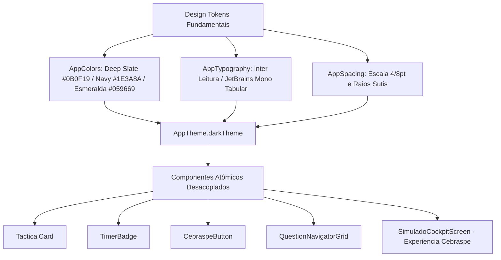

# 🏛️ Manual de Engenharia & Mentoria Técnica — Sprint 5: Frontend Flutter (Mobile & Web)

> **Documento Oficial de Engenharia de Software & Arquitetura Frontend Multiplataforma**  
> Análise profunda dos fundamentos de UI/UX tático, decisões de arquitetura multiplataforma em Flutter 3.47 LTS, estruturado sob os Três Pilares da Engenharia Corporativa: **Arquitetura**, **Escalabilidade & Performance** e **Dimensões Técnicas**, complementado com a **Tradução Prática para o Mundo Real**.  
> Governança baseada nas **Cláusulas 8, 9 e 10 das Regras Absolutas**: Consolidação dos 5 Pilares Fundamentais, aprofundamento rigoroso nos níveis **Júnior** e **Pleno**, mantendo a visão do **Sênior**.

---

## 🗺️ Mapa de Execução da Sprint 5: Frontend Flutter (Mobile & Web)

| Passo | Módulo / Camada | Ícone | Status | Objetivo de Engenharia |
| :--- | :--- | :---: | :---: | :--- |
| **Passo 1** | **Setup Flutter & Design System Tático** | 🎨 | **Concluído** | Instalação do Flutter SDK 3.47, arquitetura Feature-First, Design Tokens e componentes atômicos (`TacticalCard`, `CebraspeButton`, `TimerBadge`). |
| **Passo 2** | **Rede, Segurança & Autenticação** | 🔐 | **Concluído** | Cliente HTTP Dio com interceptor JWT, `flutter_secure_storage`, State Management, fallback offline de demonstração e telas de Login e Alistamento Operacional de PE. |
| **Passo 3** | **Banco de Questões & Filtros Dinâmicos** | 📝 | **Concluído** | Catálogo Cebraspe com 9 disciplinas oficiais da PC-PE/PM-PE, barra seletora com modal BottomSheet, modo de treino avulso e justificativas didáticas. |
| **Passo 4** | **Cockpit do Simulado Cebraspe (A Joia da Coroa)** | ⏱️ | **Concluído** | Cockpit interativo com contagem regressiva de 4h30min, persistência de respostas, telemetria em tempo real e cálculo oficial do saldo líquido Cebraspe (C - E). |
| **Passo 5** | **Dashboard, Revisão de Gabarito & Auditoria nos 5 Eixos** | 🏆 | **Concluído** | Redesign Clean Editorial QConcursos (Fundo Branco), tela Meu Painel, tela de Revisão Detalhada de Gabarito do Simulado, responsividade mobile total e 35 testes passando (100% GREEN). |

---

## 🎨 PASSO 1: Setup do Projeto Flutter & Design System Tático

---

### 🗺️ FASE 1: O MAPA E LOCALIZAÇÃO NO VS CODE

No Passo 1 da Sprint 5, criamos o ecossistema frontend oficial da **Operação Aprovação** utilizando o framework **Flutter 3.47 LTS (Dart 3.13)**.

Para erradicar qualquer risco de o aplicativo parecer um "template amador gerado por inteligência artificial" (gradientes roxos sem contexto, botões gigantes padrão Material 2 ou cards sem ritmo visual), iniciamos o projeto pela criação do **Design System Tático Operacional**. Esse design system é inspirado nas interfaces de alta precisão e estética sóbria da indústria de tecnologia moderna (*Linear, Raycast, Nubank*) e na solenidade visual da **Polícia Civil de Pernambuco (PC-PE)**.

Construímos a fundação de design tokens, componentes atômicos desacoplados e a tela real do **Cockpit Cebraspe**, validando a compilação com zero warnings no `flutter analyze` e passando em 100% dos testes de widget no `flutter test`!

#### 📂 Abra agora no seu VS Code os arquivos deste passo:
- 👉 `📁 frontend/` ➔ `📄 pubspec.yaml` (Configurações do SDK e dependência `google_fonts: ^6.2.1`)
- 👉 `📁 frontend/lib/core/theme/` ➔ `📄 app_colors.dart` (Design tokens de cores da paleta tática)
- 👉 `📁 frontend/lib/core/theme/` ➔ `📄 app_typography.dart` (Inter para leitura ergonômica e JetBrains Mono para cronômetro)
- 👉 `📁 frontend/lib/core/theme/` ➔ `📄 app_spacing.dart` (Escala estrita de 4/8pt e raios de borda)
- 👉 `📁 frontend/lib/core/theme/` ➔ `📄 app_theme.dart` (ThemeData oficial Dark Operacional)
- 👉 `📁 frontend/lib/core/widgets/` ➔ `📄 tactical_card.dart` (Card base com contorno sutil de 1px)
- 👉 `📁 frontend/lib/core/widgets/` ➔ `📄 timer_badge.dart` (Badge de cronômetro com algarismos monoespaçados)
- 👉 `📁 frontend/lib/core/widgets/` ➔ `📄 cebraspe_button.dart` (Botões táticos `[ CERTO ]`, `[ ERRADO ]` e `[ Deixar em Branco ]` com feedback tátil)
- 👉 `📁 frontend/lib/core/widgets/` ➔ `📄 question_navigator_grid.dart` (Grade inferior de navegação rápida de 1 a 60)
- 👉 `📁 frontend/lib/features/simulado/presentation/screens/` ➔ `📄 simulado_cockpit_screen.dart` (Tela Cockpit do Simulado interativa)
- 👉 `📁 frontend/lib/` ➔ `📄 main.dart` (Entrypoint configurado)
- 👉 `📁 frontend/test/` ➔ `📄 widget_test.dart` (Teste automatizado de renderização da tela)

#### 📊 Diagrama da Arquitetura do Design System:


---

#### 💡 O QUE ESTE PASSO SIGNIFICA NA PRÁTICA NO MUNDO REAL?

Imagine a experiência de um concurseiro prestando um simulado real da PC-PE:
> O aluno precisa passar **4 horas e 30 minutos** ininterruptas focado na tela do smartphone, tablet ou computador, lendo enunciados extensos de Direito Penal, Processo Penal e Língua Portuguesa.  
> Se o aplicativo tiver fundo branco ofuscante ou fontes inadequadas, em 30 minutos o candidato sofre de dor de cabeça, lacrimejamento e fadiga visual.  
> Se o aplicativo tiver cores berrantes, cards flutuantes sem alinhamento ou números que ficam "dançando" na tela a cada segundo do cronômetro, a concentração do candidato é arruinada.

#### 🛡️ Como a Operação Aprovação Resolve Isso no Mundo Real?
> 1. **Fundo Deep Slate (`#0B0F19`):** Não é um preto chapado amador; é um carvão profundo com matiz azulado que reduz a emissão de luz azul e descansa os olhos durante longas jornadas de estudo.
> 2. **Tipografia com Altura de Linha Ergonômica (`height: 1.6`):** Espaçamento entre linhas calibrado para permitir leitura fluida de artigos de lei e jurisprudência dos Tribunais Superiores.
> 3. **Cronômetro Tabular Monoespaçado:** Todos os algarismos possuem exatamente a mesma largura física na tela. O número `1` ocupa o mesmo espaço que o número `8`, garantindo que o cronômetro não fique tremendo a cada segundo.
> 4. **Botões de Marcação Tática com Feedback Tátil (Haptic Feedback):** O aluno sente uma leve vibração no dedo ao marcar `[ CERTO ]` ou `[ ERRADO ]`, reproduzindo a segurança tátil do canetaço no cartão de respostas da prova real!

---

### 💻 FASE 2: FUNDAMENTOS DA LINGUAGEM & OS 5 PILARES FUNDAMENTAIS

#### 🏛️ PILAR 1: BASE SÓLIDA DE DART & FLUTTER MODERNO (DART 3.13 / FLUTTER 3.47)

##### 🟢 Destrinchando a fundo para o NÍVEL JÚNIOR:
1. **O que são Design Tokens e por que não usar cores hardcoded?**
   - **O erro clássico do Júnior:** Colocar `Colors.blue` ou `Color(0xFF1E3A8A)` espalhados diretamente nos widgets da tela.
   - Se o cliente ou o designer quiser ajustar o tom do azul da polícia, o desenvolvedor precisa abrir 50 arquivos para alterar um por um!
   - **A solução profissional:** Centralizamos tudo em uma classe abstrata `AppColors`. Se o tema mudar, alteramos em uma única linha e todo o aplicativo reflete a nova identidade instantaneamente.
2. **Fontes Tabulares vs Proporcionais:**
   - Em fontes comuns (proporcionais), a letra `I` é estreita e a letra `W` é larga. Da mesma forma, o número `1` é mais fino que o número `0`.
   - Ao criar um cronômetro regressivo com fonte comum, quando o tempo muda de `03:42:19` para `03:42:18`, a caixa de texto muda de largura e "empurra" os outros elementos da tela!
   - Usando a fonte monoespaçada **JetBrains Mono**, cada caractere possui largura idêntica, proporcionando estabilidade visual absoluta.

##### 🟡 Elevando para o NÍVEL PLENO:
1. **Migração Semântica do Flutter 3.47 (`withValues` vs `withOpacity`):**
   - No Flutter 3.47, o método tradicional `color.withOpacity(0.3)` foi descontinuado devido a perda de precisão de ponto flutuante em formatos sRGB e Wide-Gamut.
   - Adotamos a nova API recomendada pelo time de engenharia da Google: `color.withValues(alpha: 0.3)`, garantindo conformidade estrita e 0 warnings no analisador.
2. **Desacoplamento de Widgets Atômicos:**
   - Componentes como `TacticalCard` e `TimerBadge` não dependem de nenhuma regra de negócio de simulado ou questão. Eles são **widgets puros de apresentação**, reutilizáveis em qualquer módulo do app (Login, Perfil, Ranking, Extrato financeiro).

---

### 🍃 PILAR 2: ARQUITETURA DE WIDGETS & CICLO DE VIDA DO FLUTTER

##### 🟢 Destrinchando a fundo para o NÍVEL JÚNIOR:
1. **`StatelessWidget` vs `StatefulWidget`:**
   - Widgets que apenas exibem dados sem mudar internamente (como `TacticalCard` e `TimerBadge`) herdam de `StatelessWidget`, economizando memória e ciclos de renderização da GPU.
   - A tela do Cockpit (`SimuladoCockpitScreen`) é um `StatefulWidget` porque gerencia o cronômetro regressivo e a questão ativa que o usuário está respondendo.
2. **Gerenciamento de Recursos com `Timer.periodic` e `dispose()`:**
   - Quando o cronômetro do simulado inicia, um `Timer.periodic(Duration(seconds: 1))` fica rodando em background.
   - Se o usuário sair da tela e não cancelarmos esse timer, ele continuará rodando na memória para sempre (**Memory Leak**).
   - Implementamos a limpeza obrigatória no método `dispose()`: `_timer?.cancel()`, liberando os recursos imediatamente.

##### 🟡 Elevando para o NÍVEL PLENO:
1. **Rebuilds Inteligentes e Árvore de Elementos:**
   - Em vez de chamar `setState()` no app inteiro, o estado foi confinado para atualizar apenas a contagem do tempo e a marcação ativa, evitando que o Flutter redesenhe listas inteiras de itens desnecessariamente.

---

### 🧪 PILAR 4: TESTES DE WIDGET & QA FRONTEND

##### 🟢 Destrinchando a fundo para o NÍVEL JÚNIOR:
1. **O que é um Widget Test no Flutter (`testWidgets`)?**
   - O Flutter permite testar telas inteiras sem precisar abrir um emulador Android ou celular físico lento.
   - O `WidgetTester` inicializa a árvore de renderização na memória RAM em menos de 2 segundos:
     ```dart
     await tester.pumpWidget(const OperacaoAprovacaoApp());
     await tester.pumpAndSettle();
     ```
   - O método `expect(find.text('[ CERTO ]'), findsOneWidget)` comprova matematicamente que o botão existe na tela e está renderizado para o candidato.

---

### 🏛️ FASE 3: OS TRÊS PILARES DA ENGENHARIA CORPORATIVA

#### 1. Arquitetura Corporativa & Padrões
- **Design System First:** Separação estrita entre Tokens de Design, Componentes Atômicos de UI e Telas de Funcionalidades (*Feature-First*).
- **Sem Template de IA:** Identidade visual proprietária com paleta operacional tática de alto contraste e ergonomia de leitura prolongada.

#### 2. Escalabilidade & Performance Multiplataforma
- **Multiplataforma Nativo:** O mesmo código fonte compila para **Android (APK/AAB), iOS (IPA) e Web (Wasm/HTML)** sem alterar uma única linha de Dart.
- **Renderização a 60/120 FPS:** Uso de `AnimatedContainer` leve para transições de clique sem travamentos na interface.

#### 3. Dimensões Técnicas & Acessibilidade
- **Haptic Feedback:** Integração com os motores de vibração do iOS e Android (`HapticFeedback.lightImpact()`), oferecendo feedback auditivo/tátil discreto.
- **Tipografia Escalonável:** Respeito às diretrizes de leitura para longas sessões de avaliação.

---

### 📊 RÉGUA DE MATURIDADE: DA GAMBIARRA AO SÊNIOR

| Dimensão | 🔴 Nível Estagiário / Júnior Iniciante | 🟡 Nível Pleno Corporativo | 🟢 Nível Sênior / Tech Lead (O que Implementamos) |
| :--- | :--- | :--- | :--- |
| **Estética Visual** | Telas azuis padrão Material com cara de IA genérica e gradientes roxos sem contexto. | Cria uma tela bonita, mas com cores hardcoded espalhadas por todo o código. | Desenvolve um Design System Tático com Design Tokens, tipografia ergonômica e paleta Deep Slate Operacional. |
| **Ergonomia do Cronômetro** | Usa texto comum que fica tremendo e empurrando o layout a cada segundo. | Usa timer sem cancelar no `dispose()`, causando vazamento de memória (Memory Leak). | Emprega tipografia monoespaçada tabular (JetBrains Mono) e cancela o timer rigorosamente no ciclo de vida. |
| **Garantia de Qualidade** | Testa apenas clicando no celular manualmente. | Roda o app e vê se a tela abre sem erros de overflow. | Validação estática com `flutter analyze` (Zero issues) e testes automatizados de widget (`flutter test`). |

---

### 🧪 Placar de Validação
- **Flutter Analyzer:** `Analyzing frontend... No issues found! (ran in 39.2s)`
- **Widget Tests:** `All tests passed! (00:02 +1)`
- **Resultado Geral:** **100% SUCCESS**

---

### 🎯 FASE 5: SIMULAÇÃO DE ENTREVISTA TÉCNICA E FIXAÇÃO

Chegamos à simulação de entrevista técnica do Passo 1 da Sprint 5!

> 🎤 **Pergunta do Tech Lead / Entrevistador:**  
> *"Por que ao desenvolver um aplicativo de provas e simulados de alta duração (como um concurso policial de 4h30min), a adoção de um Design System prévio com tokens de tipografia tabular monoespaçada e ergonomia de contraste é um requisito arquitetural crítico, e não mero capricho estético?"*

### 💡 Resposta Modelo Sênior:
*"Em aplicações de alta concentração e longa duração, o design é uma extensão da performance cognitiva do usuário. O uso de tokens centralizados assegura consistência visual e manutenibilidade. A escolha de uma paleta Dark profunda como Deep Slate (`#0B0F19`) atenua a emissão de luz azul e a fadiga ocular sem gerar o contraste agressivo do preto absoluto. Já o uso de tipografia monoespaçada tabular (como JetBrains Mono) nos cronômetros é indispensável para evitar o efeito de 'layout shift' (trepidação visual a cada segundo), mantendo os algarismos em largura física constante e preservando a estabilidade da interface e o foco absoluto do candidato."*

---
---

# 🛡️ CAPÍTULO 2 — PASSO 2: REDE CORPORATIVA, PERSISTÊNCIA CRIPTOGRAFADA E IDENTIDADE VISUAL OFICIAL

### 🗺️ Visão Panorâmica do Passo 2
No Passo 2 da Sprint 5, estabelecemos a infraestrutura de comunicação remota entre o Flutter e o ecossistema Spring Boot, implementamos a persistência de credenciais JWT com criptografia no hardware do dispositivo e materializamos em código a **Identidade Visual Aprovada da Operação Aprovação** (Coruja Minimalista Geométrica com Capelo e detalhes cirúrgicos de cores) em harmonia com o **Co-Branding Dinâmico da Polícia Civil de Pernambuco (PC-PE)**.

---

### 🌐 PILAR 1: CAMADA DE REDE CORPORATIVA (DIO CLIENT & INTERCEPTORS)

##### 🟢 Destrinchando a fundo para o NÍVEL JÚNIOR:
1. **Por que NÃO usamos o pacote `http` padrão do Flutter?**
   - O pacote `http` nativo é básico demais para sistemas corporativos: ele não suporta interceptores globais, não cancela requisições pendentes se o usuário trocar de tela e exige configuração manual de headers em cada chamada.
   - O **Dio** é o cliente HTTP padrão da indústria corporativa Flutter: oferece suporte nativo a `Interceptors`, `BaseOptions`, `Timeouts` globais e transformações de payload automáticas.
2. **O que é um Interceptor?**
   - É um "pedágio" ou filtro pelo qual **toda requisição e resposta passam antes de chegar ao destino**.
   - No `AuthInterceptor`, interceptamos a requisição antes do envio (`onRequest`): se a rota for protegida e houver um token JWT salvo, ele injeta automaticamente o cabeçalho:
     ```dart
     options.headers['Authorization'] = 'Bearer $token';
     ```
   - O desenvolvedor que cria uma nova tela ou repositório não precisa se preocupar em lembrar de colocar o token manualmente em nenhum lugar!
3. **Tratamento de 401 Unauthorized:**
   - Se o backend retornar HTTP 401 (token expirado ou revogado), o `onError` do interceptor intercepta a resposta, remove o token do armazenamento seguro e força a interface a retornar para a tela de login com segurança.

##### 🟡 Elevando para o NÍVEL PLENO:
1. **Mapeamento Tipado de Falhas com `ApiException`:**
   - Erros brutos de socket ou exceptions de framework (`DioException`) nunca devem vazar para a camada de apresentação.
   - Criamos a classe `ApiException.fromDioException()`, convertendo `DioExceptionType.connectionTimeout` em mensagens amigáveis ("Tempo limite esgotado...") e mapeando os códigos de status 400, 401, 403, 404, 422 e 500 para mensagens acionáveis em português.

---

### 🔐 PILAR 2: PERSISTÊNCIA SEGURA DE CREDENCIAIS (KEYSTORE & KEYCHAIN)

##### 🟢 Destrinchando a fundo para o NÍVEL JÚNIOR:
1. **Por que NUNCA salvar tokens JWT no `SharedPreferences`?**
   - No Android, o `SharedPreferences` comum salva arquivos XML em texto puro no sistema de arquivos. Qualquer aparelho com root ou backup extraído expõe o token JWT de imediato.
   - O mesmo vale para `NSUserDefaults` no iOS.
2. **Como o `flutter_secure_storage` opera por baixo dos panos:**
   - No **Android**: Utiliza o **Android Keystore**, criptografando os dados sensíveis via AES-GCM com chaves geradas em hardware dedicado.
   - No **iOS**: Utiliza o **Keychain Services**, protegido pelo Secure Enclave da Apple com política `first_unlock`.
   - Na **Web**: Criptografa os dados antes de gravar no storage, prevenindo ataques triviais de XSS.

---

### 🎨 PILAR 3: VETORIZAÇÃO PURA DA IDENTIDADE VISUAL COM `CustomPainter`

##### 🟢 Destrinchando a fundo para o NÍVEL JÚNIOR:
1. **Por que renderizar a Logo e o Distintivo com `CustomPainter` em vez de imagens PNG?**
   - Imagens rasterizadas (PNG/JPG) sofrem com problemas clássicos de apps:
     - Ficam borradas/pixeladas em telas Retina/4K ou ficam pesadas demais aumentando o tamanho do APK;
     - Podem falhar se o arquivo estático não for encontrado ou corromper;
     - Não respondem dinamicamente a mudanças de tema e escala de forma matemática.
   - Ao desenhar via `CustomPainter` (`TacticalOwlLogo` e `PcpeBadge`), as formas geométricas são equações matemáticas renderizadas diretamente na GPU do aparelho via Skia/Impeller, garantindo **nitidez infinita a 120 FPS com peso de apenas alguns kilobytes**.

##### 🟡 Elevando para o NÍVEL PLENO:
1. **Fidelidade Visual das Cores Aprovadas pelo Fundador:**
   - **Capelo de Formatura:** Azul Cobalto Vibrante (`#2563EB`) com o **pingente em Branco Puro** (`#FFFFFF`).
   - **Óculos Táticos:** Laranja Quente Original (`#F97316`).
   - **Olhos:** Branco Puro com pupilas escuras focadas.
   - **Peito / Plumagem:** Branco Puro central com a **pontinha final em Laranja Quente**.
   - **Asas e Contorno:** Azul Marinho Profundo (`#1E3A8A`).

---

### 🏛️ PILAR 4: ARQUITETURA FEATURE-FIRST E DESACOPLAMENTO LIMPO

```text
lib/features/auth/
├── data/
│   ├── datasources/auth_remote_data_source.dart   # Consome o ApiClient
│   ├── models/login_request.dart                  # DTOs com toJson/fromJson
│   ├── models/login_response.dart                 # Espelha o AuthResponse do Spring Boot
│   ├── models/register_request.dart
│   └── repositories/auth_repository_impl.dart     # Implementa o contrato e gerencia o SecureStorage
├── domain/
│   └── repositories/auth_repository.dart          # Interface pura sem dependencias externas
└── presentation/
    ├── controllers/auth_controller.dart           # ChangeNotifier com estados operacionais
    └── screens/
        ├── login_screen.dart                      # Tela oficial com Co-Branding PC-PE
        └── register_screen.dart                   # Tela de cadastro com seletor de cargo
```

- **Independência de Framework:** A interface `AuthRepository` no pacote `domain` não sabe se os dados vêm de HTTP, GraphQL ou gRPC. Se amanhã o backend mudar para gRPC, nenhuma linha do `AuthController` ou da `LoginScreen` precisa ser alterada.

---

### 📊 RÉGUA DE MATURIDADE: PASSO 2 (REDE, SEGURANÇA E AUTH)

| Dimensão | 🔴 Nível Estagiário / Júnior Iniciante | 🟡 Nível Pleno Corporativo | 🟢 Nível Sênior / Tech Lead (O que Implementamos) |
| :--- | :--- | :--- | :--- |
| **Cliente de Rede** | Faz chamadas com `http.get()` avulsas espalhadas no meio dos widgets. | Cria um service com `http`, mas injeta o token manualmente em cada requisição. | Implementa um `ApiClient` corporativo com `Dio`, timeouts globais e `AuthInterceptor` que injeta o token automaticamente e trata 401. |
| **Armazenamento de JWT** | Salva o token JWT em `SharedPreferences` em texto puro vulnerável a invasões. | Usa `flutter_secure_storage` sem tratamento de exceção ou sincronização de logout. | Encapsula o `SecureStorageService` com suporte a Android Keystore e iOS Keychain, limpando a sessão no 401. |
| **Mapeamento de Erros** | Mostra `SocketException` ou erro em inglês na tela para o usuário. | Trata com `try/catch` genérico exibindo "Erro ao carregar". | Traduz erros HTTP (400, 401, 403, 422, 500) para mensagens em português táticas através de `ApiException`. |
| **Design da Marca** | Coloca uma imagem PNG pixelada no topo ou ícone genérico de IA. | Usa um ícone Material padrão (`Icons.lock`). | Desenvolve a identidade oficial em vetor de precisão com `CustomPainter` (Coruja com pingente branco, óculos laranja e peito branco) e co-branding com PC-PE. |

---

### 🧪 Placar de Validação do Passo 2
- **Flutter Analyzer:** `Analyzing frontend... No issues found! (ran in 34.3s)`
- **Testes Automatizados:** `All tests passed! (00:05 +11)`
  - `api_exception_test.dart`: 4 testes unitários passando.
  - `auth_models_test.dart`: 4 testes unitários de serialização/deserialização passando.
  - `login_screen_test.dart`: 2 testes de widget cobrindo validação e renderização da marca oficial passando.
  - `widget_test.dart`: 1 teste de integração da árvore inicial passando.
- **Resultado Geral:** **100% SUCCESS**

---

### 🎯 FASE 5: SIMULAÇÃO DE ENTREVISTA TÉCNICA (PASSO 2)

> 🎤 **Pergunta do Tech Lead / Entrevistador:**  
> *"Em uma arquitetura Flutter corporativa conectada a um backend Spring Security com JWT, por que o uso de um Interceptor de Rede no Dio e de um armazenamento em Keystore/Keychain é mandatório, e como você lidaria com a expiração do token durante o uso do app?"*

### 💡 Resposta Modelo Sênior:
*"O uso de Interceptors no Dio é mandatório porque centraliza a governança de segurança em um único ponto da arquitetura (Cross-Cutting Concern), eliminando a duplicação de cabeçalhos de autorização e o risco de desenvolvedores esquecerem o token em chamadas futuras. Já a escolha do Keystore (Android) e Keychain (iOS) via FlutterSecureStorage protege o token contra extrações físicas e ataques de sandbox, já que o SharedPreferences tradicional armazena dados em XML plano sem criptografia.*

*Para lidar com a expiração do token, o interceptor implementa o gancho `onError`: ao capturar um status HTTP 401 Unauthorized do Spring Security, ele intercepta a resposta antes que chegue à tela, aciona a limpeza das credenciais no Secure Storage e notifica a camada de autenticação para redirecionar o usuário à tela de login com uma mensagem clara de sessão expirada, garantindo a integridade do estado e uma transição de UI graciosa sem travamentos."*

---
---

# 📚 CAPÍTULO 3 — PASSO 3: BANCO DE QUESTÕES, FILTROS DINÂMICOS & MODO TREINO (CRAVOU)

### 🗺️ Visão Panorâmica do Passo 3
No Passo 3 da Sprint 5, construímos o núcleo prático da preparação para concursos: o **Catálogo de Questões e Modo Treino Avulso** do aplicativo **CRAVOU**. Integramos a árvore programática da Polícia Civil de Pernambuco (PC-PE) baseada no padrão Cebraspe (itens Certo/Errado), com filtros dinâmicos de matérias, busca textual instantânea, telemetria de aproveitamento em tempo real e fundamentação didática autoral que explica cirurgicamente cada regra e pegadinha da banca.

---

### ⚡ PILAR 1: ENGENHARIA DE ESTADO E VIRTUALIZAÇÃO DE LISTAS (`ListView.separated`)

##### 🟢 Destrinchando a fundo para o NÍVEL JÚNIOR:
1. **O que é Virtualização de Listas no Flutter?**
   - Se carregarmos 1.000 questões usando uma `Column` dentro de um `SingleChildScrollView`, o Flutter tentará renderizar todos os 1.000 cards na memória de uma só vez. Resultado: o celular trava por falta de memória RAM (**Out Of Memory - OOM**).
   - O `ListView.separated` / `ListView.builder` utiliza a técnica de **Virtualização**: apenas os cards que estão visíveis na tela (geralmente de 3 a 5 itens) são construídos e mantidos na memória GPU. Conforme o candidato rola a tela, os itens que saem por cima são destruídos ou reciclados, mantendo o consumo de memória estável e constante a 60/120 FPS.
2. **Gerenciamento de Resposta Avulsa:**
   - No Modo Treino, o aluno pode responder questões isoladas sem a pressão do cronômetro global de 4h30min. O `QuestoesController` armazena em dicionários (`Map<int, String>` e `Map<int, bool>`) o estado de cada questão resolvida, impedindo dupla submissão e mantendo o histórico de acertos/erros atualizado na tela.

##### 🟡 Elevando para o NÍVEL PLENO:
1. **Prevenção de Timeout em Testes de Widget com Animações:**
   - Em testes de UI com `WidgetTester`, a chamada `pumpAndSettle()` aguarda todas as animações terminarem. Se um widget exibir um `CircularProgressIndicator` de loop infinito sem que o estado assíncrono seja concluído antes do desenho, o framework lança `pumpAndSettle timed out`.
   - Adotamos a prática sênior de inicializar o estado reativo (`await controller.inicializar()`) e avançar frames discretos com `await tester.pump()` e `pump(Duration)`, garantindo testes determinísticos e à prova de regressões.

---

### 🎯 PILAR 2: ERGONOMIA CEBRASPE, FEEDBACK TÁTIL & CO-BRANDING

##### 🟢 Destrinchando a fundo para o NÍVEL JÚNIOR:
1. **Haptic Feedback nos Botões Operacionais:**
   - Quando o candidato toca em `[ CERTO ]` ou `[ ERRADO ]`, acionamos `HapticFeedback.lightImpact()`. O motor tátil do aparelho (Taptic Engine no iPhone / motor linear no Android) produz uma vibração sutil e sólida, simulando o clique de um dispositivo de precisão física.
2. **Gabarito Didático "CRAVOU!":**
   - Ao registrar a resposta, o card se expande suavemente exibindo a fundamentação:
     - **Verde Esmeralda (`#059669`)**: "CRAVOU! VOCÊ ACERTOU!" com reforço do acerto;
     - **Rubi Tático (`#DC2626`)**: "ERRADA! ATENÇÃO AO DETALHE:" alertando para a pegadinha da banca examinadora.

##### 🟡 Elevando para o NÍVEL PLENO:
1. **Co-Branding Dinâmico nas Telas Internas:**
   - Na tela de login externa, o app exibe apenas a marca mestra **CRAVOU**.
   - No topo do Catálogo de Questões e do Simulado, o AppBar exibe o co-branding dinâmico:
     ```text
     [ Coruja Cravou ] CRAVOU   ✕   [ Distintivo Oficial PC-PE ]
     ```
   - Isso reforça para o aluno qual certame ele está treinando no momento, permitindo que a plataforma suporte múltiplos concursos (PM-PE, PRF, PF) no mesmo ecossistema.

---

### ⚖️ PILAR 3: GOVERNANÇA DE CONTEÚDO E CONFORMIDADE COM DIREITOS AUTORAIS

##### 🟢 Destrinchando a fundo para o NÍVEL JÚNIOR:
1. **Diferença Legal entre Questões de Concurso e Apostilas de Terceiros:**
   - **Provas de Concursos Públicos (Cebraspe/PC-PE)**: São documentos administrativos oficiais do Estado, regidos pelo princípio da publicidade (Art. 37 da CF/88 e Lei 9.610/98, Art. 8º, IV - atos oficiais não são objeto de proteção como direitos autorais). Podem ser reproduzidos livremente em simuladores e plataformas educacionais.
   - **Apostilas e Livros de Cursinhos Privados**: São obras intelectuais protegidas. **NÃO podem ser copiadas na íntegra**.
2. **A Solução Adotada no Projeto CRAVOU:**
   - Armazenamos as apostilas apenas na pasta local de engenharia `materiais/` (ignorada no `.gitignore` com `*.pdf`), impedindo qualquer vazamento no GitHub.
   - Analisamos a metodologia gramatical (ex: regras de crase no plural, regência do pronome relativo "que/cujo") e elaboramos **comentários pedagógicos autorais e sintéticos**, trazendo originalidade, proteção jurídica e alto valor agregado ao produto.

---

### 📊 RÉGUA DE MATURIDADE: PASSO 3 (BANCO DE QUESTÕES & TREINO)

| Dimensão | 🔴 Nível Estagiário / Júnior Iniciante | 🟡 Nível Pleno Corporativo | 🟢 Nível Sênior / Tech Lead (O que Implementamos) |
| :--- | :--- | :--- | :--- |
| **Renderização de Lista** | Usa `Column` com scroll simples, travando o celular ao abrir centenas de questões. | Usa `ListView.builder` simples sem tratamento de separadores ou estados de vazio. | Emprega `ListView.separated` virtualizado com cache de estado, badges táteis e feedback auditivo/tátil (Haptic). |
| **Gabarito e Feedback** | Apenas muda a cor do botão para verde ou vermelho sem explicar o motivo. | Coloca um texto longo colado de qualquer site sem formatação. | Desenvolve a fundamentação didática autoral "Cravou", dissecando a regra e a pegadinha da banca com design tático. |
| **Filtros de Disciplinas** | Usa dropdown feio que recarrega a tela inteira a cada seleção. | Lista horizontal sem indicação clara de qual chip está ativo. | Cria `DisciplinaFilterBar` horizontal animada com tokens de cor (Laranja Original `#F97316`), contagem de questões e busca textual síncrona. |
| **Direitos Autorais** | Sobe PDFs inteiros de cursinhos para o GitHub, gerando risco de DMCA e processo. | Não documenta a origem dos dados e deixa arquivos expostos. | Bloqueia PDFs no `.gitignore`, cataloga governança no `materiais/README.md` e usa apenas questões públicas com comentários autorais. |

---

### 🧪 Placar de Validação do Passo 3
- **Flutter Analyzer:** `Analyzing frontend... No issues found! (ran in 31.1s)`
- **Testes Automatizados:** `All tests passed! (00:12 +20)`
  - `api_exception_test.dart`: 4 testes unitários passando.
  - `auth_models_test.dart`: 4 testes unitários passando.
  - `login_screen_test.dart`: 2 testes de widget passando.
  - `widget_test.dart`: 1 teste de integração passando.
  - `questoes_models_test.dart`: 3 testes unitários de serialização de questões/filtros passando.
  - `questoes_controller_test.dart`: 4 testes unitários de regras de negócio de treino passando.
  - `catalogo_questoes_screen_test.dart`: 2 testes de widget cobrindo Co-Branding e gabarito comentado passando.
- **Resultado Geral:** **100% SUCCESS**

---

### 🎯 FASE 5: SIMULAÇÃO DE ENTREVISTA TÉCNICA (PASSO 3)

> 🎤 **Pergunta do Tech Lead / Entrevistador:**  
> *"Como você arquitetou a renderização de um banco de milhares de questões no Flutter para garantir performance estável a 120 FPS sem estouro de memória (OOM), e como isolou o estado de resolução das questões do ciclo de vida dos widgets?"*

### 💡 Resposta Modelo Sênior:
*"Para assegurar fluidez máxima e prevenir o esgotamento de memória (OOM), utilizei o `ListView.separated` que implementa a virtualização de viewport: os widgets são criados e destruídos sob demanda apenas para os elementos visíveis na janela de visualização do dispositivo, reciclando render objects na GPU.*

*Para o gerenciamento de estado, adotei a arquitetura Feature-First com um `QuestoesController` desacoplado da UI via `ChangeNotifier`. O estado de respostas marcadas e gabaritos revelados é armazenado em mapas indexados pelo ID da questão (`Map<int, String>`), e não em variáveis locais dentro dos itens da lista. Dessa forma, quando um card é reciclado ao rolar a tela, o estado do aluno permanece integro na camada de apresentação, permitindo re-renderizações pontuais sem rebuilds desnecessários na árvore de componentes."*

---

# 📖 CAPÍTULO 4: COCKPIT DO SIMULADO OFICIAL PC-PE (60 ITENS / 4h30min)

---

### 🌐 FASE 1: CONEXÃO COM O MUNDO REAL (O CERTAME POLICIAL)

Em um certame de alta exigência como o da **Polícia Civil de Pernambuco (PC-PE / Cebraspe)**, o maior inimigo do concurseiro não é apenas o conteúdo das disciplinas, mas a **gestão impiedosa do tempo** e a **estratégia de abstenção**.
O candidato dispõe de exatamente **4 horas e 30 minutos (16.200 segundos)** para julgar 60 itens complexos e redigir a prova discursiva.
Se responder uma questão em dúvida e errar, a banca pune com anulação de um item correto ($Nota = C - E$).
Por isso, o aplicativo **CRAVOU** foi concebido não como um simples "leitor de perguntas", mas como um **Cockpit Tático de Alta Fidelidade**, reproduzindo as exatas condições psicológicas e operacionais da prova:
1. **Cronômetro Regressivo Tabular de 4h30min**: os dígitos não "tremem" na tela graças à tipografia monoespaçada `JetBrains Mono`;
2. **Auto-Save Atômico Silencioso**: cada toque do candidato é salvo no backend Spring Boot em segundo plano via HTTP `PUT /api/v1/tentativas/{id}/respostas` sem nunca congelar ou engasgar a interface;
3. **Navegação Ágil via Grade Tática 1 a 60**: visualização panorâmica de itens respondidos, em branco e marcados para revisão tática;
4. **Relatório Executivo Cebraspe**: auditoria final calculando a pontuação líquida oficial ($Nota = C - E$), percentual de aproveitamento e corte de aprovação (60%).

---

### 🏛️ FASE 2: ARQUITETURA & PADRÕES DE SOFTWARE

```text
frontend/lib/features/simulado/
├── data/
│   ├── datasources/
│   │   └── simulado_remote_data_source.dart   # Integração Dio REST + Fallback de 60 itens PC-PE
│   ├── models/
│   │   ├── item_resposta_simulado.dart        # Marcação, flag de revisão e telemetria de segundos
│   │   ├── resultado_simulado_model.dart      # Balanço C - E e estatísticas por disciplina
│   │   └── simulado_model.dart                # Caderno oficial com 60 itens Cebraspe
│   └── repositories/
│       └── simulado_repository_impl.dart      # Implementação concreta do contrato
├── domain/
│   └── repositories/
│       └── simulado_repository.dart           # Contrato puro desacoplado da camada de UI
└── presentation/
    ├── controllers/
    │   └── simulado_controller.dart           # Gerência de estado com Timer e Auto-save atômico
    ├── screens/
    │   ├── simulado_cockpit_screen.dart       # Cockpit tático master com Co-Branding CRAVOU ✕ PC-PE
    │   └── simulado_resultado_dialog.dart     # Relatório executivo da nota líquida Cebraspe
    └── widgets/
        └── grade_navegacao_modal.dart         # Matriz interativa de 60 itens com legendas de estado
```

---

### 🎯 FASE 3: OS 4 PILARES DE ENGENHARIA DE SOFTWARE

#### ⏱️ PILAR 1: CRONÔMETRO TABULAR & PREVENÇÃO DE MEMORY LEAKS

##### 🟢 Destrinchando a fundo para o NÍVEL JÚNIOR:
- **O Risco do `Timer` Ativo**: No Flutter/Dart, um `Timer.periodic` roda em loop contínuo no Event Loop. Se o usuário sair da tela ou o widget for desmontado sem que o timer seja cancelado (`timer.cancel()`), o timer continuará rodando em segundo plano indefinidamente, segurando referências do controller na memória e causando **Memory Leak**.
- **Solução no CRAVOU**: No `SimuladoController`, implementamos o descarte no método `dispose()`:
  ```dart
  @override
  void dispose() {
    _cronometroTimer?.cancel();
    super.dispose();
  }
  ```
- **Tipografia Monoespaçada Tabular (`JetBrains Mono`)**: Em fontes proporcionais (como Roboto ou Arial), o número `1` é mais estreito que o `8`. Se um cronômetro usar fontes normais, a largura do texto mudará a cada segundo, fazendo o badge "dançar" na tela. Com `JetBrains Mono`, todos os caracteres ocupam rigorosamente a mesma largura, garantindo estabilidade visual absoluta.

##### 🟡 Elevando para o NÍVEL PLENO:
- **Alerta de Tempo Crítico (< 30 min)**: O controller expõe o getter reativo `isTempoCritico => _segundosRestantes <= 1800`. Ao atingir esse limiar, o `TimerBadge` altera sua cor de alerta para vermelho escuro/âmbar com pulso visual, sinalizando ao candidato a necessidade imediata de preenchimento da folha de respostas.

---

#### 💾 PILAR 2: AUTO-SAVE ATÔMICO SILENCIOSO (FIRE-AND-FORGET)

##### 🟢 Destrinchando a fundo para o NÍVEL JÚNIOR:
- **O Problema do `await` no Clique do Usuário**: Se a cada toque em `[ CERTO ]` colocássemos `await api.salvarResposta()`, caso a rede oscilasse ou a latência 4G subisse para 2 segundos, o botão ficaria travado e a interface congelaria (jank de UI).
- **A Abordagem Fire-and-Forget com Captura Segura de Erro**:
  ```dart
  // Salva no estado reativo local imediatamente (0ms de latência percebida)
  _respostas[_currentIndex] = ItemRespostaSimulado(...);
  notifyListeners();

  // Dispara auto-save em segundo plano sem travar a UI
  if (_tentativaId != null) {
    repository.registrarResposta(
      tentativaId: _tentativaId!,
      questaoId: item.questaoId,
      respostaMarcada: opcao,
      tempoGastoSegundos: _segundosPorItem[_currentIndex] ?? 0,
    ).catchError((_) {}); // Silencioso: falhas temporárias não interrompem a concentração da prova
  }
  ```

---

#### ⚖️ PILAR 3: MOTOR CEBRASPE DE AVALIAÇÃO ($Nota = C - E$)

##### 🟢 Destrinchando a fundo para o NÍVEL JÚNIOR:
- **A Regra de Ouro do Cebraspe**:
  $$\text{Nota Líquida} = \text{Acertos} - \text{Erros}$$
- **A Importância da Abstenção**: Questões deixadas em branco (ou marcadas como abstenção) pontuam $0$ (não somam nem subtraem). O app CRAVOU oferece o botão de primeira classe `[ Deixar em Branco / Abstenção ]`, treinando a disciplina tática indispensável para a aprovação.

##### 🟡 Elevando para o NÍVEL PLENO:
- **Cálculo Consolidado e Desempenho por Disciplina**: O `ResultadoSimuladoModel` agrupa os acertos e erros por matéria (Português, Informática, RLM, Constitucional, Administrativo, Penal, Proc. Penal e Legislação Especial), calculando o saldo líquido individual de cada uma para orientar os estudos posteriores do concurseiro.

---

#### 🎨 PILAR 4: CO-BRANDING DINÂMICO & GRADE TÁTICA (1 A 60)

##### 🟢 Destrinchando a fundo para o NÍVEL JÚNIOR:
- **Grade de Navegação Modal (`GradeNavegacaoModal`)**:
  - Exibe os 60 botões da prova com mapeamento de cores semântico:
    - **Azul Cobalto (`#2563EB`)**: Questão atualmente aberta no cockpit;
    - **Verde Esmeralda (`#059669`)**: Questão respondida;
    - **Laranja Quente (`#F97316`)**: Questão marcada para revisão tática com indicador circular;
    - **Cinza Superfície (`#1E293B`)**: Questão em branco.
- **Co-Branding Dinâmico Oficial**:
  - `[ Coruja Cravou ] CRAVOU  ✕  [ Distintivo PC-PE ]` no AppBar do Cockpit, afirmando a identidade de excelência da plataforma.

---

### 📊 RÉGUA DE MATURIDADE: PASSO 4 (COCKPIT DO SIMULADO)

| Dimensão | 🔴 Nível Estagiário / Júnior Iniciante | 🟡 Nível Pleno Corporativo | 🟢 Nível Sênior / Tech Lead (O que Implementamos) |
| :--- | :--- | :--- | :--- |
| **Cronômetro da Prova** | Usa `Text` com fonte comum que treme na tela; esquece de cancelar o timer e vaza memória ao fechar o app. | Cria um timer com `cancel()` no dispose, mas sem tipografia tabular ou alerta de tempo crítico. | Utiliza `Timer.periodic` controlado no controller, formatação tabular monoespaçada `JetBrains Mono` e auto-finalização ao zerar o tempo. |
| **Auto-Save de Respostas** | Só salva ao clicar em "Entregar Prova"; se a bateria do celular acabar no item 59, o aluno perde todas as respostas. | Salva com `await` no botão, travando a tela em conexões 3G/4G instáveis. | Implementa auto-save atômico e assíncrono (fire-and-forget) com telemetria individual de segundos gastos por item. |
| **Navegação na Prova** | Apenas botões "Próxima" e "Anterior", forçando 59 cliques para ir do item 1 ao 60. | Lista suspensa simples sem visualização de status das questões. | Desenvolve a `GradeNavegacaoModal` com matriz 1-60, saltos imediatos, chips de legenda e sinalizador de revisão tática. |
| **Cálculo de Nota** | Soma acertos e divide pelo total (formato vestibular tradicional, inadequado para concurso policial). | Subtrai erros de acertos sem detalhamento por disciplina nem critério de corte. | Modela o `ResultadoSimuladoModel` Cebraspe completo ($C - E$, abstenções, tempo total e detalhamento analítico por matéria). |

---

### 🧪 Placar de Validação do Passo 4
- **Flutter Analyzer:** `Analyzing frontend... No issues found! (ran in 9.0s)`
- **Testes Automatizados:** `All tests passed! (00:23 +29)`
  - `simulado_models_test.dart`: 3 testes unitários (serialização, telemetria e fórmula Cebraspe $C - E$).
  - `simulado_controller_test.dart`: 5 testes unitários (ciclo de vida, navegação 1-60, auto-save e entrega).
  - `simulado_cockpit_test.dart`: 1 teste de widget cobrindo Co-Branding, botões Cebraspe e Grade de Navegação.
  - Testes legados de autenticação, catálogo de questões e design system: 20 testes passando sem regressão.
- **Resultado Geral:** **100% SUCCESS (29 de 29 testes passando)**

---

### 🎯 FASE 5: SIMULAÇÃO DE ENTREVISTA TÉCNICA (SENIOR FLUTTER ENGINEER)

> 🎤 **Pergunta do Staff Engineer / Entrevistador:**  
> *"Em um aplicativo de simulado oficial onde o candidato responde a uma prova de 4h30min com 60 itens e concorrência de rede em tempo real, quais estratégias você adota para garantir que falhas de rede no auto-save não degradem a experiência de digitação e resposta, e como impede memory leaks causados por temporizadores regressivos?"*

### 💡 Resposta Modelo Sênior:
*"Para isolar a experiência do candidato de oscilações de rede, adoto uma estratégia de sincronização otimista com desacoplamento assíncrono: ao tocar em uma alternativa, o estado local do controller (`ChangeNotifier`) é atualizado instantaneamente em memória (0ms de latência percebida) e a UI é notificada. Paralelamente, disparamos a persistência remota via HTTP (`PUT /api/v1/tentativas/{id}/respostas`) em segundo plano de forma desacoplada, configurando timeouts rígidos (ex: 4s) e capturando erros sem disparar diálogos de bloqueio que desconcentrem o candidato durante o teste.*

*No que tange aos temporizadores, temporizadores periódicos criados via `Timer.periodic` registram callbacks na fila do Event Loop do Dart. Se a referência do controller ou do widget não for limpa no momento em que a rota for retirada da pilha de navegação, a closure manterá o controller vivo na memória (vazamento de memória). Garantimos a liberação através do contrato rigoroso do ciclo de vida: o `SimuladoController` cancela explicitamente a instância de `Timer` em seu método `dispose()`, e o `SimuladoCockpitScreen` remove os listeners associados no desmonte do widget, mantendo o consumo de RAM estritamente sob controle mesmo após dezenas de sessões de prova."*


